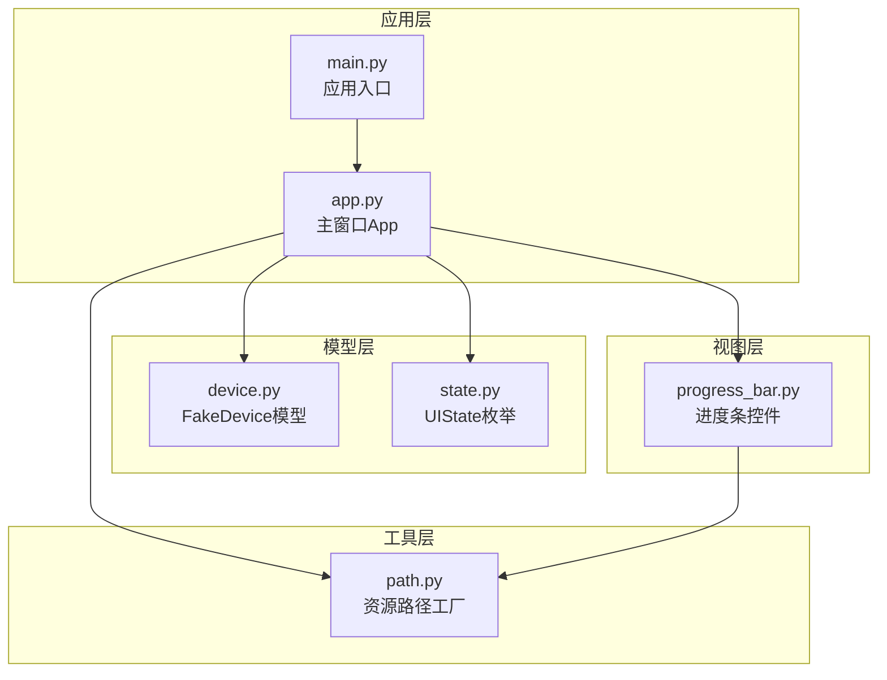
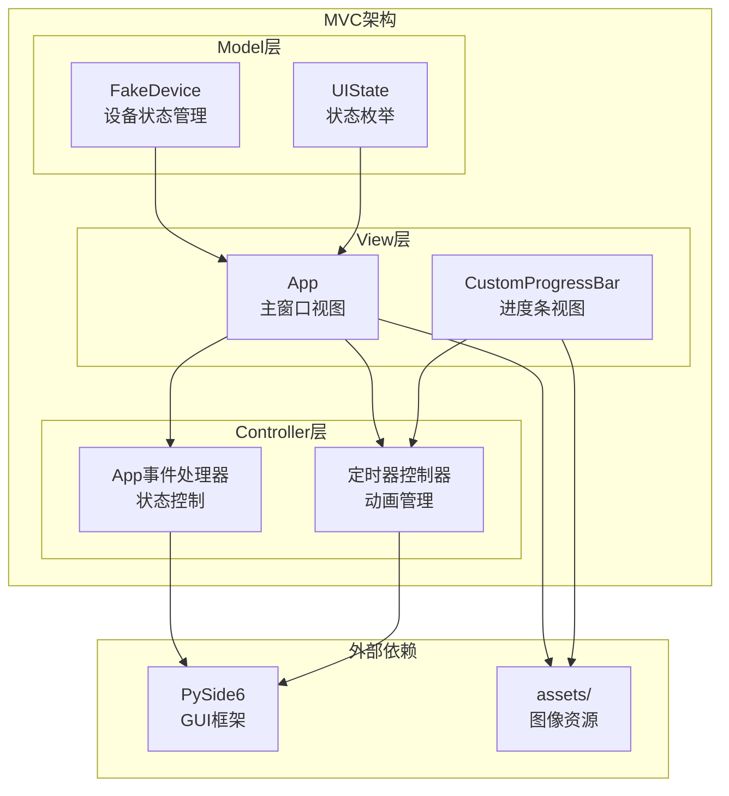
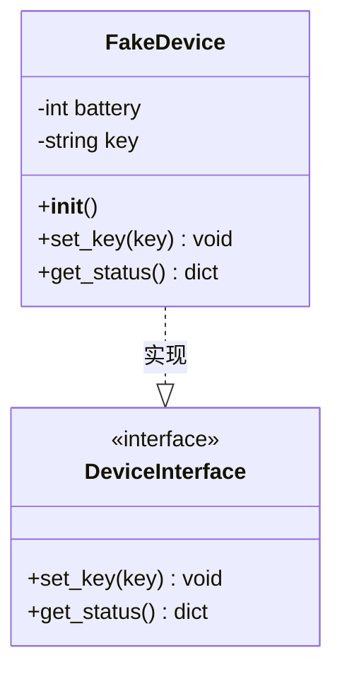
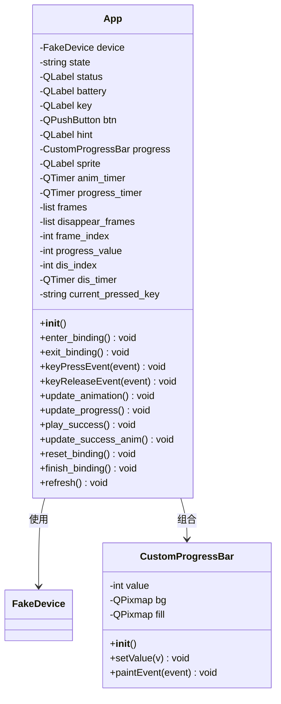
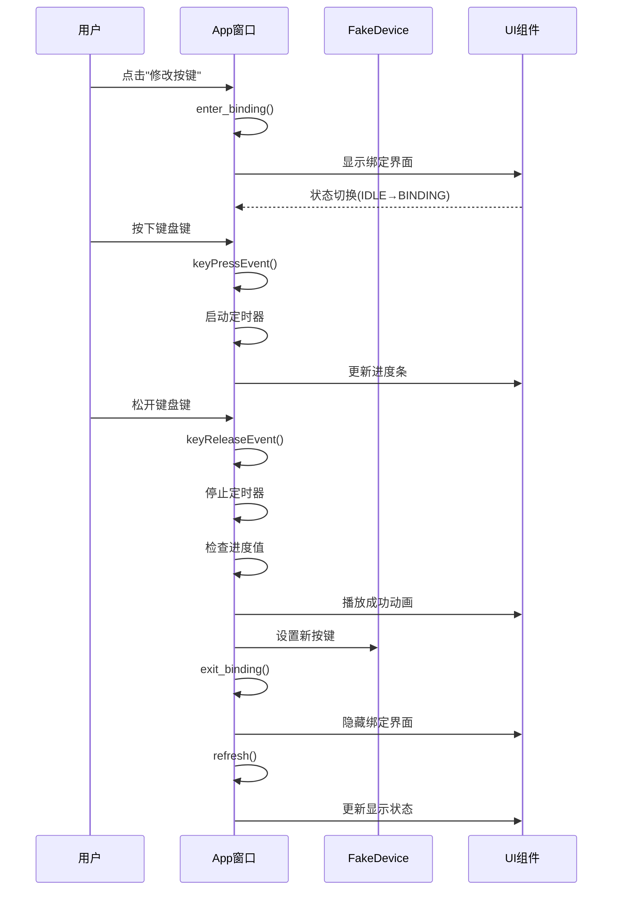
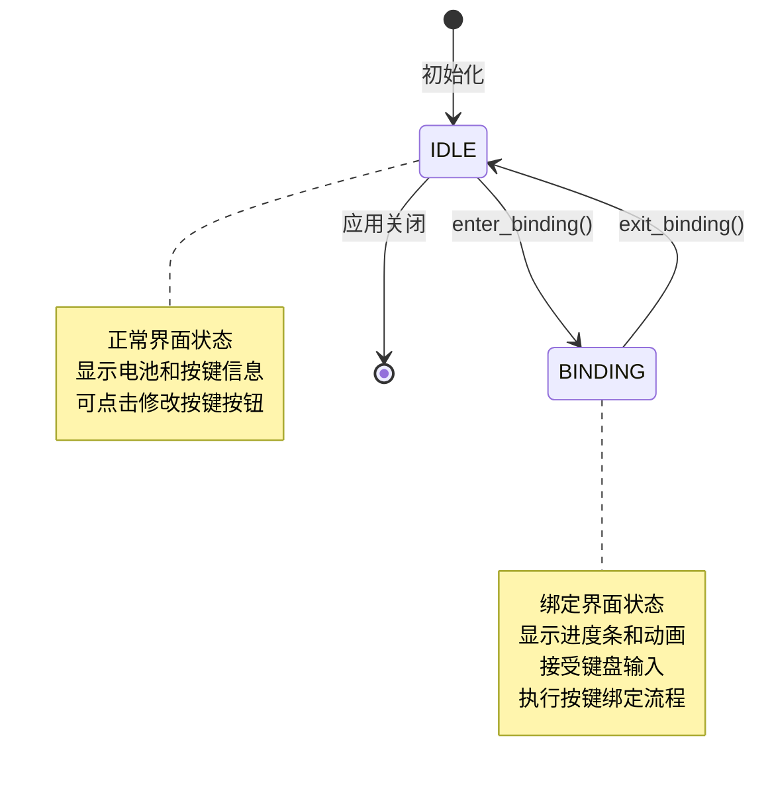
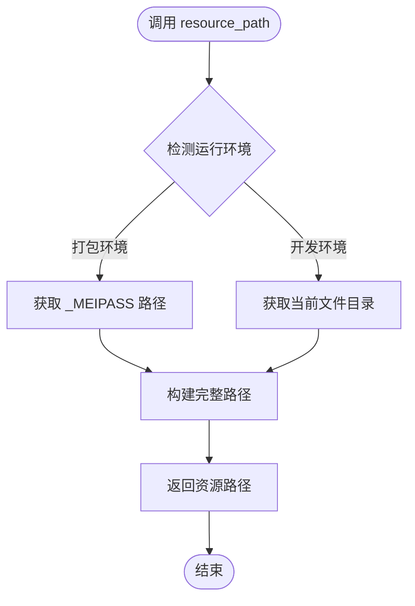
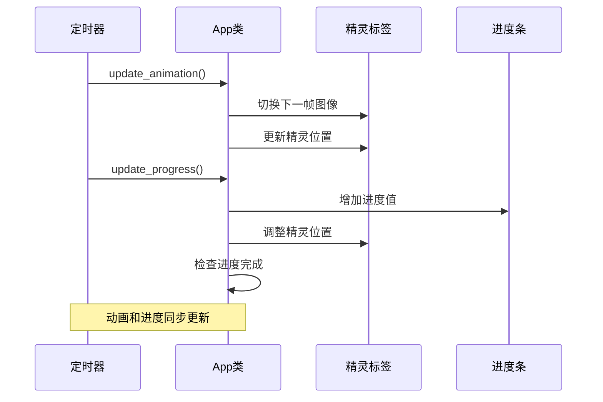
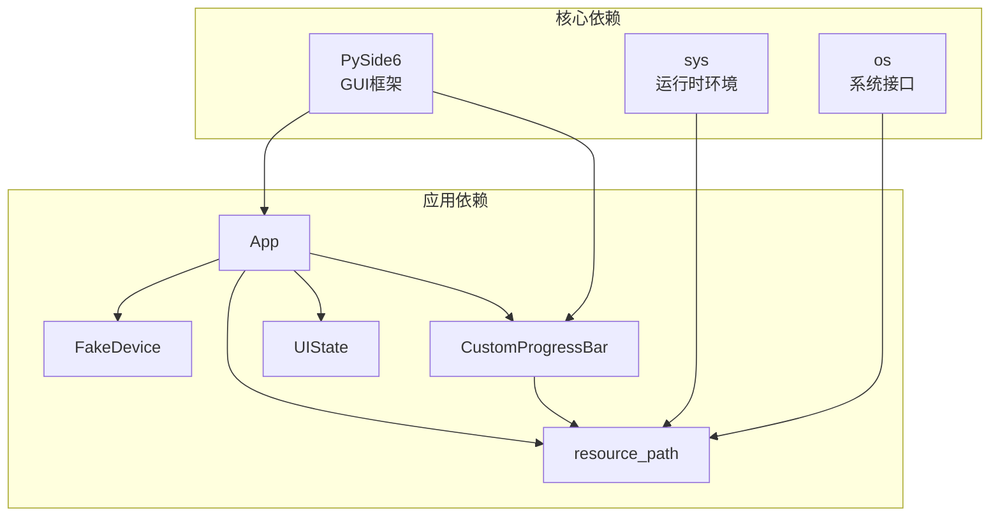

# 代码架构与设计模式

<cite>
**本文档引用的文件**
- [controller/app.py](file://controller/app.py)
- [controller/main.py](file://controller/main.py)
- [controller/core/device.py](file://controller/core/device.py)
- [controller/core/state.py](file://controller/core/state.py)
- [controller/ui/progress_bar.py](file://controller/ui/progress_bar.py)
- [controller/utils/path.py](file://controller/utils/path.py)
</cite>

## 目录
1. [引言](#引言)
2. [项目结构](#项目结构)
3. [核心组件](#核心组件)
4. [架构总览](#架构总览)
5. [详细组件分析](#详细组件分析)
6. [依赖关系分析](#依赖关系分析)
7. [性能考量](#性能考量)
8. [故障排除指南](#故障排除指南)
9. [结论](#结论)
10. [附录](#附录)

## 引言
本项目是一个基于PySide6的桌面应用程序，用于模拟无线键盘设备的按键绑定流程。通过分析代码架构，可以清晰地看到MVC架构模式、观察者模式、状态模式以及工厂模式在项目中的具体应用。本文档将深入解释这些设计模式如何协同工作，以实现清晰的职责分离、可维护的状态管理和高效的资源加载机制。

## 项目结构
项目采用分层组织方式，按照功能模块划分目录结构：
- controller：核心控制器层，包含应用入口、主窗口、设备模型和工具类
- board：硬件固件示例，展示输入输出逻辑
- assets：静态资源文件夹

**图表来源**
- [controller/main.py:1-8](file://controller/main.py#L1-L8)
- [controller/app.py:1-202](file://controller/app.py#L1-L202)
- [controller/core/device.py:1-11](file://controller/core/device.py#L1-L11)
- [controller/core/state.py:1-3](file://controller/core/state.py#L1-L3)
- [controller/ui/progress_bar.py:1-28](file://controller/ui/progress_bar.py#L1-L28)
- [controller/utils/path.py:1-10](file://controller/utils/path.py#L1-L10)

**章节来源**
- [controller/main.py:1-8](file://controller/main.py#L1-L8)
- [controller/app.py:1-202](file://controller/app.py#L1-L202)

## 核心组件
项目的核心由四个主要组件构成，每个组件承担明确的职责：

### 模型层组件
- **FakeDevice**：封装设备状态数据（电池电量、当前按键），提供状态查询和按键设置接口
- **UIState**：定义UI状态常量，作为状态机的合法状态集合

### 视图层组件
- **App**：主窗口类，负责用户界面布局、事件处理和动画管理
- **CustomProgressBar**：自定义进度条控件，实现渐进式视觉反馈

### 工具层组件
- **resource_path**：资源路径解析工厂，支持打包后的可执行文件运行环境

**章节来源**
- [controller/core/device.py:1-11](file://controller/core/device.py#L1-L11)
- [controller/core/state.py:1-3](file://controller/core/state.py#L1-L3)
- [controller/app.py:12-202](file://controller/app.py#L12-L202)
- [controller/ui/progress_bar.py:1-28](file://controller/ui/progress_bar.py#L1-L28)
- [controller/utils/path.py:1-10](file://controller/utils/path.py#L1-L10)

## 架构总览
项目采用经典的MVC架构模式，实现了清晰的职责分离：

**图表来源**
- [controller/app.py:12-202](file://controller/app.py#L12-L202)
- [controller/core/device.py:1-11](file://controller/core/device.py#L1-L11)
- [controller/core/state.py:1-3](file://controller/core/state.py#L1-L3)
- [controller/ui/progress_bar.py:1-28](file://controller/ui/progress_bar.py#L1-L28)

## 详细组件分析

### MVC架构模式实现

#### Model层：FakeDevice
FakeDevice作为数据模型，封装了设备的核心状态信息：
- **数据封装**：电池电量和当前按键值作为私有属性
- **访问接口**：提供get_status()统一访问接口，隐藏内部状态
- **状态变更**：set_key()方法负责按键绑定操作

**图表来源**
- [controller/core/device.py:1-11](file://controller/core/device.py#L1-L11)

#### View层：App主窗口
App类实现了完整的UI视图层，包含多个子组件：
- **基础UI组件**：状态标签、电池显示、按键显示
- **交互组件**：修改按键按钮、绑定提示文本
- **动画组件**：进度条、精灵标签、自定义动画帧
- **资源管理**：预加载图像资源，支持动态切换

**图表来源**
- [controller/app.py:12-202](file://controller/app.py#L12-L202)
- [controller/ui/progress_bar.py:5-28](file://controller/ui/progress_bar.py#L5-L28)

#### Controller层：事件处理与状态控制
App类同时承担控制器职责，实现了事件驱动的状态管理：
- **状态转换**：enter_binding()和exit_binding()方法管理UI状态切换
- **事件响应**：keyPressEvent和keyReleaseEvent处理键盘输入
- **定时器协调**：动画定时器和进度定时器的同步控制

**章节来源**
- [controller/app.py:12-202](file://controller/app.py#L12-L202)

### 观察者模式在UI状态管理中的应用

项目通过PySide6的信号槽机制实现了观察者模式：
- **状态变化通知**：UIState枚举定义了合法状态值
- **事件监听**：App类监听键盘事件，自动触发状态更新
- **自动刷新机制**：refresh()方法统一更新所有UI组件显示

**图表来源**
- [controller/app.py:77-111](file://controller/app.py#L77-L111)
- [controller/app.py:113-138](file://controller/app.py#L113-L138)
- [controller/app.py:199-202](file://controller/app.py#L199-L202)

**章节来源**
- [controller/core/state.py:1-3](file://controller/core/state.py#L1-L3)
- [controller/app.py:77-111](file://controller/app.py#L77-L111)

### 状态模式在UI状态切换中的使用

项目实现了简单但有效的状态模式，通过UIState枚举管理两种核心状态：

**图表来源**
- [controller/core/state.py:1-3](file://controller/core/state.py#L1-L3)
- [controller/app.py:77-111](file://controller/app.py#L77-L111)

状态转换逻辑的关键实现：
- **进入绑定状态**：隐藏常规UI组件，显示绑定界面元素
- **退出绑定状态**：恢复常规UI组件，清理绑定状态
- **状态检查**：所有UI操作都包含状态验证，防止非法操作

**章节来源**
- [controller/core/state.py:1-3](file://controller/core/state.py#L1-L3)
- [controller/app.py:77-111](file://controller/app.py#L77-L111)

### 工厂模式在资源路径解析中的应用

resource_path函数实现了简单的工厂模式，负责根据运行环境返回正确的资源路径：

**图表来源**
- [controller/utils/path.py:4-10](file://controller/utils/path.py#L4-L10)

工厂模式的优势：
- **环境适配**：自动区分开发环境和打包后的可执行文件环境
- **路径抽象**：隐藏底层文件系统差异
- **易于扩展**：未来可添加更多资源类型支持

**章节来源**
- [controller/utils/path.py:1-10](file://controller/utils/path.py#L1-L10)

### 定时器模式在动画系统中的实现

项目使用定时器模式实现了流畅的动画效果：

**图表来源**
- [controller/app.py:140-162](file://controller/app.py#L140-L162)
- [controller/app.py:148-161](file://controller/app.py#L148-L161)

动画系统的定时器配置：
- **动画定时器**：150ms间隔，控制精灵帧切换
- **进度定时器**：30ms间隔，控制进度条填充
- **成功动画**：100ms间隔，播放消失效果

**章节来源**
- [controller/app.py:67-75](file://controller/app.py#L67-L75)
- [controller/app.py:140-162](file://controller/app.py#L140-L162)

## 依赖关系分析

**图表来源**
- [controller/app.py:1-10](file://controller/app.py#L1-L10)
- [controller/ui/progress_bar.py:1-4](file://controller/ui/progress_bar.py#L1-L4)
- [controller/utils/path.py:1-10](file://controller/utils/path.py#L1-L10)

**章节来源**
- [controller/app.py:1-10](file://controller/app.py#L1-L10)
- [controller/ui/progress_bar.py:1-4](file://controller/ui/progress_bar.py#L1-L4)
- [controller/utils/path.py:1-10](file://controller/utils/path.py#L1-L10)

## 性能考量
项目在性能优化方面采用了以下策略：

### 资源管理
- **预加载机制**：在初始化时一次性加载所有动画帧，避免运行时磁盘I/O
- **内存优化**：使用QPixmap缓存图像资源，减少重复解码开销
- **路径缓存**：工厂函数返回绝对路径，避免重复路径拼接计算

### 定时器优化
- **频率选择**：动画定时器150ms，进度定时器30ms，平衡流畅度和CPU占用
- **条件更新**：所有定时器回调都包含状态检查，避免无效更新
- **及时停止**：进度完成后立即停止定时器，释放系统资源

### UI渲染优化
- **增量更新**：进度条只绘制变化的部分区域
- **懒加载**：非必要组件延迟创建和显示

## 故障排除指南

### 常见问题及解决方案

#### 资源加载失败
**症状**：图像无法显示或显示为默认图标
**原因**：资源路径不正确或文件缺失
**解决**：检查assets目录结构，确认resource_path返回的路径存在

#### 动画卡顿
**症状**：精灵移动不流畅或进度条跳变
**原因**：定时器频率过高或系统资源不足
**解决**：调整定时器间隔，检查系统性能

#### 状态异常
**症状**：界面显示与实际状态不符
**原因**：状态转换逻辑错误或事件处理异常
**解决**：检查状态检查条件，确保所有UI操作都有状态验证

**章节来源**
- [controller/app.py:140-162](file://controller/app.py#L140-L162)
- [controller/app.py:179-197](file://controller/app.py#L179-L197)

## 结论
本项目成功地将多种设计模式有机结合，形成了清晰、可维护且具有良好用户体验的桌面应用程序。通过MVC架构实现了职责分离，观察者模式确保了状态的一致性，状态模式提供了优雅的状态管理，工厂模式简化了资源管理，定时器模式保证了动画的流畅性。

架构决策的技术背景：
- **PySide6选择**：提供跨平台GUI支持和丰富的Qt生态系统
- **MVC模式**：分离关注点，提高代码可维护性
- **事件驱动**：响应用户交互，提供即时反馈
- **工厂模式**：处理不同运行环境的差异

设计权衡考虑：
- **简洁性vs功能性**：在保持代码简洁的同时满足功能需求
- **性能vs可读性**：通过预加载和缓存优化性能，同时保持代码清晰
- **扩展性vs稳定性**：为未来功能扩展预留接口，同时确保现有功能稳定

## 附录

### 扩展点识别与最佳实践

#### 新功能添加建议
1. **状态扩展**：通过UIState枚举添加新状态，确保所有相关方法都有状态处理
2. **动画扩展**：在App类中添加新的动画序列，注意定时器的协调
3. **资源管理**：通过resource_path工厂添加新的资源类型
4. **设备模拟**：扩展FakeDevice类以支持更多设备特性

#### 最佳实践
- **单一职责原则**：每个类专注于特定功能
- **依赖注入**：通过构造函数传递依赖，便于测试和替换
- **接口抽象**：为可能变化的组件定义清晰的接口
- **错误处理**：添加适当的异常处理和边界检查
- **文档注释**：为公共接口添加详细的文档字符串