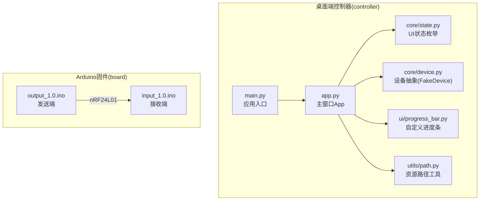
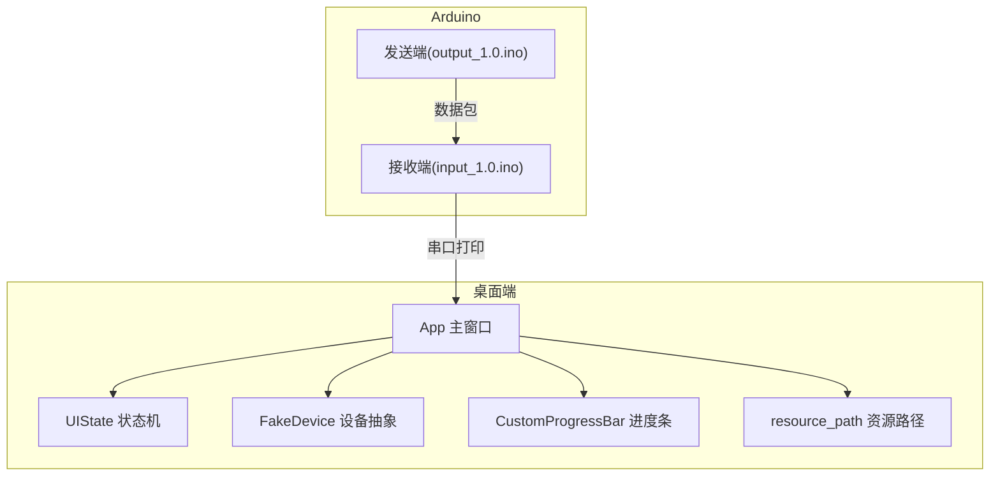
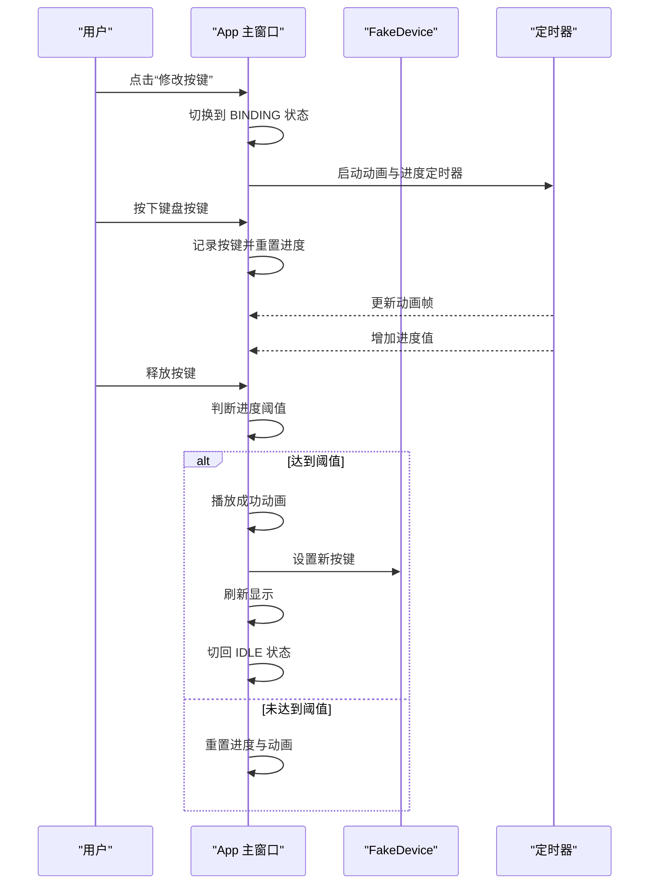
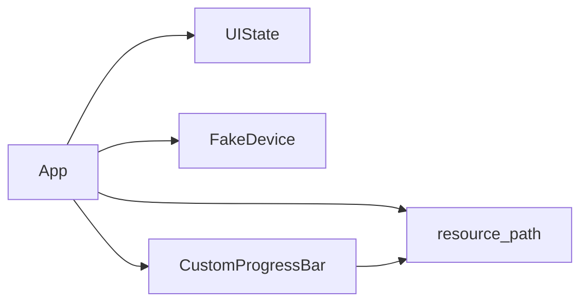

# 开发指南

<cite>
**本文引用的文件**
- [README.md](file://README.md)
- [.gitignore](file://.gitignore)
- [controller/main.py](file://controller/main.py)
- [controller/app.py](file://controller/app.py)
- [controller/core/device.py](file://controller/core/device.py)
- [controller/core/state.py](file://controller/core/state.py)
- [controller/ui/progress_bar.py](file://controller/ui/progress_bar.py)
- [controller/utils/path.py](file://controller/utils/path.py)
- [board/input_1.0/input_1.0.ino](file://board/input_1.0/input_1.0.ino)
- [board/output_1.0/output_1.0.ino](file://board/output_1.0/output_1.0.ino)
</cite>

## 目录
1. [简介](#简介)
2. [项目结构](#项目结构)
3. [核心组件](#核心组件)
4. [架构总览](#架构总览)
5. [详细组件分析](#详细组件分析)
6. [依赖分析](#依赖分析)
7. [性能考虑](#性能考虑)
8. [故障排查指南](#故障排查指南)
9. [结论](#结论)
10. [附录](#附录)

## 简介
本开发指南面向参与“无线键盘玩具”项目的开发者，目标是帮助你快速搭建开发与调试环境，理解项目整体架构与核心组件，掌握编码规范与最佳实践，并提供调试、测试与性能优化建议。项目由桌面端 Python 控制器与两块 Arduino 板组成，通过 nRF24L01 无线模块实现按键事件的采集与转发。

## 项目结构
项目采用分层组织：
- board：Arduino 固件，分为输入端与输出端，负责按键采集与无线发送/接收。
- controller：桌面端 Python 应用，使用 PySide6 构建 GUI，包含核心设备抽象、UI 状态机、自定义进度条控件与资源路径工具。

图表来源
- [controller/main.py:1-8](file://controller/main.py#L1-L8)
- [controller/app.py:1-202](file://controller/app.py#L1-L202)
- [controller/core/state.py:1-3](file://controller/core/state.py#L1-L3)
- [controller/core/device.py:1-11](file://controller/core/device.py#L1-L11)
- [controller/ui/progress_bar.py:1-28](file://controller/ui/progress_bar.py#L1-L28)
- [controller/utils/path.py:1-10](file://controller/utils/path.py#L1-L10)
- [board/input_1.0/input_1.0.ino:1-35](file://board/input_1.0/input_1.0.ino#L1-L35)
- [board/output_1.0/output_1.0.ino:1-43](file://board/output_1.0/output_1.0.ino#L1-L43)

章节来源
- [README.md:1-1](file://README.md#L1-L1)
- [controller/main.py:1-8](file://controller/main.py#L1-L8)
- [controller/app.py:1-202](file://controller/app.py#L1-L202)
- [controller/core/state.py:1-3](file://controller/core/state.py#L1-L3)
- [controller/core/device.py:1-11](file://controller/core/device.py#L1-L11)
- [controller/ui/progress_bar.py:1-28](file://controller/ui/progress_bar.py#L1-L28)
- [controller/utils/path.py:1-10](file://controller/utils/path.py#L1-L10)
- [board/input_1.0/input_1.0.ino:1-35](file://board/input_1.0/input_1.0.ino#L1-L35)
- [board/output_1.0/output_1.0.ino:1-43](file://board/output_1.0/output_1.0.ino#L1-L43)

## 核心组件
- 应用入口与窗口
  - 入口：应用初始化、创建主窗口并展示。
  - 主窗口：负责 UI 布局、状态切换、键盘事件处理、动画与进度更新、成功反馈与完成绑定后的刷新。
- 设备抽象
  - FakeDevice：模拟设备，维护电池电量与当前按键映射，提供读取状态与设置按键的方法。
- UI 状态机
  - UIState：定义空闲(IDLE)与绑定(BINDING)两种状态，用于控制交互流程。
- 自定义进度条
  - CustomProgressBar：绘制背景与填充区域，根据数值动态裁剪填充图元。
- 资源路径工具
  - resource_path：兼容打包后运行时的资源定位，确保在可执行文件中也能正确加载资源。
- Arduino 固件
  - 发送端：读取按键状态变化，封装为数据包并通过 nRF24L01 发送。
  - 接收端：监听无线数据，原样转发到串口，便于上位机查看。

章节来源
- [controller/main.py:1-8](file://controller/main.py#L1-L8)
- [controller/app.py:1-202](file://controller/app.py#L1-L202)
- [controller/core/device.py:1-11](file://controller/core/device.py#L1-L11)
- [controller/core/state.py:1-3](file://controller/core/state.py#L1-L3)
- [controller/ui/progress_bar.py:1-28](file://controller/ui/progress_bar.py#L1-L28)
- [controller/utils/path.py:1-10](file://controller/utils/path.py#L1-L10)
- [board/input_1.0/input_1.0.ino:1-35](file://board/input_1.0/input_1.0.ino#L1-L35)
- [board/output_1.0/output_1.0.ino:1-43](file://board/output_1.0/output_1.0.ino#L1-L43)

## 架构总览
桌面端控制器通过 PySide6 提供图形界面，内部以状态机驱动交互流程；设备抽象屏蔽底层差异；自定义控件提升用户体验；资源路径工具保证跨平台与打包一致性。Arduino 两端通过 nRF24L01 实现无线通信，接收端将原始数据透传至串口，便于调试与验证。

图表来源
- [controller/app.py:1-202](file://controller/app.py#L1-L202)
- [controller/core/state.py:1-3](file://controller/core/state.py#L1-L3)
- [controller/core/device.py:1-11](file://controller/core/device.py#L1-L11)
- [controller/ui/progress_bar.py:1-28](file://controller/ui/progress_bar.py#L1-L28)
- [controller/utils/path.py:1-10](file://controller/utils/path.py#L1-L10)
- [board/input_1.0/input_1.0.ino:1-35](file://board/input_1.0/input_1.0.ino#L1-L35)
- [board/output_1.0/output_1.0.ino:1-43](file://board/output_1.0/output_1.0.ino#L1-L43)

## 详细组件分析

### App 主窗口（状态机驱动的交互）
- 关键职责
  - 初始化窗口、按钮、标签与自定义进度条。
  - 维护 UI 状态（空闲/绑定），在不同状态间切换时显示/隐藏元素。
  - 处理键盘事件：开始绑定时记录按键，释放时判断进度阈值决定成功或重置。
  - 驱动动画与进度：定时器驱动精灵帧切换与进度增长，达到阈值播放成功动画并完成绑定。
  - 刷新显示：从设备抽象读取状态并更新电池与按键文本。
- 设计要点
  - 使用状态机避免复杂条件分支，提高可读性与可维护性。
  - 将动画与进度解耦，分别由独立定时器驱动，便于独立控制与调试。
  - 通过资源路径工具加载动画帧，确保打包后仍能正确显示。
- 交互序列（绑定流程）

图表来源
- [controller/app.py:77-196](file://controller/app.py#L77-L196)
- [controller/core/device.py:6-11](file://controller/core/device.py#L6-L11)

章节来源
- [controller/app.py:1-202](file://controller/app.py#L1-L202)

### UI 状态机（UIState）
- 设计意图
  - 将交互流程划分为明确的状态，避免状态混杂导致逻辑混乱。
- 实现方式
  - 通过类属性定义状态常量，统一在主窗口中读取与切换。
- 适用场景
  - 绑定流程的开始、进行与结束阶段清晰分离，便于扩展更多状态。

章节来源
- [controller/core/state.py:1-3](file://controller/core/state.py#L1-L3)
- [controller/app.py:22-101](file://controller/app.py#L22-L101)

### 设备抽象（FakeDevice）
- 设计意图
  - 屏蔽底层差异，提供统一接口，便于替换真实设备或模拟器。
- 实现方式
  - 维护电池与按键字段，提供读取状态与设置按键的方法。
- 扩展建议
  - 可引入实际串口通信或蓝牙接口，实现与真实硬件的对接。

章节来源
- [controller/core/device.py:1-11](file://controller/core/device.py#L1-L11)
- [controller/app.py:191-196](file://controller/app.py#L191-L196)

### 自定义进度条（CustomProgressBar）
- 设计意图
  - 提升用户反馈体验，直观显示绑定进度。
- 实现方式
  - 绘制背景与按比例裁剪的填充图元，setValue 时触发重绘。
- 性能注意
  - 重绘操作应尽量轻量，避免频繁大尺寸图像处理。

章节来源
- [controller/ui/progress_bar.py:1-28](file://controller/ui/progress_bar.py#L1-L28)

### 资源路径工具（resource_path）
- 设计意图
  - 解决打包后资源路径问题，确保在可执行文件中也能正确加载资源。
- 实现方式
  - 检测运行环境，选择打包根目录或当前脚本所在目录拼接资源路径。

章节来源
- [controller/utils/path.py:1-10](file://controller/utils/path.py#L1-L10)

### Arduino 发送端（output_1.0.ino）
- 设计意图
  - 采集按键状态变化，封装为数据包并通过 nRF24L01 发送。
- 实现方式
  - 使用固定地址管道，低电平表示按下，高电平表示释放。
- 数据包结构
  - 包含键码、状态与序列号，便于接收端识别与去抖。

章节来源
- [board/output_1.0/output_1.0.ino:1-43](file://board/output_1.0/output_1.0.ino#L1-L43)

### Arduino 接收端（input_1.0.ino）
- 设计意图
  - 监听无线数据，原样转发到串口，便于上位机调试。
- 实现方式
  - 打开读取管道并循环检查可用数据，读取后直接打印三元组。

章节来源
- [board/input_1.0/input_1.0.ino:1-35](file://board/input_1.0/input_1.0.ino#L1-L35)

## 依赖分析
- 内部依赖
  - App 依赖 UIState、FakeDevice、CustomProgressBar、resource_path。
  - 自定义进度条依赖资源路径工具。
- 外部依赖
  - PySide6：GUI 框架。
  - nRF24L01 库：无线通信。
- 版本控制与忽略
  - .gitignore 已包含常见虚拟环境、构建产物、日志与 IDE 生成文件，建议保持默认忽略规则。

图表来源
- [controller/app.py:1-202](file://controller/app.py#L1-L202)
- [controller/core/state.py:1-3](file://controller/core/state.py#L1-L3)
- [controller/core/device.py:1-11](file://controller/core/device.py#L1-L11)
- [controller/ui/progress_bar.py:1-28](file://controller/ui/progress_bar.py#L1-L28)
- [controller/utils/path.py:1-10](file://controller/utils/path.py#L1-L10)

章节来源
- [.gitignore:1-227](file://.gitignore#L1-L227)
- [controller/app.py:1-202](file://controller/app.py#L1-L202)

## 性能考虑
- 动画与进度
  - 使用独立定时器分别驱动动画帧与进度增长，避免相互阻塞。
  - 在进度达到阈值时及时停止定时器，减少无效计算。
- 图像渲染
  - 自定义进度条按比例裁剪填充图元，避免全图复制，降低绘制成本。
- 资源加载
  - 预加载动画帧并在初始化时完成，避免运行时重复 IO。
- 无线通信
  - Arduino 端对按键状态变化进行检测，避免持续写入；接收端仅在有数据时处理，降低 CPU 占用。

章节来源
- [controller/app.py:67-161](file://controller/app.py#L67-L161)
- [controller/ui/progress_bar.py:19-28](file://controller/ui/progress_bar.py#L19-L28)
- [board/output_1.0/output_1.0.ino:28-42](file://board/output_1.0/output_1.0.ino#L28-L42)
- [board/input_1.0/input_1.0.ino:24-34](file://board/input_1.0/input_1.0.ino#L24-L34)

## 故障排查指南
- 无法启动桌面端应用
  - 检查是否安装 PySide6 依赖。
  - 确认资源路径工具能正确解析资源文件。
- 无线通信异常
  - 检查 Arduino 板供电与连线，确认 nRF24L01 模块工作正常。
  - 使用串口监视器查看接收端输出，核对键码、状态与序列号格式。
- 绑定流程失败
  - 确保在绑定状态下长按按键直至进度达到阈值。
  - 检查定时器是否被意外停止，以及进度值更新逻辑。
- 资源加载失败
  - 若打包后资源缺失，检查 resource_path 的路径拼接逻辑与打包配置。

章节来源
- [controller/utils/path.py:4-10](file://controller/utils/path.py#L4-L10)
- [board/input_1.0/input_1.0.ino:24-34](file://board/input_1.0/input_1.0.ino#L24-L34)
- [controller/app.py:113-161](file://controller/app.py#L113-L161)

## 结论
本项目通过清晰的分层架构与状态机驱动的交互设计，实现了从按键采集到上位机反馈的完整链路。桌面端与 Arduino 端分工明确，易于扩展与维护。建议在后续迭代中完善真实设备接入、增加单元测试与集成测试，并持续优化动画与通信性能。

## 附录

### 开发环境搭建
- Python 环境
  - 建议使用 Python 3.x 并创建独立虚拟环境。
  - 安装 PySide6 依赖以支持 GUI。
- IDE 设置
  - 推荐使用 VS Code 或 PyCharm，启用类型提示与自动补全。
  - 配置 Python 解释器指向虚拟环境。
- Arduino 开发
  - 安装 Arduino IDE 与 nRF24L01 所需库。
  - 确保硬件连线正确，上传发送端与接收端固件。

章节来源
- [controller/main.py:1-8](file://controller/main.py#L1-L8)
- [board/output_1.0/output_1.0.ino:1-43](file://board/output_1.0/output_1.0.ino#L1-L43)
- [board/input_1.0/input_1.0.ino:1-35](file://board/input_1.0/input_1.0.ino#L1-L35)

### 编码规范与最佳实践
- 代码风格
  - 使用一致的缩进与命名约定，类名使用 PascalCase，函数与变量使用 snake_case。
  - 将 UI 逻辑与业务逻辑分离，保持组件职责单一。
- 注释规范
  - 对关键流程与算法添加简要注释，解释设计意图与边界条件。
- 错误处理
  - 对外部依赖（如串口、网络、文件系统）进行异常捕获与降级处理。
  - 在状态切换与定时器控制处增加健壮性检查，避免竞态条件。

### 设计模式应用
- 状态模式
  - UIState 定义状态常量，App 在状态之间切换，使流程清晰可控。
- 观察者模式
  - 可在设备抽象中引入事件回调机制，当状态变化时通知 UI 更新。
- 工厂模式
  - 可将设备实例化抽象为工厂方法，便于替换不同类型的设备实现。

章节来源
- [controller/core/state.py:1-3](file://controller/core/state.py#L1-L3)
- [controller/app.py:77-101](file://controller/app.py#L77-L101)

### 调试技巧与测试策略
- 单元测试
  - 为设备抽象与工具函数编写单元测试，覆盖边界条件与异常路径。
- 集成测试
  - 搭建最小化硬件链路，验证从按键到串口输出的完整流程。
- 硬件调试
  - 使用串口监视器观察无线数据格式，结合 LED 或示波器验证信号质量。

### 代码贡献指南与版本控制最佳实践
- 分支策略
  - 使用功能分支进行开发，合并前进行代码审查与测试。
- 提交信息
  - 使用清晰的描述性提交信息，说明变更目的与影响范围。
- 依赖管理
  - 保持依赖版本稳定，必要时使用锁定文件确保可复现构建。
- 忽略规则
  - 遵循现有 .gitignore，避免将本地配置与构建产物纳入版本控制。

章节来源
- [.gitignore:1-227](file://.gitignore#L1-L227)

### 性能优化建议与内存管理注意事项
- 优化建议
  - 减少不必要的重绘与定时器频率，优先使用增量更新。
  - 对大图资源进行压缩与缓存，避免重复解码。
- 内存管理
  - 注意避免循环引用，及时清理不再使用的对象与定时器。
  - 在打包发布前进行内存泄漏检测与性能分析。