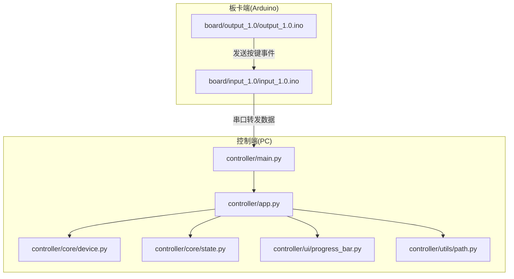
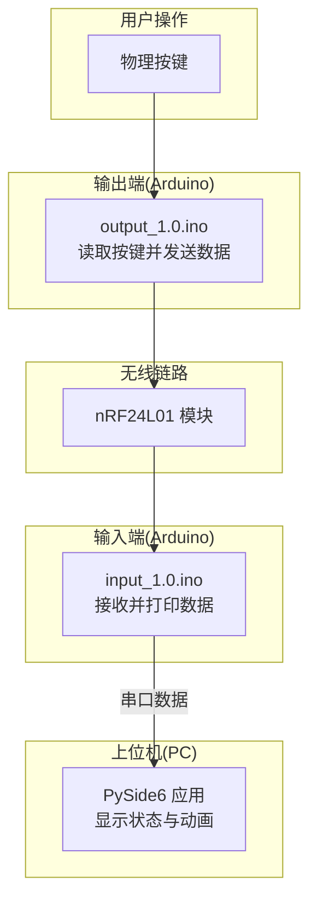
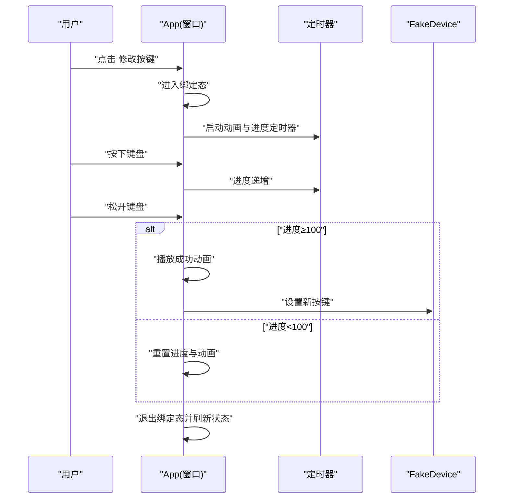
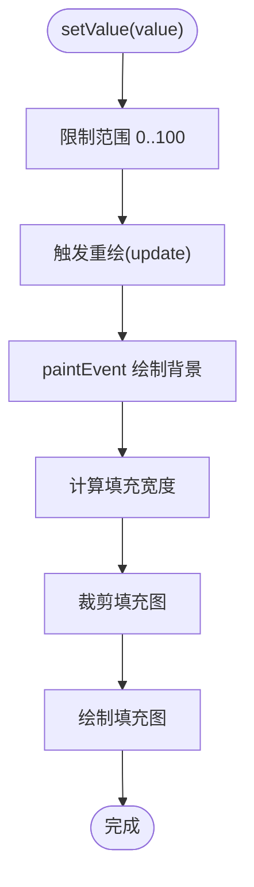
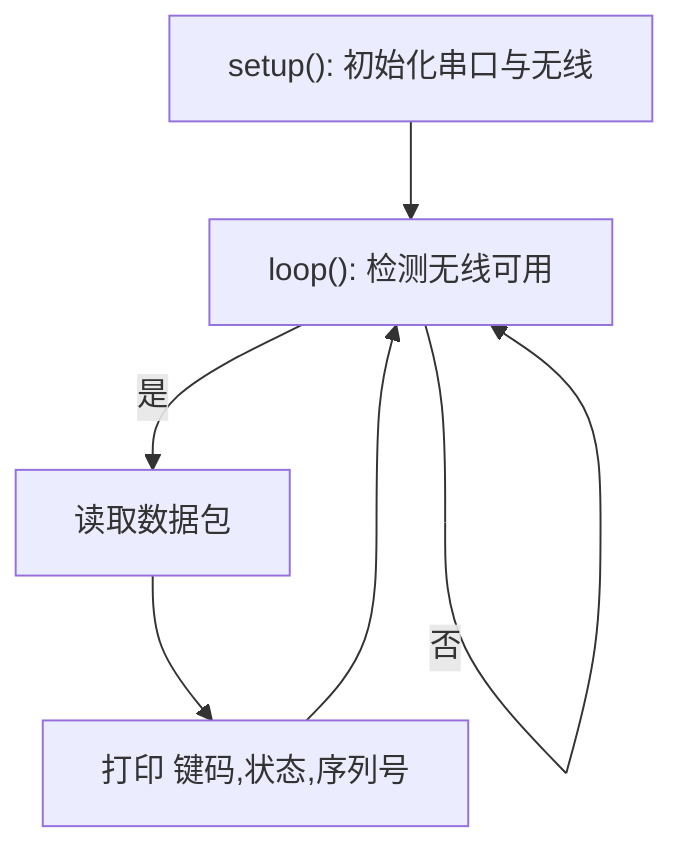

# 开发环境搭建

<cite>
**本文引用的文件**
- [README.md](file://README.md)
- [controller/main.py](file://controller/main.py)
- [controller/app.py](file://controller/app.py)
- [controller/core/device.py](file://controller/core/device.py)
- [controller/core/state.py](file://controller/core/state.py)
- [controller/ui/progress_bar.py](file://controller/ui/progress_bar.py)
- [controller/utils/path.py](file://controller/utils/path.py)
- [board/input_1.0/input_1.0.ino](file://board/input_1.0/input_1.0.ino)
- [board/output_1.0/output_1.0.ino](file://board/output_1.0/output_1.0.ino)
- [.gitignore](file://.gitignore)
</cite>

## 目录
1. [简介](#简介)
2. [项目结构](#项目结构)
3. [核心组件](#核心组件)
4. [架构总览](#架构总览)
5. [详细组件分析](#详细组件分析)
6. [依赖分析](#依赖分析)
7. [性能考虑](#性能考虑)
8. [故障排查指南](#故障排查指南)
9. [结论](#结论)
10. [附录](#附录)

## 简介
本指南面向首次参与“无线键盘玩具”项目的开发者，提供从零开始的开发环境搭建与配置建议，涵盖以下方面：
- Python 版本要求与虚拟环境创建（venv 或 conda）
- PySide6 框架安装与 Qt 库依赖、版本兼容性
- Arduino IDE 安装与 nRF24L01 核心库配置
- 项目依赖安装（pip 安装与可选编译依赖）
- 推荐 IDE 配置（VS Code 与 PyCharm）
- 常见环境问题排查与解决方案

## 项目结构
该项目采用分层组织方式：
- 控制端（PC 端）：基于 PySide6 的图形界面应用，负责按键绑定、状态显示与动画展示
- 板卡端（Arduino）：两套固件分别实现“输入端”与“输出端”，通过 nRF24L01 无线通信
- 资源与工具：UI 资源路径解析工具、自定义进度条控件等

图表来源
- [controller/main.py:1-8](file://controller/main.py#L1-L8)
- [controller/app.py:1-202](file://controller/app.py#L1-L202)
- [controller/core/device.py:1-11](file://controller/core/device.py#L1-L11)
- [controller/core/state.py:1-3](file://controller/core/state.py#L1-L3)
- [controller/ui/progress_bar.py:1-28](file://controller/ui/progress_bar.py#L1-L28)
- [controller/utils/path.py:1-10](file://controller/utils/path.py#L1-L10)
- [board/input_1.0/input_1.0.ino:1-35](file://board/input_1.0/input_1.0.ino#L1-L35)
- [board/output_1.0/output_1.0.ino:1-43](file://board/output_1.0/output_1.0.ino#L1-L43)

章节来源
- [README.md:1-1](file://README.md#L1-L1)
- [controller/main.py:1-8](file://controller/main.py#L1-L8)
- [controller/app.py:1-202](file://controller/app.py#L1-L202)
- [controller/core/device.py:1-11](file://controller/core/device.py#L1-L11)
- [controller/core/state.py:1-3](file://controller/core/state.py#L1-L3)
- [controller/ui/progress_bar.py:1-28](file://controller/ui/progress_bar.py#L1-L28)
- [controller/utils/path.py:1-10](file://controller/utils/path.py#L1-L10)
- [board/input_1.0/input_1.0.ino:1-35](file://board/input_1.0/input_1.0.ino#L1-L35)
- [board/output_1.0/output_1.0.ino:1-43](file://board/output_1.0/output_1.0.ino#L1-L43)

## 核心组件
- 控制端入口与窗口类
  - 入口脚本负责初始化 Qt 应用与主窗口
  - 主窗口类负责布局、状态管理、动画与进度条逻辑
- 设备模拟与状态
  - 设备模拟器提供电池电量与当前按键信息
  - UI 状态机区分空闲与绑定两种模式
- 自定义 UI 组件
  - 自定义进度条控件用于可视化绑定过程
  - 资源路径解析工具支持打包后运行时资源定位
- 板卡端固件
  - 输入端：监听无线数据并通过串口打印
  - 输出端：读取按键状态并通过无线发送

章节来源
- [controller/main.py:1-8](file://controller/main.py#L1-L8)
- [controller/app.py:1-202](file://controller/app.py#L1-L202)
- [controller/core/device.py:1-11](file://controller/core/device.py#L1-L11)
- [controller/core/state.py:1-3](file://controller/core/state.py#L1-L3)
- [controller/ui/progress_bar.py:1-28](file://controller/ui/progress_bar.py#L1-L28)
- [controller/utils/path.py:1-10](file://controller/utils/path.py#L1-L10)
- [board/input_1.0/input_1.0.ino:1-35](file://board/input_1.0/input_1.0.ino#L1-L35)
- [board/output_1.0/output_1.0.ino:1-43](file://board/output_1.0/output_1.0.ino#L1-L43)

## 架构总览
控制端与板卡端通过无线模块与串口进行数据交互，形成“按键采集 → 无线传输 → 上位机显示”的闭环。

图表来源
- [board/output_1.0/output_1.0.ino:1-43](file://board/output_1.0/output_1.0.ino#L1-L43)
- [board/input_1.0/input_1.0.ino:1-35](file://board/input_1.0/input_1.0.ino#L1-L35)
- [controller/app.py:1-202](file://controller/app.py#L1-L202)

## 详细组件分析

### 控制端应用（PySide6）
- 关键导入与功能
  - 使用 Qt Widgets、Core、Gui 模块构建窗口与事件处理
  - 通过定时器驱动动画与进度更新
  - 使用资源路径工具在打包后仍能正确加载图片资源
- 绑定流程时序
  - 用户点击“修改按键”
  - 进入绑定态，显示提示、进度条与精灵图
  - 键盘按下触发进度增长，释放决定成功或重置
  - 成功后播放消失动画并刷新设备状态

图表来源
- [controller/app.py:77-196](file://controller/app.py#L77-L196)
- [controller/core/device.py:1-11](file://controller/core/device.py#L1-L11)

章节来源
- [controller/app.py:1-202](file://controller/app.py#L1-L202)
- [controller/main.py:1-8](file://controller/main.py#L1-L8)
- [controller/core/device.py:1-11](file://controller/core/device.py#L1-L11)
- [controller/core/state.py:1-3](file://controller/core/state.py#L1-L3)
- [controller/ui/progress_bar.py:1-28](file://controller/ui/progress_bar.py#L1-L28)
- [controller/utils/path.py:1-10](file://controller/utils/path.py#L1-L10)

### 自定义进度条控件
- 绘制逻辑
  - 背景图与填充图分离，按百分比裁剪绘制
  - 通过 setValue 更新内部值并触发重绘
- 资源路径
  - 使用资源路径工具在打包后仍可定位到 assets 目录

图表来源
- [controller/ui/progress_bar.py:15-28](file://controller/ui/progress_bar.py#L15-L28)
- [controller/utils/path.py:4-10](file://controller/utils/path.py#L4-L10)

章节来源
- [controller/ui/progress_bar.py:1-28](file://controller/ui/progress_bar.py#L1-L28)
- [controller/utils/path.py:1-10](file://controller/utils/path.py#L1-L10)

### 板卡端固件（Arduino）
- 输出端（按键采集）
  - 读取引脚状态，构造数据包并通过 nRF24L01 发送
  - 包含键码、状态与序列号字段
- 输入端（数据接收）
  - 初始化无线模块并开启接收
  - 将接收到的数据通过串口打印为文本

图表来源
- [board/input_1.0/input_1.0.ino:16-35](file://board/input_1.0/input_1.0.ino#L16-L35)

章节来源
- [board/input_1.0/input_1.0.ino:1-35](file://board/input_1.0/input_1.0.ino#L1-L35)
- [board/output_1.0/output_1.0.ino:1-43](file://board/output_1.0/output_1.0.ino#L1-L43)

## 依赖分析
- 控制端依赖
  - PySide6：图形界面与事件系统
  - Python 标准库：os、sys（资源路径解析）
- 板卡端依赖
  - RF24/nRF24L01：无线通信
  - Arduino 核心库：SPI、Wire（由 RF24 间接使用）

章节来源
- [controller/app.py:1-10](file://controller/app.py#L1-L10)
- [controller/ui/progress_bar.py:1-3](file://controller/ui/progress_bar.py#L1-L3)
- [board/input_1.0/input_1.0.ino:1-3](file://board/input_1.0/input_1.0.ino#L1-L3)
- [board/output_1.0/output_1.0.ino:1-3](file://board/output_1.0/output_1.0.ino#L1-L3)

## 性能考虑
- 控制端
  - 动画与进度更新频率适中，避免过度占用 CPU
  - 资源加载采用预加载策略，减少运行时 IO
- 板卡端
  - 无线发送与串口打印均为短时操作，循环中尽量减少额外处理
  - 注意 nRF24L01 的 PA 等级与距离匹配，避免不必要的高功耗

## 故障排查指南
- Python 环境相关
  - 虚拟环境未激活导致导入失败：确认已创建并激活 venv 或 conda 环境
  - 资源路径异常（打包后找不到图片）：检查资源路径工具与相对路径拼接
- PySide6 相关
  - 无法启动应用：确认已安装 PySide6 并满足系统 Qt 依赖
  - 键盘事件无响应：检查窗口焦点策略与事件过滤条件
- Arduino 相关
  - 无线通信失败：核对天线、地址一致与供电稳定
  - 串口无输出：确认波特率一致与串口监视器设置正确
- 通用建议
  - 清理缓存与重建虚拟环境
  - 使用最小化复现步骤定位问题

章节来源
- [controller/utils/path.py:1-10](file://controller/utils/path.py#L1-L10)
- [controller/app.py:113-138](file://controller/app.py#L113-L138)
- [board/input_1.0/input_1.0.ino:17-17](file://board/input_1.0/input_1.0.ino#L17-L17)
- [board/output_1.0/output_1.0.ino:29-42](file://board/output_1.0/output_1.0.ino#L29-L42)

## 结论
本指南提供了从 Python 环境、PySide6 框架、Arduino 开发到项目依赖与 IDE 配置的完整落地步骤。按照该指南准备环境后，即可运行控制端应用并与板卡端进行数据交互，完成按键绑定与状态显示的全流程验证。

## 附录

### A. Python 版本与虚拟环境
- 版本要求
  - 建议使用 Python 3.8–3.11，确保与 PySide6 生态兼容
- 创建虚拟环境
  - 使用 venv：python -m venv .venv；激活后进行后续安装
  - 使用 conda：conda create -n toykey python=3.x；conda activate toykey
- 激活与退出
  - Windows：.venv\Scripts\activate；deactivate
  - Linux/macOS：source .venv/bin/activate；deactivate

章节来源
- [controller/main.py:1-8](file://controller/main.py#L1-L8)
- [.gitignore:8-10](file://.gitignore#L8-L10)

### B. PySide6 安装与配置
- 安装
  - pip install PySide6
- Qt 依赖与版本兼容
  - 确保系统已安装 Qt 运行时库（随 PySide6 分发或系统自带）
  - 若出现导入错误，请检查 Python 与 PySide6 架构一致性（32/64 位）
- 资源路径
  - 打包后资源定位：使用资源路径工具拼接相对路径

章节来源
- [controller/app.py:1-10](file://controller/app.py#L1-L10)
- [controller/ui/progress_bar.py:1-3](file://controller/ui/progress_bar.py#L1-L3)
- [controller/utils/path.py:1-10](file://controller/utils/path.py#L1-L10)

### C. Arduino IDE 与 nRF24L01 配置
- 安装
  - 下载并安装 Arduino IDE
- 核心库
  - 在库管理器中安装 “RF24” 与 “nRF24L01” 相关库
- 开发板与端口
  - 选择正确的开发板与 COM/USB 端口
- 固件烧录
  - 将输出端固件上传至“输出端”板卡
  - 将输入端固件上传至“输入端”板卡
- 串口监视器
  - 打开串口监视器，设置与固件一致的波特率，观察数据输出

章节来源
- [board/input_1.0/input_1.0.ino:1-3](file://board/input_1.0/input_1.0.ino#L1-L3)
- [board/output_1.0/output_1.0.ino:1-3](file://board/output_1.0/output_1.0.ino#L1-L3)

### D. 项目依赖安装
- 控制端
  - pip install PySide6
  - 如需打包：pip install pyinstaller（可选）
- 板卡端
  - 通过 Arduino IDE 库管理器安装 RF24 与 nRF24L01 相关库
- 编译依赖
  - 一般无需额外编译依赖；若使用打包工具，确保系统具备对应构建环境

章节来源
- [controller/app.py:1-10](file://controller/app.py#L1-L10)
- [board/input_1.0/input_1.0.ino:1-3](file://board/input_1.0/input_1.0.ino#L1-L3)
- [board/output_1.0/output_1.0.ino:1-3](file://board/output_1.0/output_1.0.ino#L1-L3)

### E. IDE 推荐配置
- VS Code
  - Python 解释器：指向虚拟环境中的 Python
  - 扩展：Python、Pylance、Qt
  - 调试：配置 launch.json 启动 controller/main.py
- PyCharm
  - 解释器：指向虚拟环境
  - 运行配置：新增 Python 启动项，目标为 controller/main.py
  - 代码风格：启用 PEP8 规则与自动格式化

章节来源
- [controller/main.py:1-8](file://controller/main.py#L1-L8)