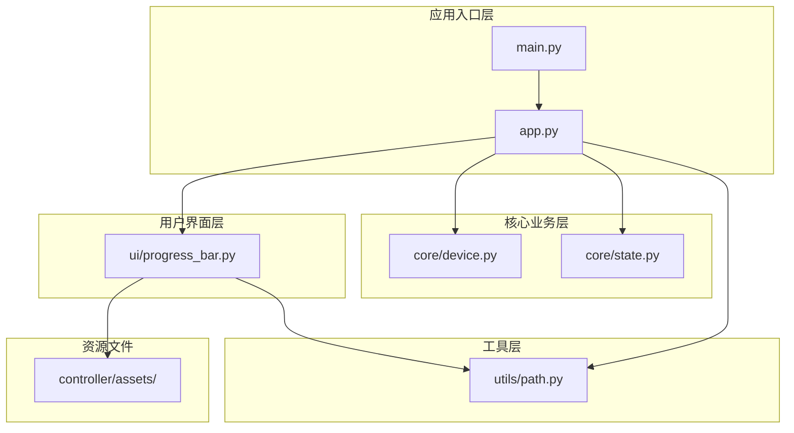
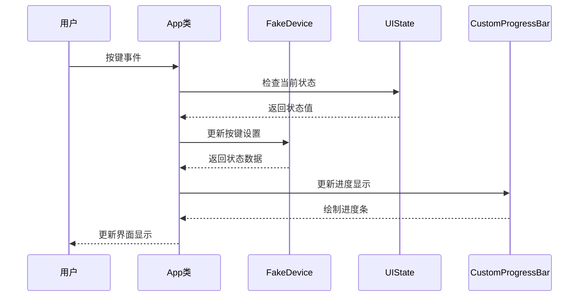
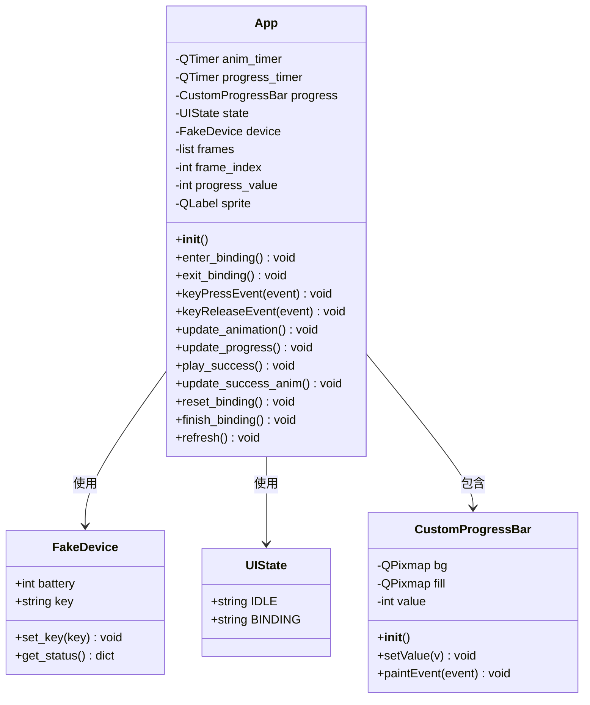
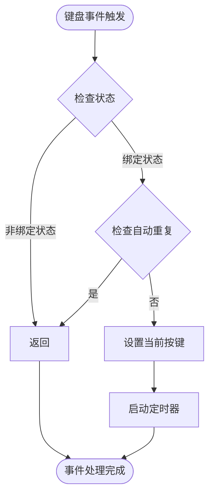
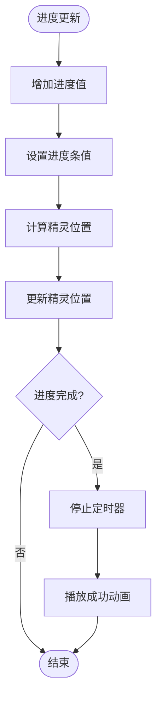
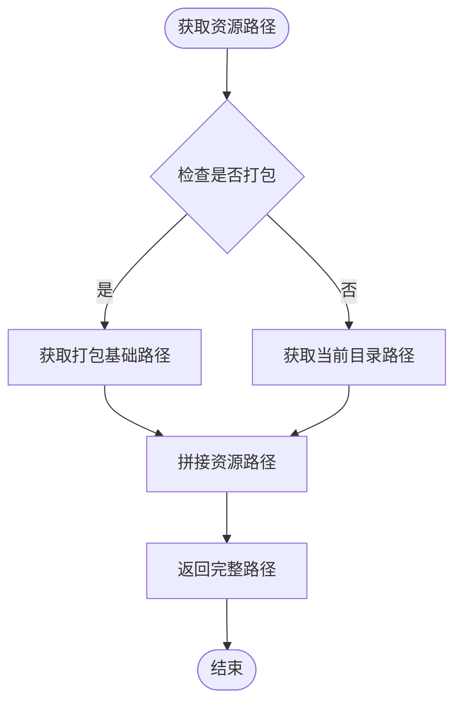
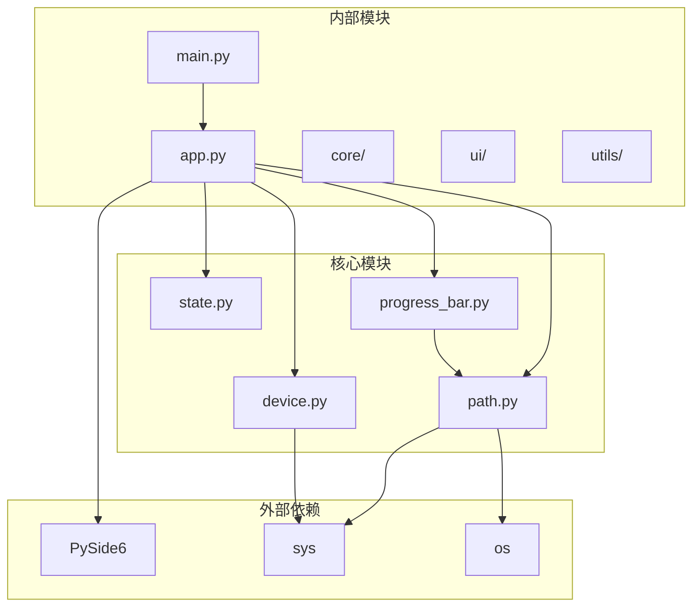

# 编码规范与最佳实践

<cite>
**本文档引用的文件**
- [app.py](file://controller/app.py)
- [main.py](file://controller/main.py)
- [device.py](file://controller/core/device.py)
- [state.py](file://controller/core/state.py)
- [path.py](file://controller/utils/path.py)
- [progress_bar.py](file://controller/ui/progress_bar.py)
- [.gitignore](file://.gitignore)
- [README.md](file://README.md)
</cite>

## 目录
1. [简介](#简介)
2. [项目结构](#项目结构)
3. [核心组件](#核心组件)
4. [架构概览](#架构概览)
5. [详细组件分析](#详细组件分析)
6. [依赖关系分析](#依赖关系分析)
7. [性能考虑](#性能考虑)
8. [故障排除指南](#故障排除指南)
9. [结论](#结论)
10. [附录](#附录)

## 简介

本指南为无线键盘玩具项目的Python编码规范和最佳实践提供全面的指导。该项目采用PySide6构建GUI应用程序，实现了键盘绑定功能和动画效果。本文档基于实际代码库分析，制定了符合PEP8标准的编码规范，涵盖了变量命名、函数设计、类组织、注释规范、错误处理、日志记录等各个方面。

## 项目结构

项目采用清晰的功能模块化组织方式，主要分为以下层次：

**图表来源**
- [main.py:1-8](file://controller/main.py#L1-L8)
- [app.py:1-202](file://controller/app.py#L1-L202)
- [device.py:1-11](file://controller/core/device.py#L1-L11)
- [state.py:1-3](file://controller/core/state.py#L1-L3)
- [progress_bar.py:1-28](file://controller/ui/progress_bar.py#L1-L28)
- [path.py:1-10](file://controller/utils/path.py#L1-L10)

**章节来源**
- [main.py:1-8](file://controller/main.py#L1-L8)
- [app.py:1-202](file://controller/app.py#L1-L202)

## 核心组件

### 应用程序主类

App类是整个GUI应用程序的核心控制器，负责管理用户界面状态、设备交互和动画系统。该类体现了良好的面向对象设计原则：

- **单一职责原则**：专注于UI状态管理和事件处理
- **封装性**：内部状态通过方法访问，避免直接属性修改
- **模块化设计**：将不同功能分离到独立的方法中

### 设备抽象层

FakeDevice类提供了设备抽象接口，模拟真实硬件的行为：
- 简洁的数据模型设计
- 清晰的方法职责划分
- 良好的数据封装

### 状态管理

UIState类定义了应用程序的状态常量，采用枚举式设计：
- 使用字符串常量表示状态
- 提供清晰的状态语义
- 易于扩展和维护

**章节来源**
- [app.py:12-202](file://controller/app.py#L12-L202)
- [device.py:1-11](file://controller/core/device.py#L1-L11)
- [state.py:1-3](file://controller/core/state.py#L1-L3)

## 架构概览

应用程序采用MVC（Model-View-Controller）架构模式的变体：

**图表来源**
- [app.py:77-202](file://controller/app.py#L77-L202)
- [device.py:6-11](file://controller/core/device.py#L6-L11)
- [state.py:1-3](file://controller/core/state.py#L1-L3)
- [progress_bar.py:15-28](file://controller/ui/progress_bar.py#L15-L28)

## 详细组件分析

### App类详细分析

App类是应用程序的核心控制器，实现了完整的键盘绑定流程：

#### 类设计原则

**图表来源**
- [app.py:12-202](file://controller/app.py#L12-L202)
- [device.py:1-11](file://controller/core/device.py#L1-L11)
- [state.py:1-3](file://controller/core/state.py#L1-L3)
- [progress_bar.py:5-28](file://controller/ui/progress_bar.py#L5-L28)

#### 关键方法分析

**键盘事件处理流程**：

**图表来源**
- [app.py:113-138](file://controller/app.py#L113-L138)

**进度更新算法**：

**图表来源**
- [app.py:148-161](file://controller/app.py#L148-L161)

**章节来源**
- [app.py:12-202](file://controller/app.py#L12-L202)

### CustomProgressBar类分析

CustomProgressBar类实现了自定义进度条控件：

#### 绘制机制

该类继承自QWidget，实现了自定义绘制逻辑：
- 使用QPainter进行图形绘制
- 支持背景和填充图像的组合
- 实现了动态裁剪填充区域

#### 性能优化

- 使用QPixmap缓存静态图像资源
- 在setValue方法中限制值范围，避免无效更新
- 通过update()方法触发重绘，提高响应效率

**章节来源**
- [progress_bar.py:1-28](file://controller/ui/progress_bar.py#L1-L28)

### 资源路径管理

resource_path函数提供了跨平台的资源路径解决方案：

#### 实现策略

**图表来源**
- [path.py:4-10](file://controller/utils/path.py#L4-L10)

**章节来源**
- [path.py:1-10](file://controller/utils/path.py#L1-L10)

## 依赖关系分析

项目采用清晰的依赖层次结构：

**图表来源**
- [main.py:1-8](file://controller/main.py#L1-L8)
- [app.py:1-10](file://controller/app.py#L1-L10)
- [progress_bar.py:1-3](file://controller/ui/progress_bar.py#L1-L3)
- [path.py:1-3](file://controller/utils/path.py#L1-L3)

**章节来源**
- [main.py:1-8](file://controller/main.py#L1-L8)
- [app.py:1-10](file://controller/app.py#L1-L10)

## 性能考虑

### 内存管理

- **图像资源缓存**：在App类中预加载QPixmap对象，避免重复创建
- **定时器管理**：及时停止不再使用的QTimer实例，防止内存泄漏
- **对象生命周期**：合理管理Qt对象的创建和销毁

### 渲染优化

- **最小化重绘**：仅在必要时调用update()方法触发重绘
- **批量操作**：在状态切换时一次性更新多个UI元素
- **延迟初始化**：资源在需要时才进行加载

### 事件处理

- **防抖处理**：过滤自动重复的键盘事件
- **状态检查**：在处理事件前检查应用程序状态
- **及时响应**：使用定时器实现流畅的动画效果

## 故障排除指南

### 常见问题及解决方案

#### 资源文件加载失败

**问题描述**：图像资源无法正确加载
**可能原因**：
- 资源路径配置错误
- 打包后路径解析问题
- 文件权限问题

**解决方案**：
- 验证resource_path函数的返回路径
- 检查assets目录结构
- 确认文件存在且可读

#### 动画显示异常

**问题描述**：精灵动画不流畅或显示错误
**可能原因**：
- 定时器频率设置不当
- 图像尺寸不匹配
- 坐标计算错误

**解决方案**：
- 调整anim_timer和progress_timer的间隔
- 验证图像尺寸和分辨率
- 检查坐标计算逻辑

#### 键盘事件处理问题

**问题描述**：按键绑定功能异常
**可能原因**：
- 事件过滤条件过于严格
- 状态管理错误
- Qt事件系统问题

**解决方案**：
- 检查UIState的使用
- 验证事件处理逻辑
- 测试不同键盘布局兼容性

**章节来源**
- [app.py:113-161](file://controller/app.py#L113-L161)
- [progress_bar.py:19-28](file://controller/ui/progress_bar.py#L19-L28)

## 结论

本编码规范和最佳实践指南基于无线键盘玩具项目的实际代码实现，总结了以下关键要点：

1. **代码风格一致性**：遵循PEP8标准，保持代码格式统一
2. **模块化设计**：清晰的分层架构，职责明确的模块划分
3. **面向对象原则**：合理的类设计和继承关系
4. **错误处理策略**：完善的异常处理和状态管理
5. **性能优化**：注重内存管理和渲染效率
6. **可维护性**：清晰的注释和文档规范

这些规范为项目的长期发展奠定了坚实的基础，确保代码质量和团队协作效率。

## 附录

### Python代码风格规范

#### PEP8遵循情况

**已遵循的规范**：
- 缩进使用4个空格
- 行长度不超过79字符
- 导入语句分组排列
- 类名使用PascalCase
- 函数名使用snake_case
- 常量名使用UPPER_CASE

**建议改进**：
- 添加适当的空行分隔逻辑块
- 优化长行代码的换行处理
- 增强类型注解的使用

#### 变量命名约定

**类变量**：使用PascalCase，如 `FakeDevice`, `CustomProgressBar`
**实例变量**：使用snake_case，如 `current_pressed_key`, `frame_index`
**常量**：使用UPPER_CASE，如 `IDLE`, `BINDING`
**临时变量**：使用简短的snake_case，如 `i`, `j`, `event`

#### 函数命名规范

**方法命名**：使用动词短语的snake_case，如 `enter_binding`, `update_progress`
**私有方法**：使用单下划线前缀 `_method_name`
**受保护方法**：使用双下划线前缀 `__method_name`
**静态方法**：使用 `@staticmethod` 装饰器

#### 注释编写规范

**类注释**：使用三重引号的docstring，描述类的功能和用途
**方法注释**：包含参数说明、返回值和异常信息
**复杂逻辑注释**：解释算法思路和关键步骤
**行内注释**：简洁明了地说明代码意图

#### 错误处理模式

**异常捕获**：使用try-except块处理预期异常
**错误传播**：在适当的地方重新抛出异常
**资源清理**：使用finally块或with语句确保资源释放
**日志记录**：使用logging模块记录错误信息

#### 代码组织结构

**导入顺序**：
1. 标准库导入
2. 第三方库导入  
3. 本地模块导入
4. 模块内相对导入

**依赖管理**：
- 使用requirements.txt管理第三方依赖
- 避免循环导入
- 最小化模块间耦合
- 明确接口契约

#### 日志记录规范

**日志级别**：
- DEBUG：详细调试信息
- INFO：一般运行信息
- WARNING：警告信息
- ERROR：错误信息
- CRITICAL：严重错误

**日志格式**：包含时间戳、级别、模块名和消息内容

#### 代码审查检查清单

**功能性**：
- 功能实现是否正确
- 边界条件处理是否完善
- 性能是否满足要求

**可维护性**：
- 代码是否易于理解
- 是否有适当的注释
- 设计是否合理

**可靠性**：
- 是否有充分的错误处理
- 是否考虑了异常情况
- 是否有适当的测试覆盖

**安全性**：
- 是否存在安全漏洞
- 输入验证是否充分
- 资源使用是否安全