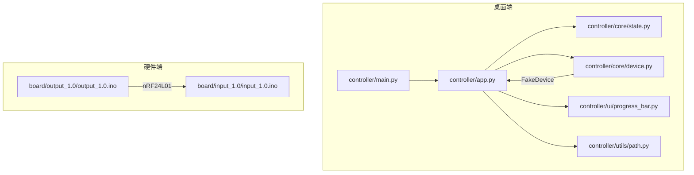
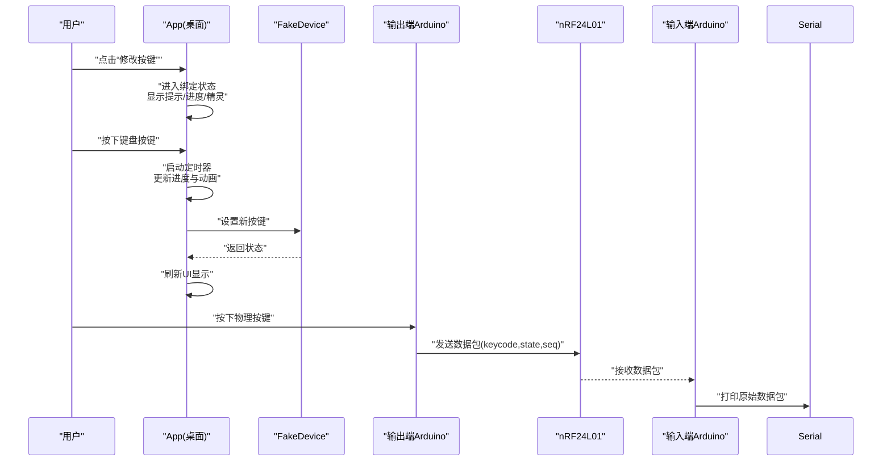
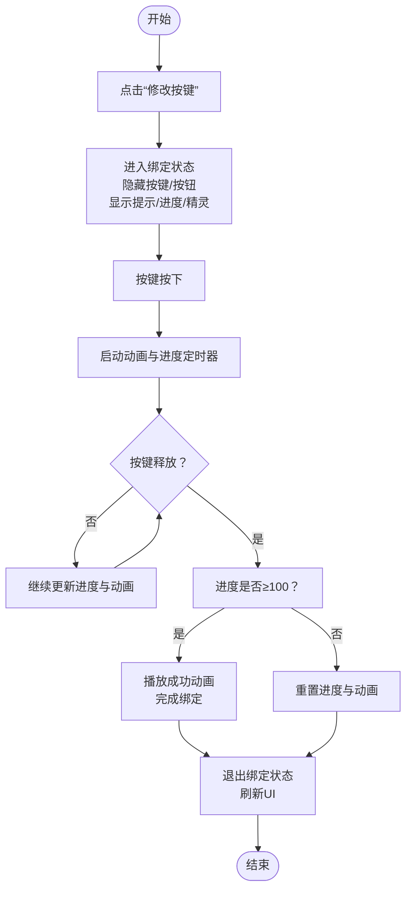
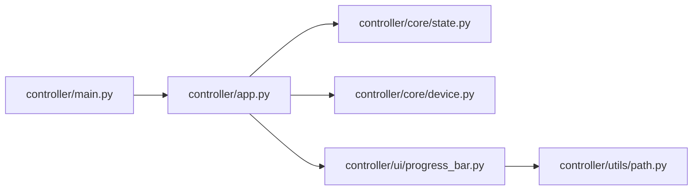

# 调试与测试

<cite>
**本文引用的文件**
- [README.md](file://README.md)
- [controller/main.py](file://controller/main.py)
- [controller/app.py](file://controller/app.py)
- [controller/core/device.py](file://controller/core/device.py)
- [controller/core/state.py](file://controller/core/state.py)
- [controller/ui/progress_bar.py](file://controller/ui/progress_bar.py)
- [controller/utils/path.py](file://controller/utils/path.py)
- [board/input_1.0/input_1.0.ino](file://board/input_1.0/input_1.0.ino)
- [board/output_1.0/output_1.0.ino](file://board/output_1.0/output_1.0.ino)
</cite>

## 目录
1. [简介](#简介)
2. [项目结构](#项目结构)
3. [核心组件](#核心组件)
4. [架构总览](#架构总览)
5. [详细组件分析](#详细组件分析)
6. [依赖关系分析](#依赖关系分析)
7. [性能考虑](#性能考虑)
8. [故障排查指南](#故障排查指南)
9. [结论](#结论)
10. [附录](#附录)

## 简介
本指南面向桌面应用与嵌入式硬件联合调试与测试场景，围绕以下目标展开：
- 桌面应用调试：PySide6 应用的断点调试、日志输出与 UI 状态监控。
- 硬件调试：Arduino 串口监视器使用、无线通信调试与电路故障排查。
- 测试策略：单元测试与集成测试，含 Qt 测试框架与模拟对象的创建。
- 性能分析与内存泄漏检测：工具与实践建议。
- 常见问题诊断流程与解决方案。

本项目包含桌面控制器（PySide6）与两块 Arduino 板（输入/输出），通过 nRF24L01 无线模块进行按键事件传输，桌面端负责显示状态与引导用户完成按键绑定流程。

## 项目结构
项目采用“功能分层 + 文件组织”的方式：
- desktop controller 层：入口、窗口、UI 组件、状态机与设备抽象。
- hardware firmware 层：输入端发送按键事件，输出端接收并转发原始数据包。

图表来源
- [controller/main.py:1-8](file://controller/main.py#L1-L8)
- [controller/app.py:1-202](file://controller/app.py#L1-L202)
- [controller/core/state.py:1-3](file://controller/core/state.py#L1-L3)
- [controller/core/device.py:1-11](file://controller/core/device.py#L1-L11)
- [controller/ui/progress_bar.py:1-28](file://controller/ui/progress_bar.py#L1-L28)
- [controller/utils/path.py:1-10](file://controller/utils/path.py#L1-L10)
- [board/input_1.0/input_1.0.ino:1-35](file://board/input_1.0/input_1.0.ino#L1-L35)
- [board/output_1.0/output_1.0.ino:1-43](file://board/output_1.0/output_1.0.ino#L1-L43)

章节来源
- [README.md:1-1](file://README.md#L1-L1)
- [controller/main.py:1-8](file://controller/main.py#L1-L8)
- [controller/app.py:1-202](file://controller/app.py#L1-L202)
- [controller/core/device.py:1-11](file://controller/core/device.py#L1-L11)
- [controller/core/state.py:1-3](file://controller/core/state.py#L1-L3)
- [controller/ui/progress_bar.py:1-28](file://controller/ui/progress_bar.py#L1-L28)
- [controller/utils/path.py:1-10](file://controller/utils/path.py#L1-L10)
- [board/input_1.0/input_1.0.ino:1-35](file://board/input_1.0/input_1.0.ino#L1-L35)
- [board/output_1.0/output_1.0.ino:1-43](file://board/output_1.0/output_1.0.ino#L1-L43)

## 核心组件
- 入口与主循环：桌面应用入口负责创建 QApplication 与主窗口，启动事件循环。
- 主窗口 App：管理 UI 状态、按键事件处理、动画与进度条更新、设备状态刷新。
- 设备抽象 FakeDevice：提供电池与按键状态读取，以及设置新按键的方法；用于桌面端逻辑验证。
- UI 状态机 UIState：定义空闲与绑定两种状态，驱动 UI 行为切换。
- 自定义进度条 CustomProgressBar：绘制背景与填充区域，支持值更新与重绘。
- 资源路径工具 resource_path：兼容打包后的可执行文件资源定位。

章节来源
- [controller/main.py:1-8](file://controller/main.py#L1-L8)
- [controller/app.py:12-202](file://controller/app.py#L12-L202)
- [controller/core/device.py:1-11](file://controller/core/device.py#L1-L11)
- [controller/core/state.py:1-3](file://controller/core/state.py#L1-L3)
- [controller/ui/progress_bar.py:5-28](file://controller/ui/progress_bar.py#L5-L28)
- [controller/utils/path.py:4-10](file://controller/utils/path.py#L4-L10)

## 架构总览
桌面端与硬件端通过 nRF24L01 无线模块通信，桌面端负责用户交互与状态展示，硬件端负责采集按键并发送数据包。数据包结构包含键码、状态与序列号，输入端仅转发原始数据到串口，便于上位机观察。

图表来源
- [controller/app.py:77-196](file://controller/app.py#L77-L196)
- [controller/core/device.py:6-11](file://controller/core/device.py#L6-L11)
- [board/output_1.0/output_1.0.ino:28-43](file://board/output_1.0/output_1.0.ino#L28-L43)
- [board/input_1.0/input_1.0.ino:24-35](file://board/input_1.0/input_1.0.ino#L24-L35)

## 详细组件分析

### 桌面应用组件分析
- App 类职责
  - 窗口初始化与布局：标题、尺寸、焦点策略。
  - UI 控件：状态标签、电量标签、按键标签、按钮、提示文本、进度条、精灵图。
  - 动画与进度：帧索引、进度值、精灵移动、定时器驱动。
  - 状态机：进入/退出绑定模式，刷新 UI。
  - 键盘事件：捕获按键按下/释放，启动/停止定时器，判定成功或重置。
  - 设备交互：调用设备设置按键并刷新显示。

- 关键流程图：绑定流程

图表来源
- [controller/app.py:77-196](file://controller/app.py#L77-L196)

章节来源
- [controller/app.py:12-202](file://controller/app.py#L12-L202)

### 设备抽象与状态机
- FakeDevice 提供电池与按键状态，set_key 会打印绑定信息，get_status 返回字典。
- UIState 定义 IDLE 与 BINDING 两个状态，驱动 UI 的行为切换。

章节来源
- [controller/core/device.py:1-11](file://controller/core/device.py#L1-L11)
- [controller/core/state.py:1-3](file://controller/core/state.py#L1-L3)

### 自定义进度条
- 绘制背景与按比例裁剪填充区域，setValue 更新值并触发重绘。
- 与 App 的进度定时器配合，驱动精灵沿进度条移动。

章节来源
- [controller/ui/progress_bar.py:5-28](file://controller/ui/progress_bar.py#L5-L28)

### 资源路径工具
- 在打包后可执行文件中正确解析资源路径，避免运行时找不到图片资源。

章节来源
- [controller/utils/path.py:4-10](file://controller/utils/path.py#L4-L10)

### 硬件端组件分析
- 输入端 Arduino
  - 初始化 nRF24L01 并开启读取管道，持续监听。
  - 有数据到达时，直接将数据包字段以逗号分隔输出到串口，便于上位机观察。
- 输出端 Arduino
  - 监听按键状态变化，构造数据包（键码、状态、序列号）并通过 nRF24L01 发送。
  - 使用低功率模式，避免干扰。

章节来源
- [board/input_1.0/input_1.0.ino:16-35](file://board/input_1.0/input_1.0.ino#L16-L35)
- [board/output_1.0/output_1.0.ino:19-43](file://board/output_1.0/output_1.0.ino#L19-L43)

## 依赖关系分析
- 模块导入关系
  - main.py 导入 app.py 创建窗口并启动事件循环。
  - app.py 导入 state.py、device.py、progress_bar.py、path.py。
  - progress_bar.py 依赖 path.py。
  - device.py 为 app.py 的依赖。
- 外部依赖
  - PySide6：GUI 框架。
  - nRF24L01 库：无线通信。
  - Arduino IDE：编译与上传固件。

图表来源
- [controller/main.py:1-8](file://controller/main.py#L1-L8)
- [controller/app.py:6-9](file://controller/app.py#L6-L9)
- [controller/ui/progress_bar.py:3](file://controller/ui/progress_bar.py#L3)
- [controller/utils/path.py:4-10](file://controller/utils/path.py#L4-L10)

章节来源
- [controller/main.py:1-8](file://controller/main.py#L1-L8)
- [controller/app.py:6-9](file://controller/app.py#L6-L9)
- [controller/ui/progress_bar.py:3](file://controller/ui/progress_bar.py#L3)
- [controller/utils/path.py:4-10](file://controller/utils/path.py#L4-L10)

## 性能考虑
- 定时器频率与帧率
  - 动画定时器与进度定时器分别控制精灵帧切换与进度推进，需平衡流畅度与 CPU 占用。
- UI 刷新策略
  - setValue 与 update 仅在必要时触发重绘，避免过度绘制。
- 资源加载
  - 预加载精灵帧与进度条纹理，减少运行时 IO。
- 无线通信
  - 输出端使用低功率模式，降低功耗与干扰；输入端仅转发数据包，不做复杂处理，减少延迟。

章节来源
- [controller/app.py:67-75](file://controller/app.py#L67-L75)
- [controller/ui/progress_bar.py:15-28](file://controller/ui/progress_bar.py#L15-L28)
- [board/output_1.0/output_1.0.ino:24-25](file://board/output_1.0/output_1.0.ino#L24-L25)
- [board/input_1.0/input_1.0.ino:28-34](file://board/input_1.0/input_1.0.ino#L28-L34)

## 故障排查指南

### 桌面应用调试
- 断点调试
  - 在 PyCharm/VSCode 中设置断点于关键函数入口，如 App 的 keyPressEvent、update_progress、finish_binding 等。
  - 观察 state、progress_value、current_pressed_key 等变量的变化。
- 日志输出
  - 设备 set_key 会打印绑定信息，可在终端查看。
  - 可在 App.refresh 中添加日志，记录设备状态与 UI 显示的一致性。
- UI 状态监控
  - 使用 Qt Creator 的对象树与属性面板，检查控件可见性、位置与尺寸。
  - 通过状态标签与电量标签确认设备状态是否正确刷新。

章节来源
- [controller/app.py:113-138](file://controller/app.py#L113-L138)
- [controller/app.py:148-161](file://controller/app.py#L148-L161)
- [controller/app.py:190-196](file://controller/app.py#L190-L196)
- [controller/core/device.py:6-8](file://controller/core/device.py#L6-L8)

### 硬件调试
- 串口监视器
  - 打开 Arduino IDE 的串口监视器，波特率为 115200，观察输入端打印的数据包字段。
  - 若无输出，检查 nRF24L01 接线与供电。
- 无线通信调试
  - 确认输入/输出两端地址一致且无线模块工作正常。
  - 使用示波器或逻辑分析仪检查按键抖动与电平变化。
- 电路故障排查
  - 检查电源电压、地线连通性与上拉电阻。
  - 更换天线或缩短连线以排除信号衰减影响。

章节来源
- [board/input_1.0/input_1.0.ino:17](file://board/input_1.0/input_1.0.ino#L17)
- [board/output_1.0/output_1.0.ino:20](file://board/output_1.0/output_1.0.ino#L20)

### 单元测试与模拟对象
- 测试框架建议
  - 使用 Python unittest 或 pytest 编写桌面端逻辑测试。
  - 对 UIState、FakeDevice、CustomProgressBar 等进行单元测试。
- 模拟对象
  - 使用 unittest.mock 或 pytest-mock 替换真实设备，验证 App 的状态转换与 UI 更新逻辑。
  - 示例思路：构造 FakeDevice 的替身，断言 set_key 被调用、get_status 返回预期值。

章节来源
- [controller/core/state.py:1-3](file://controller/core/state.py#L1-L3)
- [controller/core/device.py:1-11](file://controller/core/device.py#L1-L11)
- [controller/ui/progress_bar.py:5-28](file://controller/ui/progress_bar.py#L5-L28)

### 集成测试策略
- 桌面应用与 Arduino 联合测试
  - 使用串口读取输入端输出的数据包字段，验证按键事件是否正确转发。
  - 在 App 中注入可替换的设备接口，使测试可控制输入端的事件序列。
  - 模拟绑定流程：触发 App 的按键事件处理，断言 UI 状态与设备状态一致。

章节来源
- [controller/app.py:77-196](file://controller/app.py#L77-L196)
- [board/input_1.0/input_1.0.ino:24-35](file://board/input_1.0/input_1.0.ino#L24-L35)

### 性能分析与内存泄漏检测
- 工具建议
  - Python：使用 cProfile、memory_profiler 分析 CPU 与内存占用。
  - PySide6：使用 QLoggingCategory 输出性能日志，结合系统性能监视器。
  - Arduino：使用内置计时函数测量无线发送间隔与处理耗时。
- 内存泄漏检测
  - 关注定时器生命周期，确保在退出绑定或关闭窗口时停止并释放。
  - 检查 QPixmap 资源的生命周期，避免重复加载导致内存增长。

章节来源
- [controller/app.py:67-75](file://controller/app.py#L67-L75)
- [controller/ui/progress_bar.py:10-11](file://controller/ui/progress_bar.py#L10-L11)

### 常见问题诊断流程
- 症状：桌面端无法显示电量或按键
  - 检查设备状态刷新逻辑与标签更新。
  - 确认设备返回的字典结构与键名一致。
- 症状：绑定流程无法完成
  - 检查定时器启动/停止条件与进度阈值。
  - 观察精灵动画与进度条同步情况。
- 症状：无线通信不稳定
  - 检查 nRF24L01 地址、功率设置与天线连接。
  - 使用串口监视器确认数据包是否到达。

章节来源
- [controller/app.py:199-202](file://controller/app.py#L199-L202)
- [controller/app.py:148-161](file://controller/app.py#L148-L161)
- [board/input_1.0/input_1.0.ino:24-35](file://board/input_1.0/input_1.0.ino#L24-L35)

## 结论
本指南提供了从桌面端到硬件端的完整调试与测试路径：通过断点调试、日志输出与 UI 状态监控定位桌面端问题；借助串口监视器与无线通信观测验证硬件链路；利用单元测试与模拟对象隔离验证业务逻辑；最后结合性能分析与内存泄漏检测提升系统稳定性。建议在开发周期中持续进行集成测试，确保桌面端与硬件端协同工作的可靠性。

## 附录
- 快速检查清单
  - 桌面端：断点命中、日志输出、UI 状态切换、资源路径正确。
  - 硬件端：串口有输出、地址一致、天线连接良好、按键无抖动。
  - 集成：绑定流程完整、数据包字段正确、动画与进度同步。