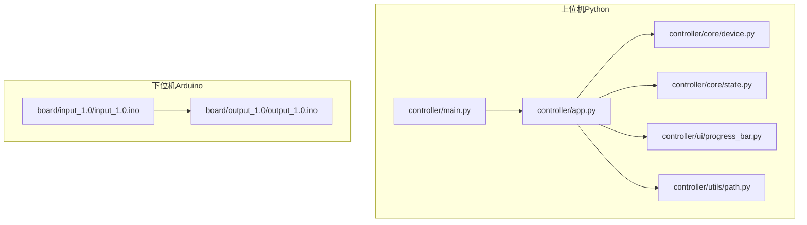
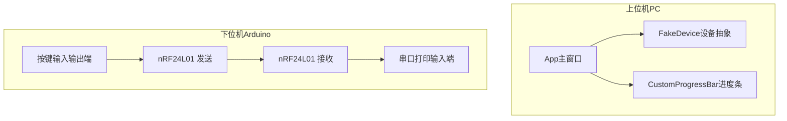
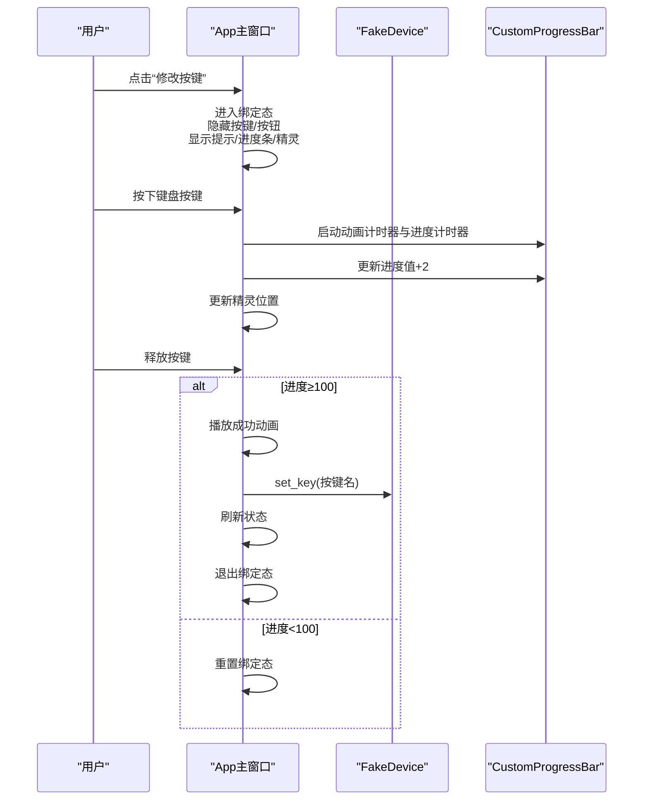
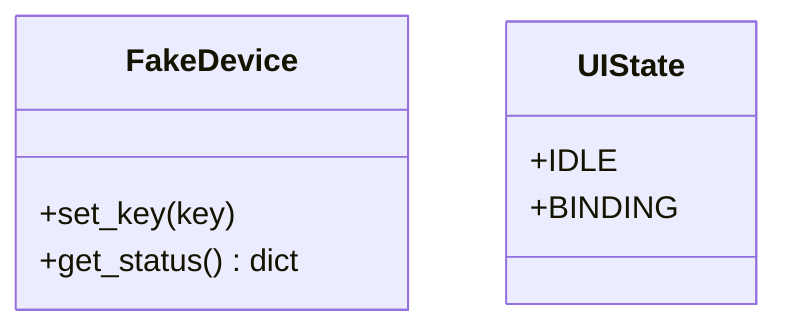
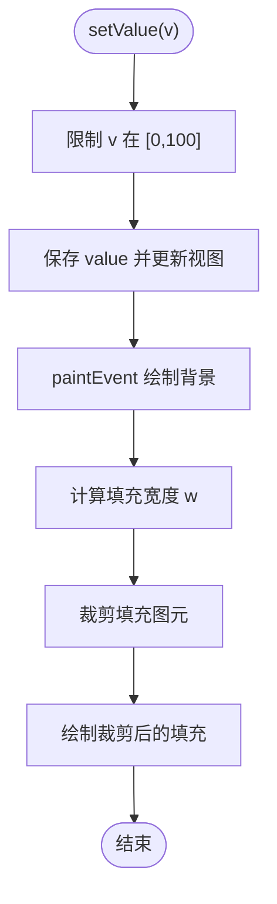
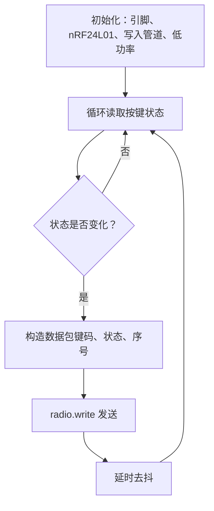
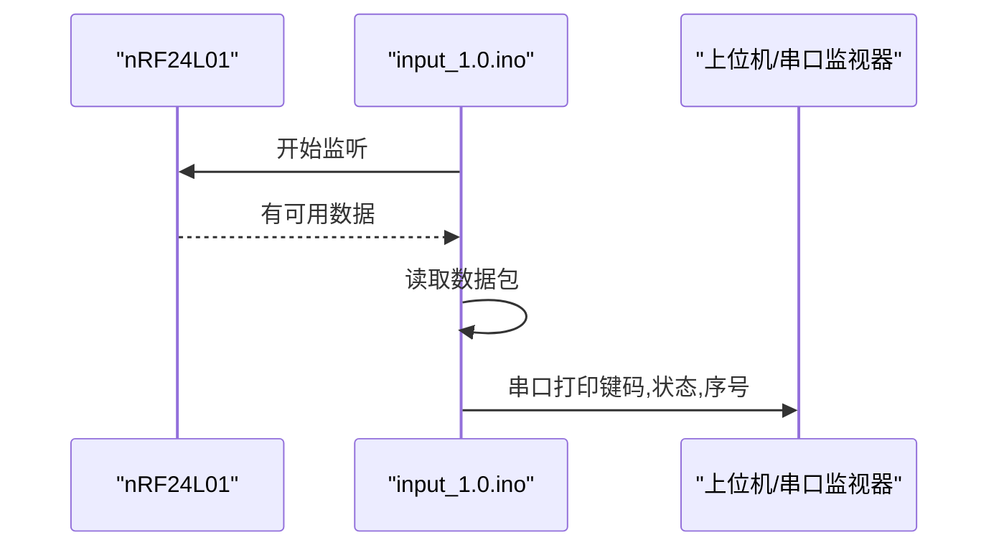
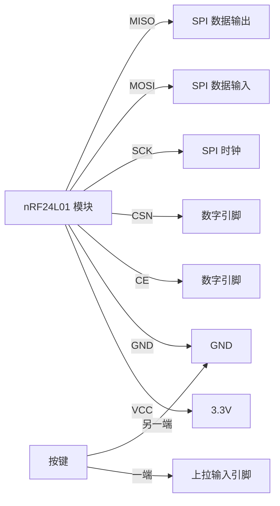
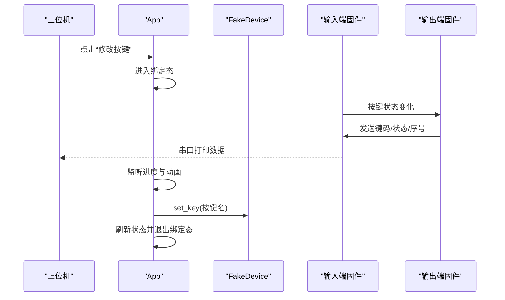

# 快速开始

<cite>
**本文引用的文件**
- [README.md](file://README.md)
- [controller/main.py](file://controller/main.py)
- [controller/app.py](file://controller/app.py)
- [controller/core/device.py](file://controller/core/device.py)
- [controller/core/state.py](file://controller/core/state.py)
- [controller/ui/progress_bar.py](file://controller/ui/progress_bar.py)
- [controller/utils/path.py](file://controller/utils/path.py)
- [board/input_1.0/input_1.0.ino](file://board/input_1.0/input_1.0.ino)
- [board/output_1.0/output_1.0.ino](file://board/output_1.0/output_1.0.ino)
- [.gitignore](file://.gitignore)
</cite>

## 目录
1. [简介](#简介)
2. [项目结构](#项目结构)
3. [核心组件](#核心组件)
4. [架构总览](#架构总览)
5. [详细组件分析](#详细组件分析)
6. [依赖分析](#依赖分析)
7. [性能考虑](#性能考虑)
8. [故障排除指南](#故障排除指南)
9. [结论](#结论)
10. [附录](#附录)

## 简介
本指南面向首次接触“无线键盘玩具”项目的开发者与爱好者，帮助你在最短时间内完成环境准备、硬件连接、软件配置与首次运行验证。项目由两部分组成：
- 上位机软件：基于 PySide6 的图形界面，用于按键绑定与状态显示。
- 下位机固件：基于 Arduino 与 nRF24L01 的收发两端，分别负责按键事件采集与无线发送/接收。

通过本指南，你将获得：
- Python 环境与依赖安装步骤
- PySide6 库安装与使用说明
- Arduino IDE 设置与上传流程
- nRF24L01 模块的硬件接线图与注意事项
- 串口通信与设备绑定流程
- 常见问题排查与优化建议

## 项目结构
仓库采用分层组织方式：
- controller：上位机应用与核心逻辑
  - app.py：主窗口与交互逻辑
  - core：设备抽象与状态管理
  - ui：自定义控件（进度条）
  - utils：资源路径工具
- board：下位机固件（输入端与输出端）
- 根目录：项目说明与忽略规则

**图表来源**
- [controller/main.py:1-8](file://controller/main.py#L1-L8)
- [controller/app.py:12-75](file://controller/app.py#L12-L75)
- [controller/core/device.py:1-11](file://controller/core/device.py#L1-L11)
- [controller/core/state.py:1-3](file://controller/core/state.py#L1-L3)
- [controller/ui/progress_bar.py:1-28](file://controller/ui/progress_bar.py#L1-L28)
- [controller/utils/path.py:1-10](file://controller/utils/path.py#L1-L10)
- [board/input_1.0/input_1.0.ino:1-35](file://board/input_1.0/input_1.0.ino#L1-L35)
- [board/output_1.0/output_1.0.ino:1-43](file://board/output_1.0/output_1.0.ino#L1-L43)

**章节来源**
- [README.md:1-1](file://README.md#L1-L1)
- [controller/main.py:1-8](file://controller/main.py#L1-L8)
- [controller/app.py:12-75](file://controller/app.py#L12-L75)
- [board/input_1.0/input_1.0.ino:1-35](file://board/input_1.0/input_1.0.ino#L1-L35)
- [board/output_1.0/output_1.0.ino:1-43](file://board/output_1.0/output_1.0.ino#L1-L43)

## 核心组件
- 上位机应用入口：启动 Qt 应用并展示主窗口。
- 主窗口类：负责 UI 布局、状态切换、按键绑定流程、动画与进度条更新。
- 设备抽象：提供电池电量与当前按键的虚拟数据接口。
- 状态管理：定义空闲与绑定两种 UI 状态。
- 自定义进度条：绘制背景与填充区域，支持值更新。
- 资源路径工具：兼容打包后的可执行文件资源定位。

**章节来源**
- [controller/main.py:1-8](file://controller/main.py#L1-L8)
- [controller/app.py:12-75](file://controller/app.py#L12-L75)
- [controller/core/device.py:1-11](file://controller/core/device.py#L1-L11)
- [controller/core/state.py:1-3](file://controller/core/state.py#L1-L3)
- [controller/ui/progress_bar.py:1-28](file://controller/ui/progress_bar.py#L1-L28)
- [controller/utils/path.py:1-10](file://controller/utils/path.py#L1-L10)

## 架构总览
上位机与下位机通过 nRF24L01 无线模块通信，下位机采集按键状态并通过无线发送；上位机接收数据并在 UI 中展示绑定结果。

**图表来源**
- [controller/app.py:12-75](file://controller/app.py#L12-L75)
- [controller/core/device.py:1-11](file://controller/core/device.py#L1-L11)
- [controller/ui/progress_bar.py:1-28](file://controller/ui/progress_bar.py#L1-L28)
- [board/output_1.0/output_1.0.ino:1-43](file://board/output_1.0/output_1.0.ino#L1-L43)
- [board/input_1.0/input_1.0.ino:1-35](file://board/input_1.0/input_1.0.ino#L1-L35)

## 详细组件分析

### 上位机应用（PySide6）
- 启动流程：创建 QApplication 实例，初始化 App 并显示。
- 主窗口职责：
  - 展示状态、电量与当前按键
  - 提供“修改按键”按钮进入绑定流程
  - 绑定时显示提示、进度条与精灵动画
  - 键盘按下与释放事件驱动进度增长与成功判定
  - 绑定完成后刷新状态并退出绑定态

**图表来源**
- [controller/app.py:77-196](file://controller/app.py#L77-L196)
- [controller/core/device.py:6-8](file://controller/core/device.py#L6-L8)
- [controller/ui/progress_bar.py:15-28](file://controller/ui/progress_bar.py#L15-L28)

**章节来源**
- [controller/main.py:1-8](file://controller/main.py#L1-L8)
- [controller/app.py:12-75](file://controller/app.py#L12-L75)
- [controller/app.py:113-196](file://controller/app.py#L113-L196)

### 设备抽象与状态管理
- FakeDevice：提供电池电量与当前按键的虚拟数据，支持设置新按键。
- UIState：定义 IDLE 与 BINDING 两种状态，用于控制 UI 行为。

**图表来源**
- [controller/core/device.py:1-11](file://controller/core/device.py#L1-L11)
- [controller/core/state.py:1-3](file://controller/core/state.py#L1-L3)

**章节来源**
- [controller/core/device.py:1-11](file://controller/core/device.py#L1-L11)
- [controller/core/state.py:1-3](file://controller/core/state.py#L1-L3)

### 自定义进度条
- 绘制背景与按比例裁剪的填充区域
- setValue 限制范围并触发重绘

**图表来源**
- [controller/ui/progress_bar.py:15-28](file://controller/ui/progress_bar.py#L15-L28)

**章节来源**
- [controller/ui/progress_bar.py:1-28](file://controller/ui/progress_bar.py#L1-L28)

### 资源路径工具
- 兼容 PyInstaller 打包后资源定位，拼接相对路径返回绝对路径

**章节来源**
- [controller/utils/path.py:1-10](file://controller/utils/path.py#L1-L10)

### 下位机固件（输出端：按键采集与发送）
- 使用 nRF24L01 将按键状态通过无线发送
- 通过序列号递增记录事件顺序
- 低功率模式降低功耗与干扰

**图表来源**
- [board/output_1.0/output_1.0.ino:19-43](file://board/output_1.0/output_1.0.ino#L19-L43)

**章节来源**
- [board/output_1.0/output_1.0.ino:1-43](file://board/output_1.0/output_1.0.ino#L1-L43)

### 下位机固件（输入端：接收与串口转发）
- 初始化 nRF24L01 为接收模式，打开读取管道
- 有数据可用时读取并原样打印到串口（键码、状态、序号）

**图表来源**
- [board/input_1.0/input_1.0.ino:16-35](file://board/input_1.0/input_1.0.ino#L16-L35)

**章节来源**
- [board/input_1.0/input_1.0.ino:1-35](file://board/input_1.0/input_1.0.ino#L1-L35)

## 依赖分析
- 上位机依赖：PySide6（Qt Widgets/Gui/Core）、标准库
- 下位机依赖：Arduino SPI、RF24 驱动、nRF24L01 库
- 项目忽略：Python 编译产物、虚拟环境、构建缓存等

**章节来源**
- [controller/main.py:1-8](file://controller/main.py#L1-L8)
- [board/output_1.0/output_1.0.ino:1-43](file://board/output_1.0/output_1.0.ino#L1-L43)
- [board/input_1.0/input_1.0.ino:1-35](file://board/input_1.0/input_1.0.ino#L1-L35)
- [.gitignore:1-123](file://.gitignore#L1-L123)

## 性能考虑
- 无线发送端采用低功率模式，减少能耗与干扰
- 发送前加入短延时，避免按键抖动引发的重复上报
- 上位机进度条与动画使用定时器驱动，帧率可控
- 串口打印仅在有数据时触发，避免空转

[本节为通用建议，无需特定文件引用]

## 故障排除指南
- 无法导入 PySide6
  - 确认 Python 版本与系统架构匹配
  - 使用包管理器安装 PySide6
  - 若使用虚拟环境，请确保已激活
- 串口无数据
  - 检查输入端固件是否正确烧录
  - 确认串口波特率一致（输入端使用较高波特率）
  - 检查 USB 转串口芯片与驱动
- 无线无法通信
  - 确认两块板子使用相同地址与频道配置
  - 检查天线连接与供电电压
  - 避免强干扰源（微波炉、无绳电话等）
- 绑定失败
  - 确保按键长按直至进度条满
  - 避免自动重复按键导致中断
  - 重新进入绑定流程并重试

[本节为通用建议，无需特定文件引用]

## 结论
通过本指南，你已经完成了从环境准备到首次运行的全流程。建议在掌握基础功能后，进一步扩展：
- 使用真实串口通信替代虚拟设备
- 添加多按键支持与配置持久化
- 优化无线参数与动画效果

[本节为总结性内容，无需特定文件引用]

## 附录

### 环境要求与安装步骤
- Python 环境
  - 建议使用 Python 3.8~3.11
  - 创建并激活虚拟环境
- 安装 PySide6
  - 使用包管理器安装 PySide6
- 依赖确认
  - 运行上位机入口文件以验证依赖加载

**章节来源**
- [controller/main.py:1-8](file://controller/main.py#L1-L8)

### Arduino IDE 设置与上传
- 安装 Arduino IDE 与所需板包
- 在库管理器中安装 RF24 与相关 SPI 库
- 选择正确的开发板与端口
- 分别编译并上传输入端与输出端固件

**章节来源**
- [board/input_1.0/input_1.0.ino:1-35](file://board/input_1.0/input_1.0.ino#L1-L35)
- [board/output_1.0/output_1.0.ino:1-43](file://board/output_1.0/output_1.0.ino#L1-L43)

### 硬件连接步骤（nRF24L01）
- 接线要点
  - VCC → 3.3V（非 5V）
  - GND → GND
  - CE → 数字引脚（输出端使用某数字引脚）
  - CSN → 数字引脚（与 CE 不同）
  - SCK → SPI 时钟引脚
  - MOSI → SPI 数据输入引脚
  - MISO → SPI 数据输出引脚
- 天线连接
  - 使用合适长度的单根导线作为天线
- 按键输入端
  - 使用上拉输入引脚连接按键，另一端接地

**图表来源**
- [board/output_1.0/output_1.0.ino:5-26](file://board/output_1.0/output_1.0.ino#L5-L26)
- [board/input_1.0/input_1.0.ino:1-22](file://board/input_1.0/input_1.0.ino#L1-L22)

**章节来源**
- [board/output_1.0/output_1.0.ino:5-26](file://board/output_1.0/output_1.0.ino#L5-L26)
- [board/input_1.0/input_1.0.ino:1-22](file://board/input_1.0/input_1.0.ino#L1-L22)

### 串口通信与设备绑定流程
- 串口设置
  - 输入端使用高波特率串口输出
  - 打开串口监视器观察键码、状态、序号
- 绑定流程
  - 在上位机点击“修改按键”，进入绑定态
  - 长按目标键盘按键直至进度条满
  - 成功后自动保存按键映射并退出绑定态

**图表来源**
- [controller/app.py:77-196](file://controller/app.py#L77-L196)
- [controller/core/device.py:6-8](file://controller/core/device.py#L6-L8)
- [board/input_1.0/input_1.0.ino:24-35](file://board/input_1.0/input_1.0.ino#L24-L35)
- [board/output_1.0/output_1.0.ino:28-43](file://board/output_1.0/output_1.0.ino#L28-L43)

**章节来源**
- [controller/app.py:77-196](file://controller/app.py#L77-L196)
- [board/input_1.0/input_1.0.ino:24-35](file://board/input_1.0/input_1.0.ino#L24-L35)
- [board/output_1.0/output_1.0.ino:28-43](file://board/output_1.0/output_1.0.ino#L28-L43)

### 首次运行完整操作指南
- 步骤概览
  - 准备 Python 环境并安装 PySide6
  - 安装 Arduino IDE 并配置 nRF24L01 库
  - 硬件连接：nRF24L01 与按键输入端
  - 上传输入端与输出端固件
  - 打开串口监视器观察数据
  - 运行上位机，进入绑定流程并完成按键绑定
- 注意事项
  - 严格使用 3.3V 供电
  - 确保天线连接良好
  - 绑定时避免自动重复按键

[本节为操作性指导，无需特定文件引用]