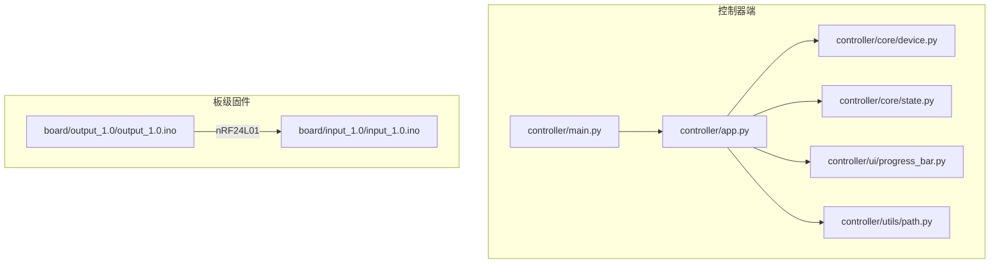
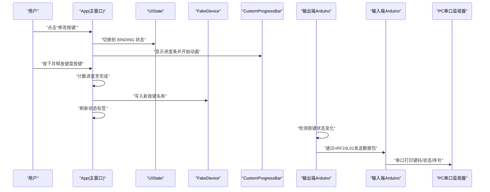
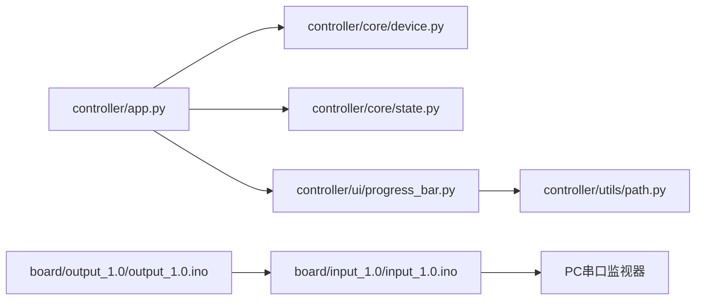
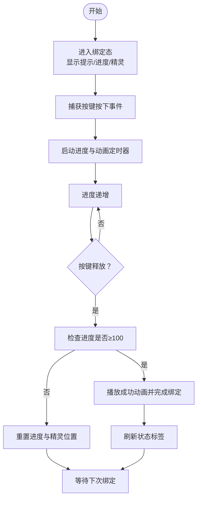

# 故障排除

<cite>
**本文引用的文件**
- [README.md](file://README.md)
- [controller/main.py](file://controller/main.py)
- [controller/app.py](file://controller/app.py)
- [controller/core/device.py](file://controller/core/device.py)
- [controller/core/state.py](file://controller/core/state.py)
- [controller/ui/progress_bar.py](file://controller/ui/progress_bar.py)
- [controller/utils/path.py](file://controller/utils/path.py)
- [board/input_1.0/input_1.0.ino](file://board/input_1.0/input_1.0.ino)
- [board/output_1.0/output_1.0.ino](file://board/output_1.0/output_1.0.ino)
</cite>

## 目录
1. [简介](#简介)
2. [项目结构](#项目结构)
3. [核心组件](#核心组件)
4. [架构总览](#架构总览)
5. [详细组件分析与故障排除](#详细组件分析与故障排除)
6. [依赖关系分析](#依赖关系分析)
7. [性能考虑](#性能考虑)
8. [故障排除指南](#故障排除指南)
9. [结论](#结论)
10. [附录](#附录)

## 简介
本指南面向“无线键盘玩具”项目的使用者与维护者，提供系统化、可操作的故障排除流程，覆盖以下方面：
- 无线通信故障：nRF24L01链路、数据包格式、地址与序列号一致性
- UI 显示与交互异常：进度条绘制、动画帧切换、按键绑定流程
- 硬件连接与固件问题：Arduino 按键输入、发射端发送逻辑、串口打印验证
- 软件层面问题：资源路径、打包后资源访问、PySide6 应用生命周期
- 预防性维护与健康检查清单
- 紧急恢复方案（最小可用回退）

本指南以仓库中实际代码为依据，避免臆测，所有分析均标注来源文件与行号。

## 项目结构
该项目采用分层组织：
- 控制器端（Python + PySide6）：应用入口、UI 组件、设备抽象、资源路径工具
- 板级固件（Arduino + nRF24L01）：输入端（接收并转发）、输出端（按键扫描并发送）

图表来源
- [controller/main.py:1-8](file://controller/main.py#L1-L8)
- [controller/app.py:1-202](file://controller/app.py#L1-L202)
- [controller/core/device.py:1-11](file://controller/core/device.py#L1-L11)
- [controller/core/state.py:1-3](file://controller/core/state.py#L1-L3)
- [controller/ui/progress_bar.py:1-28](file://controller/ui/progress_bar.py#L1-L28)
- [controller/utils/path.py:1-10](file://controller/utils/path.py#L1-L10)
- [board/input_1.0/input_1.0.ino:1-35](file://board/input_1.0/input_1.0.ino#L1-L35)
- [board/output_1.0/output_1.0.ino:1-43](file://board/output_1.0/output_1.0.ino#L1-L43)

章节来源
- [README.md:1-1](file://README.md#L1-L1)
- [controller/main.py:1-8](file://controller/main.py#L1-L8)

## 核心组件
- 应用入口与窗口：负责初始化应用、创建主窗口并进入事件循环
- 设备抽象：提供电池电量与当前按键的虚拟状态，支持设置新按键
- UI 状态机：定义空闲与绑定两种状态，驱动交互流程
- 自定义进度条：基于像素图绘制进度背景与填充区域
- 资源路径工具：兼容打包后的资源定位

章节来源
- [controller/main.py:1-8](file://controller/main.py#L1-L8)
- [controller/app.py:1-202](file://controller/app.py#L1-L202)
- [controller/core/device.py:1-11](file://controller/core/device.py#L1-L11)
- [controller/core/state.py:1-3](file://controller/core/state.py#L1-L3)
- [controller/ui/progress_bar.py:1-28](file://controller/ui/progress_bar.py#L1-L28)
- [controller/utils/path.py:1-10](file://controller/utils/path.py#L1-L10)

## 架构总览
从用户交互到硬件执行的关键路径如下：

图表来源
- [controller/app.py:77-197](file://controller/app.py#L77-L197)
- [controller/core/state.py:1-3](file://controller/core/state.py#L1-L3)
- [controller/core/device.py:6-11](file://controller/core/device.py#L6-L11)
- [controller/ui/progress_bar.py:15-28](file://controller/ui/progress_bar.py#L15-L28)
- [board/output_1.0/output_1.0.ino:28-43](file://board/output_1.0/output_1.0.ino#L28-L43)
- [board/input_1.0/input_1.0.ino:24-35](file://board/input_1.0/input_1.0.ino#L24-L35)

## 详细组件分析与故障排除

### UI 与交互流程（App）
- 关键点
  - 状态机：仅在绑定态处理键盘事件，防止误触发
  - 进度更新：定时器每 30ms 增加进度，动画定时器每 150ms 切换帧
  - 成功动画：进度达 100 后播放消失帧并完成绑定
  - 资源加载：通过资源路径工具加载行走帧与消失帧
- 常见问题与排查
  - 进度条不动：确认绑定态下是否启动了进度与动画定时器；检查 setValue 是否被调用
  - 动画不切换：检查帧索引与资源路径是否正确；确认 update_animation 是否被定时器回调
  - 绑定未生效：确认 keyReleaseEvent 中进度阈值与成功分支；检查设备 set_key 是否被调用
  - 资源缺失导致崩溃：打包后资源路径需正确；可通过资源路径函数拼接相对路径验证

章节来源
- [controller/app.py:77-197](file://controller/app.py#L77-L197)
- [controller/ui/progress_bar.py:15-28](file://controller/ui/progress_bar.py#L15-L28)
- [controller/utils/path.py:4-10](file://controller/utils/path.py#L4-L10)

### 自定义进度条（CustomProgressBar）
- 关键点
  - 背景与填充图按比例裁剪绘制，value 限制在 0~100
  - setValue 会触发重绘
- 常见问题与排查
  - 进度条空白：确认资源路径返回有效图片；检查 setValue 是否被调用
  - 绘制异常：检查 paintEvent 的裁剪宽度计算与 rect 尺寸

章节来源
- [controller/ui/progress_bar.py:1-28](file://controller/ui/progress_bar.py#L1-L28)

### 设备抽象（FakeDevice）
- 关键点
  - 提供电池电量与按键名称的只读状态
  - 设置按键会打印绑定日志
- 常见问题与排查
  - 状态不更新：确认 refresh 是否调用 get_status 并更新标签
  - 绑定无效：确认 set_key 已被调用且传入合法按键名

章节来源
- [controller/core/device.py:1-11](file://controller/core/device.py#L1-L11)
- [controller/app.py:199-202](file://controller/app.py#L199-L202)

### 状态机（UIState）
- 关键点
  - 定义空闲与绑定两种状态
- 常见问题与排查
  - 事件未响应：确认当前状态匹配处理分支；避免重复进入绑定态

章节来源
- [controller/core/state.py:1-3](file://controller/core/state.py#L1-L3)

### 应用入口（main）
- 关键点
  - 创建 QApplication 与 App 实例，显示窗口并进入事件循环
- 常见问题与排查
  - 窗口不显示：确认 QApplication 初始化与 exec 流程；检查窗口属性与资源路径

章节来源
- [controller/main.py:1-8](file://controller/main.py#L1-L8)

### 输出端固件（按键扫描与发送）
- 关键点
  - 使用按钮引脚输入，上拉配置
  - 检测电平变化后构造数据包并发送
  - 发送后自增序列号
- 常见问题与排查
  - 无数据发送：检查按钮引脚连接与上拉电阻；确认 radio 写入成功
  - 数据包字段错误：核对键码、状态、序列号字段顺序与类型
  - 发送失败：检查地址一致、PA 级别与停止监听配置

章节来源
- [board/output_1.0/output_1.0.ino:19-43](file://board/output_1.0/output_1.0.ino#L19-L43)

### 输入端固件（接收与串口转发）
- 关键点
  - 开启读管道并开始监听
  - 有数据时读取并原样打印键码、状态、序列号
- 常见问题与排查
  - 无串口输出：检查 radio 初始化与地址配置；确认接收管道打开
  - 打印异常：核对串口波特率与打印格式；确保数据包大小与结构一致

章节来源
- [board/input_1.0/input_1.0.ino:16-35](file://board/input_1.0/input_1.0.ino#L16-L35)

## 依赖关系分析
- 控制器端内部依赖
  - app 依赖 device、state、progress_bar、path
  - progress_bar 依赖 path 获取资源
- 硬件链路
  - 输出端通过 nRF24L01 发送数据包至输入端
  - 输入端将数据包转发到 PC 串口

图表来源
- [controller/app.py:6-9](file://controller/app.py#L6-L9)
- [controller/ui/progress_bar.py:3](file://controller/ui/progress_bar.py#L3)
- [controller/utils/path.py:4-10](file://controller/utils/path.py#L4-L10)
- [board/output_1.0/output_1.0.ino:22-25](file://board/output_1.0/output_1.0.ino#L22-L25)
- [board/input_1.0/input_1.0.ino:19-21](file://board/input_1.0/input_1.0.ino#L19-L21)

章节来源
- [controller/app.py:6-9](file://controller/app.py#L6-L9)
- [controller/ui/progress_bar.py:3](file://controller/ui/progress_bar.py#L3)
- [controller/utils/path.py:4-10](file://controller/utils/path.py#L4-L10)
- [board/output_1.0/output_1.0.ino:22-25](file://board/output_1.0/output_1.0.ino#L22-L25)
- [board/input_1.0/input_1.0.ino:19-21](file://board/input_1.0/input_1.0.ino#L19-L21)

## 性能考虑
- 定时器频率
  - 进度定时器 30ms，动画定时器 150ms；可根据 UI 响应需求微调
- 资源加载
  - 预加载帧图减少运行时开销；确保资源路径正确避免重复 IO
- 无线链路
  - PA 级别与距离权衡；序列号用于去重与顺序校验
- 事件处理
  - 避免重复按键自动重复导致的状态抖动

[本节为通用指导，无需列出章节来源]

## 故障排除指南

### 一、无线通信故障
- 现象
  - 串口无打印或打印异常
  - 按键无响应或响应延迟
- 排查步骤
  1) 硬件检查
     - 确认 nRF24L01 模块供电与 SPI 引脚连接正确
     - 确认两块板子使用相同地址（字符串长度与字符集一致）
  2) 固件验证
     - 在输入端确认 radio 初始化与管道打开成功
     - 在输出端确认按键引脚上拉与电平变化检测
  3) 数据链路验证
     - 使用串口监视器观察输入端打印格式是否为“键码,状态,序列号”
     - 对比输出端发送的数据包字段与输入端打印是否一致
  4) 信号强度与干扰
     - 调整 PA 级别；缩短距离；避免强干扰源
- 相关实现参考
  - 输入端初始化与监听：[board/input_1.0/input_1.0.ino:19-21](file://board/input_1.0/input_1.0.ino#L19-L21)
  - 输出端发送与序列号递增：[board/output_1.0/output_1.0.ino:31-40](file://board/output_1.0/output_1.0.ino#L31-L40)
  - 输入端串口转发：[board/input_1.0/input_1.0.ino:28-33](file://board/input_1.0/input_1.0.ino#L28-L33)

章节来源
- [board/input_1.0/input_1.0.ino:19-35](file://board/input_1.0/input_1.0.ino#L19-L35)
- [board/output_1.0/output_1.0.ino:28-43](file://board/output_1.0/output_1.0.ino#L28-L43)

### 二、UI 显示与交互异常
- 现象
  - 进度条不更新、动画不切换、绑定完成后未刷新状态
- 排查步骤
  1) 状态机
     - 确认进入绑定态后启动定时器；退出绑定态后隐藏控件并复位进度
  2) 进度条
     - 确认 setValue 被调用且值在 0~100 之间；检查裁剪宽度计算
  3) 动画
     - 确认帧索引轮转与资源路径有效；检查定时器回调
  4) 绑定完成
     - 确认成功条件满足后播放消失动画并调用完成逻辑
- 相关实现参考
  - 绑定态进入与控件显示：[controller/app.py:77-98](file://controller/app.py#L77-L98)
  - 进度更新与精灵移动：[controller/app.py:148-161](file://controller/app.py#L148-L161)
  - 成功动画与完成绑定：[controller/app.py:164-196](file://controller/app.py#L164-L196)
  - 进度条绘制逻辑：[controller/ui/progress_bar.py:19-28](file://controller/ui/progress_bar.py#L19-L28)

章节来源
- [controller/app.py:77-197](file://controller/app.py#L77-L197)
- [controller/ui/progress_bar.py:19-28](file://controller/ui/progress_bar.py#L19-L28)

### 三、硬件连接问题
- 现象
  - 按键无反应、指示灯不亮、无法上电
- 排查步骤
  1) 电源与地线
     - 检查 3.3V 与 GND 连接；避免跨板共地问题
  2) 引脚连接
     - 确认按钮一端接 GPIO，另一端通过上拉电阻接 VCC
     - 确认 nRF24L01 SPI 引脚与 Arduino 对应管脚一致
  3) 固件下载
     - 确认开发板与串口驱动安装；选择正确的板型与端口
- 相关实现参考
  - 按钮引脚与上拉配置：[board/output_1.0/output_1.0.ino:20](file://board/output_1.0/output_1.0.ino#L20)
  - nRF24L01 引脚定义（Arduino 数字引脚）：[board/output_1.0/output_1.0.ino:5](file://board/output_1.0/output_1.0.ino#L5)

章节来源
- [board/output_1.0/output_1.0.ino:20-25](file://board/output_1.0/output_1.0.ino#L20-L25)

### 四、软件层面问题
- 资源文件问题（打包后）
  - 现象：运行时报找不到图片资源
  - 排查：确认资源路径函数在打包环境下能正确拼接；检查资源目录结构
  - 参考：[controller/utils/path.py:4-10](file://controller/utils/path.py#L4-L10)
- 串口通信诊断
  - 现象：串口无输出或输出乱码
  - 排查：确认串口波特率一致；检查打印格式与换行符
  - 参考：[board/input_1.0/input_1.0.ino:17](file://board/input_1.0/input_1.0.ino#L17)
- PySide6 应用调试
  - 现象：窗口不显示或事件无响应
  - 排查：确认 QApplication 初始化与事件循环；检查焦点策略与按键事件过滤
  - 参考：[controller/main.py:1-8](file://controller/main.py#L1-L8)，[controller/app.py:113-138](file://controller/app.py#L113-L138)

章节来源
- [controller/utils/path.py:4-10](file://controller/utils/path.py#L4-L10)
- [board/input_1.0/input_1.0.ino:17](file://board/input_1.0/input_1.0.ino#L17)
- [controller/main.py:1-8](file://controller/main.py#L1-L8)
- [controller/app.py:113-138](file://controller/app.py#L113-L138)

### 五、系统化调试方法与工具
- 日志记录
  - 设备层打印绑定日志，便于追踪按键变更
  - 参考：[controller/core/device.py:7](file://controller/core/device.py#L7)
- 状态监控
  - UI 层刷新电池与按键状态标签，便于快速判断
  - 参考：[controller/app.py:199-202](file://controller/app.py#L199-L202)
- 性能分析
  - 调整定时器间隔以平衡流畅度与 CPU 占用
  - 参考：[controller/app.py:68-74](file://controller/app.py#L68-L74)

章节来源
- [controller/core/device.py:7](file://controller/core/device.py#L7)
- [controller/app.py:199-202](file://controller/app.py#L199-L202)
- [controller/app.py:68-74](file://controller/app.py#L68-L74)

### 六、预防性维护与健康检查清单
- 硬件
  - 定期检查 nRF24L01 引脚与排针接触
  - 清洁按钮与 PCB 接触点，避免虚连
- 固件
  - 上电自检：确认 radio 初始化与管道打开
  - 通信自检：短距离内验证串口打印与按键响应
- 软件
  - 资源完整性：打包前后资源路径一致性校验
  - UI 健康：定时器状态与控件可见性检查
- 配置
  - 地址一致性：确保收发两端地址完全一致
  - 波特率与打印格式：保持统一

[本节为通用指导，无需列出章节来源]

### 七、紧急恢复方案
- 最小可用回退
  - 使用 FakeDevice 与本地状态：绕过真实硬件，验证 UI 与交互逻辑
  - 参考：[controller/core/device.py:1-11](file://controller/core/device.py#L1-L11)
- 快速验证
  - 仅启用输入端串口打印，跳过 UI，直接观察键码/状态/序列号
  - 参考：[board/input_1.0/input_1.0.ino:28-33](file://board/input_1.0/input_1.0.ino#L28-L33)
- 临时修复
  - 降低无线功率级别以减少干扰
  - 参考：[board/output_1.0/output_1.0.ino:24](file://board/output_1.0/output_1.0.ino#L24)

章节来源
- [controller/core/device.py:1-11](file://controller/core/device.py#L1-L11)
- [board/input_1.0/input_1.0.ino:28-33](file://board/input_1.0/input_1.0.ino#L28-L33)
- [board/output_1.0/output_1.0.ino:24](file://board/output_1.0/output_1.0.ino#L24)

## 结论
本指南基于仓库中的实际实现，提供了从硬件到软件的全栈故障排除路径。通过对照关键实现位置，结合系统化的调试方法与预防性维护建议，可高效定位并解决常见问题。遇到紧急情况时，可优先启用最小可用回退方案，尽快恢复基本功能。

[本节为总结性内容，无需列出章节来源]

## 附录

### A. 关键流程图：按键绑定与无线发送

图表来源
- [controller/app.py:77-197](file://controller/app.py#L77-L197)