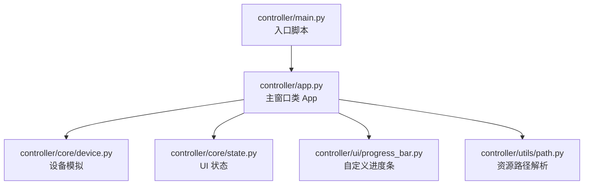
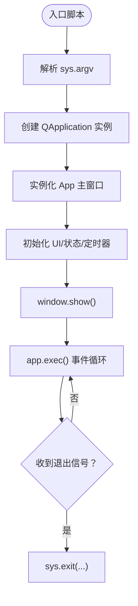
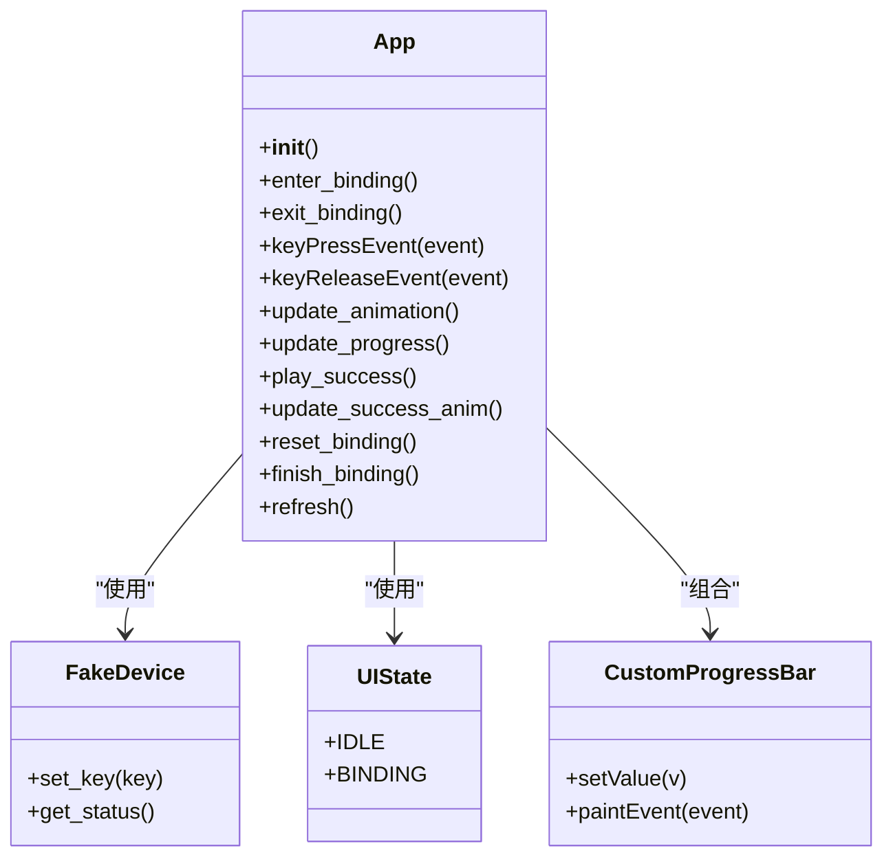
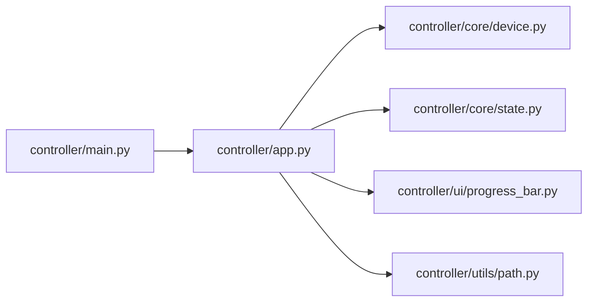

# 应用程序入口

<cite>
**本文引用的文件**
- [controller/main.py](file://controller/main.py)
- [controller/app.py](file://controller/app.py)
- [controller/core/device.py](file://controller/core/device.py)
- [controller/core/state.py](file://controller/core/state.py)
- [controller/ui/progress_bar.py](file://controller/ui/progress_bar.py)
- [controller/utils/path.py](file://controller/utils/path.py)
</cite>

## 目录
1. [简介](#简介)
2. [项目结构](#项目结构)
3. [核心组件](#核心组件)
4. [架构总览](#架构总览)
5. [详细组件分析](#详细组件分析)
6. [依赖分析](#依赖分析)
7. [性能考量](#性能考量)
8. [故障排查指南](#故障排查指南)
9. [结论](#结论)
10. [附录](#附录)

## 简介
本文件聚焦于应用程序入口点的实现与运行机制，围绕 PySide6 应用的启动序列、主窗口初始化、生命周期管理、退出机制与异常处理策略展开。通过分析 controller/main.py 的入口逻辑与 controller/app.py 的主窗口类，结合设备模拟、UI 状态机与自定义进度条等模块，给出可扩展的入口点设计建议与跨平台兼容性说明。

## 项目结构
该仓库采用“控制器-视图-工具”分层组织，入口位于 controller/main.py；主窗口类 App 定义在 controller/app.py；核心业务对象（设备模拟）与状态枚举分别位于 controller/core；自定义 UI 控件与资源路径解析位于 controller/ui 与 controller/utils。



图表来源
- [controller/main.py](file://controller/main.py)
- [controller/app.py](file://controller/app.py)
- [controller/core/device.py](file://controller/core/device.py)
- [controller/core/state.py](file://controller/core/state.py)
- [controller/ui/progress_bar.py](file://controller/ui/progress_bar.py)
- [controller/utils/path.py](file://controller/utils/path.py)

章节来源
- [controller/main.py](file://controller/main.py)
- [controller/app.py](file://controller/app.py)

## 核心组件
- 入口脚本 controller/main.py：负责创建 QApplication 实例、构建主窗口并进入事件循环。
- 主窗口类 controller/app.py：继承自 QWidget，封装 UI 组件、状态机与动画逻辑。
- 设备模拟 controller/core/device.py：提供电池与按键状态的读写接口。
- UI 状态 controller/core/state.py：定义空闲与绑定两种状态。
- 自定义进度条 controller/ui/progress_bar.py：基于 QWidget 的自绘控件。
- 资源路径解析 controller/utils/path.py：支持打包后（如使用 PyInstaller）的资源定位。

章节来源
- [controller/main.py](file://controller/main.py)
- [controller/app.py](file://controller/app.py)
- [controller/core/device.py](file://controller/core/device.py)
- [controller/core/state.py](file://controller/core/state.py)
- [controller/ui/progress_bar.py](file://controller/ui/progress_bar.py)
- [controller/utils/path.py](file://controller/utils/path.py)

## 架构总览
下图展示了从命令行参数到主窗口显示的启动序列，以及事件循环与退出路径。

```mermaid
sequenceDiagram
participant CLI as "命令行"
participant Main as "controller/main.py"
participant Qt as "QApplication"
participant App as "App(QWidget)"
participant Loop as "事件循环"
participant OS as "操作系统"
CLI->>Main : 传入 sys.argv
Main->>Qt : 创建 QApplication(sys.argv)
Main->>App : 实例化 App()
App->>App : 初始化 UI 组件/状态/定时器
Main->>App : window.show()
Main->>Loop : app.exec()
Loop-->>OS : 运行事件循环
OS-->>Main : 退出信号/用户关闭
Main->>Qt : sys.exit(app.exec())
```

图表来源
- [controller/main.py](file://controller/main.py)
- [controller/app.py](file://controller/app.py)

## 详细组件分析

### 入口点与启动序列
- 命令行参数处理：入口脚本接收 sys.argv 并将其传递给 QApplication 构造函数，用于初始化 Qt 应用的参数解析与平台插件加载。
- 应用实例创建：QApplication 是 Qt 应用的根对象，负责事件循环、平台集成与资源管理。
- 主窗口初始化：App 类在构造中完成窗口标题、尺寸、焦点策略设置，并初始化设备模拟、状态机、UI 组件与定时器。
- 显示与事件循环：调用 show() 后进入 app.exec()，开始事件驱动的运行时。



图表来源
- [controller/main.py](file://controller/main.py)
- [controller/app.py](file://controller/app.py)

章节来源
- [controller/main.py](file://controller/main.py)

### 主窗口类 App 的职责与状态机
- 窗口属性：标题、固定尺寸、强焦点策略，确保键盘事件优先级。
- 组件布局：状态标签、电量标签、按键标签、按钮、提示文本、自定义进度条、精灵标签。
- 状态机：UIState 定义空闲与绑定两种模式，切换由 enter_binding 与 exit_binding 触发。
- 动画与进度：两个 QTimer 驱动精灵帧更新与进度条增长，成功后播放消失动画并完成绑定。
- 设备交互：通过 FakeDevice 读取状态并在绑定完成后写入新按键。



图表来源
- [controller/app.py](file://controller/app.py)
- [controller/core/device.py](file://controller/core/device.py)
- [controller/core/state.py](file://controller/core/state.py)
- [controller/ui/progress_bar.py](file://controller/ui/progress_bar.py)

章节来源
- [controller/app.py](file://controller/app.py)
- [controller/core/device.py](file://controller/core/device.py)
- [controller/core/state.py](file://controller/core/state.py)
- [controller/ui/progress_bar.py](file://controller/ui/progress_bar.py)

### 自定义进度条控件
- 继承 QWidget，重写 paintEvent 实现背景与填充绘制。
- 使用资源路径解析函数加载位图，支持打包后的资源访问。
- setValue 将值约束在 0~100 区间并触发重绘。

章节来源
- [controller/ui/progress_bar.py](file://controller/ui/progress_bar.py)
- [controller/utils/path.py](file://controller/utils/path.py)

### 资源路径解析
- 在打包场景下（如 PyInstaller），通过 sys._MEIPASS 获取临时目录，否则回退到当前文件所在目录。
- 返回资源绝对路径，供 QPixmap 等加载使用。

章节来源
- [controller/utils/path.py](file://controller/utils/path.py)

## 依赖分析
- controller/main.py 仅依赖 PySide6 的 QApplication 与 App 类，耦合度低，便于扩展。
- App 类依赖设备模拟、状态枚举、自定义进度条与资源路径解析，形成清晰的内聚边界。
- 自定义进度条依赖资源路径解析与绘制 API，保持 UI 与数据分离。



图表来源
- [controller/main.py](file://controller/main.py)
- [controller/app.py](file://controller/app.py)
- [controller/core/device.py](file://controller/core/device.py)
- [controller/core/state.py](file://controller/core/state.py)
- [controller/ui/progress_bar.py](file://controller/ui/progress_bar.py)
- [controller/utils/path.py](file://controller/utils/path.py)

章节来源
- [controller/main.py](file://controller/main.py)
- [controller/app.py](file://controller/app.py)

## 性能考量
- 定时器频率：动画与进度刷新间隔分别为约 150ms 与 30ms，需根据目标平台帧率与 CPU 负载评估是否需要动态调整。
- 资源加载：精灵帧与进度条纹理在初始化阶段一次性加载，避免运行时抖动。
- 事件处理：键盘事件去重（自动重复过滤）减少无效刷新，提高响应效率。
- 打包优化：资源路径解析统一处理，避免重复拼接与 IO 操作。

## 故障排查指南
- 应用无法启动
  - 检查 PySide6 是否正确安装与导入。
  - 确认入口脚本路径与模块导入链路。
- 资源缺失（图片/位图未显示）
  - 核对资源路径解析逻辑与打包后资源位置。
  - 确保资源文件存在于预期目录。
- 键盘绑定不生效
  - 确认窗口获得焦点（强焦点策略）。
  - 检查自动重复过滤逻辑与事件分发。
- 进度条不更新
  - 检查定时器启动与停止条件，确认 setValue 调用与重绘触发。
- 退出异常
  - 确保通过 sys.exit(app.exec()) 正常退出，避免僵尸进程。

章节来源
- [controller/main.py](file://controller/main.py)
- [controller/app.py](file://controller/app.py)
- [controller/ui/progress_bar.py](file://controller/ui/progress_bar.py)
- [controller/utils/path.py](file://controller/utils/path.py)

## 结论
该入口点以最小化样板代码实现了标准的 PySide6 应用启动流程：创建 QApplication、实例化主窗口、显示并进入事件循环。App 类通过清晰的状态机与定时器驱动，提供了直观的交互体验。通过将 UI、业务与资源解耦，为后续扩展（如日志、配置、多语言、主题切换等）提供了良好基础。

## 附录

### 扩展入口点的实践建议
- 命令行参数与配置
  - 在入口处解析额外参数（如调试开关、语言、主题），在 App 初始化前注入配置对象。
  - 参考路径：[controller/main.py](file://controller/main.py)
- 异常处理与优雅退出
  - 包裹 app.exec()，捕获异常并记录日志，随后 sys.exit(1)。
  - 参考路径：[controller/main.py](file://controller/main.py)
- 多窗口与单例
  - 若需要多窗口或多实例，可在入口处判断已有实例并激活现有窗口。
  - 参考路径：[controller/app.py](file://controller/app.py)
- 跨平台兼容性
  - 使用资源路径解析统一处理打包后资源，避免硬编码绝对路径。
  - 参考路径：[controller/utils/path.py](file://controller/utils/path.py)
- 系统集成
  - 在 Linux/Windows/macOS 上注册快捷键或托盘菜单，需在 App 初始化后进行平台适配。
  - 参考路径：[controller/app.py](file://controller/app.py)