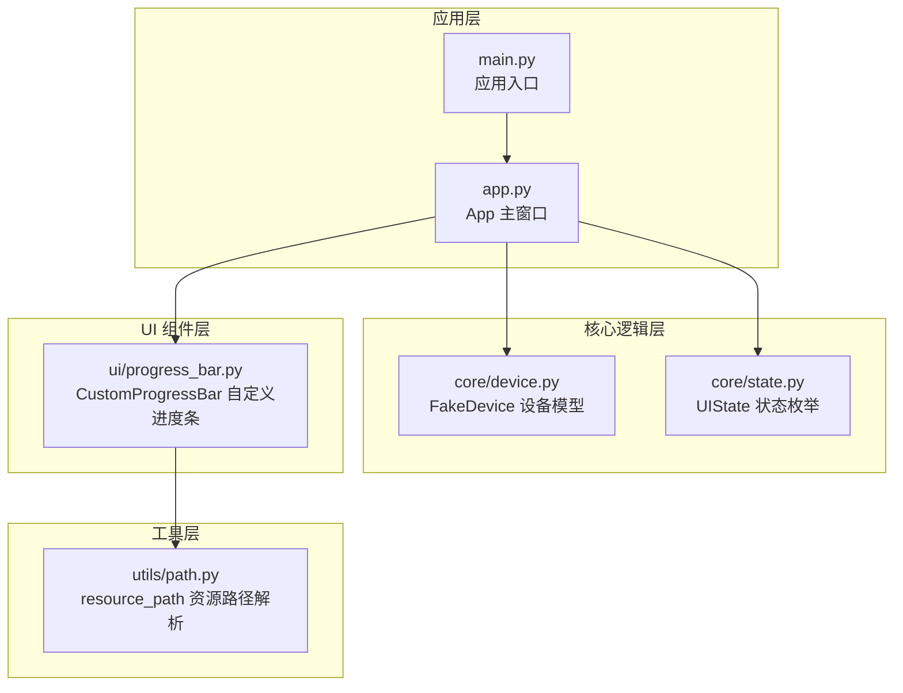
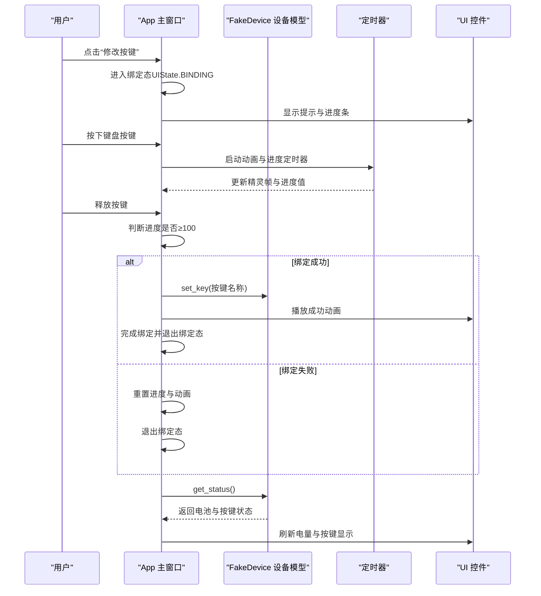
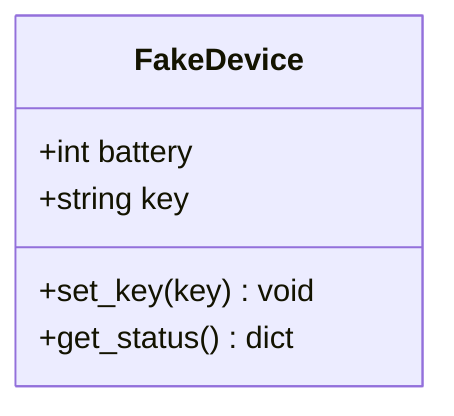
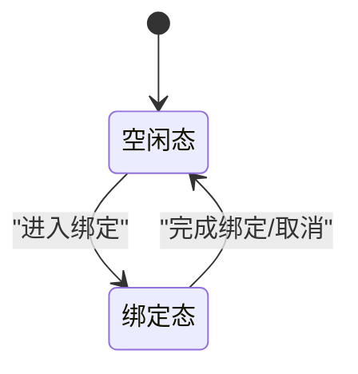
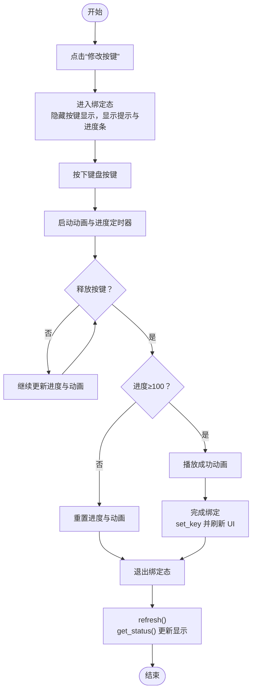
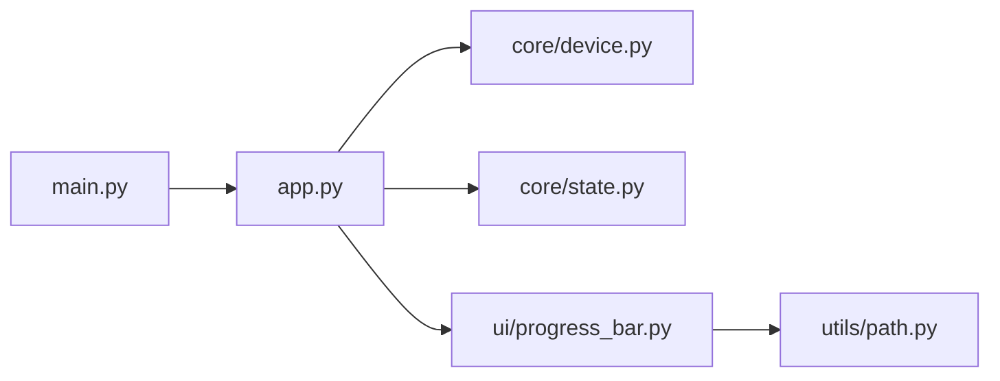

# 核心业务逻辑

<cite>
**本文引用的文件列表**
- [controller/core/device.py](file://controller/core/device.py)
- [controller/core/state.py](file://controller/core/state.py)
- [controller/app.py](file://controller/app.py)
- [controller/main.py](file://controller/main.py)
- [controller/ui/progress_bar.py](file://controller/ui/progress_bar.py)
- [controller/utils/path.py](file://controller/utils/path.py)
- [README.md](file://README.md)
</cite>

## 目录
1. [简介](#简介)
2. [项目结构](#项目结构)
3. [核心组件](#核心组件)
4. [架构总览](#架构总览)
5. [详细组件分析](#详细组件分析)
6. [依赖关系分析](#依赖关系分析)
7. [性能考量](#性能考量)
8. [故障排查指南](#故障排查指南)
9. [结论](#结论)
10. [附录](#附录)

## 简介
本文件聚焦于无线键盘玩具控制器的核心业务逻辑模块，系统性解析以下内容：
- FakeDevice 类的设计与实现：设备状态管理（电池电量、按键映射）、状态查询接口与按键绑定流程
- UIState 枚举的定义与用途：状态常量含义与状态转换规则
- 业务逻辑封装模式：数据模型设计、状态更新机制、事件处理流程
- 使用示例：设备状态查询、按键绑定操作、状态监听机制
- 业务逻辑与 UI 层的交互模式与数据流向

## 项目结构
该项目采用“核心逻辑 + UI 展示 + 工具辅助”的分层组织方式：
- controller/core：核心业务逻辑（设备模型与状态枚举）
- controller/ui：自定义 UI 组件（进度条等）
- controller/utils：工具函数（资源路径解析）
- controller/app.py：应用主窗口与事件处理
- controller/main.py：应用入口

图表来源
- [controller/main.py:1-8](file://controller/main.py#L1-L8)
- [controller/app.py:1-202](file://controller/app.py#L1-L202)
- [controller/core/device.py:1-11](file://controller/core/device.py#L1-L11)
- [controller/core/state.py:1-3](file://controller/core/state.py#L1-L3)
- [controller/ui/progress_bar.py:1-28](file://controller/ui/progress_bar.py#L1-L28)
- [controller/utils/path.py:1-10](file://controller/utils/path.py#L1-L10)

章节来源
- [controller/main.py:1-8](file://controller/main.py#L1-L8)
- [controller/app.py:1-202](file://controller/app.py#L1-L202)

## 核心组件
本节从设计与实现角度，深入剖析核心业务逻辑模块的关键组件及其职责边界。

- FakeDevice
  - 职责：维护设备的静态状态（如电池电量、当前按键映射），提供状态查询与按键绑定能力
  - 关键点：状态字段为实例属性；提供 set_key 与 get_status 方法；用于 UI 层刷新显示
- UIState
  - 职责：定义 UI 的状态集合，作为状态机的标识符
  - 关键点：包含 IDLE 与 BINDING 两个状态常量，用于控制 UI 行为与交互流程

章节来源
- [controller/core/device.py:1-11](file://controller/core/device.py#L1-L11)
- [controller/core/state.py:1-3](file://controller/core/state.py#L1-L3)

## 架构总览
应用启动后，App 主窗口负责：
- 初始化设备模型与状态枚举
- 维护 UI 控件与动画定时器
- 处理键盘事件以驱动绑定流程
- 通过设备模型刷新 UI 显示

图表来源
- [controller/app.py:76-196](file://controller/app.py#L76-L196)
- [controller/core/device.py:5-11](file://controller/core/device.py#L5-L11)

## 详细组件分析

### FakeDevice 类分析
- 设计要点
  - 数据模型：电池电量与当前按键映射作为实例属性，便于在运行时动态更新
  - 接口设计：提供 set_key 与 get_status，满足 UI 层读写需求
- 状态管理
  - 电池电量：初始值为 82，可通过外部逻辑或模拟场景调整
  - 按键映射：通过 set_key 设置，get_status 返回包含电池与按键的字典
- 状态同步机制
  - UI 通过调用 get_status 获取最新状态，实现 UI 与设备模型的单向数据流
  - 绑定完成后，通过 set_key 将按键名称写回设备模型，随后 UI 调用 refresh 触发重新渲染

图表来源
- [controller/core/device.py:1-11](file://controller/core/device.py#L1-L11)

章节来源
- [controller/core/device.py:1-11](file://controller/core/device.py#L1-L11)

### UIState 枚举分析
- 定义与用途
  - IDLE：空闲态，允许用户查看设备状态与触发绑定流程
  - BINDING：绑定态，响应键盘事件并驱动进度条与动画
- 状态转换规则
  - 由 IDLE 进入 BINDING：用户点击“修改按键”按钮触发
  - 由 BINDING 退出 IDLE：绑定完成或取消（进度未达阈值时重置）
- 与 UI 的耦合
  - App 中通过 self.state 字段保存当前状态，并在事件处理中根据状态分支执行不同逻辑

图表来源
- [controller/core/state.py:1-3](file://controller/core/state.py#L1-L3)
- [controller/app.py:76-111](file://controller/app.py#L76-L111)

章节来源
- [controller/core/state.py:1-3](file://controller/core/state.py#L1-L3)
- [controller/app.py:76-111](file://controller/app.py#L76-L111)

### 绑定流程与事件处理
- 事件处理流程
  - 用户点击“修改按键”按钮，App 进入绑定态并初始化 UI 与动画
  - 按下键盘按键时，App 记录当前按键并启动动画与进度定时器
  - 释放按键时，App 根据进度阈值判断绑定结果，播放成功动画或重置
  - 绑定完成后，App 调用设备模型的 set_key 写入按键名称，并刷新 UI
- 关键实现位置
  - 绑定入口与退出：enter_binding / exit_binding
  - 键盘事件：keyPressEvent / keyReleaseEvent
  - 动画与进度：update_animation / update_progress
  - 成功动画：play_success / update_success_anim
  - 完成与重置：finish_binding / reset_binding
  - 状态刷新：refresh

图表来源
- [controller/app.py:76-196](file://controller/app.py#L76-L196)

章节来源
- [controller/app.py:76-196](file://controller/app.py#L76-L196)

### UI 组件与资源路径
- CustomProgressBar
  - 自绘进度条，支持背景与填充图层裁剪绘制
  - 通过 setValue 更新内部值并触发重绘
- 资源路径解析
  - resource_path 在打包与开发环境间自动选择资源根目录，确保 UI 资源正确加载

章节来源
- [controller/ui/progress_bar.py:1-28](file://controller/ui/progress_bar.py#L1-L28)
- [controller/utils/path.py:1-10](file://controller/utils/path.py#L1-L10)

## 依赖关系分析
- 模块依赖
  - app.py 依赖 core/device.py 与 core/state.py 提供设备与状态
  - ui/progress_bar.py 依赖 utils/path.py 解析资源路径
  - main.py 仅负责启动应用与展示主窗口
- 耦合与内聚
  - App 对设备模型与状态枚举存在直接依赖，但保持清晰的职责边界
  - UI 组件与资源路径解耦，便于扩展与替换

图表来源
- [controller/main.py:1-8](file://controller/main.py#L1-L8)
- [controller/app.py:1-202](file://controller/app.py#L1-L202)
- [controller/core/device.py:1-11](file://controller/core/device.py#L1-L11)
- [controller/core/state.py:1-3](file://controller/core/state.py#L1-L3)
- [controller/ui/progress_bar.py:1-28](file://controller/ui/progress_bar.py#L1-L28)
- [controller/utils/path.py:1-10](file://controller/utils/path.py#L1-L10)

章节来源
- [controller/main.py:1-8](file://controller/main.py#L1-L8)
- [controller/app.py:1-202](file://controller/app.py#L1-L202)

## 性能考量
- 定时器频率
  - 动画定时器与进度定时器分别以不同周期更新，避免过度占用 CPU
- 渲染优化
  - 自定义进度条仅在 setValue 或 paintEvent 时重绘，减少不必要的绘制开销
- 事件过滤
  - 对重复按键事件进行过滤，防止绑定过程中的误触发

## 故障排查指南
- 绑定无法完成
  - 检查是否处于绑定态且未被重复按键事件干扰
  - 确认进度阈值是否达到要求，必要时重试
- UI 不显示最新状态
  - 确保在绑定完成后调用 refresh，以触发 get_status 刷新显示
- 资源加载失败
  - 检查资源路径解析逻辑，确认打包后资源路径正确

章节来源
- [controller/app.py:113-138](file://controller/app.py#L113-L138)
- [controller/app.py:199-202](file://controller/app.py#L199-L202)
- [controller/utils/path.py:1-10](file://controller/utils/path.py#L1-L10)

## 结论
本项目通过简洁的设备模型与状态枚举，配合完善的事件处理与 UI 刷新机制，实现了从设备状态查询到按键绑定的完整业务闭环。其模块化设计与清晰的状态机划分，使得业务逻辑易于扩展与维护。建议后续可引入更丰富的设备状态与事件类型，以增强系统的可扩展性与用户体验。

## 附录
- 使用示例（步骤说明）
  - 查询设备状态：调用设备模型的 get_status，UI 层据此刷新电量与按键显示
  - 修改按键映射：点击“修改按键”，进入绑定态；长按目标按键直至进度条满，完成绑定并退出绑定态
  - 状态监听：通过 App 的 refresh 与设备模型的 get_status 实现状态变更后的 UI 同步

章节来源
- [controller/app.py:199-202](file://controller/app.py#L199-L202)
- [controller/core/device.py:5-11](file://controller/core/device.py#L5-L11)