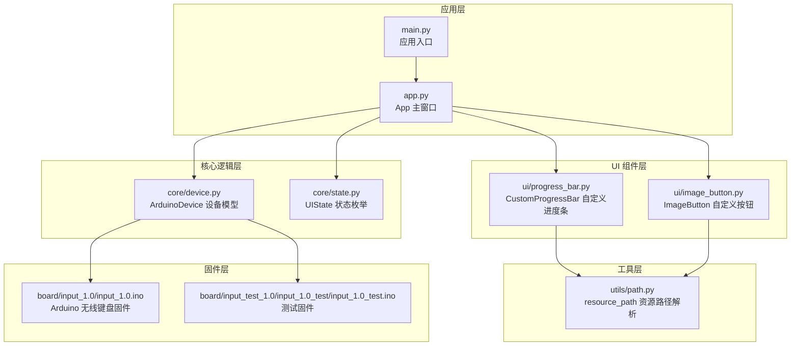
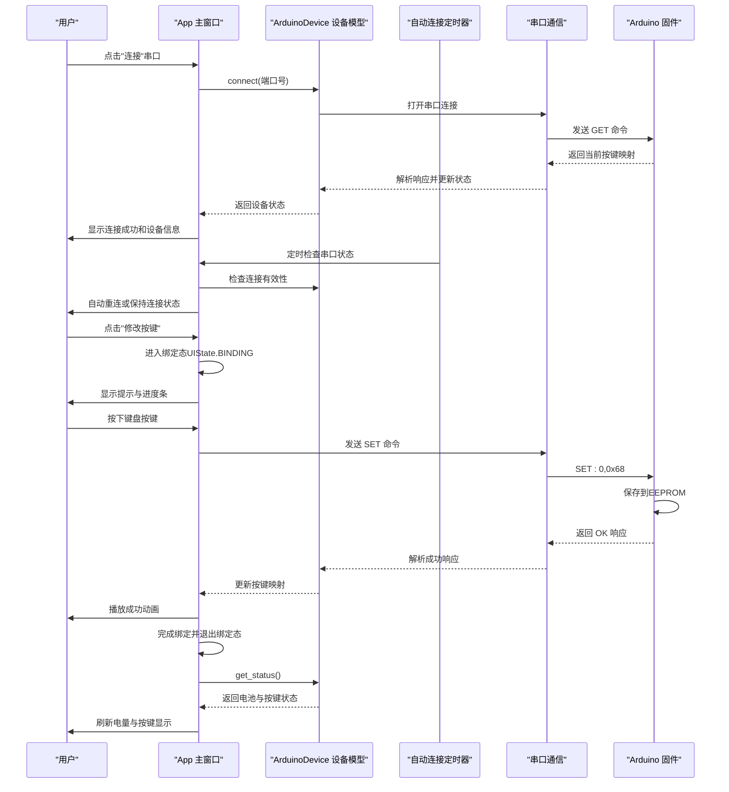
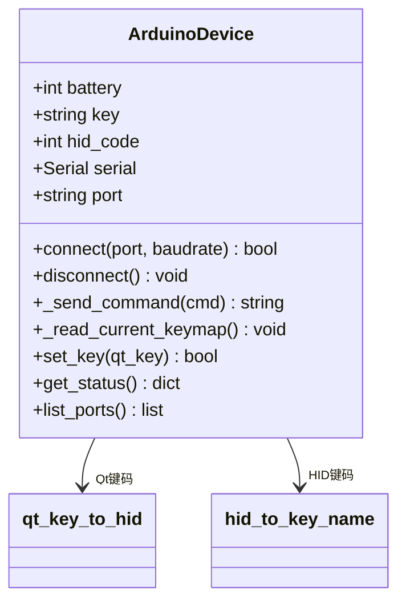
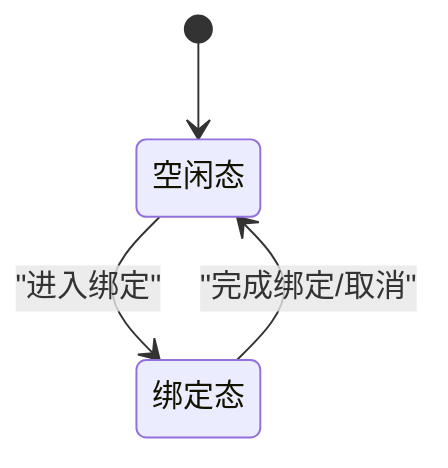
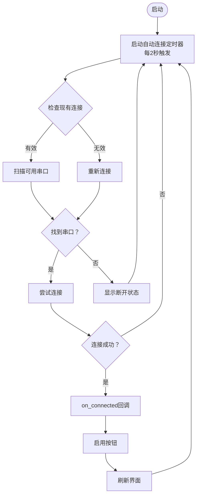
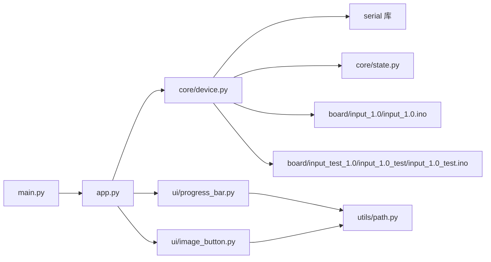

# 核心业务逻辑

<cite>
**本文引用的文件列表**
- [controller/core/device.py](file://controller/core/device.py)
- [controller/core/state.py](file://controller/core/state.py)
- [controller/app.py](file://controller/app.py)
- [controller/main.py](file://controller/main.py)
- [controller/ui/progress_bar.py](file://controller/ui/progress_bar.py)
- [controller/ui/image_button.py](file://controller/ui/image_button.py)
- [controller/utils/path.py](file://controller/utils/path.py)
- [board/input_1.0/input_1.0.ino](file://board/input_1.0/input_1.0.ino)
- [board/input_test_1.0/input_1.0_test/input_1.0_test.ino](file://board/input_test_1.0/input_1.0_test/input_1.0_test.ino)
</cite>

## 更新摘要
**变更内容**
- 新增自动连接功能，支持定时扫描和连接可用的串口设备
- 增强UI状态管理系统，使用字符串常量定义状态
- 改进电池状态处理，支持四档电量显示和动态更新
- 优化绑定流程，新增取消绑定功能和更完善的错误处理
- 增强调试输出功能，提供详细的系统运行日志
- 改进UI组件，新增ImageButton自定义按钮和CustomProgressBar进度条

## 目录
1. [简介](#简介)
2. [项目结构](#项目结构)
3. [核心组件](#核心组件)
4. [架构总览](#架构总览)
5. [详细组件分析](#详细组件分析)
6. [依赖关系分析](#依赖关系分析)
7. [性能考量](#性能考量)
8. [故障排查指南](#故障排查指南)
9. [结论](#结论)
10. [附录](#附录)

## 简介
本文件聚焦于无线键盘玩具控制器的核心业务逻辑模块，系统性解析以下内容：
- ArduinoDevice 类的设计与实现：串口通信、HID键码映射、动态按键配置、增强调试输出
- UIState 枚举的定义与用途：状态常量含义与状态转换规则
- 业务逻辑封装模式：数据模型设计、状态更新机制、事件处理流程
- 自动连接功能：定时扫描串口设备并建立连接
- 电池状态管理系统：四档电量显示和动态更新机制
- 测试模式支持：直连测试和无线测试模式的实现
- 使用示例：串口连接、设备状态查询、按键绑定操作、状态监听机制
- 业务逻辑与 UI 层的交互模式与数据流向

## 项目结构
该项目采用"核心逻辑 + UI 展示 + 工具辅助 + 固件支持"的分层组织方式：
- controller/core：核心业务逻辑（Arduino设备模型与状态枚举）
- controller/ui：自定义 UI 组件（进度条、按钮等）
- controller/utils：工具函数（资源路径解析）
- controller/app.py：应用主窗口与事件处理
- controller/main.py：应用入口
- board/input_1.0：Arduino固件代码，支持无线键盘输入
- board/input_test_1.0：测试固件，支持直连测试模式



**图表来源**
- [controller/main.py:1-8](file://controller/main.py#L1-L8)
- [controller/app.py:1-667](file://controller/app.py#L1-L667)
- [controller/core/device.py:1-202](file://controller/core/device.py#L1-L202)
- [controller/core/state.py:1-3](file://controller/core/state.py#L1-L3)
- [controller/ui/progress_bar.py:1-28](file://controller/ui/progress_bar.py#L1-L28)
- [controller/ui/image_button.py:1-102](file://controller/ui/image_button.py#L1-L102)
- [controller/utils/path.py:1-16](file://controller/utils/path.py#L1-L16)
- [board/input_1.0/input_1.0.ino:1-208](file://board/input_1.0/input_1.0.ino#L1-L208)
- [board/input_test_1.0/input_1.0_test/input_1.0_test.ino:1-244](file://board/input_test_1.0/input_1.0_test/input_1.0_test.ino#L1-L244)

**章节来源**
- [controller/main.py:1-8](file://controller/main.py#L1-L8)
- [controller/app.py:1-667](file://controller/app.py#L1-L667)

## 核心组件
本节从设计与实现角度，深入剖析核心业务逻辑模块的关键组件及其职责边界。

- ArduinoDevice
  - 职责：维护设备的静态状态（如电池电量、当前按键映射），提供串口通信、HID键码映射、动态按键配置能力
  - 关键点：支持串口连接/断开、命令发送/接收、Qt键到HID键码转换、按键映射读取/设置、增强调试输出
- UIState
  - 职责：定义 UI 的状态集合，作为状态机的标识符
  - 关键点：包含 IDLE 与 BINDING 两个状态常量，使用字符串类型提供更好的可读性
- App 主窗口
  - 职责：管理整个应用的UI状态、事件处理、自动连接、电池状态显示
  - 关键点：集成自动连接定时器、电池状态管理、绑定流程控制、动画系统
- UI 组件
  - CustomProgressBar：自定义进度条，支持背景与填充图层裁剪绘制
  - ImageButton：支持三种状态的自定义按钮，支持文字叠加

**章节来源**
- [controller/core/device.py:110-202](file://controller/core/device.py#L110-L202)
- [controller/core/state.py:1-3](file://controller/core/state.py#L1-L3)
- [controller/app.py:47-76](file://controller/app.py#L47-L76)
- [controller/ui/progress_bar.py:5-28](file://controller/ui/progress_bar.py#L5-L28)
- [controller/ui/image_button.py:8-102](file://controller/ui/image_button.py#L8-L102)

## 架构总览
应用启动后，App 主窗口负责：
- 初始化 Arduino 设备模型与状态枚举
- 维护 UI 控件与动画定时器
- 处理键盘事件以驱动绑定流程
- 通过串口与 Arduino 固件通信
- 通过设备模型刷新 UI 显示
- 支持测试模式下的直连测试
- **新增**：定时自动扫描和连接可用的串口设备



**图表来源**
- [controller/app.py:423-455](file://controller/app.py#L423-L455)
- [controller/app.py:476-554](file://controller/app.py#L476-L554)
- [controller/core/device.py:167-189](file://controller/core/device.py#L167-L189)
- [board/input_1.0/input_1.0.ino:58-98](file://board/input_1.0/input_1.0.ino#L58-L98)

## 详细组件分析

### ArduinoDevice 类分析
- 设计要点
  - 串口通信：支持连接/断开、命令发送/接收、超时处理、增强调试输出
  - HID键码映射：提供Qt键到HID键码的双向转换，支持完整的键映射表
  - 动态按键配置：通过串口命令实时修改按键映射
  - 数据模型：电池电量与当前按键映射作为实例属性
- 状态管理
  - 电池电量：初始值为 82，可通过外部逻辑或模拟场景调整
  - 按键映射：通过 HID 键码存储，支持 Qt 键名称转换
- 串口通信机制
  - 命令格式：SET:0,0x68（设置物理按键0映射到HID键码）
  - 响应格式：OK:0->0x68（成功）或 ERR:INVALID_KEY（失败）
  - 状态同步：连接时自动读取当前按键映射
- 调试输出
  - 详细的键码转换日志
  - 命令发送和接收的完整跟踪
  - 错误处理和状态变化的可视化



**图表来源**
- [controller/core/device.py:110-202](file://controller/core/device.py#L110-L202)
- [controller/core/device.py:95-107](file://controller/core/device.py#L95-L107)

**章节来源**
- [controller/core/device.py:110-202](file://controller/core/device.py#L110-L202)

### UIState 枚举分析
- 定义与用途
  - IDLE：空闲态，允许用户查看设备状态与触发绑定流程
  - BINDING：绑定态，响应键盘事件并驱动进度条与动画
- 状态转换规则
  - 由 IDLE 进入 BINDING：用户点击"修改按键"按钮触发
  - 由 BINDING 退出 IDLE：绑定完成或取消（进度未达阈值时重置）
- 与 UI 的耦合
  - App 中通过 self.state 字段保存当前状态，并在事件处理中根据状态分支执行不同逻辑
- **更新**：使用字符串常量替代整数值，提供更好的可读性和类型安全性



**图表来源**
- [controller/core/state.py:1-3](file://controller/core/state.py#L1-L3)
- [controller/app.py:476-554](file://controller/app.py#L476-L554)

**章节来源**
- [controller/core/state.py:1-3](file://controller/core/state.py#L1-L3)
- [controller/app.py:476-554](file://controller/app.py#L476-L554)

### 自动连接功能分析
- 定时扫描机制
  - 使用QTimer定时器每2秒触发一次自动连接检查
  - 检查现有连接的有效性，如断开则重新扫描
  - 遍历可用串口列表，跳过蓝牙和无线设备
- 连接策略
  - 优先尝试当前设备的串口连接
  - 成功连接后调用on_connected回调
  - 连接失败时保持连接中状态
- 状态管理
  - on_connected：显示祈祷动画，启用按钮，刷新界面
  - on_disconnected：显示断开状态，禁用按钮，清空显示
- **新增**：提供无缝的设备连接体验，减少用户手动操作



**图表来源**
- [controller/app.py:423-455](file://controller/app.py#L423-L455)
- [controller/app.py:456-474](file://controller/app.py#L456-L474)

**章节来源**
- [controller/app.py:423-455](file://controller/app.py#L423-L455)
- [controller/app.py:456-474](file://controller/app.py#L456-L474)

### 电池状态管理系统
- 四档电量显示
  - 0-25%：低电量图标
  - 26-50%：中低电量图标
  - 51-75%：中高电量图标
  - 76-100%：高电量图标
- 动态更新机制
  - _update_battery_display：根据电池百分比更新显示
  - get_status：返回包含电池信息的状态字典
  - refresh：UI刷新时自动更新电池显示
- **新增**：提供直观的电量状态反馈，提升用户体验

**章节来源**
- [controller/app.py:269-284](file://controller/app.py#L269-L284)
- [controller/app.py:664-667](file://controller/app.py#L664-L667)
- [controller/core/device.py:191-193](file://controller/core/device.py#L191-L193)

### 绑定流程与事件处理
- 事件处理流程
  - 用户点击"修改按键"按钮，App 进入绑定态并初始化 UI 与动画
  - 按下键盘按键时，App 记录当前按键并启动动画与进度定时器
  - 释放按键时，App 根据进度阈值判断绑定结果，播放成功动画或重置
  - 绑定完成后，App 调用 ArduinoDevice 的 set_key 写入按键映射，并刷新 UI
- 关键实现位置
  - 串口连接：toggle_connection
  - 绑定入口与退出：enter_binding / exit_binding
  - 键盘事件：keyPressEvent / keyReleaseEvent
  - 动画与进度：update_animation / update_progress
  - 成功动画：play_success / update_success_anim
  - 完成与重置：finish_binding / reset_binding
  - **新增**：取消绑定：cancel_binding
  - 状态刷新：refresh
- 增强的调试输出
  - 键盘事件的详细日志记录
  - 进度更新和动画状态的可视化跟踪
  - **新增**：绑定流程的完整日志跟踪

```mermaid
flowchart TD
Start(["开始"]) --> BindBtn["点击"修改按键"]
BindBtn --> EnterBinding["enter_binding()<br/>进入绑定态"]
EnterBinding --> Press["按下键盘按键"]
Press --> StartTimers["启动动画与进度定时器"]
StartTimers --> Release{"释放按键？"}
Release --> |否| Wait["继续更新进度与动画"]
Wait --> Release
Release --> |是| Check{"进度≥100？"}
Check --> |是| SendCmd["发送 SET 命令<br/>SET:0,0x68"]
SendCmd --> CmdSuccess{"命令成功？"}
CmdSuccess --> |是| Success["播放成功动画"]
CmdSuccess --> |否| Reset["重置进度与动画"]
Check --> |否| Reset
Success --> Finish["finish_binding()<br/>完成绑定"]
Reset --> Cancel["cancel_binding()<br/>取消绑定"]
Finish --> ExitBinding["exit_binding()<br/>退出绑定态"]
Cancel --> ExitBinding
ExitBinding --> Refresh["refresh()<br/>get_status() 更新显示"]
Refresh --> End(["结束"])
```

**图表来源**
- [controller/app.py:476-554](file://controller/app.py#L476-L554)
- [controller/app.py:578-604](file://controller/app.py#L578-L604)
- [controller/app.py:606-628](file://controller/app.py#L606-L628)
- [controller/app.py:630-643](file://controller/app.py#L630-L643)
- [controller/app.py:645-654](file://controller/app.py#L645-L654)
- [controller/app.py:656-662](file://controller/app.py#L656-L662)

**章节来源**
- [controller/app.py:476-554](file://controller/app.py#L476-L554)
- [controller/app.py:578-604](file://controller/app.py#L578-L604)
- [controller/app.py:606-662](file://controller/app.py#L606-L662)

### UI 组件与资源路径
- CustomProgressBar
  - 自绘进度条，支持背景与填充图层裁剪绘制
  - 通过 setValue 更新内部值并触发重绘
- ImageButton
  - 支持三种状态：正常、悬停、按下
  - 支持文字叠加，提供更好的视觉反馈
  - 通过资源路径解析加载图片资源
- 资源路径解析
  - resource_path 在打包与开发环境间自动选择资源根目录，确保 UI 资源正确加载

**章节来源**
- [controller/ui/progress_bar.py:5-28](file://controller/ui/progress_bar.py#L5-L28)
- [controller/ui/image_button.py:8-102](file://controller/ui/image_button.py#L8-L102)
- [controller/utils/path.py:4-16](file://controller/utils/path.py#L4-L16)

### 测试模式支持
- 测试固件特性
  - 直连测试模式：通过硬件按键直接测试，无需无线模块
  - 无线测试模式：支持标准的无线按键输入
  - 调试输出控制：可禁用调试输出避免干扰主控制器
  - **新增**：LED错误指示系统，提供硬件状态反馈
- 测试模式配置
  - 通过宏定义启用/禁用直连测试模式
  - 可配置测试按键引脚
  - 支持独立运行，不依赖串口连接
- 键盘输入处理
  - 支持ASCII字符和控制字符的混合处理
  - 提供HID键码到ASCII的映射表
  - 避免输入法干扰的直接字符发送

**章节来源**
- [board/input_test_1.0/input_1.0_test/input_1.0_test.ino:7-10](file://board/input_test_1.0/input_1.0_test/input_1.0_test.ino#L7-L10)
- [board/input_test_1.0/input_1.0_test/input_1.0_test.ino:150-159](file://board/input_test_1.0/input_1.0_test/input_1.0_test.ino#L150-L159)
- [board/input_test_1.0/input_1.0_test/input_1.0_test.ino:105-125](file://board/input_test_1.0/input_1.0_test/input_1.0_test.ino#L105-L125)

## 依赖关系分析
- 模块依赖
  - app.py 依赖 core/device.py 提供 Arduino 设备与状态
  - core/device.py 依赖 serial 库进行串口通信
  - ui/progress_bar.py 依赖 utils/path.py 解析资源路径
  - ui/image_button.py 依赖 utils/path.py 解析资源路径
  - main.py 仅负责启动应用与展示主窗口
  - 测试固件独立运行，不依赖主控制器
- 耦合与内聚
  - App 对 Arduino 设备模型存在直接依赖，但保持清晰的职责边界
  - UI 组件与资源路径解耦，便于扩展与替换
  - 设备模型与固件层通过串口协议解耦
  - 测试固件提供独立的测试环境
- **新增**：UI组件间的依赖关系更加清晰，ImageButton和CustomProgressBar都依赖资源路径解析



**图表来源**
- [controller/main.py:1-8](file://controller/main.py#L1-L8)
- [controller/app.py:1-667](file://controller/app.py#L1-L667)
- [controller/core/device.py:1-3](file://controller/core/device.py#L1-L3)
- [controller/core/state.py:1-3](file://controller/core/state.py#L1-L3)
- [controller/ui/progress_bar.py:1-4](file://controller/ui/progress_bar.py#L1-L4)
- [controller/ui/image_button.py:1-6](file://controller/ui/image_button.py#L1-L6)
- [controller/utils/path.py:1-16](file://controller/utils/path.py#L1-L16)
- [board/input_1.0/input_1.0.ino:1-6](file://board/input_1.0/input_1.0.ino#L1-L6)
- [board/input_test_1.0/input_1.0_test/input_1.0_test.ino:1-6](file://board/input_test_1.0/input_1.0_test/input_1.0_test.ino#L1-L6)

**章节来源**
- [controller/main.py:1-8](file://controller/main.py#L1-L8)
- [controller/app.py:1-667](file://controller/app.py#L1-L667)

## 性能考量
- 串口通信优化
  - 使用115200波特率确保快速响应
  - 超时设置避免阻塞等待
  - 命令格式简单明确，减少解析开销
- 定时器频率
  - 动画定时器（150ms）与进度定时器（30ms）分别以不同周期更新，避免过度占用 CPU
  - **新增**：自动连接定时器（2000ms）提供合理的扫描频率
- 渲染优化
  - 自定义进度条仅在 setValue 或 paintEvent 时重绘，减少不必要的绘制开销
  - **新增**：电池图标和状态图标使用预加载缓存，提升显示效率
- 事件过滤
  - 对重复按键事件进行过滤，防止绑定过程中的误触发
- 调试输出优化
  - 测试固件可禁用调试输出，避免影响性能
  - 主控制器的调试输出仅在开发阶段启用
- **新增**：自动连接功能使用非阻塞检查，避免长时间串口操作影响UI响应

## 故障排查指南
- 串口连接失败
  - 检查Arduino固件是否正确烧录
  - 确认串口权限和设备占用情况
  - 验证波特率设置（115200）
  - **新增**：检查自动连接定时器是否正常工作
- 绑定无法完成
  - 检查是否处于绑定态且未被重复按键事件干扰
  - 确认进度阈值是否达到要求，必要时重试
  - 验证HID键码映射是否有效
  - **新增**：检查取消绑定功能是否正常工作
- UI 不显示最新状态
  - 确保在绑定完成后调用 refresh，以触发 get_status 刷新显示
  - **新增**：检查电池状态更新函数是否正确调用
- 资源加载失败
  - 检查资源路径解析逻辑，确认打包后资源路径正确
  - **新增**：验证UI组件的图片资源是否正确加载
- 固件通信问题
  - 检查Arduino固件中的串口命令格式
  - 验证EEPROM存储和读取功能
- 调试输出干扰
  - 检查测试固件的调试输出设置
  - 确认主控制器的调试日志级别
- 键码转换错误
  - 验证Qt键码范围和HID键码映射表
  - 检查未知键码的处理逻辑
- **新增**：自动连接问题排查
  - 检查串口扫描权限
  - 验证设备断线检测机制
  - 确认连接状态回调函数正常执行

**章节来源**
- [controller/app.py:423-455](file://controller/app.py#L423-L455)
- [controller/app.py:578-604](file://controller/app.py#L578-L604)
- [controller/utils/path.py:4-16](file://controller/utils/path.py#L4-L16)

## 结论
本项目通过ArduinoDevice类实现了从串口通信到HID键码映射的完整设备抽象，配合完善的事件处理与 UI 刷新机制，实现了从串口连接到按键绑定的完整业务闭环。其模块化设计与清晰的状态机划分，使得业务逻辑易于扩展与维护。

**更新内容**
- 新增自动连接功能，提供定时扫描和连接可用串口设备的能力
- 增强UI状态管理系统，使用字符串常量定义状态，提升可读性
- 改进了电池状态处理，支持四档电量显示和动态更新机制
- 优化了绑定流程，新增取消绑定功能和更完善的错误处理
- 增强了调试输出功能，提供了详细的系统运行日志
- 改进了UI组件，新增ImageButton自定义按钮和CustomProgressBar进度条

这些更新大大增强了系统的实用性和可扩展性，为开发者提供了更好的调试和测试体验，同时提升了用户的操作便利性和系统稳定性。

## 附录
- 使用示例（步骤说明）
  - 串口连接：选择串口 -> 点击"连接" -> 确认连接成功
  - 查询设备状态：调用设备模型的 get_status，UI 层据此刷新电量与按键显示
  - 修改按键映射：点击"修改按键"，进入绑定态；长按目标按键直至进度条满，发送SET命令完成绑定并退出绑定态
  - 状态监听：通过 App 的 refresh 与设备模型的 get_status 实现状态变更后的 UI 同步
  - 固件通信：通过串口命令格式"SET:0,0x68"和"GET"实现设备配置和状态查询
  - 测试模式：通过测试固件的宏定义启用直连测试，无需无线模块即可进行功能测试
  - **新增**：自动连接：系统会定时扫描可用串口并自动连接设备
  - **新增**：电池状态：UI会根据电池百分比动态更新电量图标显示

**章节来源**
- [controller/app.py:423-455](file://controller/app.py#L423-L455)
- [controller/app.py:578-604](file://controller/app.py#L578-L604)
- [controller/core/device.py:167-189](file://controller/core/device.py#L167-L189)
- [board/input_1.0/input_1.0.ino:58-98](file://board/input_1.0/input_1.0.ino#L58-L98)
- [board/input_test_1.0/input_1.0_test/input_1.0_test.ino:7-10](file://board/input_test_1.0/input_1.0_test/input_1.0_test.ino#L7-L10)