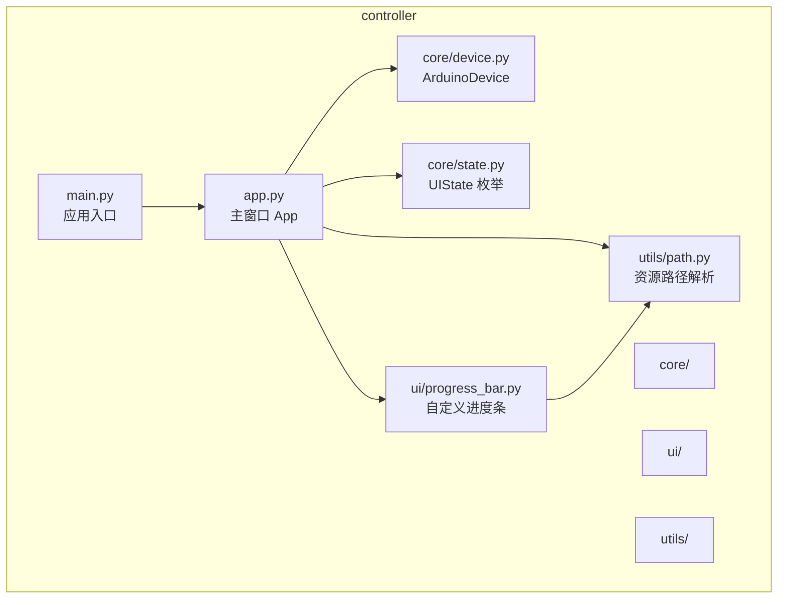
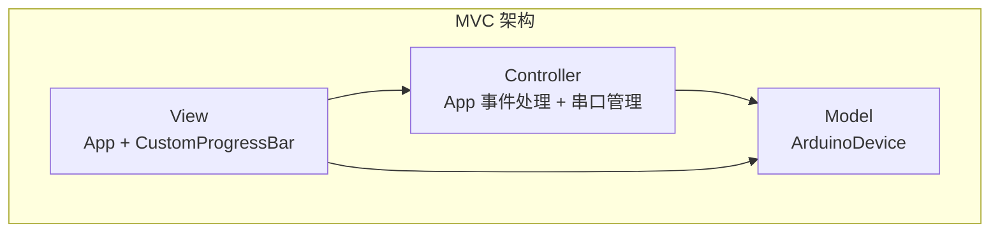
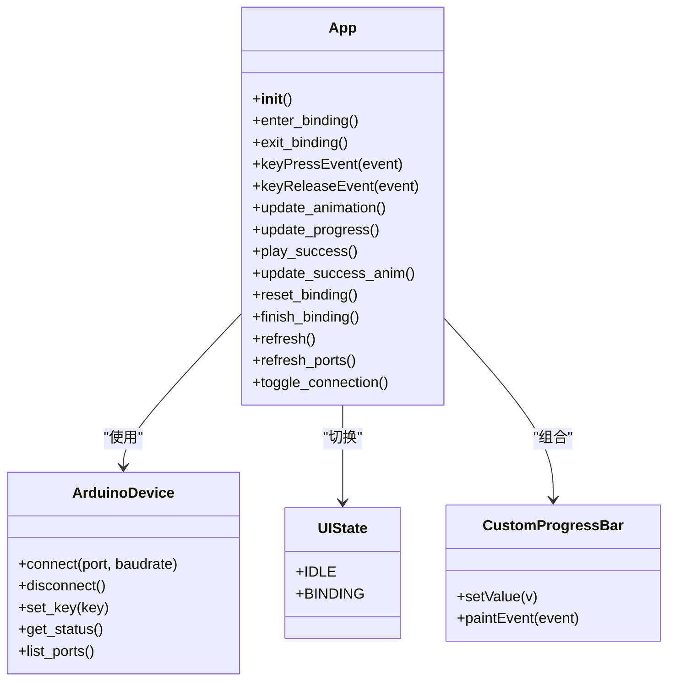
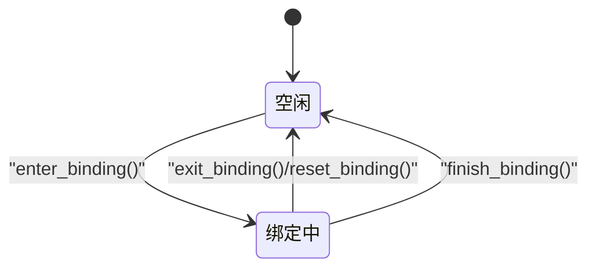
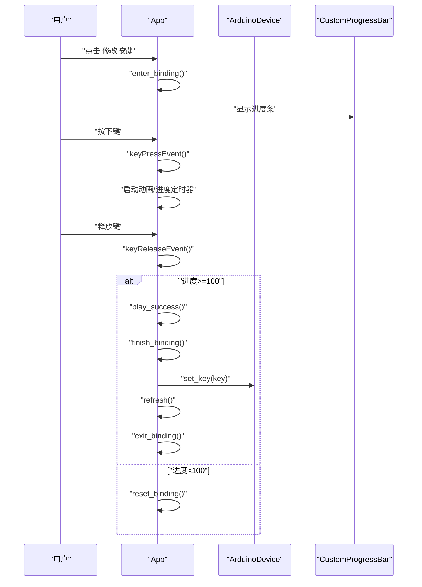
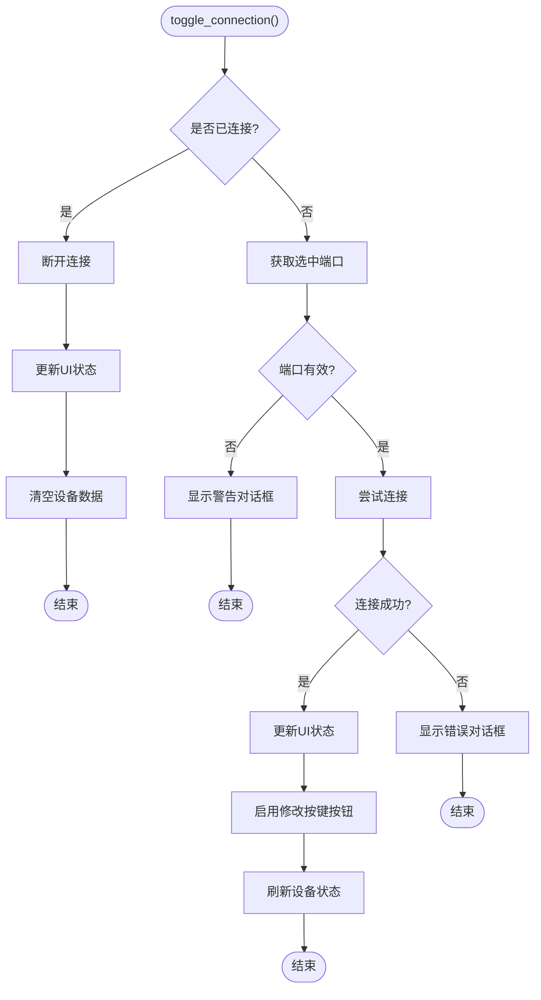
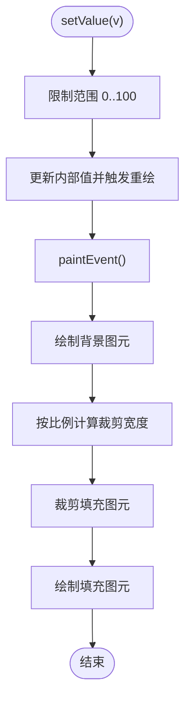
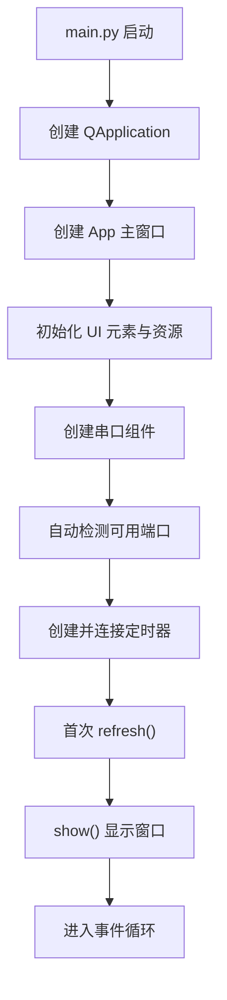
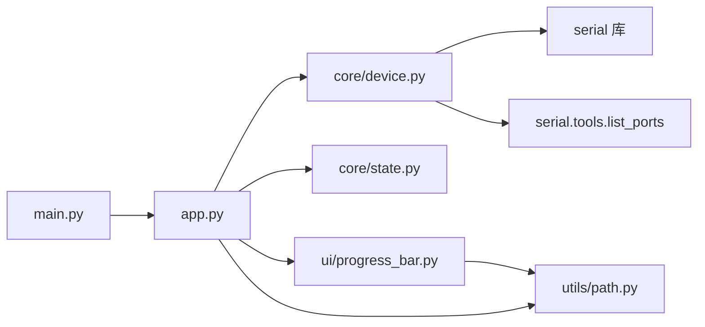

# 桌面应用架构

<cite>
**本文档引用的文件**
- [main.py](file://controller/main.py)
- [app.py](file://controller/app.py)
- [device.py](file://controller/core/device.py)
- [state.py](file://controller/core/state.py)
- [progress_bar.py](file://controller/ui/progress_bar.py)
- [path.py](file://controller/utils/path.py)
- [README.md](file://README.md)
</cite>

## 更新摘要
**变更内容**
- 新增串口连接界面与自动端口检测功能
- 实现实时状态监控与设备通信
- UI尺寸从220x320像素增大到320x260像素
- 设备模型从FakeDevice重构为ArduinoDevice，支持真实硬件通信
- 增加Qt键到HID键码映射系统
- 优化用户界面布局与交互体验

## 目录
1. [简介](#简介)
2. [项目结构](#项目结构)
3. [核心组件](#核心组件)
4. [架构总览](#架构总览)
5. [详细组件分析](#详细组件分析)
6. [依赖关系分析](#依赖关系分析)
7. [性能考虑](#性能考虑)
8. [故障排除指南](#故障排除指南)
9. [结论](#结论)

## 简介
本项目是一个基于 PySide6 的桌面应用程序，采用 MVC 架构模式设计，实现了设备状态管理与交互式按键绑定功能。应用通过状态机驱动 UI 行为，结合自定义进度条与动画资源，提供直观的用户反馈。经过重构后，应用现已支持真实的串口通信，能够连接 Arduino 设备进行按键映射配置，并提供实时状态监控功能。本文档将从系统架构、组件职责、数据流与控制流、状态管理、初始化流程、窗口配置与布局、以及依赖关系等方面进行全面解析，帮助开发者快速理解并扩展该桌面应用。

## 项目结构
项目采用分层组织方式，核心目录与职责如下：
- controller：应用的核心逻辑与界面层
  - main.py：应用入口点，负责创建 QApplication 与主窗口并启动事件循环
  - app.py：主窗口类 App，负责 UI 初始化、事件处理、状态切换与动画更新，新增串口连接管理
  - core：业务模型与状态定义
    - device.py：设备抽象（ArduinoDevice），封装串口通信、电池电量与按键信息，支持真实硬件交互
    - state.py：UI 状态枚举（UIState）
  - ui：自定义 UI 组件
    - progress_bar.py：自定义进度条控件
  - utils：工具模块
    - path.py：资源路径解析，支持打包后运行
- board：Arduino 固件示例（与桌面应用解耦）
- 根目录：README 文档

**图表来源**
- [main.py:1-8](file://controller/main.py#L1-L8)
- [app.py:1-261](file://controller/app.py#L1-L261)
- [device.py:1-197](file://controller/core/device.py#L1-L197)
- [state.py:1-3](file://controller/core/state.py#L1-L3)
- [progress_bar.py:1-28](file://controller/ui/progress_bar.py#L1-L28)
- [path.py:1-10](file://controller/utils/path.py#L1-L10)

**章节来源**
- [main.py:1-8](file://controller/main.py#L1-L8)
- [app.py:1-261](file://controller/app.py#L1-L261)
- [device.py:1-197](file://controller/core/device.py#L1-L197)
- [state.py:1-3](file://controller/core/state.py#L1-L3)
- [progress_bar.py:1-28](file://controller/ui/progress_bar.py#L1-L28)
- [path.py:1-10](file://controller/utils/path.py#L1-L10)
- [README.md:1-1](file://README.md#L1-L1)

## 核心组件
本节对应用的关键组件进行深入分析，涵盖职责划分、数据结构与复杂度、依赖链路与优化点。

- 应用入口点（main.py）
  - 职责：创建 QApplication 实例，构建主窗口 App 并显示，进入事件循环
  - 关键点：使用 sys.argv 传递命令行参数；调用 sys.exit(app.exec()) 保证退出码正确性
  - 复杂度：O(1)，无额外计算开销
  - 优化建议：可增加异常捕获以提升健壮性

- 主窗口 App（app.py）
  - 职责：管理 UI 初始化、事件处理、状态切换、动画与进度条更新、设备状态刷新，新增串口连接管理
  - 数据结构：
    - 设备对象：ArduinoDevice（支持串口通信）
    - UI 状态：UIState（IDLE/BINDING）
    - 自定义进度条：CustomProgressBar
    - 资源帧：walk1~4 与 disappear1/2 的 QPixmap 列表
    - 定时器：动画定时器与进度定时器
    - 串口组件：QComboBox（端口选择）、QPushButton（连接/断开）
  - 控制流：
    - 状态切换：enter_binding() 与 exit_binding() 在 IDLE 与 BINDING 之间转换
    - 键盘事件：keyPressEvent/keyReleaseEvent 驱动绑定流程
    - 动画与进度：update_animation()/update_progress() 驱动 UI 更新
    - 成功动画：play_success()/update_success_anim() 完成绑定后的视觉反馈
    - 串口管理：toggle_connection() 实现连接/断开，refresh_ports() 自动检测端口
  - 性能影响：定时器频率与帧数影响 CPU 占用；串口通信增加I/O开销；建议根据实际需求调整定时器间隔
  - 优化建议：将帧索引与进度值封装为受控属性，避免重复设置 pixmap

- 设备模型 ArduinoDevice（device.py）
  - 职责：维护设备状态（电池电量、当前按键），提供串口通信接口，支持真实硬件交互
  - 数据结构：字典返回值包含 battery 与 key，支持串口连接状态管理
  - 复杂度：get_status() O(1)，set_key() O(1)，connect() O(1)
  - 扩展建议：支持持久化存储与状态变更通知，增加错误重连机制

- UI 状态枚举 UIState（state.py）
  - 职责：定义 UI 的两种状态（空闲/绑定中），作为状态机的输入与输出
  - 使用场景：App 中的状态判断与 UI 可见性控制
  - 扩展建议：可引入更多状态（如错误、加载中、连接中）以增强用户体验

- 自定义进度条 CustomProgressBar（progress_bar.py）
  - 职责：绘制背景与填充区域，根据数值裁剪填充图元
  - 数据结构：value 属性与 QPixmap 背景/填充
  - 绘制流程：paintEvent 中按比例裁剪并绘制
  - 性能影响：每次 setValue() 触发 update()，建议在高频更新时合并绘制请求

- 资源路径解析（path.py）
  - 职责：兼容打包后运行（pyinstaller）与开发环境的资源路径解析
  - 关键点：利用 sys._MEIPASS 或 __file__ 所在目录拼接资源路径
  - 影响范围：所有 UI 组件与动画资源加载

**章节来源**
- [main.py:1-8](file://controller/main.py#L1-L8)
- [app.py:12-261](file://controller/app.py#L12-L261)
- [device.py:1-197](file://controller/core/device.py#L1-L197)
- [state.py:1-3](file://controller/core/state.py#L1-L3)
- [progress_bar.py:1-28](file://controller/ui/progress_bar.py#L1-L28)
- [path.py:1-10](file://controller/utils/path.py#L1-L10)

## 架构总览
应用遵循 MVC 架构模式：
- Model（模型）：ArduinoDevice 封装设备状态与业务数据，提供串口通信接口与只读状态查询
- View（视图）：App 作为主窗口承载 UI 元素，CustomProgressBar 提供自定义渲染
- Controller（控制器）：App 作为事件控制器，处理键盘事件、状态切换、动画调度与串口连接管理

**图表来源**
- [app.py:6-22](file://controller/app.py#L6-L22)
- [device.py:108-197](file://controller/core/device.py#L108-L197)
- [progress_bar.py:5-28](file://controller/ui/progress_bar.py#L5-L28)

## 详细组件分析

### App 类（主窗口）
App 是应用的核心控制器与视图容器，负责：
- 初始化基础属性（标题、尺寸、焦点策略）
- 创建并布局 UI 元素（状态标签、串口选择、连接按钮、电池标签、按键标签、按钮、提示文本、进度条、精灵标签）
- 加载动画资源（walk1~4、disappear1/2）
- 管理状态（UIState）、定时器与事件响应
- 刷新设备状态并在 UI 上展示
- **新增**：串口连接管理与自动端口检测

**图表来源**
- [app.py:12-261](file://controller/app.py#L12-L261)
- [device.py:108-197](file://controller/core/device.py#L108-L197)
- [state.py:1-3](file://controller/core/state.py#L1-L3)
- [progress_bar.py:5-28](file://controller/ui/progress_bar.py#L5-L28)

**章节来源**
- [app.py:12-261](file://controller/app.py#L12-L261)

### 状态管理模式
UIState 枚举定义了两种状态：
- IDLE：空闲态，允许用户点击"修改按键"进入绑定流程，串口连接正常
- BINDING：绑定态，监听键盘事件并驱动进度条与动画

状态转换逻辑：
- enter_binding()：进入绑定态，隐藏按键与按钮，显示提示、进度条与精灵，重置进度与帧索引，启动定时器
- exit_binding()：退出绑定态，恢复按键与按钮可见性，隐藏提示、进度条与精灵
- finish_binding()：完成绑定后刷新设备状态并回到空闲态

**图表来源**
- [app.py:129-170](file://controller/app.py#L129-L170)
- [app.py:156-170](file://controller/app.py#L156-L170)
- [app.py:248-256](file://controller/app.py#L248-L256)
- [state.py:1-3](file://controller/core/state.py#L1-L3)

**章节来源**
- [app.py:129-170](file://controller/app.py#L129-L170)
- [app.py:156-170](file://controller/app.py#L156-L170)
- [app.py:248-256](file://controller/app.py#L248-L256)
- [state.py:1-3](file://controller/core/state.py#L1-L3)

### 键盘事件与绑定流程
绑定流程通过键盘事件驱动，核心步骤如下：
- 用户点击"修改按键"，App 进入 BINDING 状态并显示进度条与提示
- 按下键触发 keyPressEvent：记录当前按键、重置进度、启动动画与进度定时器
- 释放键触发 keyReleaseEvent：停止定时器，若进度达到阈值则播放成功动画，否则重置绑定
- 成功动画结束后调用 finish_binding()，将当前按键写入设备并刷新 UI

**图表来源**
- [app.py:171-221](file://controller/app.py#L171-L221)
- [app.py:248-256](file://controller/app.py#L248-L256)
- [device.py:165-184](file://controller/core/device.py#L165-L184)
- [progress_bar.py:15-28](file://controller/ui/progress_bar.py#L15-L28)

**章节来源**
- [app.py:171-221](file://controller/app.py#L171-L221)
- [app.py:248-256](file://controller/app.py#L248-L256)
- [device.py:165-184](file://controller/core/device.py#L165-L184)
- [progress_bar.py:15-28](file://controller/ui/progress_bar.py#L15-L28)

### 串口连接管理
**新增功能**：App 现在支持完整的串口连接管理，包括自动端口检测和实时状态监控。

- 端口检测：refresh_ports() 方法自动扫描可用串口并更新下拉框
- 连接控制：toggle_connection() 实现连接/断开操作，根据连接状态动态更新UI
- 状态显示：实时显示连接状态、电池电量和当前按键映射
- 错误处理：提供连接失败的错误提示和无可用端口的警告

**图表来源**
- [app.py:92-128](file://controller/app.py#L92-L128)
- [device.py:121-131](file://controller/core/device.py#L121-L131)

**章节来源**
- [app.py:92-128](file://controller/app.py#L92-L128)
- [device.py:121-131](file://controller/core/device.py#L121-L131)

### 自定义进度条绘制
CustomProgressBar 通过重写 paintEvent 实现自定义绘制：
- 背景图元固定绘制
- 根据当前值按比例裁剪填充图元并绘制
- setValue() 更新内部值并触发重绘

**图表来源**
- [progress_bar.py:15-28](file://controller/ui/progress_bar.py#L15-L28)

**章节来源**
- [progress_bar.py:15-28](file://controller/ui/progress_bar.py#L15-L28)

### 初始化流程与窗口配置
- 应用入口：创建 QApplication，实例化 App 并 show，进入事件循环
- 主窗口初始化：设置标题、固定尺寸（320x260）、强焦点策略；创建设备与状态；初始化 UI 元素与动画资源；创建并连接定时器；首次刷新状态
- 资源路径：通过 resource_path 解析资源路径，支持打包后运行
- **新增**：串口组件初始化，自动检测可用端口

**图表来源**
- [main.py:5-8](file://controller/main.py#L5-L8)
- [app.py:13-91](file://controller/app.py#L13-L91)
- [path.py:4-10](file://controller/utils/path.py#L4-L10)

**章节来源**
- [main.py:5-8](file://controller/main.py#L5-L8)
- [app.py:13-91](file://controller/app.py#L13-L91)
- [path.py:4-10](file://controller/utils/path.py#L4-L10)

### Qt键到HID键码映射系统
**新增功能**：完整的键值映射系统，支持Qt键序列到HID键码的双向转换。

- Qt键到HID键码映射：支持功能键、数字键、字母键、特殊键、方向键和修饰键
- HID键码到Qt键名映射：用于显示当前按键映射的可读名称
- 键值转换函数：qt_key_to_hid() 和 hid_to_key_name() 提供便捷的键值转换

**章节来源**
- [device.py:4-106](file://controller/core/device.py#L4-L106)

## 依赖关系分析
组件间的依赖关系清晰且低耦合：
- main.py 仅依赖 app.py，形成单一入口
- app.py 依赖 core/device.py、core/state.py、ui/progress_bar.py、utils/path.py
- progress_bar.py 依赖 utils/path.py
- device.py 依赖 serial 和 serial.tools.list_ports，提供串口通信功能
- state.py 无外部依赖，保持纯数据与常量

**图表来源**
- [main.py:1-8](file://controller/main.py#L1-L8)
- [app.py:6-9](file://controller/app.py#L6-L9)
- [progress_bar.py:3](file://controller/ui/progress_bar.py#L3)
- [path.py:1-10](file://controller/utils/path.py#L1-L10)
- [device.py:1-2](file://controller/core/device.py#L1-L2)

**章节来源**
- [main.py:1-8](file://controller/main.py#L1-L8)
- [app.py:6-9](file://controller/app.py#L6-L9)
- [progress_bar.py:3](file://controller/ui/progress_bar.py#L3)
- [path.py:1-10](file://controller/utils/path.py#L1-L10)
- [device.py:1-2](file://controller/core/device.py#L1-L2)

## 性能考虑
- 定时器频率：动画定时器与进度定时器分别控制帧率与进度步进，建议根据目标帧率与 CPU 负载调整间隔
- 绘制开销：自定义进度条每次 setValue() 触发重绘，高频更新时可考虑减少更新频率或合并绘制请求
- 资源加载：动画帧与进度条纹理一次性加载，避免运行时重复 IO
- 状态切换：状态机切换仅涉及 UI 可见性与定时器启停，成本较低
- **新增**：串口通信开销：串口读写操作可能成为性能瓶颈，建议异步处理和错误重试机制

## 故障排除指南
- 进度条不显示或显示异常
  - 检查资源路径是否正确（resource_path 返回的路径是否存在）
  - 确认 setValue() 是否被调用且值在 0..100 范围内
- 动画不播放
  - 确认 App 处于 BINDING 状态
  - 检查定时器是否启动与回调函数是否连接
- 绑定失败
  - 确认释放键时进度值是否达到阈值
  - 检查设备 set_key() 是否被调用与当前按键是否有效
- 资源路径问题（打包后）
  - 确保 resource_path 正确识别 sys._MEIPASS 并拼接相对路径
- **新增**：串口连接问题
  - 检查串口权限和占用情况
  - 确认Arduino设备固件版本兼容性
  - 验证波特率设置（默认115200）
- **新增**：端口检测失败
  - 确认系统已安装pyserial库
  - 检查USB转串口驱动是否正确安装
  - 验证设备供电和连接稳定性

**章节来源**
- [app.py:129-128](file://controller/app.py#L129-L128)
- [app.py:171-221](file://controller/app.py#L171-L221)
- [app.py:248-256](file://controller/app.py#L248-L256)
- [progress_bar.py:15-28](file://controller/ui/progress_bar.py#L15-L28)
- [path.py:4-10](file://controller/utils/path.py#L4-L10)
- [device.py:121-131](file://controller/core/device.py#L121-L131)

## 结论
本项目经过重构后，以更加完整和实用的方式实现了基于 PySide6 的桌面应用，采用 MVC 架构与状态机驱动 UI，具备良好的可扩展性与可维护性。通过新增的串口连接功能，应用现在能够与真实的Arduino设备进行交互，提供完整的按键映射配置解决方案。通过自定义进度条与动画资源，提供了直观的用户反馈。后续可在以下方面进一步完善：
- 增加更多 UI 状态（如错误态、加载态、连接中）
- 优化串口通信性能，支持异步操作和自动重连
- 扩展键值映射系统，支持更多特殊键和组合键
- 增加配置持久化与主题切换能力
- 添加日志记录和调试信息显示功能
- 实现多设备同时管理功能