# 桌面应用架构

<cite>
**本文档引用的文件**
- [main.py](file://controller/main.py)
- [app.py](file://controller/app.py)
- [device.py](file://controller/core/device.py)
- [state.py](file://controller/core/state.py)
- [progress_bar.py](file://controller/ui/progress_bar.py)
- [image_button.py](file://controller/ui/image_button.py)
- [path.py](file://controller/utils/path.py)
- [README.md](file://README.md)
</cite>

## 更新摘要
**变更内容**
- 应用从简单的命令行界面升级为复杂的图形用户界面，窗口尺寸从220x320像素扩大到800x600像素
- 新增自动连接管理系统，支持智能端口检测和自动重连
- 实现完整的状态指示器系统，包括连接状态、电量状态和动画效果
- 增强UI组件系统，包括自定义ImageButton和CustomProgressBar
- 重构设备模型为ArduinoDevice，支持真实的串口通信和状态监控
- 新增字体加载、背景图支持和窗口拖拽功能
- 实现仙女祈祷动画和连接状态动画效果
- **新增**：电池图标系统，支持四档电量状态显示
- **新增**：文本叠加动画，实现字符级跳跃效果
- **新增**：状态指示器系统，提供连接状态和电量状态的可视化反馈

## 目录
1. [简介](#简介)
2. [项目结构](#项目结构)
3. [核心组件](#核心组件)
4. [架构总览](#架构总览)
5. [详细组件分析](#详细组件分析)
6. [依赖关系分析](#依赖关系分析)
7. [性能考虑](#性能考虑)
8. [故障排除指南](#故障排除指南)
9. [结论](#结论)

## 简介
本项目是一个基于 PySide6 的复杂桌面应用程序，采用 MVC 架构模式设计，实现了设备状态管理、自动连接管理和交互式按键绑定功能。应用通过状态机驱动 UI 行为，结合自定义进度条、动画资源和状态指示器，提供直观而丰富的用户反馈。经过重大重构后，应用现已支持真实的串口通信，能够自动检测和连接 Arduino 设备，提供完整的按键映射配置解决方案。本文档将从系统架构、组件职责、数据流与控制流、状态管理、初始化流程、窗口配置与布局、以及依赖关系等方面进行全面解析，帮助开发者快速理解并扩展该桌面应用。

## 项目结构
项目采用分层组织方式，核心目录与职责如下：
- controller：应用的核心逻辑与界面层
  - main.py：应用入口点，负责创建 QApplication 与主窗口并启动事件循环
  - app.py：主窗口类 App，负责 UI 初始化、事件处理、状态切换、动画更新、设备状态刷新和自动连接管理
  - core：业务模型与状态定义
    - device.py：设备抽象（ArduinoDevice），封装串口通信、电池电量与按键信息，支持真实硬件交互
    - state.py：UI 状态枚举（UIState）
  - ui：自定义 UI 组件
    - progress_bar.py：自定义进度条控件
    - image_button.py：自定义图像按钮组件
  - utils：工具模块
    - path.py：资源路径解析，支持打包后运行
- board：Arduino 固件示例（与桌面应用解耦）
- 根目录：README 文档

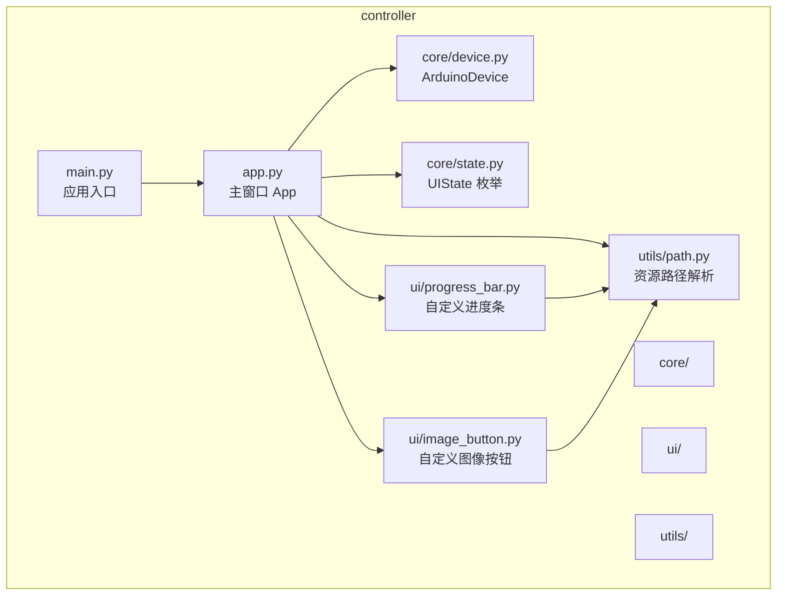

**图表来源**
- [main.py:1-8](file://controller/main.py#L1-L8)
- [app.py:1-667](file://controller/app.py#L1-L667)
- [device.py:1-202](file://controller/core/device.py#L1-L202)
- [state.py:1-3](file://controller/core/state.py#L1-L3)
- [progress_bar.py:1-28](file://controller/ui/progress_bar.py#L1-L28)
- [image_button.py:1-102](file://controller/ui/image_button.py#L1-L102)
- [path.py:1-16](file://controller/utils/path.py#L1-L16)

**章节来源**
- [main.py:1-8](file://controller/main.py#L1-L8)
- [app.py:1-667](file://controller/app.py#L1-L667)
- [device.py:1-202](file://controller/core/device.py#L1-L202)
- [state.py:1-3](file://controller/core/state.py#L1-L3)
- [progress_bar.py:1-28](file://controller/ui/progress_bar.py#L1-L28)
- [image_button.py:1-102](file://controller/ui/image_button.py#L1-L102)
- [path.py:1-16](file://controller/utils/path.py#L1-L16)
- [README.md:1-1](file://README.md#L1-L1)

## 核心组件
本节对应用的关键组件进行深入分析，涵盖职责划分、数据结构与复杂度、依赖链路与优化点。

- 应用入口点（main.py）
  - 职责：创建 QApplication 实例，构建主窗口 App 并显示，进入事件循环
  - 关键点：使用 sys.argv 传递命令行参数；调用 sys.exit(app.exec()) 保证退出码正确性
  - 复杂度：O(1)，无额外计算开销
  - 优化建议：可增加异常捕获以提升健壮性

- 主窗口 App（app.py）
  - 职责：管理 UI 初始化、事件处理、状态切换、动画与进度条更新、设备状态刷新、自动连接管理
  - 数据结构：
    - 设备对象：ArduinoDevice（支持串口通信）
    - UI 状态：UIState（IDLE/BINDING）
    - 自定义进度条：CustomProgressBar
    - 自定义按钮：ImageButton
    - 资源帧：walk1~4、disappear1/2 的 QPixmap 列表
    - 定时器：动画定时器、进度定时器、连接动画定时器、自动连接定时器
    - 状态指示器：连接状态图标、电量图标、祈祷动画标签
    - 字体系统：自定义字体加载与应用
    - **新增**：电池图标系统，支持四档电量状态显示
    - **新增**：文本叠加动画，实现字符级跳跃效果
  - 控制流：
    - 状态切换：enter_binding() 与 exit_binding() 在 IDLE 与 BINDING 之间转换
    - 键盘事件：keyPressEvent/keyReleaseEvent 驱动绑定流程
    - 动画与进度：update_animation()/update_progress() 驱动 UI 更新
    - 成功动画：play_success()/update_success_anim() 完成绑定后的视觉反馈
    - 自动连接：try_auto_connect() 实现智能端口检测和自动重连
    - 状态指示：_update_battery_display()、_update_connecting_anim() 等更新状态显示
    - 窗口管理：mousePressEvent/mouseMoveEvent/mouseReleaseEvent 支持窗口拖拽
    - **新增**：电池状态更新：_update_battery_display() 根据电量百分比切换图标
    - **新增**：连接动画：_update_connecting_anim() 和 _update_praying_anim() 控制动画播放
  - 性能影响：多个定时器和动画资源增加CPU占用；串口通信增加I/O开销；大量UI组件影响内存使用
  - 优化建议：合理管理定时器生命周期，优化资源加载策略，使用懒加载机制

- 设备模型 ArduinoDevice（device.py）
  - 职责：维护设备状态（电池电量、当前按键），提供串口通信接口，支持真实硬件交互
  - 数据结构：字典返回值包含 battery 与 key，支持串口连接状态管理
  - 复杂度：get_status() O(1)，set_key() O(1)，connect() O(1)
  - 扩展建议：支持持久化存储与状态变更通知，增加错误重连机制
  - **新增**：Qt键到HID键码映射系统，支持完整的键盘按键转换

- UI 状态枚举 UIState（state.py）
  - 职责：定义 UI 的两种状态（空闲/绑定中），作为状态机的输入与输出
  - 使用场景：App 中的状态判断与 UI 可见性控制
  - 扩展建议：可引入更多状态（如错误、加载中、连接中）以增强用户体验

- 自定义进度条 CustomProgressBar（progress_bar.py）
  - 职责：绘制背景与填充区域，根据数值裁剪填充图元
  - 数据结构：value 属性与 QPixmap 背景/填充
  - 绘制流程：paintEvent 中按比例裁剪并绘制
  - 性能影响：每次 setValue() 触发 update()，建议在高频更新时合并绘制请求

- 自定义图像按钮 ImageButton（image_button.py）
  - 职责：实现支持三种状态的图像按钮（正常、悬停、按下），支持文字叠加
  - 数据结构：normal_pixmap、hover_pixmap、pressed_pixmap
  - 状态管理：通过鼠标事件切换按钮状态
  - 性能影响：图片资源加载和绘制开销
  - **新增**：支持文字叠加功能，可在按钮上显示文本内容

- 资源路径解析（path.py）
  - 职责：兼容打包后运行（pyinstaller）与开发环境的资源路径解析
  - 关键点：利用 sys._MEIPASS 或 __file__ 所在目录拼接资源路径
  - 影响范围：所有 UI 组件与动画资源加载

**章节来源**
- [main.py:1-8](file://controller/main.py#L1-L8)
- [app.py:14-667](file://controller/app.py#L14-L667)
- [device.py:110-202](file://controller/core/device.py#L110-L202)
- [state.py:1-3](file://controller/core/state.py#L1-L3)
- [progress_bar.py:1-28](file://controller/ui/progress_bar.py#L1-L28)
- [image_button.py:1-102](file://controller/ui/image_button.py#L1-L102)
- [path.py:1-16](file://controller/utils/path.py#L1-L16)

## 架构总览
应用遵循 MVC 架构模式：
- Model（模型）：ArduinoDevice 封装设备状态与业务数据，提供串口通信接口与只读状态查询
- View（视图）：App 作为主窗口承载 UI 元素，CustomProgressBar 和 ImageButton 提供自定义渲染
- Controller（控制器）：App 作为事件控制器，处理键盘事件、状态切换、动画调度与自动连接管理

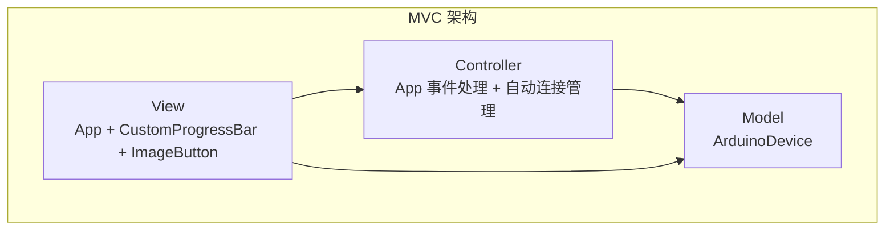

**图表来源**
- [app.py:14-667](file://controller/app.py#L14-L667)
- [device.py:110-202](file://controller/core/device.py#L110-L202)
- [progress_bar.py:5-28](file://controller/ui/progress_bar.py#L5-L28)
- [image_button.py:8-102](file://controller/ui/image_button.py#L8-L102)

## 详细组件分析

### App 类（主窗口）
App 是应用的核心控制器与视图容器，负责：
- 初始化基础属性（标题、尺寸、焦点策略、无边框窗口）
- 创建并布局 UI 元素（电量图标、关闭按钮、当前按键、连接状态、祈祷动画、主要按钮等）
- 加载动画资源（walk1~4、disappear1/2）和状态图片
- 管理状态（UIState）、定时器与事件响应
- 刷新设备状态并在 UI 上展示
- **新增**：自动连接管理、状态指示器系统、窗口拖拽功能
- **新增**：电池图标系统，支持四档电量状态显示
- **新增**：文本叠加动画，实现字符级跳跃效果

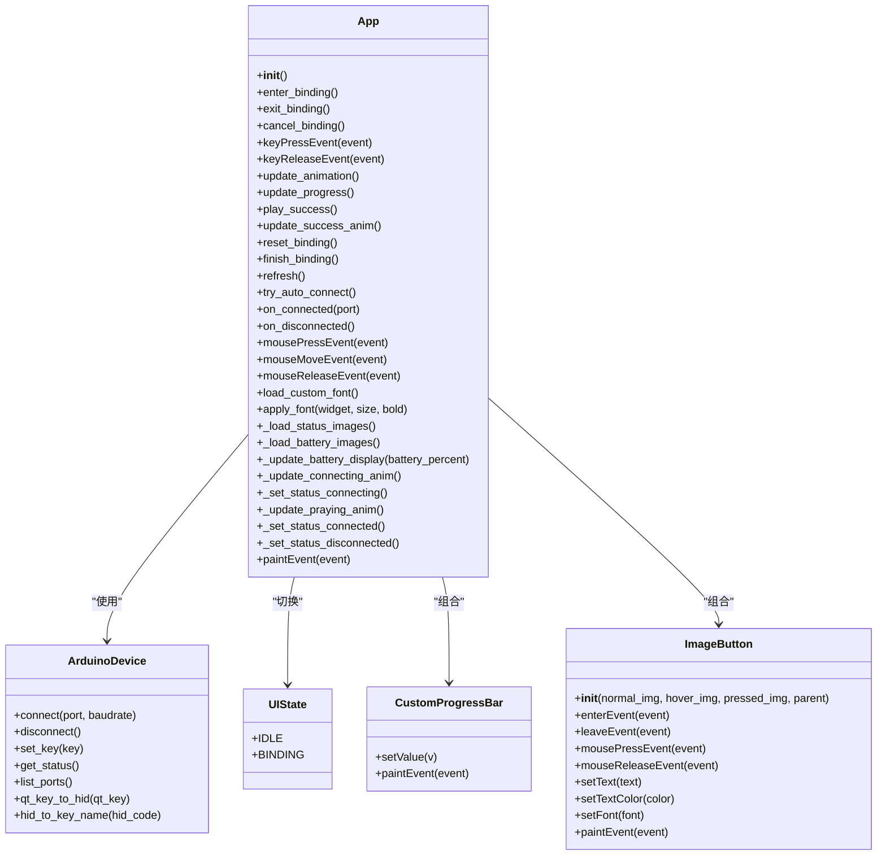

**图表来源**
- [app.py:14-667](file://controller/app.py#L14-L667)
- [device.py:110-202](file://controller/core/device.py#L110-L202)
- [state.py:1-3](file://controller/core/state.py#L1-L3)
- [progress_bar.py:5-28](file://controller/ui/progress_bar.py#L5-L28)
- [image_button.py:8-102](file://controller/ui/image_button.py#L8-L102)

**章节来源**
- [app.py:14-667](file://controller/app.py#L14-L667)

### 状态管理模式
UIState 枚举定义了两种状态：
- IDLE：空闲态，允许用户点击"修改按键"进入绑定流程，连接状态正常
- BINDING：绑定态，监听键盘事件并驱动进度条与动画

状态转换逻辑：
- enter_binding()：进入绑定态，隐藏四个角落元素，显示提示、进度条与精灵，重置进度与帧索引，启动定时器
- exit_binding()：退出绑定态，隐藏绑定界面元素，恢复四个角落元素，显示中央按钮
- cancel_binding()：取消绑定，停止所有定时器，重置状态并退出绑定界面
- finish_binding()：完成绑定后刷新设备状态并回到空闲态

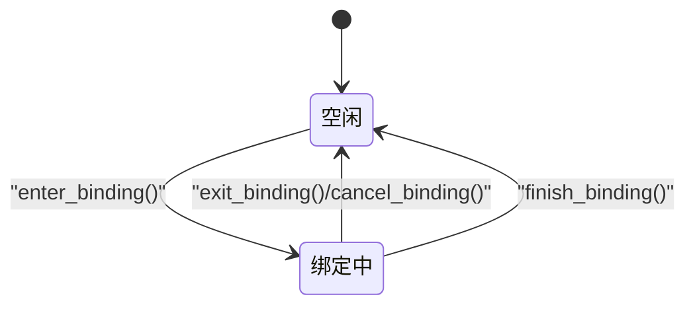

**图表来源**
- [app.py:476-537](file://controller/app.py#L476-L537)
- [app.py:507-537](file://controller/app.py#L507-L537)
- [app.py:655-662](file://controller/app.py#L655-L662)
- [state.py:1-3](file://controller/core/state.py#L1-L3)

**章节来源**
- [app.py:476-537](file://controller/app.py#L476-L537)
- [app.py:507-537](file://controller/app.py#L507-L537)
- [app.py:655-662](file://controller/app.py#L655-L662)
- [state.py:1-3](file://controller/core/state.py#L1-L3)

### 键盘事件与绑定流程
绑定流程通过键盘事件驱动，核心步骤如下：
- 用户点击"修改按键"，App 进入 BINDING 状态并显示进度条与提示
- 按下键触发 keyPressEvent：记录当前按键、重置进度、启动动画与进度定时器
- 释放键触发 keyReleaseEvent：停止定时器，若进度达到阈值则播放成功动画，否则重置绑定
- 成功动画结束后调用 finish_binding()，将当前按键写入设备并刷新 UI

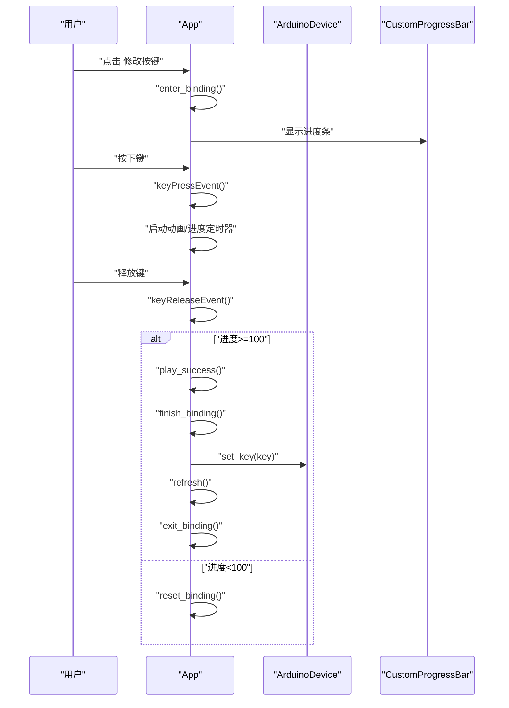

**图表来源**
- [app.py:578-604](file://controller/app.py#L578-L604)
- [app.py:655-662](file://controller/app.py#L655-L662)
- [device.py:167-189](file://controller/core/device.py#L167-L189)
- [progress_bar.py:15-28](file://controller/ui/progress_bar.py#L15-L28)

**章节来源**
- [app.py:578-604](file://controller/app.py#L578-L604)
- [app.py:655-662](file://controller/app.py#L655-L662)
- [device.py:167-189](file://controller/core/device.py#L167-L189)
- [progress_bar.py:15-28](file://controller/ui/progress_bar.py#L15-L28)

### 自动连接管理系统
**新增功能**：App 现在支持完整的自动连接管理，包括智能端口检测、自动重连和状态监控。

- 端口检测：try_auto_connect() 方法自动扫描可用串口并尝试连接
- 连接状态管理：on_connected() 和 on_disconnected() 处理连接状态变化
- 状态指示：_set_status_connecting()、_set_status_connected()、_set_status_disconnected() 更新状态显示
- 连接动画：_update_connecting_anim() 和 _update_praying_anim() 提供视觉反馈
- 自动重连：每2秒检查一次连接状态，断开后自动重连
- 过滤机制：跳过蓝牙和无线端口，优先连接有线串口

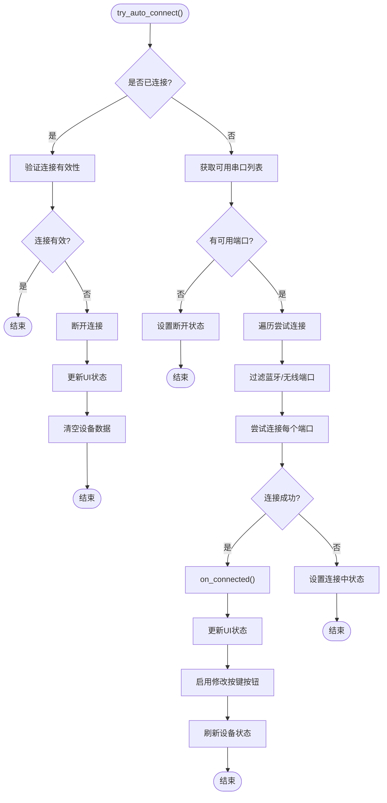

**图表来源**
- [app.py:423-455](file://controller/app.py#L423-L455)
- [app.py:456-474](file://controller/app.py#L456-L474)
- [app.py:422-474](file://controller/app.py#L422-L474)

**章节来源**
- [app.py:423-455](file://controller/app.py#L423-L455)
- [app.py:456-474](file://controller/app.py#L456-L474)
- [app.py:422-474](file://controller/app.py#L422-L474)

### 状态指示器系统
**新增功能**：完整的状态指示器系统，提供多种状态的可视化反馈。

- 连接状态指示：STATUS_CONNECTING（两帧动画）、STATUS_CONNECTED、STATUS_DISCONNECTED
- 电量状态指示：BATTERY_IMAGES（四档电量图标）
- 祈祷动画：动态文字效果，显示"仙女祈祷中"并带有跳跃动画
- 动画管理：_update_connecting_anim() 和 _update_praying_anim() 控制动画播放
- 状态切换：根据连接状态自动切换对应的图标和动画
- **新增**：电池图标系统，根据电量百分比动态切换图标

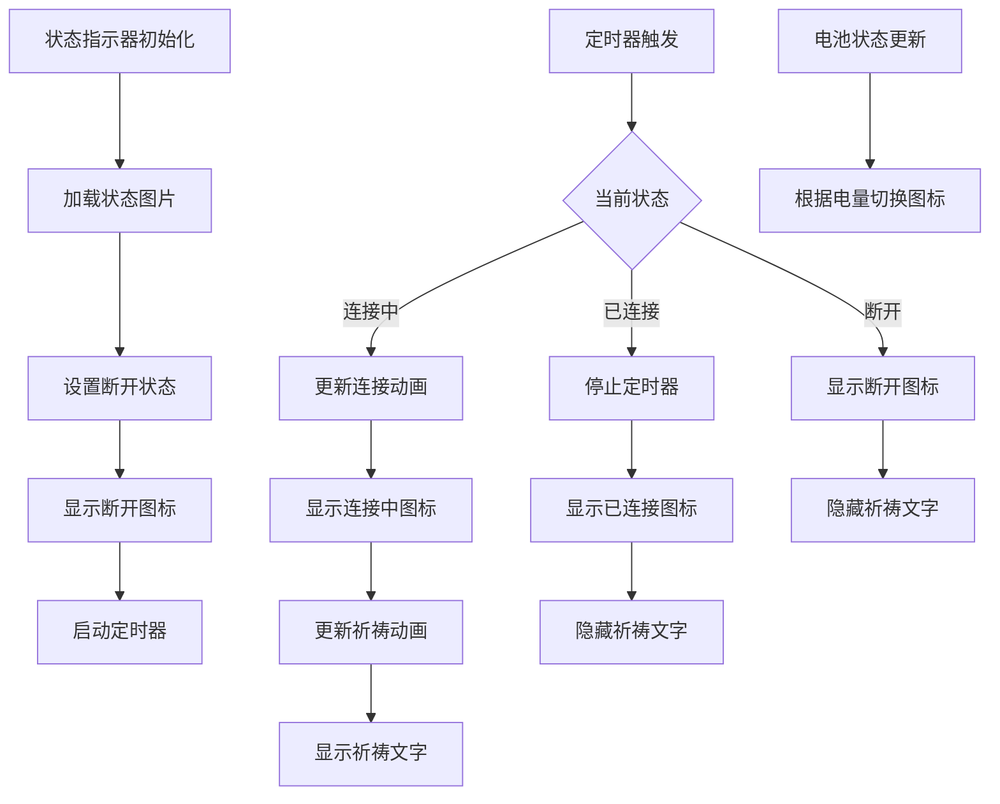

**图表来源**
- [app.py:31-45](file://controller/app.py#L31-L45)
- [app.py:246-268](file://controller/app.py#L246-L268)
- [app.py:269-284](file://controller/app.py#L269-L284)
- [app.py:285-314](file://controller/app.py#L285-L314)
- [app.py:316-352](file://controller/app.py#L316-L352)
- [app.py:353-398](file://controller/app.py#L353-L398)

**章节来源**
- [app.py:31-45](file://controller/app.py#L31-L45)
- [app.py:246-268](file://controller/app.py#L246-L268)
- [app.py:269-284](file://controller/app.py#L269-L284)
- [app.py:285-314](file://controller/app.py#L285-L314)
- [app.py:316-352](file://controller/app.py#L316-L352)
- [app.py:353-398](file://controller/app.py#L353-L398)

### 文本叠加动画系统
**新增功能**：实现字符级的跳跃动画效果，为"仙女祈祷中"文本提供动态视觉反馈。

- 字符级动画：每个字符独立控制，实现跳跃效果
- 省略号动态显示：根据动画进度动态显示1-3个点
- 时间控制：正常帧间隔360ms，最后一帧停留600ms
- 虚假显示机制：最低显示时间为2秒，确保用户体验
- **新增**：单字符标签系统，每个字符使用独立QLabel实现精确控制

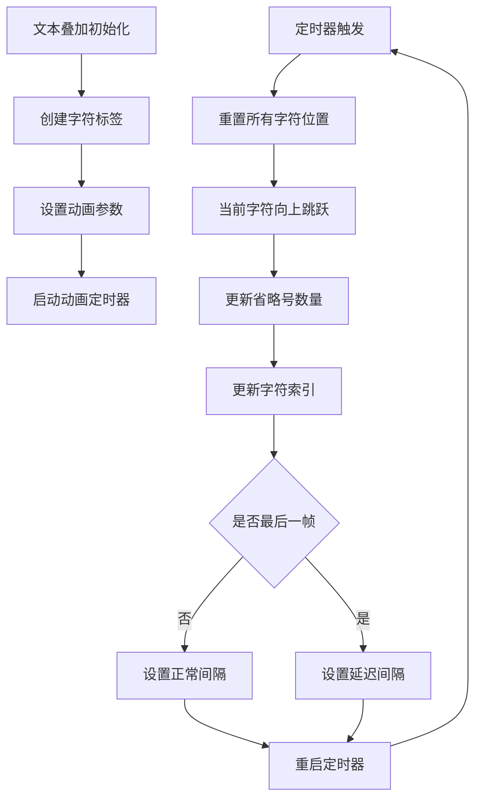

**图表来源**
- [app.py:122-133](file://controller/app.py#L122-L133)
- [app.py:148-158](file://controller/app.py#L148-L158)
- [app.py:316-352](file://controller/app.py#L316-L352)

**章节来源**
- [app.py:122-133](file://controller/app.py#L122-L133)
- [app.py:148-158](file://controller/app.py#L148-L158)
- [app.py:316-352](file://controller/app.py#L316-L352)

### 自定义UI组件系统
**新增功能**：完整的自定义UI组件系统，提供丰富的交互体验。

- CustomProgressBar：自定义进度条，支持背景和填充图元的组合绘制
- ImageButton：支持三种状态的图像按钮，提供悬停和按下效果
- **新增**：文字叠加功能，支持在按钮上显示文本内容
- 字体系统：load_custom_font() 和 apply_font() 支持自定义字体加载和应用
- 背景系统：paintEvent() 支持背景图绘制，提供美观的界面外观
- 窗口管理：mousePressEvent/mouseMoveEvent/mouseReleaseEvent 支持窗口拖拽

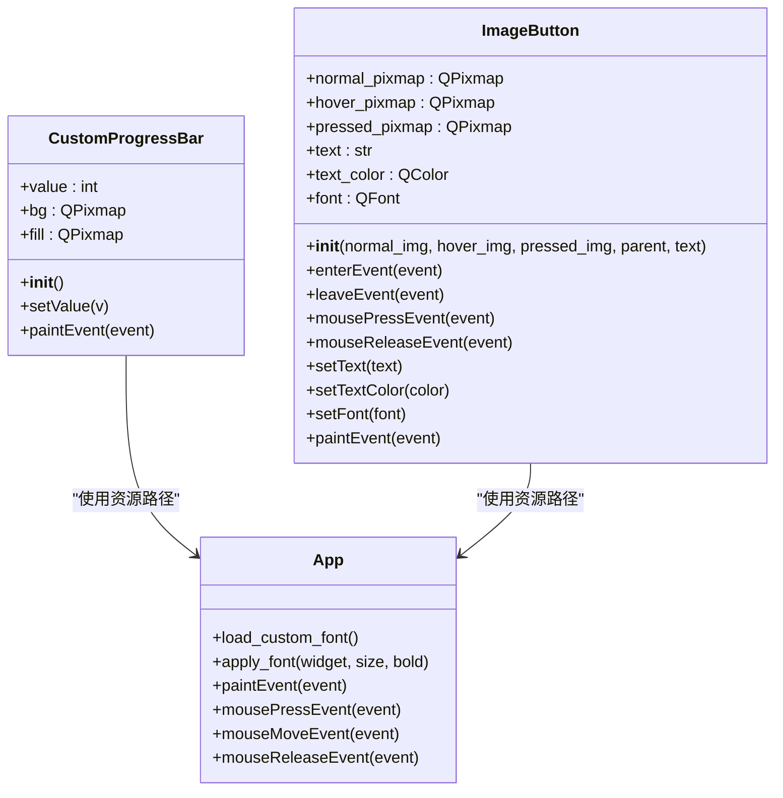

**图表来源**
- [progress_bar.py:5-28](file://controller/ui/progress_bar.py#L5-L28)
- [image_button.py:8-102](file://controller/ui/image_button.py#L8-L102)
- [app.py:399-421](file://controller/app.py#L399-L421)
- [app.py:555-576](file://controller/app.py#L555-L576)

**章节来源**
- [progress_bar.py:5-28](file://controller/ui/progress_bar.py#L5-L28)
- [image_button.py:8-102](file://controller/ui/image_button.py#L8-L102)
- [app.py:399-421](file://controller/app.py#L399-L421)
- [app.py:555-576](file://controller/app.py#L555-L576)

### Qt键到HID键码映射系统
**新增功能**：完整的键值映射系统，支持Qt键序列到HID键码的双向转换。

- Qt键到HID键码映射：支持功能键、数字键、字母键、特殊键、方向键和修饰键
- HID键码到Qt键名映射：用于显示当前按键映射的可读名称
- 键值转换函数：qt_key_to_hid() 和 hid_to_key_name() 提供便捷的键值转换
- 键码表：QT_TO_HID 字典包含完整的键码映射关系

**章节来源**
- [device.py:4-107](file://controller/core/device.py#L4-L107)
- [device.py:95-107](file://controller/core/device.py#L95-L107)

### 初始化流程与窗口配置
- 应用入口：创建 QApplication，实例化 App 并 show，进入事件循环
- 主窗口初始化：设置标题、固定尺寸（800x600）、强焦点策略；创建设备与状态；初始化 UI 元素与动画资源；创建并连接定时器；首次刷新状态
- 资源路径：通过 resource_path 解析资源路径，支持打包后运行
- **新增**：无边框窗口设置、背景图加载、字体加载、自动连接定时器启动
- **新增**：状态指示器初始化、祈祷动画定时器启动、电量图标加载
- **新增**：电池图标系统初始化、文本叠加动画系统初始化

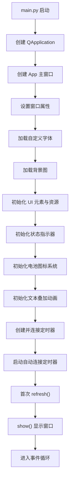

**图表来源**
- [main.py:5-8](file://controller/main.py#L5-L8)
- [app.py:47-238](file://controller/app.py#L47-L238)
- [path.py:4-16](file://controller/utils/path.py#L4-L16)

**章节来源**
- [main.py:5-8](file://controller/main.py#L5-L8)
- [app.py:47-238](file://controller/app.py#L47-L238)
- [path.py:4-16](file://controller/utils/path.py#L4-L16)

## 依赖关系分析
组件间的依赖关系清晰且低耦合：
- main.py 仅依赖 app.py，形成单一入口
- app.py 依赖 core/device.py、core/state.py、ui/progress_bar.py、ui/image_button.py、utils/path.py
- progress_bar.py 依赖 utils/path.py
- image_button.py 依赖 utils/path.py
- device.py 依赖 serial 和 serial.tools.list_ports，提供串口通信功能
- state.py 无外部依赖，保持纯数据与常量

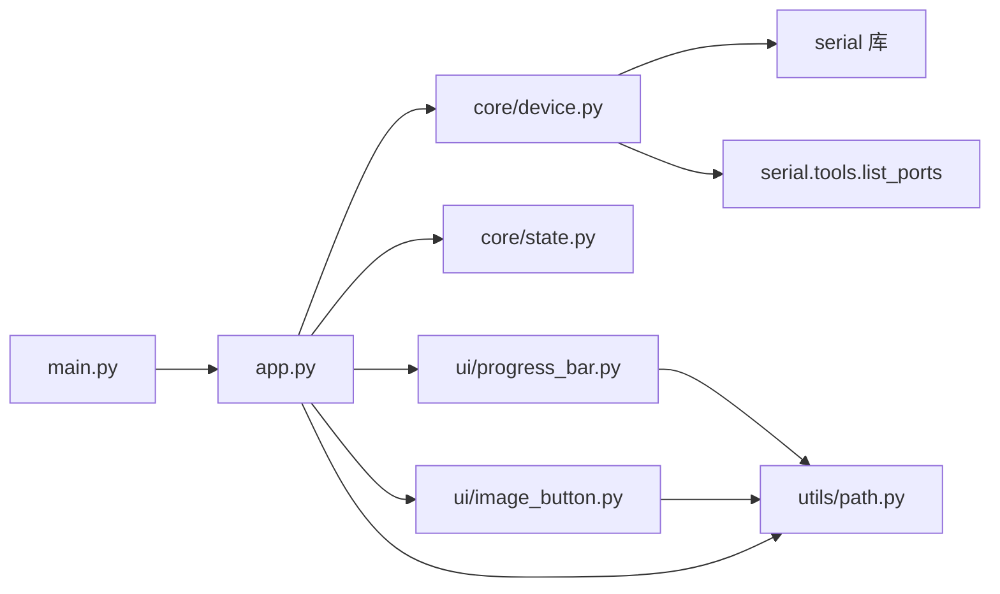

**图表来源**
- [main.py:1-8](file://controller/main.py#L1-L8)
- [app.py:7-11](file://controller/app.py#L7-L11)
- [progress_bar.py:3](file://controller/ui/progress_bar.py#L3)
- [image_button.py:5](file://controller/ui/image_button.py#L5)
- [path.py:1-16](file://controller/utils/path.py#L1-L16)
- [device.py:1-2](file://controller/core/device.py#L1-L2)

**章节来源**
- [main.py:1-8](file://controller/main.py#L1-L8)
- [app.py:7-11](file://controller/app.py#L7-L11)
- [progress_bar.py:3](file://controller/ui/progress_bar.py#L3)
- [image_button.py:5](file://controller/ui/image_button.py#L5)
- [path.py:1-16](file://controller/utils/path.py#L1-L16)
- [device.py:1-2](file://controller/core/device.py#L1-L2)

## 性能考虑
- 定时器频率：多个定时器（动画、进度、连接、祈祷）分别控制不同功能的刷新频率，建议根据目标帧率与 CPU 负载调整间隔
- 绘制开销：自定义组件每次 setValue() 触发重绘，高频更新时可考虑减少更新频率或合并绘制请求
- 资源加载：动画帧与进度条纹理一次性加载，避免运行时重复 IO；字体和背景图按需加载
- 状态切换：状态机切换仅涉及 UI 可见性与定时器启停，成本较低
- **新增**：串口通信开销：串口读写操作可能成为性能瓶颈，建议异步处理和错误重试机制
- **新增**：UI组件开销：大量 QLabel 和按钮组件增加内存使用，建议合理管理组件生命周期
- **新增**：动画开销：多帧动画和定时器增加CPU占用，建议在后台或低负载时运行
- **新增**：文本叠加动画开销：字符级动画和定时器增加CPU占用，建议优化动画频率

## 故障排除指南
- 进度条不显示或显示异常
  - 检查资源路径是否正确（resource_path 返回的路径是否存在）
  - 确认 setValue() 是否被调用且值在 0..100 范围内
- 动画不播放
  - 确认 App 处于 BINDING 状态
  - 检查定时器是否启动与回调函数是否连接
- 绑定失败
  - 确认释放键时进度值是否达到阈值
  - 检查设备 set_key() 是否被调用与当前按键是否有效
- 资源路径问题（打包后）
  - 确保 resource_path 正确识别 sys._MEIPASS 并拼接相对路径
- **新增**：串口连接问题
  - 检查串口权限和占用情况
  - 确认Arduino设备固件版本兼容性
  - 验证波特率设置（默认115200）
- **新增**：自动连接失败
  - 检查串口驱动是否正确安装
  - 确认设备供电和连接稳定性
  - 验证蓝牙/无线端口过滤逻辑
- **新增**：状态指示器异常
  - 检查状态图片文件是否存在
  - 确认状态切换逻辑是否正确执行
  - 验证定时器是否正常工作
- **新增**：电池图标显示异常
  - 检查电量图片文件是否存在
  - 确认电量百分比值是否在有效范围内
  - 验证电池图标切换逻辑
- **新增**：文本叠加动画异常
  - 检查字符标签是否正确创建
  - 确认动画定时器是否正常启动
  - 验证字符位置计算逻辑
- **新增**：UI组件显示问题
  - 检查字体文件是否正确加载
  - 确认背景图是否正确设置
  - 验证窗口尺寸和布局是否正确
- **新增**：窗口拖拽失效
  - 检查鼠标事件处理逻辑
  - 确认按钮点击事件是否干扰拖拽功能

**章节来源**
- [app.py:476-537](file://controller/app.py#L476-L537)
- [app.py:578-604](file://controller/app.py#L578-L604)
- [app.py:655-662](file://controller/app.py#L655-L662)
- [progress_bar.py:15-28](file://controller/ui/progress_bar.py#L15-L28)
- [path.py:4-16](file://controller/utils/path.py#L4-L16)
- [device.py:123-133](file://controller/core/device.py#L123-L133)
- [app.py:423-455](file://controller/app.py#L423-L455)
- [app.py:246-268](file://controller/app.py#L246-L268)
- [app.py:269-284](file://controller/app.py#L269-L284)
- [app.py:316-352](file://controller/app.py#L316-L352)

## 结论
本项目经过重大重构后，以更加完整和实用的方式实现了基于 PySide6 的复杂桌面应用，采用 MVC 架构与状态机驱动 UI，具备良好的可扩展性与可维护性。通过新增的自动连接功能、状态指示器系统和丰富的UI组件，应用现在能够与真实的Arduino设备进行智能交互，提供完整的按键映射配置解决方案。通过自定义进度条、动画资源和状态指示器，提供了直观而丰富的用户反馈。

**新增的视觉增强功能**：
- **电池图标系统**：实现了四档电量状态显示，提供直观的电量反馈
- **文本叠加动画**：字符级跳跃动画效果，增强了"仙女祈祷中"的视觉表现
- **状态指示器系统**：完整的连接状态和电量状态可视化反馈
- **自定义UI组件**：支持文字叠加的图像按钮，提升了界面的美观性和功能性

后续可在以下方面进一步完善：
- 增加更多 UI 状态（如错误态、加载态、连接中）
- 优化串口通信性能，支持异步操作和自动重连
- 扩展键值映射系统，支持更多特殊键和组合键
- 增加配置持久化与主题切换能力
- 添加日志记录和调试信息显示功能
- 实现多设备同时管理功能
- 优化资源管理，减少内存和CPU占用
- 增强错误处理和用户提示机制
- **新增**：优化文本叠加动画性能，减少CPU占用
- **新增**：扩展电池图标系统，支持更多电量状态
- **新增**：增强状态指示器的交互性，支持点击切换等功能