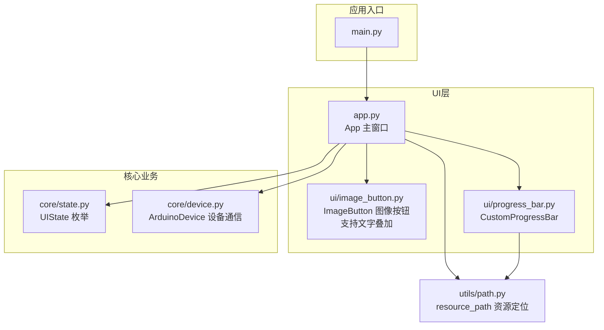
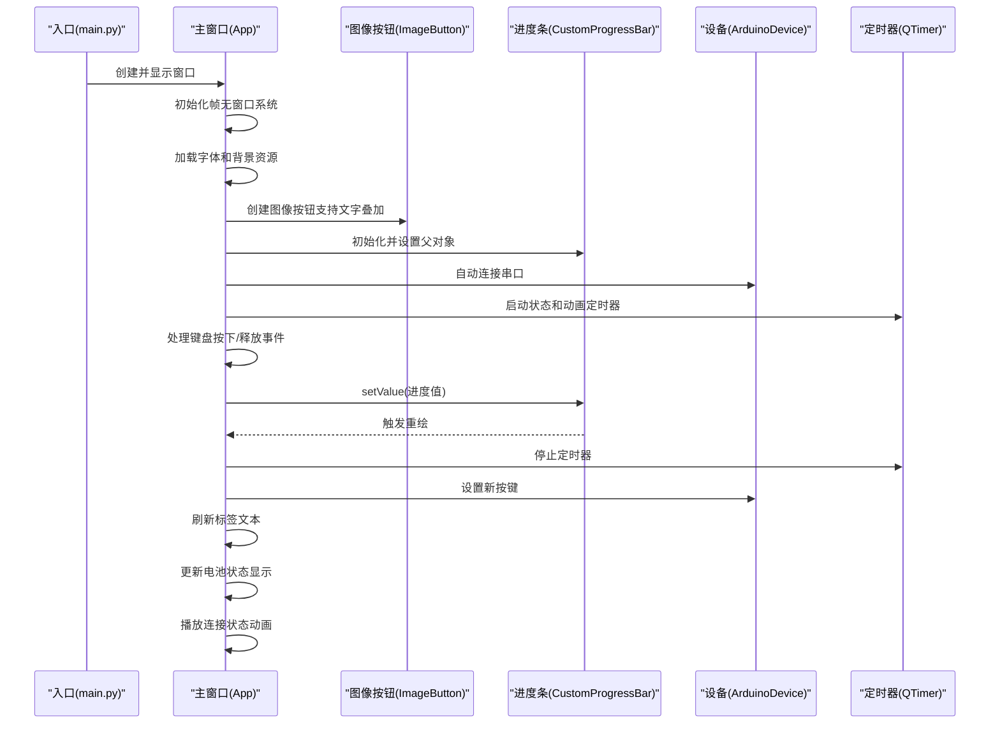
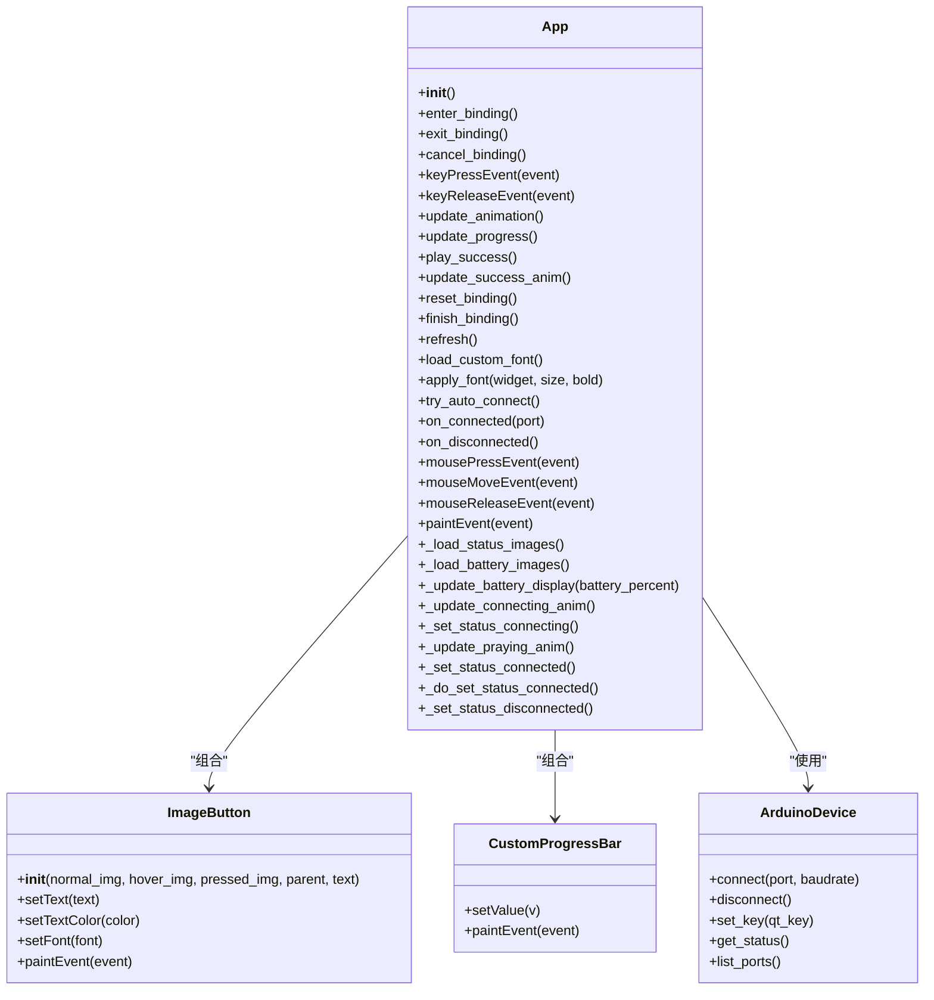
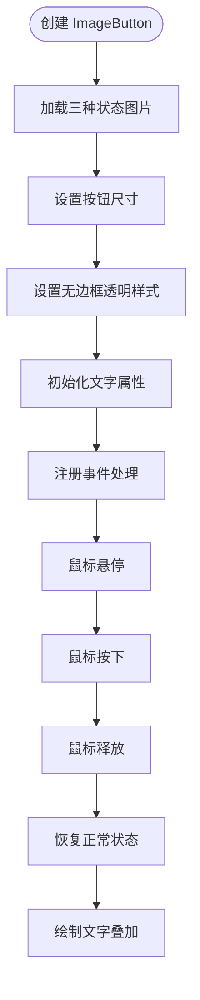
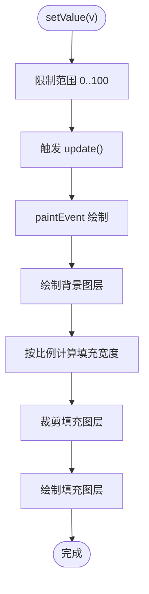
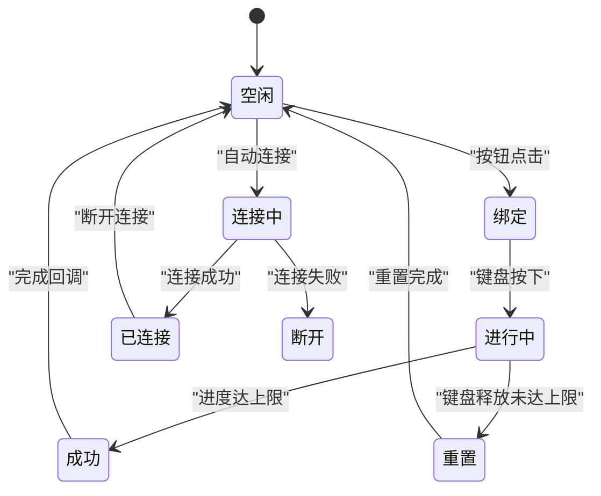
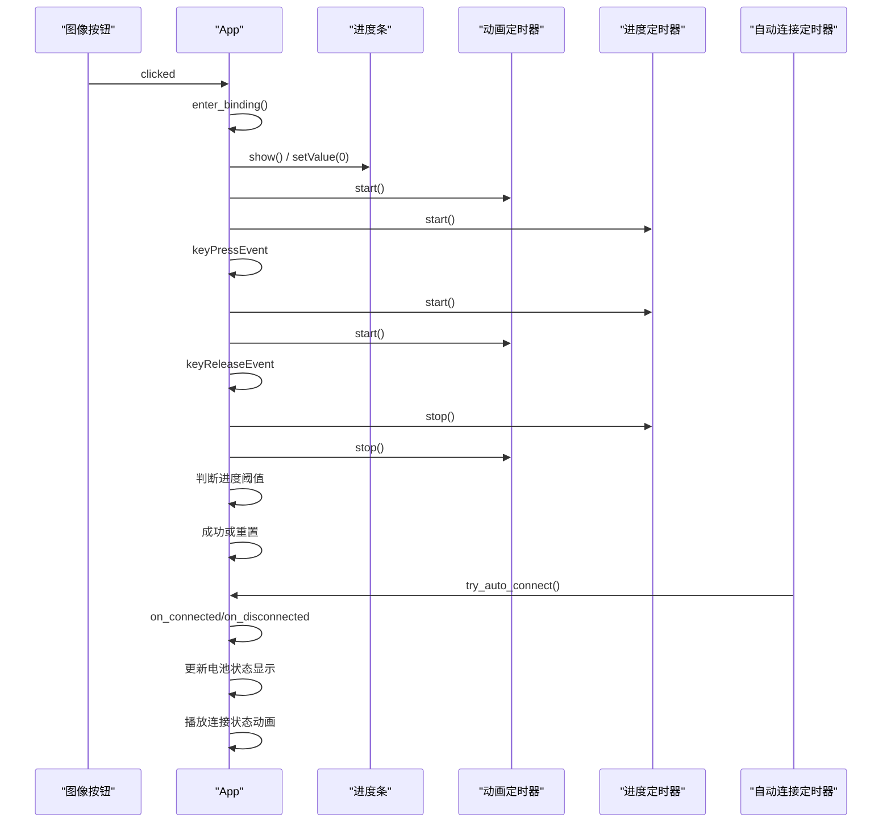
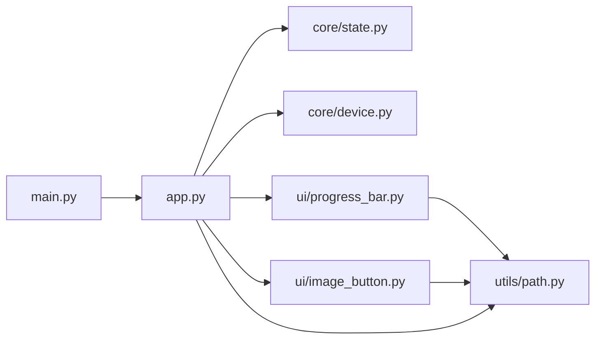

# 用户界面组件

<cite>
**本文引用的文件**
- [controller/app.py](file://controller/app.py)
- [controller/ui/image_button.py](file://controller/ui/image_button.py)
- [controller/ui/progress_bar.py](file://controller/ui/progress_bar.py)
- [controller/main.py](file://controller/main.py)
- [controller/core/state.py](file://controller/core/state.py)
- [controller/core/device.py](file://controller/core/device.py)
- [controller/utils/path.py](file://controller/utils/path.py)
</cite>

## 更新摘要
**变更内容**
- 从简单的标签界面升级为完整的图形界面系统
- 新增帧无窗口系统和窗口拖动功能
- 新增自定义图像按钮组件（支持文字叠加）
- 新增电池状态指示器（四档电量显示）
- 新增连接状态动画系统（连接中动画、祈祷文字动画）
- 新增字体系统和资源管理
- 新增串口自动连接和状态管理
- 新增多种动画系统（连接动画、祈祷动画、精灵动画）

## 目录
1. [简介](#简介)
2. [项目结构](#项目结构)
3. [核心组件](#核心组件)
4. [架构总览](#架构总览)
5. [详细组件分析](#详细组件分析)
6. [依赖分析](#依赖分析)
7. [性能考虑](#性能考虑)
8. [故障排查指南](#故障排查指南)
9. [结论](#结论)
10. [附录](#附录)

## 简介
本文件聚焦于用户界面组件的技术实现，系统性解析应用主窗口类的设计架构、布局组织与事件处理机制；深入剖析自定义进度条组件的绘制与动画联动；梳理UI状态管理与核心业务数据绑定的同步策略；并提供可扩展的使用示例与定制指南，以及响应式设计与用户体验优化建议。目标是帮助开发者快速理解并高效扩展该UI子系统。

**更新** 该系统现已从简单的标签界面升级为完整的图形界面系统，包含帧无窗口系统、自定义按钮（支持文字叠加）、电池状态指示器（四档电量显示）、连接状态动画系统（连接中动画、祈祷文字动画）、字体管理等高级功能。

## 项目结构
该项目采用"功能分层 + 文件按职责划分"的组织方式：
- 入口程序负责初始化应用与主窗口展示
- 主窗口类集中管理UI布局、状态机与事件流
- 自定义UI组件封装特定绘制与交互行为
- 核心业务模块提供设备状态与状态枚举
- 资源路径工具统一资源定位

**图表来源**
- [controller/main.py:1-8](file://controller/main.py#L1-L8)
- [controller/app.py:1-667](file://controller/app.py#L1-L667)
- [controller/ui/image_button.py:1-102](file://controller/ui/image_button.py#L1-L102)
- [controller/ui/progress_bar.py:1-28](file://controller/ui/progress_bar.py#L1-L28)
- [controller/core/state.py:1-3](file://controller/core/state.py#L1-L3)
- [controller/core/device.py:1-202](file://controller/core/device.py#L1-L202)
- [controller/utils/path.py:1-16](file://controller/utils/path.py#L1-L16)

**章节来源**
- [controller/main.py:1-8](file://controller/main.py#L1-L8)
- [controller/app.py:1-667](file://controller/app.py#L1-L667)
- [controller/ui/image_button.py:1-102](file://controller/ui/image_button.py#L1-L102)
- [controller/ui/progress_bar.py:1-28](file://controller/ui/progress_bar.py#L1-L28)
- [controller/core/state.py:1-3](file://controller/core/state.py#L1-L3)
- [controller/core/device.py:1-202](file://controller/core/device.py#L1-L202)
- [controller/utils/path.py:1-16](file://controller/utils/path.py#L1-L16)

## 核心组件
- **App 主窗口类**：负责窗口初始化、静态控件布局、状态切换、键盘事件处理、动画与进度联动、成功动画播放与完成回调、设备状态刷新等。现支持帧无窗口系统、窗口拖动、字体管理、自动连接等功能。
- **ImageButton 自定义图像按钮**：基于QPushButton重绘实现，支持正常、悬停、按下三种状态的图像切换，**新增**支持在按钮图片上叠加文字显示。
- **CustomProgressBar 自定义进度条**：基于QWidget重绘实现，支持背景与填充图层裁剪绘制，动态显示进度值。
- **UIState 状态枚举**：定义空闲与绑定两种UI状态，用于控制界面元素可见性与交互行为。
- **ArduinoDevice 设备通信**：提供串口连接、按键映射、状态查询等接口，支持自动连接和状态管理。
- **resource_path 资源定位**：兼容打包运行环境的资源路径拼接工具。

**更新** 新增了支持文字叠加的图像按钮、四档电池状态指示器、连接状态动画系统、字体系统等组件。

**章节来源**
- [controller/app.py:14-667](file://controller/app.py#L14-L667)
- [controller/ui/image_button.py:8-102](file://controller/ui/image_button.py#L8-L102)
- [controller/ui/progress_bar.py:5-28](file://controller/ui/progress_bar.py#L5-L28)
- [controller/core/state.py:1-3](file://controller/core/state.py#L1-L3)
- [controller/core/device.py:110-202](file://controller/core/device.py#L110-L202)
- [controller/utils/path.py:4-16](file://controller/utils/path.py#L4-L16)

## 架构总览
应用启动后，入口程序创建应用实例并展示主窗口；主窗口内部组合多个UI控件与自定义组件，并通过定时器驱动动画与进度更新；键盘事件触发绑定流程，进度条与精灵动画协同反馈用户操作；成功完成后刷新设备状态并回到空闲态。系统现支持自动连接、状态管理、资源加载、电池状态显示、连接动画等高级功能。

**图表来源**
- [controller/main.py:5-8](file://controller/main.py#L5-L8)
- [controller/app.py:47-76](file://controller/app.py#L47-L76)
- [controller/app.py:168-169](file://controller/app.py#L168-L169)
- [controller/app.py:365-411](file://controller/app.py#L365-L411)
- [controller/ui/progress_bar.py:15-28](file://controller/ui/progress_bar.py#L15-L28)
- [controller/core/device.py:110-202](file://controller/core/device.py#L110-L202)

## 详细组件分析

### App 主窗口类设计与事件处理
- **窗口基础**
  - 标题与固定尺寸，启用强焦点以接收键盘事件。
  - **新增** 帧无窗口系统 (`Qt.FramelessWindowHint`) 实现无边框窗口效果。
  - **新增** 窗口拖动功能，支持在空白区域拖动窗口。
- **控件组织**
  - **新增** 四个角落的UI元素：电量显示（支持四档电量图标）、连接状态（连接中/已连接/断开）、当前按键、关闭按钮。
  - **新增** 中央主要操作按钮（大尺寸图像按钮，支持文字叠加）。
  - **新增** 动态文字标签（"仙女祈祷中"）实现跳跃动画效果，包含省略号动态显示。
  - **新增** 精灵标签用于显示行走和消失动画。
  - 预加载行走帧与消失帧资源，便于动画播放。
- **状态机**
  - 使用UIState枚举区分空闲(IDLE)与绑定(BINDING)状态，控制控件显隐与交互。
- **事件处理**
  - **新增** 窗口拖动事件处理（mousePressEvent、mouseMoveEvent、mouseReleaseEvent），在按钮区域忽略拖动操作。
  - 按钮点击进入绑定态，隐藏按键与按钮，显示提示、进度与精灵。
  - 键盘按下：重置进度值，启动动画与进度定时器。
  - 键盘释放：停止定时器，若进度达到阈值则播放成功动画，否则重置绑定。
- **动画与进度联动**
  - **新增** 连接状态动画定时器，显示连接中两帧动画。
  - **新增** 祈祷文字动画定时器，实现文字跳跃和省略号效果（1-2-3个点的动态显示）。
  - **新增** 电池状态显示系统，根据电量百分比自动切换对应的电池图标。
  - 动画定时器按固定间隔轮换精灵帧。
  - 进度定时器按固定步进递增，同时根据进度计算精灵X坐标，实现"跟随"效果。
  - 进度达上限自动停止定时器并播放成功动画。
- **成功动画与完成**
  - 成功动画按序列帧播放消失效果，结束后调用完成回调，刷新设备状态并回到空闲态。
- **数据刷新**
  - **新增** 自动连接功能，定期扫描可用串口并尝试连接。
  - **新增** 字体管理系统，支持自定义字体加载和应用到所有控件。
  - 从设备读取状态并更新电量与按键标签。

**图表来源**
- [controller/app.py:14-667](file://controller/app.py#L14-L667)
- [controller/ui/image_button.py:8-102](file://controller/ui/image_button.py#L8-L102)
- [controller/ui/progress_bar.py:5-28](file://controller/ui/progress_bar.py#L5-L28)
- [controller/core/device.py:110-202](file://controller/core/device.py#L110-L202)

**章节来源**
- [controller/app.py:14-667](file://controller/app.py#L14-L667)
- [controller/core/state.py:1-3](file://controller/core/state.py#L1-L3)
- [controller/core/device.py:110-202](file://controller/core/device.py#L110-L202)

### ImageButton 自定义图像按钮组件
- **组件特性**
  - 继承自QPushButton，支持三种状态的图像切换：正常、悬停、按下。
  - **新增** 支持在按钮图片上叠加文字显示，通过构造函数的text参数设置。
  - 通过构造函数传入不同状态的图片路径，自动设置按钮尺寸。
  - 无边框、透明背景设计，适配图形界面风格。
- **状态管理**
  - 内部维护状态标记（_is_pressed、_is_hovered）跟踪按钮状态。
  - 通过enterEvent、leaveEvent、mousePressEvent、mouseReleaseEvent事件处理状态变化。
- **绘制机制**
  - 在paintEvent中根据当前状态选择对应的图片进行绘制。
  - **新增** 在绘制图片后，使用QPainter.drawText在按钮中心位置绘制文字。
  - 使用QPainter.SmoothPixmapTransform提升图片缩放质量。
- **文字叠加功能**
  - **新增** setText方法用于动态设置按钮文字。
  - **新增** setTextColor方法用于设置文字颜色。
  - **新增** setFont方法用于设置文字字体。
  - 文字默认使用粗体，颜色为黑色，居中对齐。
- **资源管理**
  - 通过resource_path工具加载图片资源，支持开发和打包环境。

**图表来源**
- [controller/ui/image_button.py:11-102](file://controller/ui/image_button.py#L11-L102)

**章节来源**
- [controller/ui/image_button.py:8-102](file://controller/ui/image_button.py#L8-L102)

### CustomProgressBar 自定义进度条组件
- **组件特性**
  - 继承自QWidget，自定义绘制背景与填充层。
  - 通过setValue设置进度值并触发重绘。
  - 在paintEvent中先绘制背景，再按比例裁剪填充图层并绘制。
- **渐进式更新**
  - 进度值按固定步进递增，配合定时器实现平滑动画。
  - 通过计算进度比例确定填充宽度，实现渐进式填充。
- **视觉反馈**
  - 背景与填充使用独立资源，支持主题化替换。
  - 尺寸固定，便于在布局中对齐与定位。

**图表来源**
- [controller/ui/progress_bar.py:15-28](file://controller/ui/progress_bar.py#L15-L28)

**章节来源**
- [controller/ui/progress_bar.py:5-28](file://controller/ui/progress_bar.py#L5-L28)

### UI 组件的状态管理与数据绑定
- **状态枚举**
  - UIState提供IDLE与BINDING两个状态，用于控制界面元素可见性与交互。
- **状态切换**
  - 进入绑定态：隐藏四个角落的元素，显示提示、进度与精灵，重置进度值与精灵帧。
  - 退出绑定态：隐藏进度与精灵，恢复四个角落的元素，清空进度。
- **数据绑定**
  - **新增** 自动连接功能，定期扫描串口并建立连接。
  - **新增** 串口状态管理，连接成功/断开时更新界面状态。
  - **新增** 电池状态显示系统，根据设备电量百分比自动切换电池图标。
  - **新增** 字体管理系统，支持自定义字体加载并应用到所有控件。
  - 设备状态通过设备接口读取，主窗口刷新标签文本，形成单向数据流。
  - 绑定完成后，将按键名称写回设备，随后再次刷新。
- **状态同步**
  - 键盘事件与定时器驱动的进度更新与动画播放，均受状态机约束，确保在非绑定态不执行绑定逻辑。
  - **新增** 窗口拖动状态不受状态机影响，但会忽略对按钮的拖动操作。
  - **新增** 连接状态动画与祈祷文字动画相互独立，互不影响。

**图表来源**
- [controller/app.py:476-537](file://controller/app.py#L476-L537)
- [controller/app.py:365-411](file://controller/app.py#L365-L411)
- [controller/core/state.py:1-3](file://controller/core/state.py#L1-L3)

**章节来源**
- [controller/app.py:476-537](file://controller/app.py#L476-L537)
- [controller/app.py:365-411](file://controller/app.py#L365-L411)
- [controller/core/state.py:1-3](file://controller/core/state.py#L1-L3)

### 组件间通信与事件传播
- **事件来源**
  - 用户交互：按钮点击、键盘按键、鼠标拖动。
  - 定时器：动画定时器、进度定时器、状态定时器。
  - **新增** 系统事件：窗口拖动、自动连接、电池状态更新。
- **事件流向**
  - 按钮点击 -> 进入绑定态 -> 显示进度与精灵 -> 启动定时器。
  - 键盘按下 -> 重置进度值 -> 启动动画与进度定时器。
  - 键盘释放 -> 停止定时器 -> 判断进度阈值 -> 成功或重置。
  - 成功动画结束 -> 完成绑定 -> 刷新设备状态 -> 回到空闲态。
  - **新增** 窗口拖动 -> 移动窗口位置 -> 忽略按钮区域拖动。
  - **新增** 自动连接 -> 扫描串口 -> 建立连接 -> 更新界面状态。
  - **新增** 电池状态更新 -> 根据电量百分比切换电池图标。
  - **新增** 连接状态动画 -> 连接中两帧循环播放 -> 祈祷文字动画。
- **事件约束**
  - 非绑定态忽略键盘事件与进度更新。
  - 自动重复按键被过滤，避免误触。
  - **新增** 按钮区域拖动被忽略，防止误操作。
  - **新增** 连接状态动画与祈祷文字动画独立运行，互不影响。

**图表来源**
- [controller/app.py:168-169](file://controller/app.py#L168-L169)
- [controller/app.py:578-604](file://controller/app.py#L578-L604)
- [controller/app.py:423-454](file://controller/app.py#L423-L454)

**章节来源**
- [controller/app.py:168-169](file://controller/app.py#L168-L169)
- [controller/app.py:578-604](file://controller/app.py#L578-L604)
- [controller/app.py:423-454](file://controller/app.py#L423-L454)
- [controller/app.py:365-411](file://controller/app.py#L365-L411)

### 新增功能详解

#### 帧无窗口系统
- **实现原理**：通过 `setWindowFlags(Qt.FramelessWindowHint)` 移除系统标题栏和边框。
- **窗口拖动**：实现 mousePressEvent、mouseMoveEvent、mouseReleaseEvent 事件处理。
- **拖动约束**：在按钮区域忽略拖动操作，防止误触。

#### 电池状态指示器
- **多级显示**：支持0-25%、26-50%、51-75%、76-100%四个电量等级。
- **资源管理**：通过 BATTERY_IMAGES 字典管理不同电量等级的图片资源。
- **动态更新**：根据设备电量百分比自动切换对应的电池图标。
- **显示位置**：位于左上角，文字在上，图标在下排列。

#### 连接状态动画系统
- **连接中动画**：两帧循环播放的连接状态指示器，显示"连接中"状态。
- **祈祷文字动画**：动态显示"仙女祈祷中"，实现文字跳跃和省略号效果。
- **状态管理**：根据连接状态自动切换不同的动画效果。
- **动画协调**：连接中动画与祈祷文字动画相互配合，营造等待连接的视觉效果。

#### 字体管理系统
- **自定义字体**：支持从资源文件加载自定义字体。
- **字体回退**：当自定义字体加载失败时自动回退到系统字体（Microsoft YaHei）。
- **样式应用**：统一应用字体到所有UI控件，设置文字颜色为黑色，背景透明。

#### 串口自动连接
- **端口扫描**：定期扫描可用的串口设备。
- **连接尝试**：按顺序尝试连接可用的串口，跳过蓝牙等系统保留端口。
- **状态反馈**：根据连接结果更新界面状态和按钮可用性。
- **连接验证**：已连接状态下定期检查串口有效性，异常时自动断开。

#### 按钮文本叠加功能
- **文字叠加**：在按钮图片上叠加文字显示，支持动态设置文字内容。
- **样式控制**：支持设置文字颜色、字体和对齐方式。
- **状态同步**：根据按钮状态（正常、悬停、按下）切换显示的图片，文字保持不变。
- **应用场景**：用于显示按钮功能说明（如"修改按键"、"取消"等）。

**章节来源**
- [controller/app.py:55-76](file://controller/app.py#L55-L76)
- [controller/app.py:269-284](file://controller/app.py#L269-L284)
- [controller/app.py:285-315](file://controller/app.py#L285-L315)
- [controller/app.py:316-352](file://controller/app.py#L316-L352)
- [controller/app.py:399-421](file://controller/app.py#L399-L421)
- [controller/app.py:423-454](file://controller/app.py#L423-L454)
- [controller/ui/image_button.py:31-77](file://controller/ui/image_button.py#L31-L77)

## 依赖分析
- **模块耦合**
  - App 依赖 UIState、ArduinoDevice、CustomProgressBar、ImageButton、resource_path。
  - ImageButton 依赖 resource_path 与绘制API。
  - CustomProgressBar 依赖 resource_path 与绘制API。
  - main 仅依赖 App，保持入口简洁。
- **外部依赖**
  - PySide6：Qt GUI框架，提供窗口、控件、事件与绘图能力。
  - pyserial：串口通信库，用于与Arduino设备通信。
- **可能的循环依赖**
  - 当前结构无循环导入，模块职责清晰。

**图表来源**
- [controller/main.py:1-8](file://controller/main.py#L1-L8)
- [controller/app.py:1-667](file://controller/app.py#L1-L667)
- [controller/ui/image_button.py:1-102](file://controller/ui/image_button.py#L1-L102)
- [controller/ui/progress_bar.py:1-28](file://controller/ui/progress_bar.py#L1-L28)
- [controller/core/state.py:1-3](file://controller/core/state.py#L1-L3)
- [controller/core/device.py:1-202](file://controller/core/device.py#L1-L202)
- [controller/utils/path.py:1-16](file://controller/utils/path.py#L1-L16)

**章节来源**
- [controller/main.py:1-8](file://controller/main.py#L1-L8)
- [controller/app.py:1-667](file://controller/app.py#L1-L667)
- [controller/ui/image_button.py:1-102](file://controller/ui/image_button.py#L1-L102)
- [controller/ui/progress_bar.py:1-28](file://controller/ui/progress_bar.py#L1-L28)
- [controller/core/state.py:1-3](file://controller/core/state.py#L1-L3)
- [controller/core/device.py:1-202](file://controller/core/device.py#L1-L202)
- [controller/utils/path.py:1-16](file://controller/utils/path.py#L1-L16)

## 性能考虑
- **定时器频率**
  - 动画定时器与进度定时器的间隔需平衡流畅度与CPU占用，当前配置已较为轻量。
  - **新增** 自动连接定时器每2秒执行一次，避免频繁扫描串口。
  - **新增** 连接状态动画定时器500ms间隔，祈祷文字动画定时器360ms间隔。
- **绘制开销**
  - 自定义绘制仅涉及背景与裁剪填充，开销较小；建议避免在绘制中进行复杂计算。
  - **新增** 图片资源预加载，减少运行时IO开销。
  - **新增** 字体文件在首次使用时加载，支持回退机制。
- **资源加载**
  - 资源在初始化阶段预加载，减少运行时IO；注意资源尺寸与格式以降低内存占用。
  - **新增** 字体文件在首次使用时加载，支持回退机制。
- **事件过滤**
  - 对自动重复按键进行过滤，避免重复触发进度更新。
  - **新增** 窗口拖动事件过滤，避免误触按钮。
- **串口通信**
  - **新增** 串口连接状态检查，避免无效的串口操作。
  - **新增** 连接状态动画与祈祷文字动画独立运行，互不影响。

**章节来源**
- [controller/app.py:215-222](file://controller/app.py#L215-L222)
- [controller/app.py:150-152](file://controller/app.py#L150-L152)
- [controller/app.py:423-454](file://controller/app.py#L423-L454)

## 故障排查指南
- **进度条不显示**
  - 检查资源路径是否正确，确认资源文件存在且路径拼接无误。
  - 确认进度条已设置父对象并处于可见状态。
- **动画不播放**
  - 检查定时器是否启动，确认状态为绑定态。
  - 确认精灵帧资源已正确加载。
- **键盘事件无效**
  - 确认窗口获得焦点，检查状态机是否处于绑定态。
  - 排查自动重复事件过滤逻辑。
- **绑定未完成**
  - 检查进度阈值与定时器停止条件，确认成功动画播放流程。
  - 确认完成回调后设备状态刷新与UI回到空闲态。
- **窗口无法拖动**
  - **新增** 检查鼠标事件处理是否被按钮拦截。
  - 确认拖动位置不在按钮区域内。
- **图像按钮不显示**
  - **新增** 检查图片资源路径是否正确。
  - 确认按钮尺寸设置是否正确。
  - **新增** 检查文字叠加功能是否正常工作。
- **自动连接失败**
  - **新增** 检查串口权限和设备连接状态。
  - 确认设备固件版本兼容性。
  - **新增** 检查自动连接定时器是否正常运行。
- **字体加载失败**
  - **新增** 检查字体文件是否存在。
  - 确认字体文件格式是否受支持。
  - **新增** 检查字体回退机制是否正常工作。
- **电池状态不显示**
  - **新增** 检查电池图标资源路径是否正确。
  - 确认电池状态更新逻辑是否正常执行。
- **连接状态动画异常**
  - **新增** 检查连接状态图片资源是否正确加载。
  - 确认连接状态定时器是否正常运行。
- **祈祷文字动画异常**
  - **新增** 检查祈祷文字标签是否正确创建。
  - 确认祈祷动画定时器是否正常运行。

**章节来源**
- [controller/app.py:664-667](file://controller/app.py#L664-L667)
- [controller/ui/image_button.py:14-21](file://controller/ui/image_button.py#L14-L21)
- [controller/app.py:423-454](file://controller/app.py#L423-L454)
- [controller/app.py:269-284](file://controller/app.py#L269-L284)
- [controller/app.py:285-315](file://controller/app.py#L285-L315)
- [controller/app.py:316-352](file://controller/app.py#L316-L352)

## 结论
该UI子系统通过清晰的状态机与事件驱动机制，实现了按键绑定流程的可视化反馈。主窗口类承担了布局、状态与事件的中枢角色，自定义进度条和图像按钮提供了可复用的视觉组件。整体架构简洁、职责明确，具备良好的扩展性与可维护性。

**更新** 系统现已从简单的标签界面升级为完整的图形界面系统，包含帧无窗口、自定义按钮（支持文字叠加）、电池状态指示器（四档电量显示）、连接状态动画系统（连接中动画、祈祷文字动画）、字体管理和自动连接等高级功能，为用户提供更加丰富和专业的图形界面体验。

## 附录

### 使用示例与自定义扩展指南
- **在现有基础上添加新状态**
  - 在UIState中新增状态常量，并在主窗口中增加对应的状态切换逻辑与控件显隐。
- **扩展进度条样式**
  - 替换背景与填充资源，或在paintEvent中增加额外绘制元素（如边框、数值文本）。
- **增加新的输入方式**
  - 在键盘事件之外接入其他输入源（如鼠标拖拽），在状态机约束下实现一致的交互体验。
- **优化动画**
  - 调整定时器间隔与步进值，或引入缓动函数以改善视觉过渡。
- **数据绑定增强**
  - 将设备状态改为双向绑定，支持UI直接修改并回写设备，同时增加错误处理与重试机制。
- **新增图像按钮样式**
  - **新增** 通过构造函数传入不同的图片路径，实现自定义按钮样式。
  - **新增** 使用setText方法动态设置按钮文字内容。
- **扩展电池状态**
  - **新增** 在BATTERY_IMAGES中添加更多电量等级的图片资源。
  - **新增** 修改电量计算逻辑以支持更多电量等级。
- **自定义字体**
  - **新增** 在APP中添加新的字体文件路径，实现多字体支持。
  - **新增** 使用apply_font方法统一应用字体到控件。
- **串口通信扩展**
  - **新增** 添加更多串口通信协议支持，如蓝牙、网络等。
- **新增连接状态动画**
  - **新增** 添加新的连接状态图片资源。
  - **新增** 修改连接状态切换逻辑以支持更多状态。
- **扩展祈祷文字动画**
  - **新增** 修改祈祷文字动画逻辑以支持更多文字效果。
  - **新增** 添加省略号动画的自定义配置。

### 响应式设计与用户体验优化
- **尺寸与布局**
  - 使用固定尺寸窗口保证元素对齐一致性；在需要时可改为可调整大小并配合布局管理器。
  - **新增** 支持背景图自适应窗口大小。
- **反馈及时性**
  - 缩短动画与进度更新的延迟，确保用户操作得到即时响应。
  - **新增** 优化自动连接的响应速度。
  - **新增** 优化连接状态动画的切换速度。
- **可访问性**
  - 提供键盘快捷键与焦点导航，确保在无鼠标的环境下也能完成操作。
  - **新增** 支持高对比度模式和屏幕阅读器。
  - **新增** 支持字体大小调整。
- **错误与重试**
  - 在绑定失败时提供明确提示与重试入口，避免长时间无响应。
  - **新增** 在串口连接失败时提供详细的错误信息和解决方案。
  - **新增** 在字体加载失败时提供回退方案。
- **窗口管理**
  - **新增** 支持窗口最小化、最大化和关闭功能。
  - **新增** 提供窗口状态保存和恢复功能。
  - **新增** 支持窗口透明度设置。

**章节来源**
- [controller/app.py:15-20](file://controller/app.py#L15-L20)
- [controller/app.py:92-99](file://controller/app.py#L92-L99)
- [controller/app.py:168-169](file://controller/app.py#L168-L169)
- [controller/app.py:399-421](file://controller/app.py#L399-L421)
- [controller/app.py:423-454](file://controller/app.py#L423-L454)
- [controller/ui/image_button.py:62-77](file://controller/ui/image_button.py#L62-L77)
- [controller/app.py:269-284](file://controller/app.py#L269-L284)
- [controller/app.py:285-315](file://controller/app.py#L285-L315)
- [controller/app.py:316-352](file://controller/app.py#L316-L352)