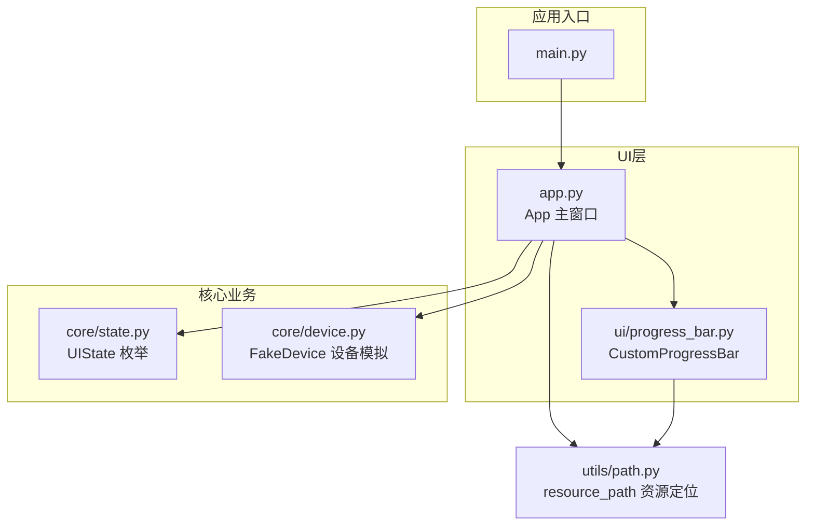
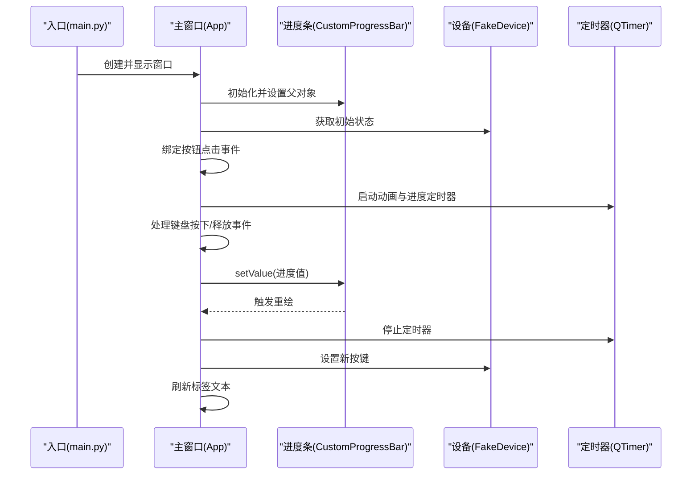
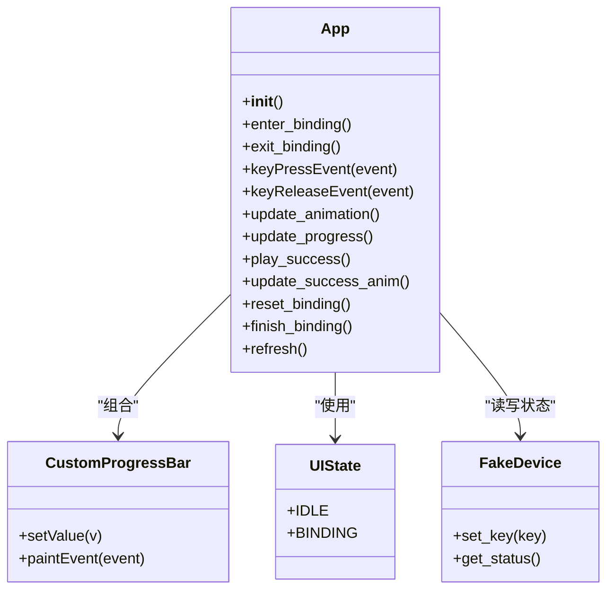
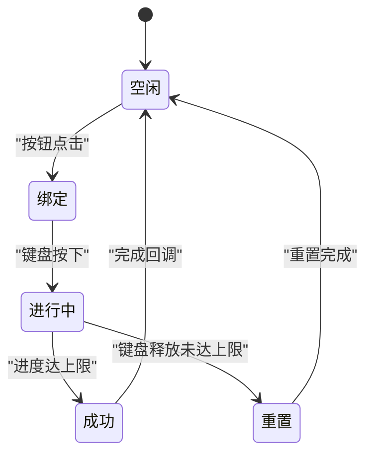
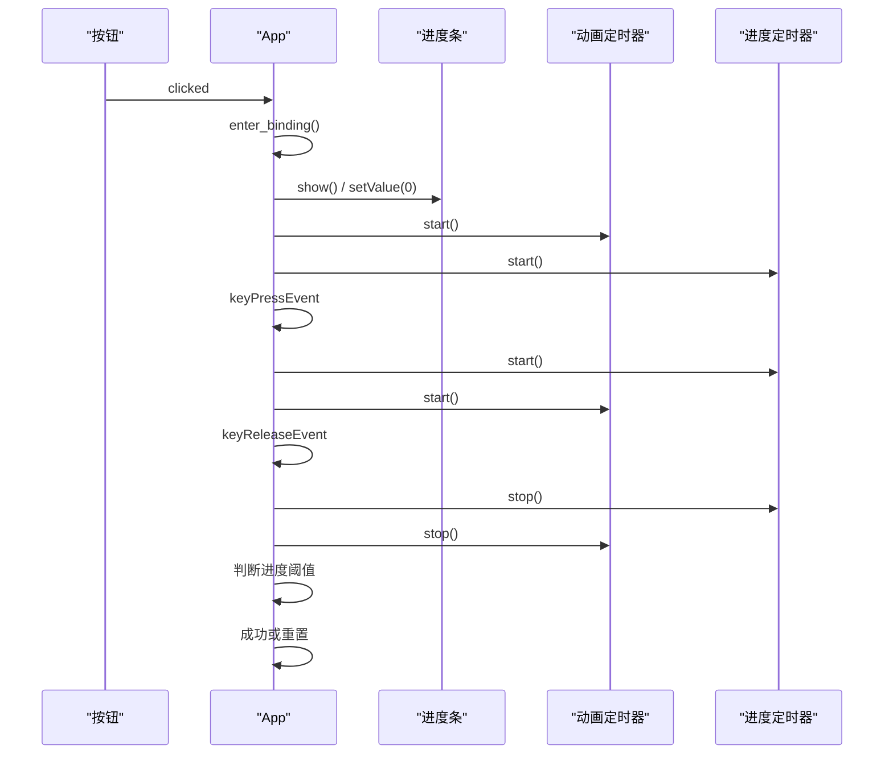
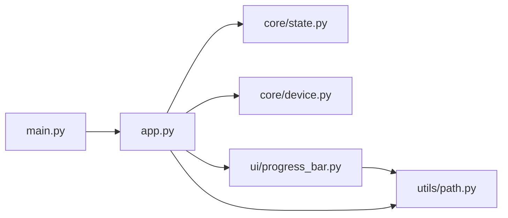

# 用户界面组件

<cite>
**本文引用的文件**
- [controller/app.py](file://controller/app.py)
- [controller/ui/progress_bar.py](file://controller/ui/progress_bar.py)
- [controller/main.py](file://controller/main.py)
- [controller/core/state.py](file://controller/core/state.py)
- [controller/core/device.py](file://controller/core/device.py)
- [controller/utils/path.py](file://controller/utils/path.py)
</cite>

## 目录
1. [简介](#简介)
2. [项目结构](#项目结构)
3. [核心组件](#核心组件)
4. [架构总览](#架构总览)
5. [详细组件分析](#详细组件分析)
6. [依赖分析](#依赖分析)
7. [性能考虑](#性能考虑)
8. [故障排查指南](#故障排查指南)
9. [结论](#结论)
10. [附录](#附录)

## 简介
本文件聚焦于用户界面组件的技术实现，系统性解析应用主窗口类的设计架构、布局组织与事件处理机制；深入剖析自定义进度条组件的绘制与动画联动；梳理UI状态管理与核心业务数据绑定的同步策略；并提供可扩展的使用示例与定制指南，以及响应式设计与用户体验优化建议。目标是帮助开发者快速理解并高效扩展该UI子系统。

## 项目结构
该项目采用“功能分层 + 文件按职责划分”的组织方式：
- 入口程序负责初始化应用与主窗口展示
- 主窗口类集中管理UI布局、状态机与事件流
- 自定义UI组件封装特定绘制与交互行为
- 核心业务模块提供设备状态与状态枚举
- 资源路径工具统一资源定位

图表来源
- [controller/main.py:1-8](file://controller/main.py#L1-L8)
- [controller/app.py:1-202](file://controller/app.py#L1-L202)
- [controller/ui/progress_bar.py:1-28](file://controller/ui/progress_bar.py#L1-L28)
- [controller/core/state.py:1-3](file://controller/core/state.py#L1-L3)
- [controller/core/device.py:1-11](file://controller/core/device.py#L1-L11)
- [controller/utils/path.py:1-10](file://controller/utils/path.py#L1-L10)

章节来源
- [controller/main.py:1-8](file://controller/main.py#L1-L8)
- [controller/app.py:1-202](file://controller/app.py#L1-L202)
- [controller/ui/progress_bar.py:1-28](file://controller/ui/progress_bar.py#L1-L28)
- [controller/core/state.py:1-3](file://controller/core/state.py#L1-L3)
- [controller/core/device.py:1-11](file://controller/core/device.py#L1-L11)
- [controller/utils/path.py:1-10](file://controller/utils/path.py#L1-L10)

## 核心组件
- App 主窗口类：负责窗口初始化、静态控件布局、状态切换、键盘事件处理、动画与进度联动、成功动画播放与完成回调、设备状态刷新等。
- CustomProgressBar 自定义进度条：基于QWidget重绘实现，支持背景与填充图层裁剪绘制，动态显示进度值。
- UIState 状态枚举：定义空闲与绑定两种UI状态，用于控制界面元素可见性与交互行为。
- FakeDevice 设备模拟：提供电池电量与当前按键的读写接口，作为UI状态的数据来源。
- resource_path 资源定位：兼容打包运行环境的资源路径拼接工具。

章节来源
- [controller/app.py:12-202](file://controller/app.py#L12-L202)
- [controller/ui/progress_bar.py:5-28](file://controller/ui/progress_bar.py#L5-L28)
- [controller/core/state.py:1-3](file://controller/core/state.py#L1-L3)
- [controller/core/device.py:1-11](file://controller/core/device.py#L1-L11)
- [controller/utils/path.py:4-10](file://controller/utils/path.py#L4-L10)

## 架构总览
应用启动后，入口程序创建应用实例并展示主窗口；主窗口内部组合多个UI控件与自定义组件，并通过定时器驱动动画与进度更新；键盘事件触发绑定流程，进度条与精灵动画协同反馈用户操作；成功完成后刷新设备状态并回到空闲态。

图表来源
- [controller/main.py:5-8](file://controller/main.py#L5-L8)
- [controller/app.py:42-75](file://controller/app.py#L42-L75)
- [controller/app.py:113-161](file://controller/app.py#L113-L161)
- [controller/ui/progress_bar.py:15-28](file://controller/ui/progress_bar.py#L15-L28)
- [controller/core/device.py:6-11](file://controller/core/device.py#L6-L11)

## 详细组件分析

### App 主窗口类设计与事件处理
- 窗口基础
  - 标题与固定尺寸，启用强焦点以接收键盘事件。
- 控件组织
  - 状态标签、电量标签、按键标签、修改按键按钮、提示标签、进度条、精灵标签。
  - 预加载行走帧与消失帧资源，便于动画播放。
- 状态机
  - 使用UIState枚举区分空闲(IDLE)与绑定(BINDING)状态，控制控件显隐与交互。
- 事件处理
  - 按钮点击进入绑定态，隐藏按键与按钮，显示提示、进度与精灵。
  - 键盘按下：重置进度值，启动动画与进度定时器。
  - 键盘释放：停止定时器，若进度达到阈值则播放成功动画，否则重置绑定。
- 动画与进度联动
  - 动画定时器按固定间隔轮换精灵帧。
  - 进度定时器按固定步进递增，同时根据进度计算精灵X坐标，实现“跟随”效果。
  - 进度达上限自动停止定时器并播放成功动画。
- 成功动画与完成
  - 成功动画按序列帧播放消失效果，结束后调用完成回调，刷新设备状态并回到空闲态。
- 数据刷新
  - 从设备读取状态并更新电量与按键标签。

图表来源
- [controller/app.py:12-202](file://controller/app.py#L12-L202)
- [controller/ui/progress_bar.py:5-28](file://controller/ui/progress_bar.py#L5-L28)
- [controller/core/state.py:1-3](file://controller/core/state.py#L1-L3)
- [controller/core/device.py:1-11](file://controller/core/device.py#L1-L11)

章节来源
- [controller/app.py:12-202](file://controller/app.py#L12-L202)
- [controller/core/state.py:1-3](file://controller/core/state.py#L1-L3)
- [controller/core/device.py:1-11](file://controller/core/device.py#L1-L11)

### CustomProgressBar 自定义进度条组件
- 组件特性
  - 继承自QWidget，自定义绘制背景与填充层。
  - 通过setValue设置进度值并触发重绘。
  - 在paintEvent中先绘制背景，再按比例裁剪填充图层并绘制。
- 渐进式更新
  - 进度值按固定步进递增，配合定时器实现平滑动画。
  - 通过计算进度比例确定填充宽度，实现渐进式填充。
- 视觉反馈
  - 背景与填充使用独立资源，支持主题化替换。
  - 尺寸固定，便于在布局中对齐与定位。

图表来源
- [controller/ui/progress_bar.py:15-28](file://controller/ui/progress_bar.py#L15-L28)

章节来源
- [controller/ui/progress_bar.py:5-28](file://controller/ui/progress_bar.py#L5-L28)

### UI 组件的状态管理与数据绑定
- 状态枚举
  - UIState提供IDLE与BINDING两个状态，用于控制界面元素可见性与交互。
- 状态切换
  - 进入绑定态：隐藏按键与按钮，显示提示、进度与精灵，重置进度值与精灵帧。
  - 退出绑定态：隐藏进度与精灵，恢复按键与按钮，清空进度。
- 数据绑定
  - 设备状态通过设备接口读取，主窗口刷新标签文本，形成单向数据流。
  - 绑定完成后，将按键名称写回设备，随后再次刷新。
- 状态同步
  - 键盘事件与定时器驱动的进度更新与动画播放，均受状态机约束，确保在非绑定态不执行绑定逻辑。

图表来源
- [controller/app.py:77-111](file://controller/app.py#L77-L111)
- [controller/app.py:148-161](file://controller/app.py#L148-L161)
- [controller/core/state.py:1-3](file://controller/core/state.py#L1-L3)

章节来源
- [controller/app.py:77-111](file://controller/app.py#L77-L111)
- [controller/app.py:148-161](file://controller/app.py#L148-L161)
- [controller/core/state.py:1-3](file://controller/core/state.py#L1-L3)

### 组件间通信与事件传播
- 事件来源
  - 用户交互：按钮点击、键盘按键。
  - 定时器：动画定时器与进度定时器。
- 事件流向
  - 按钮点击 -> 进入绑定态 -> 显示进度与精灵 -> 启动定时器。
  - 键盘按下 -> 重置进度值 -> 启动动画与进度定时器。
  - 键盘释放 -> 停止定时器 -> 判断进度阈值 -> 成功或重置。
  - 成功动画结束 -> 完成绑定 -> 刷新设备状态 -> 回到空闲态。
- 事件约束
  - 非绑定态忽略键盘事件与进度更新。
  - 自动重复按键被过滤，避免误触。

图表来源
- [controller/app.py:34-36](file://controller/app.py#L34-L36)
- [controller/app.py:77-99](file://controller/app.py#L77-L99)
- [controller/app.py:113-137](file://controller/app.py#L113-L137)
- [controller/app.py:148-161](file://controller/app.py#L148-L161)

章节来源
- [controller/app.py:34-36](file://controller/app.py#L34-L36)
- [controller/app.py:77-99](file://controller/app.py#L77-L99)
- [controller/app.py:113-137](file://controller/app.py#L113-L137)
- [controller/app.py:148-161](file://controller/app.py#L148-L161)

## 依赖分析
- 模块耦合
  - App 依赖 UIState、FakeDevice、CustomProgressBar、resource_path。
  - CustomProgressBar 依赖 resource_path 与绘制API。
  - main 仅依赖 App，保持入口简洁。
- 外部依赖
  - PySide6：Qt GUI框架，提供窗口、控件、事件与绘图能力。
- 可能的循环依赖
  - 当前结构无循环导入，模块职责清晰。

图表来源
- [controller/main.py:1-8](file://controller/main.py#L1-L8)
- [controller/app.py:1-202](file://controller/app.py#L1-L202)
- [controller/ui/progress_bar.py:1-28](file://controller/ui/progress_bar.py#L1-L28)
- [controller/core/state.py:1-3](file://controller/core/state.py#L1-L3)
- [controller/core/device.py:1-11](file://controller/core/device.py#L1-L11)
- [controller/utils/path.py:1-10](file://controller/utils/path.py#L1-L10)

章节来源
- [controller/main.py:1-8](file://controller/main.py#L1-L8)
- [controller/app.py:1-202](file://controller/app.py#L1-L202)
- [controller/ui/progress_bar.py:1-28](file://controller/ui/progress_bar.py#L1-L28)
- [controller/core/state.py:1-3](file://controller/core/state.py#L1-L3)
- [controller/core/device.py:1-11](file://controller/core/device.py#L1-L11)
- [controller/utils/path.py:1-10](file://controller/utils/path.py#L1-L10)

## 性能考虑
- 定时器频率
  - 动画定时器与进度定时器的间隔需平衡流畅度与CPU占用，当前配置已较为轻量。
- 绘制开销
  - 自定义绘制仅涉及背景与裁剪填充，开销较小；建议避免在绘制中进行复杂计算。
- 资源加载
  - 资源在初始化阶段预加载，减少运行时IO；注意资源尺寸与格式以降低内存占用。
- 事件过滤
  - 对自动重复按键进行过滤，避免重复触发进度更新。

## 故障排查指南
- 进度条不显示
  - 检查资源路径是否正确，确认资源文件存在且路径拼接无误。
  - 确认进度条已设置父对象并处于可见状态。
- 动画不播放
  - 检查定时器是否启动，确认状态为绑定态。
  - 确认精灵帧资源已正确加载。
- 键盘事件无效
  - 确认窗口获得焦点，检查状态机是否处于绑定态。
  - 排查自动重复事件过滤逻辑。
- 绑定未完成
  - 检查进度阈值与定时器停止条件，确认成功动画播放流程。
  - 确认完成回调后设备状态刷新与UI回到空闲态。

章节来源
- [controller/app.py:77-111](file://controller/app.py#L77-L111)
- [controller/app.py:148-161](file://controller/app.py#L148-L161)
- [controller/ui/progress_bar.py:15-28](file://controller/ui/progress_bar.py#L15-L28)
- [controller/utils/path.py:4-10](file://controller/utils/path.py#L4-L10)

## 结论
该UI子系统通过清晰的状态机与事件驱动机制，实现了按键绑定流程的可视化反馈。主窗口类承担了布局、状态与事件的中枢角色，自定义进度条提供了可复用的视觉组件。整体架构简洁、职责明确，具备良好的扩展性与可维护性。

## 附录

### 使用示例与自定义扩展指南
- 在现有基础上添加新状态
  - 在UIState中新增状态常量，并在主窗口中增加对应的状态切换逻辑与控件显隐。
- 扩展进度条样式
  - 替换背景与填充资源，或在paintEvent中增加额外绘制元素（如边框、数值文本）。
- 增加新的输入方式
  - 在键盘事件之外接入其他输入源（如鼠标拖拽），在状态机约束下实现一致的交互体验。
- 优化动画
  - 调整定时器间隔与步进值，或引入缓动函数以改善视觉过渡。
- 数据绑定增强
  - 将设备状态改为双向绑定，支持UI直接修改并回写设备，同时增加错误处理与重试机制。

### 响应式设计与用户体验优化
- 尺寸与布局
  - 使用固定尺寸窗口保证元素对齐一致性；在需要时可改为可调整大小并配合布局管理器。
- 反馈及时性
  - 缩短动画与进度更新的延迟，确保用户操作得到即时响应。
- 可访问性
  - 提供键盘快捷键与焦点导航，确保在无鼠标的环境下也能完成操作。
- 错误与重试
  - 在绑定失败时提供明确提示与重试入口，避免长时间无响应。