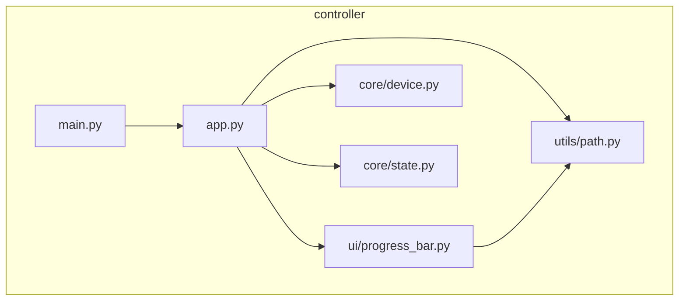
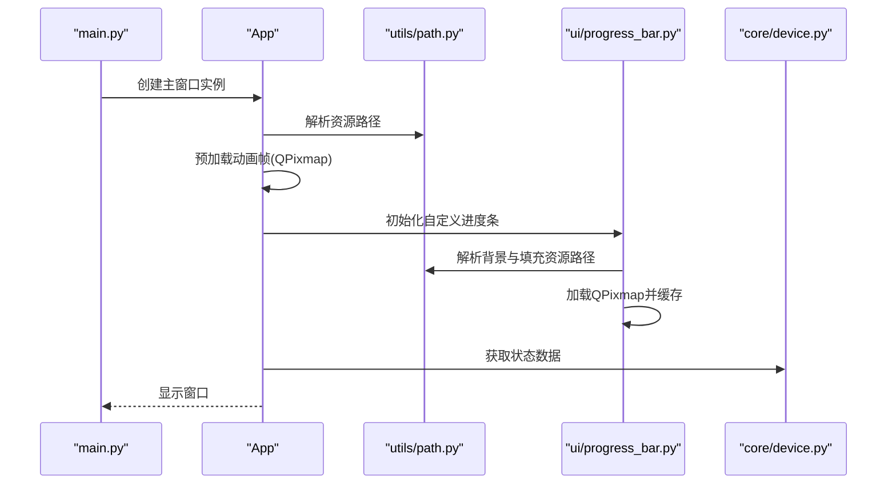
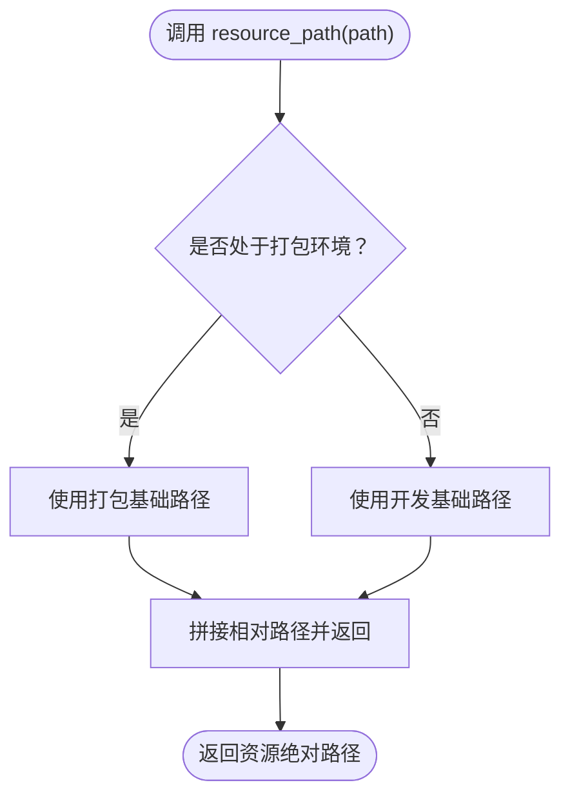
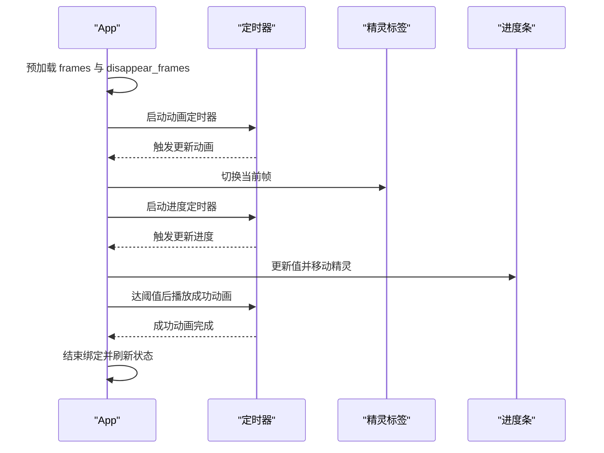
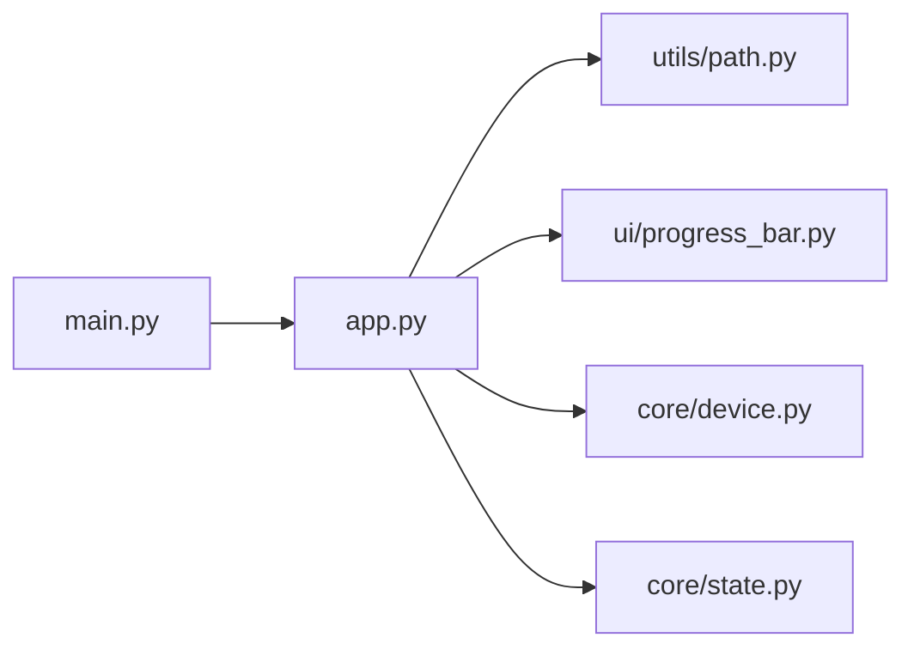

# 资源管理

<cite>
**本文引用的文件**
- [controller/utils/path.py](file://controller/utils/path.py)
- [controller/app.py](file://controller/app.py)
- [controller/ui/progress_bar.py](file://controller/ui/progress_bar.py)
- [controller/core/device.py](file://controller/core/device.py)
- [controller/core/state.py](file://controller/core/state.py)
- [controller/main.py](file://controller/main.py)
- [.gitignore](file://.gitignore)
- [README.md](file://README.md)
</cite>

## 目录
1. [简介](#简介)
2. [项目结构](#项目结构)
3. [核心组件](#核心组件)
4. [架构总览](#架构总览)
5. [详细组件分析](#详细组件分析)
6. [依赖分析](#依赖分析)
7. [性能考虑](#性能考虑)
8. [故障排查指南](#故障排查指南)
9. [结论](#结论)
10. [附录](#附录)

## 简介
本文件面向资源管理系统的技术文档，聚焦于资源路径解析工具的设计与实现，覆盖跨平台资源处理、PyInstaller 打包支持与动态资源加载机制；同时对资源文件的组织结构与命名规范进行说明，并给出缓存机制、性能优化、最佳实践与常见问题解决方案，以及资源版本管理与更新机制的建议。

## 项目结构
该项目采用模块化分层组织：
- controller/utils：通用工具模块，包含资源路径解析函数
- controller/core：核心业务逻辑，包含设备模拟与UI状态
- controller/ui：界面组件，包含自定义进度条等
- controller：应用入口与主窗口
- board：硬件相关示例（Arduino 源码），与资源管理无关
- 根目录：版本控制与构建忽略规则



图表来源
- [controller/main.py:1-8](file://controller/main.py#L1-L8)
- [controller/app.py:1-202](file://controller/app.py#L1-L202)
- [controller/ui/progress_bar.py:1-28](file://controller/ui/progress_bar.py#L1-L28)
- [controller/utils/path.py:1-10](file://controller/utils/path.py#L1-L10)
- [controller/core/device.py:1-11](file://controller/core/device.py#L1-L11)
- [controller/core/state.py:1-3](file://controller/core/state.py#L1-L3)

章节来源
- [controller/main.py:1-8](file://controller/main.py#L1-L8)
- [controller/app.py:1-202](file://controller/app.py#L1-L202)
- [controller/ui/progress_bar.py:1-28](file://controller/ui/progress_bar.py#L1-L28)
- [controller/utils/path.py:1-10](file://controller/utils/path.py#L1-L10)
- [controller/core/device.py:1-11](file://controller/core/device.py#L1-L11)
- [controller/core/state.py:1-3](file://controller/core/state.py#L1-L3)

## 核心组件
- 资源路径解析工具：提供跨平台资源定位能力，兼容开发环境与 PyInstaller 打包后的运行时
- 应用主窗口：负责资源预加载、动画与交互流程控制
- 自定义进度条：演示资源加载与绘制流程
- 设备模拟与状态：为UI提供数据支撑
- 应用入口：启动Qt应用与主窗口

章节来源
- [controller/utils/path.py:1-10](file://controller/utils/path.py#L1-L10)
- [controller/app.py:1-202](file://controller/app.py#L1-L202)
- [controller/ui/progress_bar.py:1-28](file://controller/ui/progress_bar.py#L1-L28)
- [controller/core/device.py:1-11](file://controller/core/device.py#L1-L11)
- [controller/core/state.py:1-3](file://controller/core/state.py#L1-L3)
- [controller/main.py:1-8](file://controller/main.py#L1-L8)

## 架构总览
资源管理在本项目中的职责是：
- 统一资源路径解析，确保开发与打包后的一致性
- 在UI组件中按需加载图像资源，避免重复加载
- 通过定时器驱动动画帧切换，保证流畅度



图表来源
- [controller/main.py:1-8](file://controller/main.py#L1-L8)
- [controller/app.py:51-60](file://controller/app.py#L51-L60)
- [controller/app.py:47-60](file://controller/app.py#L47-L60)
- [controller/ui/progress_bar.py:10-11](file://controller/ui/progress_bar.py#L10-L11)
- [controller/utils/path.py:4-10](file://controller/utils/path.py#L4-L10)
- [controller/core/device.py:10](file://controller/core/device.py#L10)

## 详细组件分析

### 资源路径解析工具
- 设计目标
  - 兼容开发环境与PyInstaller打包后的运行时
  - 提供统一的相对路径解析接口，屏蔽平台差异
- 实现要点
  - 通过检测运行时是否具备特定属性标识打包环境，选择不同的基础路径
  - 将相对路径拼接为可直接用于Qt资源加载的绝对路径
- 复杂度
  - 时间复杂度：O(1)，空间复杂度：O(1)
- 可扩展性
  - 可在该函数内增加更多打包工具的判断分支
  - 可引入资源清单与哈希校验以增强版本管理能力



图表来源
- [controller/utils/path.py:4-10](file://controller/utils/path.py#L4-L10)

章节来源
- [controller/utils/path.py:1-10](file://controller/utils/path.py#L1-L10)

### 应用主窗口（资源加载与动画）
- 资源加载策略
  - 在初始化阶段集中预加载动画帧与效果帧，避免运行时频繁IO
  - 使用缓存的QPixmap对象，减少重复解码开销
- 动画与交互
  - 通过定时器驱动帧切换与进度推进，保持UI响应
  - 在成功状态下播放消失动画序列
- 性能考量
  - 预加载与缓存显著降低渲染抖动
  - 合理设置定时器间隔，平衡流畅度与CPU占用



图表来源
- [controller/app.py:51-60](file://controller/app.py#L51-L60)
- [controller/app.py:140-161](file://controller/app.py#L140-L161)
- [controller/app.py:164-176](file://controller/app.py#L164-L176)
- [controller/app.py:199-202](file://controller/app.py#L199-L202)

章节来源
- [controller/app.py:1-202](file://controller/app.py#L1-L202)

### 自定义进度条（资源加载与绘制）
- 资源加载
  - 在构造函数中加载背景与填充资源，分别缓存为QPixmap
  - 通过setValue更新进度并触发重绘
- 绘制逻辑
  - 先绘制背景，再按比例裁剪填充图元并绘制，避免全量拷贝
- 性能优化
  - 仅在需要时裁剪与绘制，减少不必要的像素操作

```mermaid
classDiagram
class CustomProgressBar {
+int value
+QPixmap bg
+QPixmap fill
+setValue(v)
+paintEvent(event)
}
CustomProgressBar --> "使用" utils/path.resource_path : "解析资源路径"
```

图表来源
- [controller/ui/progress_bar.py:1-28](file://controller/ui/progress_bar.py#L1-L28)
- [controller/utils/path.py:4-10](file://controller/utils/path.py#L4-L10)

章节来源
- [controller/ui/progress_bar.py:1-28](file://controller/ui/progress_bar.py#L1-L28)

### 设备模拟与状态
- 设备模拟类提供电池与按键状态，供UI刷新显示
- 状态枚举用于控制UI行为与动画切换

章节来源
- [controller/core/device.py:1-11](file://controller/core/device.py#L1-L11)
- [controller/core/state.py:1-3](file://controller/core/state.py#L1-L3)

### 应用入口
- 启动Qt应用与主窗口，展示UI

章节来源
- [controller/main.py:1-8](file://controller/main.py#L1-L8)

## 依赖分析
- 模块耦合
  - App依赖utils/path进行资源路径解析
  - App依赖ui/progress_bar进行UI绘制
  - App依赖core/device与core/state提供数据与状态
- 外部依赖
  - PySide6：用于GUI与图像资源加载
  - sys/os：用于运行时判断与路径拼接



图表来源
- [controller/main.py:1-8](file://controller/main.py#L1-L8)
- [controller/app.py:1-9](file://controller/app.py#L1-L9)
- [controller/ui/progress_bar.py:1-3](file://controller/ui/progress_bar.py#L1-L3)
- [controller/core/device.py:1-11](file://controller/core/device.py#L1-L11)
- [controller/core/state.py:1-3](file://controller/core/state.py#L1-L3)

章节来源
- [controller/main.py:1-8](file://controller/main.py#L1-L8)
- [controller/app.py:1-9](file://controller/app.py#L1-L9)
- [controller/ui/progress_bar.py:1-3](file://controller/ui/progress_bar.py#L1-L3)
- [controller/core/device.py:1-11](file://controller/core/device.py#L1-L11)
- [controller/core/state.py:1-3](file://controller/core/state.py#L1-L3)

## 性能考虑
- 预加载与缓存
  - 在初始化阶段一次性加载所有动画帧，避免运行时IO与重复解码
  - 缓存QPixmap对象，减少内存与CPU开销
- 渲染优化
  - 自定义进度条仅按比例裁剪并绘制填充部分，避免全量拷贝
  - 合理设置定时器间隔，兼顾流畅度与系统负载
- 资源组织
  - 图像资源按功能分组（walk系列、disappear系列、进度条背景与填充），便于维护与扩展
- 版本管理建议
  - 为资源文件添加版本号或哈希，结合资源路径解析工具实现版本感知与自动更新
  - 在打包时固定资源清单，确保发布一致性

## 故障排查指南
- 资源路径错误
  - 症状：图像无法显示或加载失败
  - 排查：确认资源路径是否正确，开发与打包环境下的基础路径是否一致
  - 参考：资源路径解析函数的实现与调用点
- 打包后资源缺失
  - 症状：打包后程序无法找到资源
  - 排查：确认资源文件是否随程序一起打包，PyInstaller是否正确收集资源
  - 参考：打包忽略规则与资源路径解析逻辑
- 动画卡顿
  - 症状：动画不流畅
  - 排查：检查定时器间隔设置、帧数与图像尺寸是否过大
  - 参考：动画与进度定时器的启动与停止逻辑
- 进度条绘制异常
  - 症状：进度条不显示或显示不完整
  - 排查：确认背景与填充资源是否正确加载，裁剪宽度计算是否合理
  - 参考：进度条绘制逻辑

章节来源
- [controller/utils/path.py:4-10](file://controller/utils/path.py#L4-L10)
- [.gitignore:34-38](file://.gitignore#L34-L38)
- [controller/app.py:140-161](file://controller/app.py#L140-L161)
- [controller/ui/progress_bar.py:19-28](file://controller/ui/progress_bar.py#L19-L28)

## 结论
本项目通过统一的资源路径解析工具与预加载缓存策略，实现了跨平台与打包环境的一致性与高性能。资源文件组织清晰，命名规范明确，配合定时器驱动的动画与绘制逻辑，提供了良好的用户体验。建议在后续迭代中引入资源版本管理与自动更新机制，进一步提升可维护性与可扩展性。

## 附录

### 资源文件组织结构与命名规范
- 图像资源
  - 动画帧：walk1.png、walk2.png、walk3.png、walk4.png
  - 特效帧：disappear1.png、disappear2.png
  - 进度条：bar_bg.png、bar_fill.png
- 命名规范
  - 使用语义化前缀区分功能（walk、disappear、bar_）
  - 文件名小写，单词间使用下划线分隔
  - 保持分辨率与格式一致，便于统一渲染
- 存放位置
  - assets 目录下按功能子目录组织（当前仓库未包含实际资源文件）

章节来源
- [controller/app.py:51-60](file://controller/app.py#L51-L60)
- [controller/ui/progress_bar.py:10-11](file://controller/ui/progress_bar.py#L10-L11)

### 跨平台资源处理与PyInstaller打包支持
- 跨平台路径
  - 通过统一的资源路径解析函数屏蔽平台差异
- 打包支持
  - 识别打包环境，选择正确的基础路径
  - 确保资源文件随程序一起打包，避免运行时找不到资源

章节来源
- [controller/utils/path.py:4-10](file://controller/utils/path.py#L4-L10)
- [.gitignore:34-38](file://.gitignore#L34-L38)

### 动态资源加载机制
- 预加载策略
  - 在初始化阶段集中加载，避免运行时IO
- 运行时切换
  - 通过定时器驱动帧切换，保证流畅度
- 资源复用
  - 缓存QPixmap对象，减少重复解码与内存分配

章节来源
- [controller/app.py:51-60](file://controller/app.py#L51-L60)
- [controller/app.py:140-161](file://controller/app.py#L140-L161)

### 资源版本管理与更新机制建议
- 版本标识
  - 为资源文件添加版本号或哈希，结合资源路径解析工具实现版本感知
- 自动更新
  - 在应用启动时检查资源版本，必要时提示用户更新或自动下载新版本
- 发布一致性
  - 在打包时固定资源清单，确保不同环境下的资源一致性

[本节为概念性建议，不直接分析具体文件]