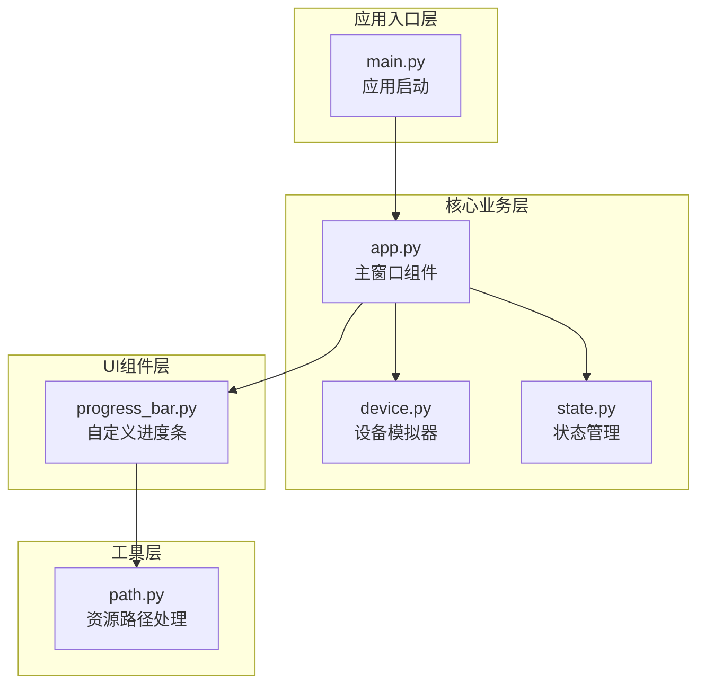
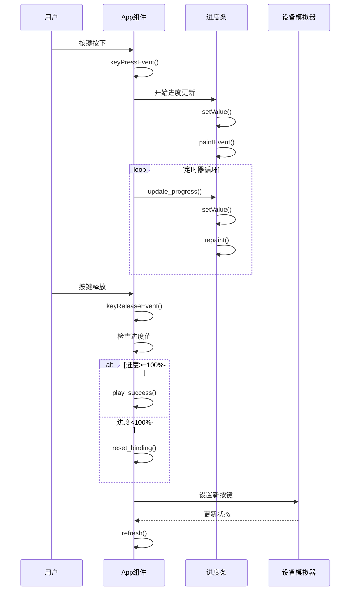
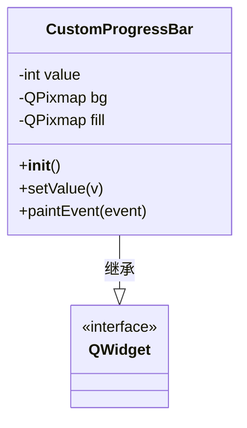
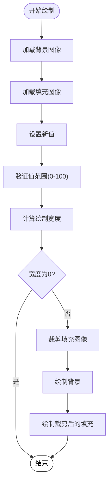
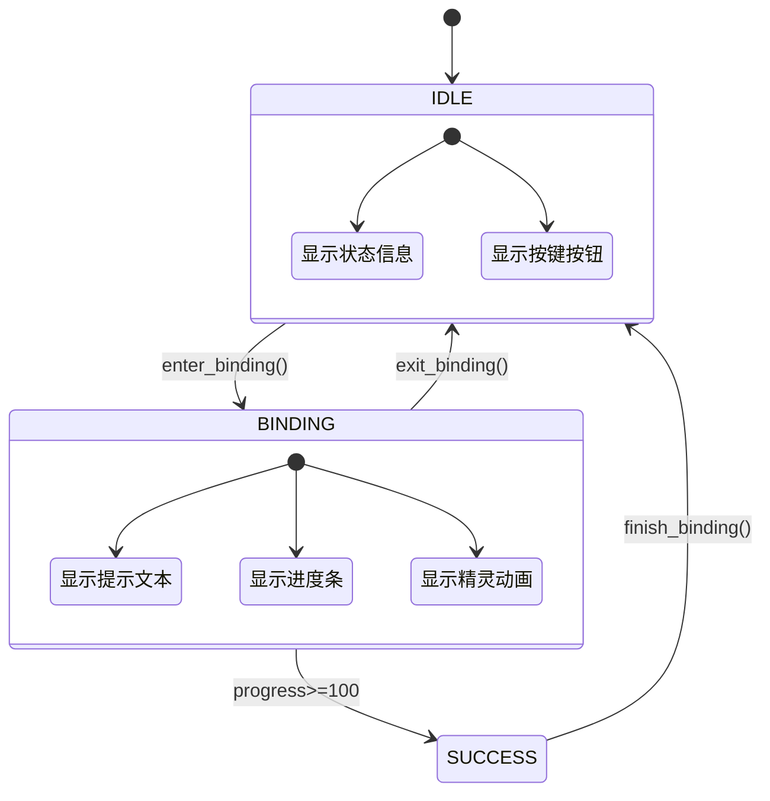
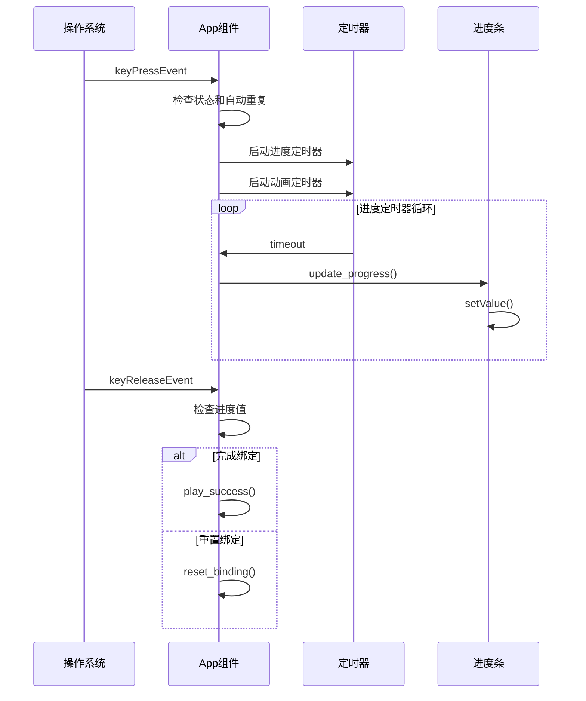
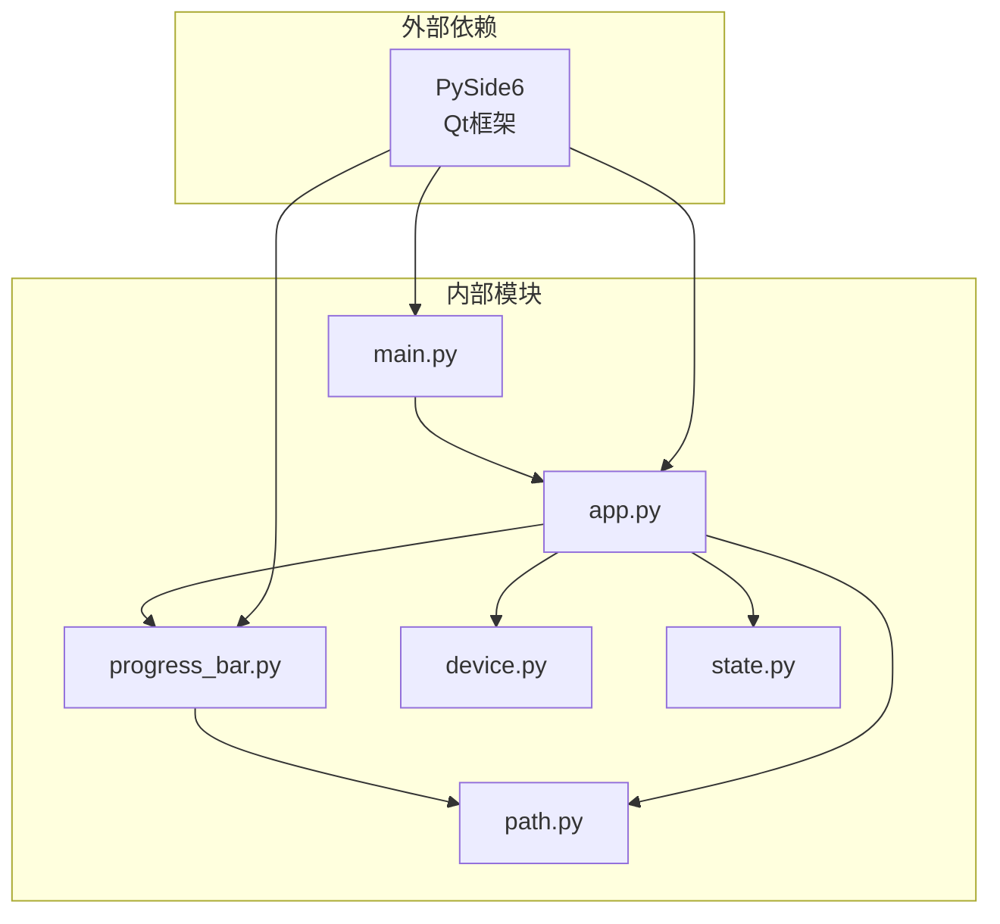
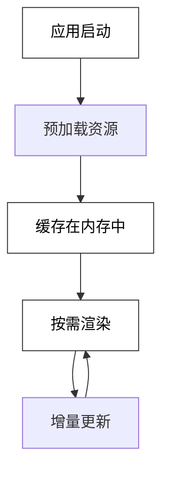

# 用户界面组件

<cite>
**本文档引用的文件**
- [progress_bar.py](file://controller/ui/progress_bar.py)
- [app.py](file://controller/app.py)
- [main.py](file://controller/main.py)
- [device.py](file://controller/core/device.py)
- [state.py](file://controller/core/state.py)
- [path.py](file://controller/utils/path.py)
</cite>

## 目录
1. [简介](#简介)
2. [项目结构](#项目结构)
3. [核心组件](#核心组件)
4. [架构概览](#架构概览)
5. [详细组件分析](#详细组件分析)
6. [依赖分析](#依赖分析)
7. [性能考虑](#性能考虑)
8. [故障排除指南](#故障排除指南)
9. [结论](#结论)

## 简介

本项目是一个基于PySide6的无线键盘控制器应用程序，专注于演示自定义用户界面组件的实现。项目采用模块化架构设计，将UI组件与业务逻辑分离，提供了完整的用户交互体验，包括按键绑定、进度显示和动画效果。

该应用程序的核心特色是实现了自定义进度条组件CustomProgressBar，它通过QPixmap的裁剪和绘制技术实现了渐进式的视觉反馈效果。整个UI系统遵循响应式设计原则，确保在不同平台上的一致性和可用性。

## 项目结构

项目采用清晰的分层架构，将功能模块按照职责进行分离：

**图表来源**
- [main.py:1-8](file://controller/main.py#L1-L8)
- [app.py:1-202](file://controller/app.py#L1-L202)
- [progress_bar.py:1-28](file://controller/ui/progress_bar.py#L1-L28)

**章节来源**
- [main.py:1-8](file://controller/main.py#L1-L8)
- [app.py:1-202](file://controller/app.py#L1-L202)
- [progress_bar.py:1-28](file://controller/ui/progress_bar.py#L1-L28)

## 核心组件

### 主窗口组件App

主窗口组件是整个应用程序的核心，负责协调所有UI元素和用户交互。它继承自QWidget，实现了完整的状态管理和事件处理机制。

**主要特性：**
- 状态管理模式：通过UIState枚举管理IDLE和BINDING两种状态
- 多定时器系统：分别控制动画和进度更新
- 资源管理系统：预加载动画帧和UI资源
- 事件处理：键盘输入捕获和响应

**章节来源**
- [app.py:12-75](file://controller/app.py#L12-L75)
- [state.py:1-3](file://controller/core/state.py#L1-L3)

### 自定义进度条组件CustomProgressBar

CustomProgressBar是项目中最复杂的UI组件，实现了渐进式的视觉反馈效果。该组件完全自定义绘制，不依赖Qt内置的进度条控件。

**核心设计理念：**
- 分层渲染：背景层和填充层分离
- 动态裁剪：根据当前值动态裁剪填充图像
- 性能优化：使用QPixmap缓存静态资源

**章节来源**
- [progress_bar.py:5-28](file://controller/ui/progress_bar.py#L5-L28)

### 设备模拟器FakeDevice

FakeDevice提供了一个简化的设备接口，用于演示按键绑定和状态管理功能。它模拟了真实的硬件设备行为，包括电池状态和按键配置。

**章节来源**
- [device.py:1-11](file://controller/core/device.py#L1-L11)

## 架构概览

应用程序采用MVC（Model-View-Controller）架构模式，但在此简化版本中，主窗口同时承担了控制器和视图的职责：

**图表来源**
- [app.py:113-161](file://controller/app.py#L113-L161)
- [progress_bar.py:15-17](file://controller/ui/progress_bar.py#L15-L17)

## 详细组件分析

### CustomProgressBar 类分析

CustomProgressBar实现了完整的自定义绘制功能，通过重写paintEvent方法来实现渐进式动画效果。

#### 类结构设计

**图表来源**
- [progress_bar.py:5-28](file://controller/ui/progress_bar.py#L5-L28)

#### 绘制流程分析

进度条的绘制过程包含以下关键步骤：

1. **初始化阶段**：加载背景和填充图像资源
2. **值设置阶段**：验证输入范围并触发重绘
3. **绘制阶段**：先绘制背景，再根据当前值裁剪填充部分

#### 渐进式动画实现

**图表来源**
- [progress_bar.py:19-28](file://controller/ui/progress_bar.py#L19-L28)

**章节来源**
- [progress_bar.py:5-28](file://controller/ui/progress_bar.py#L5-L28)

### App 主窗口组件分析

App组件是整个应用程序的核心控制器，实现了复杂的状态管理和事件处理逻辑。

#### 状态管理机制

**图表来源**
- [app.py:77-111](file://controller/app.py#L77-L111)
- [state.py:1-3](file://controller/core/state.py#L1-L3)

#### 定时器系统设计

应用程序使用了三个独立的定时器来实现不同的功能：

1. **动画定时器**：控制精灵角色的行走动画
2. **进度定时器**：控制按键绑定进度的增加
3. **成功动画定时器**：控制绑定成功的特殊效果

**章节来源**
- [app.py:67-75](file://controller/app.py#L67-L75)
- [app.py:140-177](file://controller/app.py#L140-L177)

### 事件处理机制

应用程序实现了完整的键盘事件处理系统：

**图表来源**
- [app.py:113-138](file://controller/app.py#L113-L138)
- [app.py:148-161](file://controller/app.py#L148-L161)

**章节来源**
- [app.py:113-138](file://controller/app.py#L113-L138)
- [app.py:148-161](file://controller/app.py#L148-L161)

## 依赖分析

项目采用了清晰的依赖关系设计，确保模块间的松耦合：

**图表来源**
- [main.py:1-8](file://controller/main.py#L1-L8)
- [app.py:6-9](file://controller/app.py#L6-L9)
- [progress_bar.py:1-3](file://controller/ui/progress_bar.py#L1-L3)

### 关键依赖关系

1. **UI组件依赖**：CustomProgressBar依赖资源路径工具
2. **业务逻辑依赖**：App组件依赖设备模拟器和状态管理
3. **事件处理依赖**：所有组件都依赖PySide6的事件系统

**章节来源**
- [app.py:6-9](file://controller/app.py#L6-L9)
- [progress_bar.py:1-3](file://controller/ui/progress_bar.py#L1-L3)

## 性能考虑

### 资源管理优化

应用程序采用了多种性能优化策略：

1. **资源预加载**：所有动画帧在初始化时一次性加载
2. **QPixmap缓存**：避免重复的图像解码开销
3. **增量更新**：只在必要时触发重绘操作

### 内存管理

### 定时器性能

应用程序使用了不同频率的定时器来平衡性能和用户体验：
- 动画定时器：150ms间隔，保证流畅的动画效果
- 进度定时器：30ms间隔，提供平滑的进度变化
- 成功动画定时器：100ms间隔，简洁的成功反馈

## 故障排除指南

### 常见问题及解决方案

1. **进度条不显示**
   - 检查资源文件路径是否正确
   - 验证QPixmap对象是否成功加载
   - 确认setValue方法被正确调用

2. **动画不播放**
   - 检查定时器是否正确启动
   - 验证frame_index索引范围
   - 确认sprite标签可见性

3. **按键绑定失败**
   - 检查状态转换逻辑
   - 验证进度值计算准确性
   - 确认设备状态更新

**章节来源**
- [app.py:164-177](file://controller/app.py#L164-L177)
- [progress_bar.py:15-17](file://controller/ui/progress_bar.py#L15-L17)

## 结论

本项目展示了如何使用PySide6构建高质量的桌面应用程序UI组件。通过CustomProgressBar的实现，我们验证了自定义绘制技术在创建独特视觉效果方面的优势。整个应用程序体现了良好的架构设计原则，包括模块化、可扩展性和跨平台兼容性。

项目的主要成就包括：
- 实现了完整的按键绑定工作流程
- 创建了流畅的渐进式动画效果
- 建立了清晰的状态管理机制
- 提供了可扩展的组件架构

这些组件可以作为开发类似桌面应用程序的基础模板，开发者可以根据具体需求进行扩展和定制。