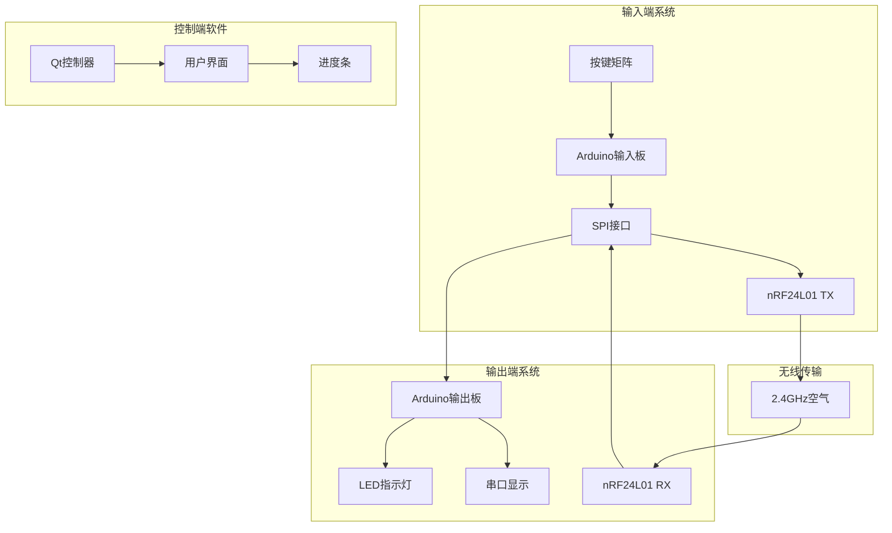
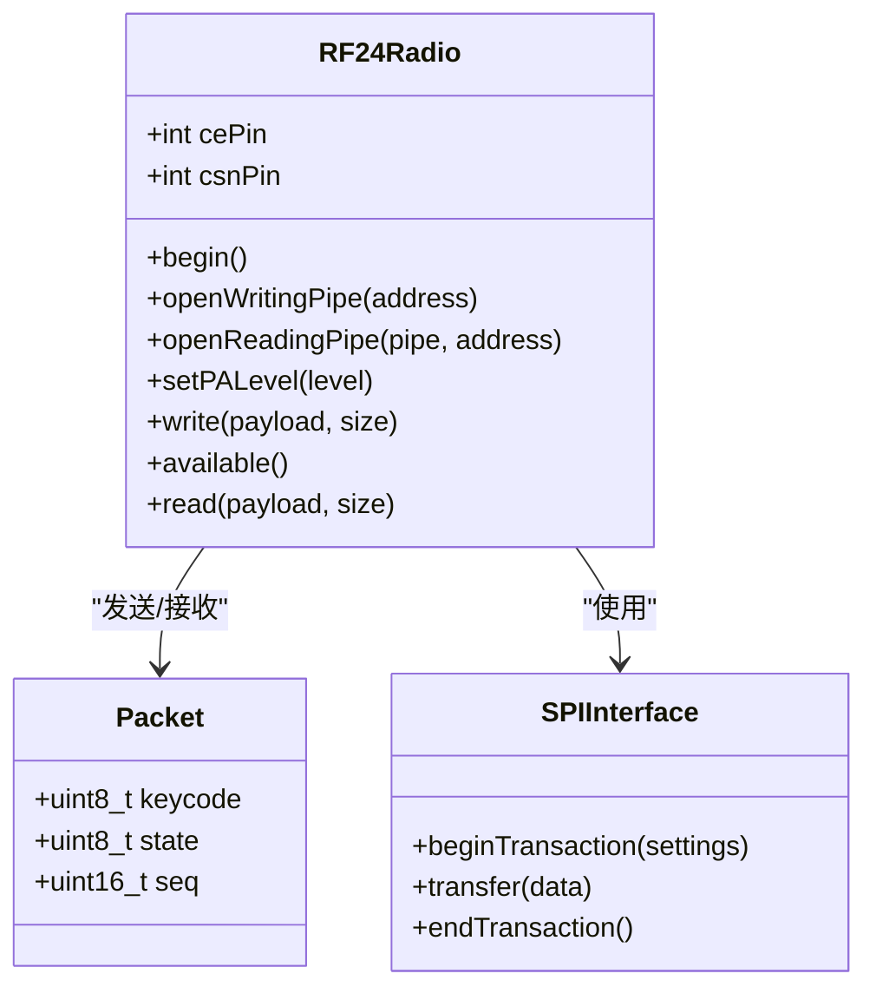
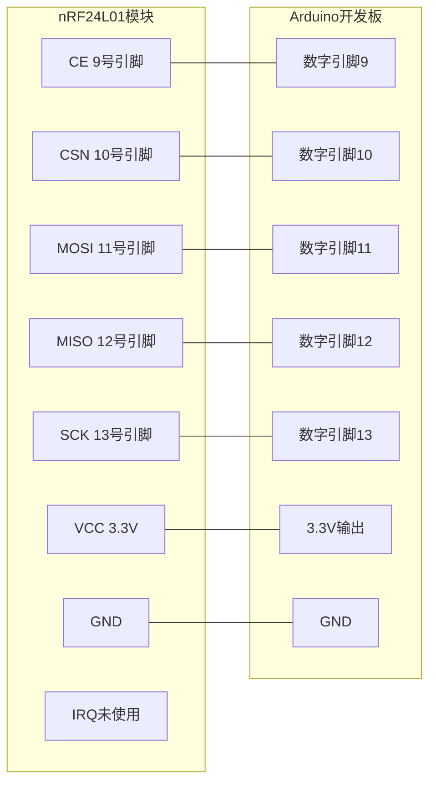
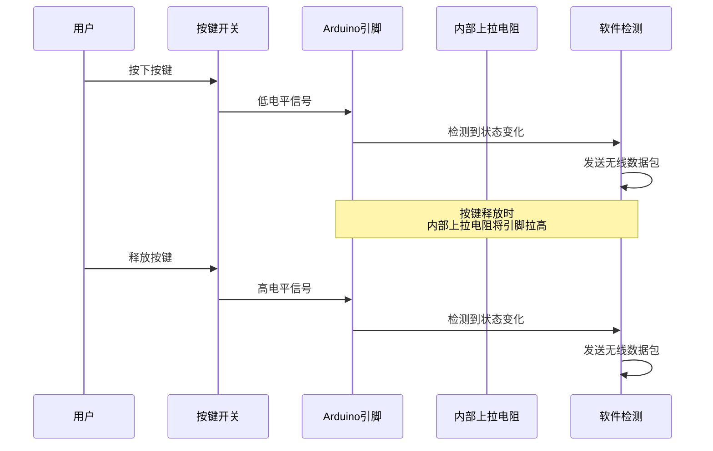
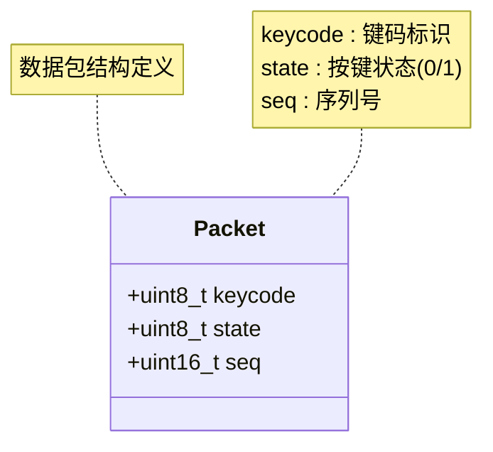
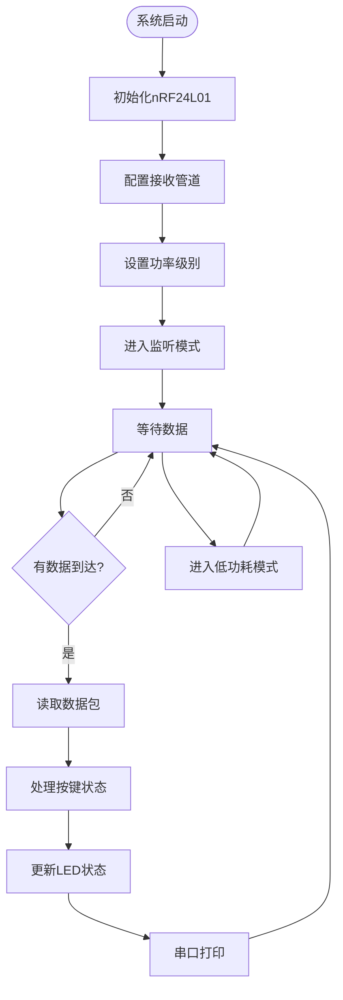
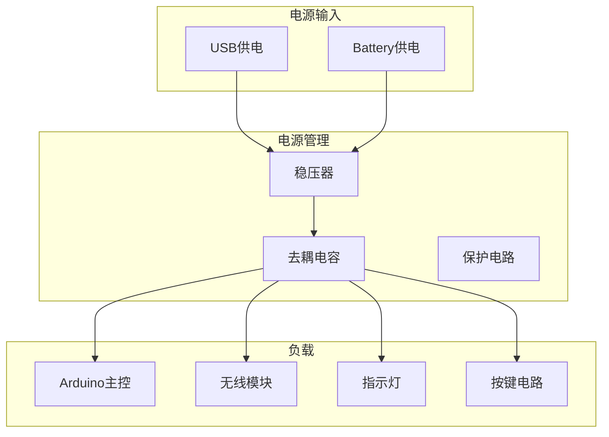
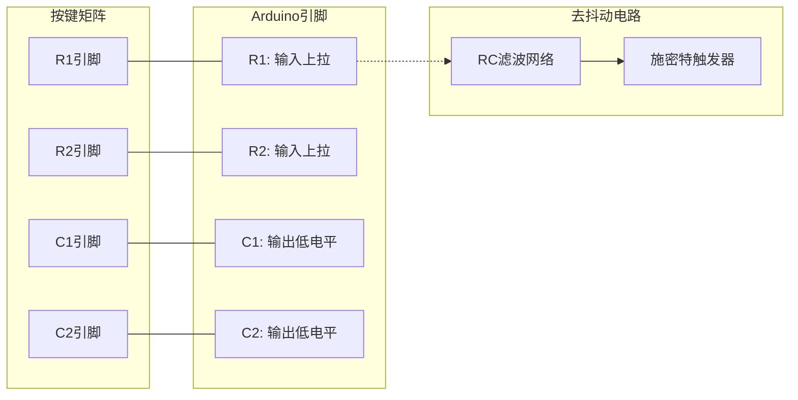
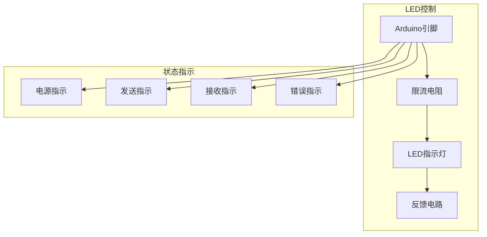
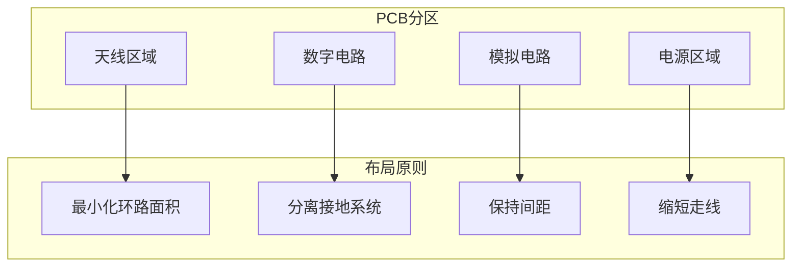

# Arduino硬件架构

<cite>
**本文档引用的文件**
- [README.md](file://README.md)
- [input_1.0.ino](file://board/input_1.0/input_1.0.ino)
- [output_1.0.ino](file://board/output_1.0/output_1.0.ino)
- [.gitignore](file://.gitignore)
- [device.py](file://controller/core/device.py)
- [app.py](file://controller/app.py)
- [progress_bar.py](file://controller/ui/progress_bar.py)
- [state.py](file://controller/core/state.py)
- [path.py](file://controller/utils/path.py)
</cite>

## 目录
1. [项目概述](#项目概述)
2. [系统架构](#系统架构)
3. [核心组件分析](#核心组件分析)
4. [nRF24L01无线模块硬件设计](#nrf24l01无线模块硬件设计)
5. [输入端硬件设计](#输入端硬件设计)
6. [输出端硬件设计](#输出端硬件设计)
7. [供电方案与电源管理](#供电方案与电源管理)
8. [按键矩阵硬件实现](#按键矩阵硬件实现)
9. [LED指示灯控制电路](#led指示灯控制电路)
10. [BOM物料清单](#bom物料清单)
11. [信号完整性与EMC设计](#信号完整性与emc设计)
12. [故障排除指南](#故障排除指南)
13. [结论](#结论)

## 项目概述

本项目是一个基于Arduino的无线键盘玩具系统，采用nRF24L01无线模块实现按键状态的无线传输。系统由两个主要部分组成：输入端（按键发射端）和输出端（按键接收端），通过2.4GHz ISM频段进行数据通信。

该项目展示了嵌入式系统中无线通信、传感器接口和用户界面的综合应用，为学习Arduino硬件设计提供了完整的示例。

## 系统架构

**图表来源**
- [input_1.0.ino:16-35](file://board/input_1.0/input_1.0.ino#L16-L35)
- [output_1.0.ino:19-43](file://board/output_1.0/output_1.0.ino#L19-L43)

## 核心组件分析

### Arduino开发板配置

系统使用标准Arduino开发板作为主控芯片，具备以下关键特性：
- **微控制器**：ATmega328P（典型配置）
- **工作电压**：5V或3.3V可选
- **I/O引脚**：数字I/O 14个（其中6个支持PWM）
- **模拟输入**：6个通道
- **内存**：程序存储器32KB，SRAM 2KB

### nRF24L01无线模块配置

**图表来源**
- [input_1.0.ino:5-12](file://board/input_1.0/input_1.0.ino#L5-L12)
- [output_1.0.ino:7-17](file://board/output_1.0/output_1.0.ino#L7-L17)

**章节来源**
- [input_1.0.ino:1-35](file://board/input_1.0/input_1.0.ino#L1-L35)
- [output_1.0.ino:1-43](file://board/output_1.0/output_1.0.ino#L1-L43)

## nRF24L01无线模块硬件设计

### 物理连接方式

nRF24L01模块通过SPI接口与Arduino连接，采用以下引脚分配：

**图表来源**
- [input_1.0.ino:5](file://board/input_1.0/input_1.0.ino#L5)
- [output_1.0.ino:7](file://board/output_1.0/output_1.0.ino#L7)

### 电源管理设计

nRF24L01模块采用独立的3.3V电源供电，具有以下特点：
- **工作电流**：接收模式约12.5mA，发送模式约15mA
- **休眠模式**：约1.2μA，适合电池供电应用
- **电源去耦**：在VCC和GND之间放置0.1μF陶瓷电容

### 信号完整性优化

为确保无线通信质量，需要特别注意以下设计要点：

1. **PCB布线要求**
   - 射频走线应尽可能短且直
   - 避免在射频路径上放置任何走线或过孔
   - 地平面应完整，避免分割

2. **阻抗控制**
   - 50Ω特性阻抗的微带线设计
   - 每个信号线都有对应的地线回路

3. **屏蔽与隔离**
   - 在nRF24L01周围设置地平面屏蔽
   - 数字信号线与射频线保持足够距离

**章节来源**
- [input_1.0.ino:19-21](file://board/input_1.0/input_1.0.ino#L19-L21)
- [output_1.0.ino:22-25](file://board/output_1.0/output_1.0.ino#L22-L25)

## 输入端硬件设计

### 按键输入电路

输入端采用单按键检测设计，使用内部上拉电阻实现：

**图表来源**
- [output_1.0.ino:19-21](file://board/output_1.0/output_1.0.ino#L19-L21)
- [output_1.0.ino:28-43](file://board/output_1.0/output_1.0.ino#L28-L43)

### 去抖动电路设计

软件去抖动机制通过以下方式实现：
- **采样间隔**：10ms的延迟时间
- **状态比较**：连续两次读取结果一致才认为有效
- **序列号递增**：每次有效按键事件递增计数器

### 数据包格式设计

**图表来源**
- [input_1.0.ino:8-12](file://board/input_1.0/input_1.0.ino#L8-L12)
- [output_1.0.ino:13-17](file://board/output_1.0/output_1.0.ino#L13-L17)

**章节来源**
- [output_1.0.ino:19-43](file://board/output_1.0/output_1.0.ino#L19-L43)

## 输出端硬件设计

### 无线接收电路

输出端负责接收来自输入端的数据并进行处理：

**图表来源**
- [input_1.0.ino:16-35](file://board/input_1.0/input_1.0.ino#L16-L35)

### 串口通信接口

输出端通过串口监视器显示接收到的数据：
- **波特率**：115200 bps
- **数据格式**：ASCII文本
- **输出内容**：keycode,state,seq

**章节来源**
- [input_1.0.ino:16-35](file://board/input_1.0/input_1.0.ino#L16-L35)

## 供电方案与电源管理

### 电源设计考虑

由于项目使用Arduino开发板，电源方案相对简单：

### 保护措施

1. **过流保护**：通过限流电阻限制LED电流
2. **反向保护**：二极管防止电源反接
3. **ESD保护**：在敏感信号线上添加TVS二极管
4. **电源去耦**：在电源和地之间放置滤波电容

## 按键矩阵硬件实现

### 单按键检测电路

虽然当前版本使用单按键，但可以扩展为矩阵按键：

### 上拉电阻配置

- **上拉电阻值**：4.7kΩ至10kΩ
- **功耗考虑**：选择较大的电阻值以降低静态电流
- **响应速度**：较小的电阻值提供更快的充电/放电速度

### 去抖动电路

软件去抖动算法：
1. **采样计数**：连续读取N次
2. **阈值判断**：超过阈值比例才确认状态
3. **延时处理**：按键稳定后再处理

## LED指示灯控制电路

### LED驱动电路

### 状态显示逻辑

LED状态与系统状态的对应关系：
- **常亮**：系统正常运行
- **闪烁**：数据传输中
- **慢闪**：待机状态
- **快速闪烁**：错误状态

## BOM物料清单

### 电子元件清单

| 序号 | 元件名称 | 规格参数 | 数量 | 备注 |
|------|----------|----------|------|------|
| 1 | Arduino Uno | ATmega328P, 16MHz | 2套 | 输入端和输出端各1套 |
| 2 | nRF24L01模块 | 2.4GHz, 3.3V | 2个 | 发射和接收各1个 |
| 3 | 按键开关 | 6mm, 3-5mm行程 | 1个 | 输入端使用 |
| 4 | LED指示灯 | 5mm, 红色/绿色 | 1个 | 状态指示 |
| 5 | 限流电阻 | 220Ω, 1/4W | 1个 | LED限流 |
| 6 | 上拉电阻 | 10kΩ, 1/4W | 1个 | 按键上拉 |
| 7 | 电容 | 0.1μF, 50V | 2个 | 电源去耦 |
| 8 | 面包板 | 标准尺寸 | 2块 | 原型制作 |
| 9 | 杜邦线 | 各种规格 | 若干 | 连接用 |

### 采购建议

1. **Arduino开发板**
   - 推荐购买原装Arduino Uno或兼容版本
   - 价格：约$25-35/套

2. **nRF24L01模块**
   - 选择质量可靠的国产模块
   - 价格：约$3-5/个

3. **按键开关**
   - 选择轻触开关，手感适中
   - 价格：约$0.5-1/个

4. **LED指示灯**
   - 选择高亮度LED，颜色自选
   - 价格：约$0.2-0.5/个

### 替代方案

1. **Arduino开发板**
   - ESP32：集成WiFi功能，功耗更低
   - STM32：性能更强，成本略高

2. **无线模块**
   - ESP-NOW：集成WiFi，无需额外模块
   - LoRa：远距离传输，功耗更低

3. **按键开关**
   - 机械键盘轴体：手感更好，寿命更长
   - 电容式触摸开关：无机械磨损

## 信号完整性与EMC设计

### EMI/EMC考虑因素

1. **频率规划**
   - nRF24L01工作在2.4GHz ISM频段
   - 避免与其他2.4GHz设备同时工作

2. **屏蔽设计**
   - 在PCB底部设置完整的地平面
   - 将高频信号线包围在地线中

3. **接地设计**
   - 采用多点接地，减少环路面积
   - 将模拟地和数字地分开，最后在一点汇合

### PCB布局建议

## 故障排除指南

### 常见问题及解决方案

1. **无线通信失败**
   - 检查nRF24L01模块供电电压
   - 确认SPI引脚连接正确
   - 验证地址配置一致性

2. **按键无响应**
   - 检查上拉电阻是否正确安装
   - 验证按键线路连接
   - 确认软件去抖动参数

3. **LED不亮**
   - 检查限流电阻是否正确
   - 验证LED正负极连接
   - 确认Arduino引脚配置

### 调试工具推荐

1. **示波器**：检查信号完整性
2. **逻辑分析仪**：分析SPI通信时序
3. **频谱分析仪**：验证射频性能
4. **万用表**：测量电压和电流

**章节来源**
- [input_1.0.ino:16-35](file://board/input_1.0/input_1.0.ino#L16-L35)
- [output_1.0.ino:19-43](file://board/output_1.0/output_1.0.ino#L19-L43)

## 结论

本项目展示了一个完整的Arduino无线键盘系统的设计思路和技术实现。通过合理的硬件设计和软件架构，实现了可靠的无线按键传输功能。

### 主要技术特点

1. **简洁高效**：采用单按键设计，简化了硬件复杂度
2. **低功耗**：合理配置nRF24L01的功耗模式
3. **易于扩展**：预留了按键矩阵和LED指示等扩展接口
4. **成本友好**：使用常见的开源硬件平台

### 技术改进建议

1. **增加电池管理**：集成电池电量监测和低电量告警
2. **扩展按键数量**：实现完整的键盘矩阵
3. **增强安全性**：添加数据加密和身份认证
4. **优化功耗**：实现更精细的睡眠管理策略

这个项目为学习嵌入式系统设计、无线通信技术和人机交互界面提供了宝贵的实践经验。