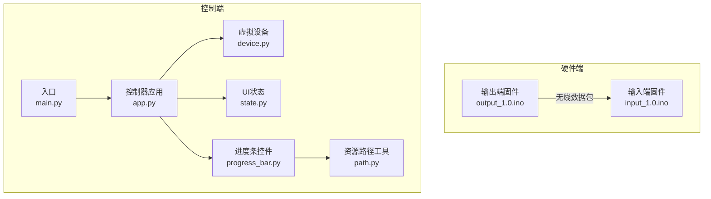
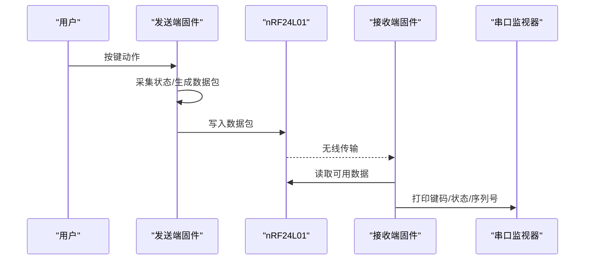
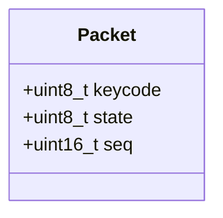
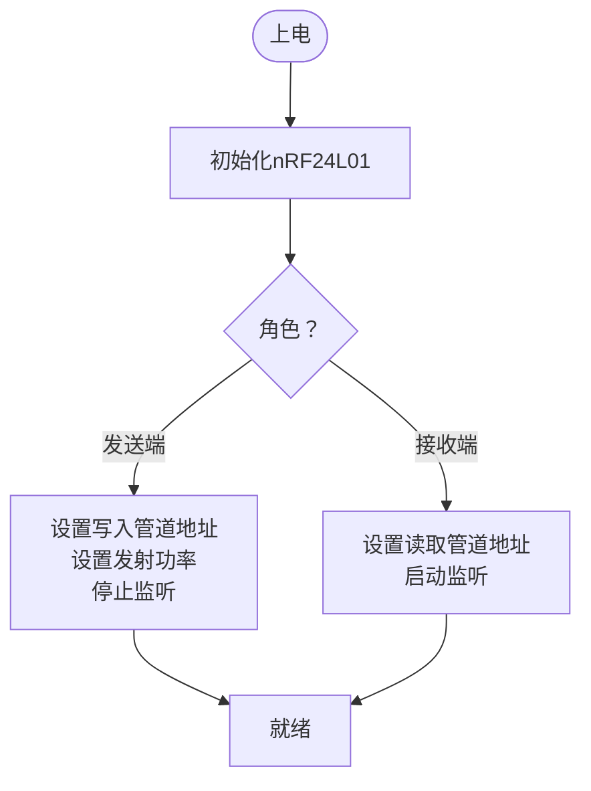
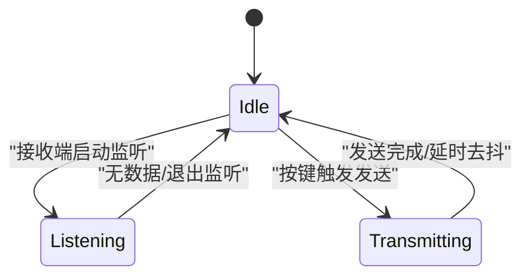
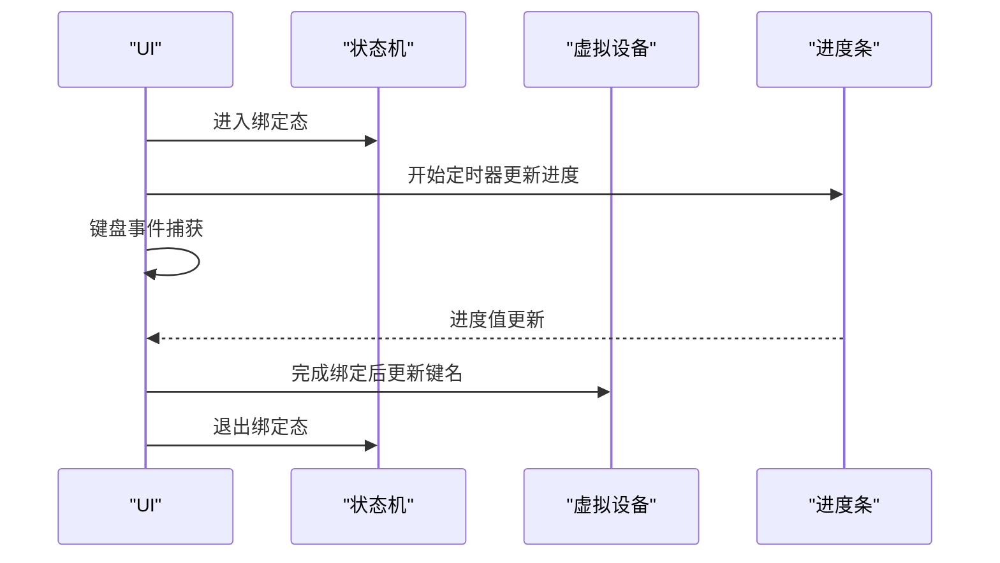
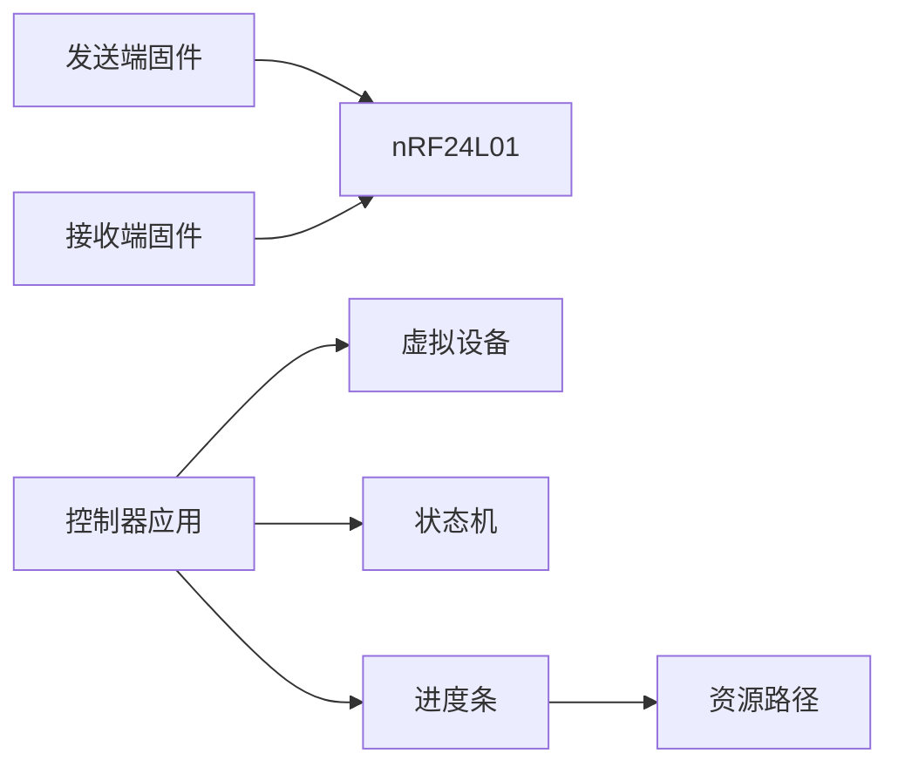

# nRF24L01无线通信协议

<cite>
**本文引用的文件**
- [README.md](file://README.md)
- [input_1.0.ino](file://board/input_1.0/input_1.0.ino)
- [output_1.0.ino](file://board/output_1.0/output_1.0.ino)
- [device.py](file://controller/core/device.py)
- [state.py](file://controller/core/state.py)
- [app.py](file://controller/app.py)
- [main.py](file://controller/main.py)
- [progress_bar.py](file://controller/ui/progress_bar.py)
- [path.py](file://controller/utils/path.py)
</cite>

## 目录
1. [简介](#简介)
2. [项目结构](#项目结构)
3. [核心组件](#核心组件)
4. [架构总览](#架构总览)
5. [详细组件分析](#详细组件分析)
6. [依赖关系分析](#依赖关系分析)
7. [性能与功耗考虑](#性能与功耗考虑)
8. [故障排除指南](#故障排除指南)
9. [结论](#结论)
10. [附录](#附录)

## 简介
本技术文档围绕nRF24L01无线通信协议在本仓库中的应用展开，系统性地解析了数据包格式、初始化流程、管道配置、收发模式切换、中断与轮询机制、通信时序与状态转换，并结合实际代码路径给出API使用要点与优化建议。读者可据此快速理解并部署基于nRF24L01的无线键盘/遥控场景。

## 项目结构
该项目采用“硬件端（Arduino）+ 控制端（Python/Qt）”的分层设计：
- 硬件端包含输入端与输出端两套固件，分别负责按键采集与数据发送、以及数据接收与串口转发。
- 控制端使用PySide6构建图形界面，模拟设备状态与按键绑定流程，用于演示与验证。

图表来源
- [input_1.0.ino:1-35](file://board/input_1.0/input_1.0.ino#L1-L35)
- [output_1.0.ino:1-43](file://board/output_1.0/output_1.0.ino#L1-L43)
- [app.py:1-202](file://controller/app.py#L1-L202)
- [main.py:1-8](file://controller/main.py#L1-L8)
- [device.py:1-11](file://controller/core/device.py#L1-L11)
- [state.py:1-3](file://controller/core/state.py#L1-L3)
- [progress_bar.py:1-28](file://controller/ui/progress_bar.py#L1-L28)
- [path.py:1-10](file://controller/utils/path.py#L1-L10)

章节来源
- [README.md:1-1](file://README.md#L1-L1)
- [input_1.0.ino:1-35](file://board/input_1.0/input_1.0.ino#L1-L35)
- [output_1.0.ino:1-43](file://board/output_1.0/output_1.0.ino#L1-L43)
- [app.py:1-202](file://controller/app.py#L1-L202)
- [main.py:1-8](file://controller/main.py#L1-L8)

## 核心组件
- 数据包结构：由发送端构造，包含键码、按键状态、序列号三部分，作为一次按键事件的最小传输单元。
- 发送端（输出端）：按键采集、打包、通过nRF24L01发送。
- 接收端（输入端）：监听nRF24L01，读取数据包并通过串口打印。
- 控制端（Qt应用）：模拟设备状态、按键绑定流程，展示UI与状态机交互。

章节来源
- [input_1.0.ino:8-12](file://board/input_1.0/input_1.0.ino#L8-L12)
- [output_1.0.ino:13-17](file://board/output_1.0/output_1.0.ino#L13-L17)
- [device.py:1-11](file://controller/core/device.py#L1-L11)
- [state.py:1-3](file://controller/core/state.py#L1-L3)

## 架构总览
下图展示了从按键触发到无线发送、接收与串口输出的完整链路，以及控制端的状态机与UI交互。

图表来源
- [output_1.0.ino:28-43](file://board/output_1.0/output_1.0.ino#L28-L43)
- [input_1.0.ino:24-35](file://board/input_1.0/input_1.0.ino#L24-L35)

## 详细组件分析

### 数据包格式与字段语义
- 字段定义
  - 键码（keycode）：表示被按下的键标识，发送端填充固定值或映射自实际按键。
  - 状态（state）：表示按键的按下/抬起状态，通常用0/1表示。
  - 序列号（seq）：单调递增的计数器，用于去重与顺序校验。
- 编码方式
  - 键码与状态为8位无符号整型。
  - 序列号为16位无符号整型。
- 传输单元
  - 该结构体作为一次按键事件的完整载荷，通过nRF24L01单次写入/读取完成。

图表来源
- [input_1.0.ino:8-12](file://board/input_1.0/input_1.0.ino#L8-L12)
- [output_1.0.ino:13-17](file://board/output_1.0/output_1.0.ino#L13-L17)

章节来源
- [input_1.0.ino:8-12](file://board/input_1.0/input_1.0.ino#L8-L12)
- [output_1.0.ino:13-17](file://board/output_1.0/output_1.0.ino#L13-L17)

### 初始化与管道配置
- 发送端初始化
  - 初始化nRF24L01、设置写入管道地址、降低发射功率、停止监听模式。
- 接收端初始化
  - 初始化nRF24L01、设置读取管道地址、启动监听模式。
- 地址设置
  - 使用统一的管道地址字符串，确保两端匹配。

图表来源
- [output_1.0.ino:19-26](file://board/output_1.0/output_1.0.ino#L19-L26)
- [input_1.0.ino:16-22](file://board/input_1.0/input_1.0.ino#L16-L22)

章节来源
- [output_1.0.ino:19-26](file://board/output_1.0/output_1.0.ino#L19-L26)
- [input_1.0.ino:16-22](file://board/input_1.0/input_1.0.ino#L16-L22)

### 发送与接收模式切换逻辑
- 发送端
  - 通过按键状态变化触发数据包发送；每次发送后延时以抑制抖动。
- 接收端
  - 轮询检测是否有可用数据，若有则读取并打印。
- 模式切换
  - 发送端在非监听模式下工作；接收端在监听模式下等待数据。

图表来源
- [output_1.0.ino:28-43](file://board/output_1.0/output_1.0.ino#L28-L43)
- [input_1.0.ino:24-35](file://board/input_1.0/input_1.0.ino#L24-L35)

章节来源
- [output_1.0.ino:28-43](file://board/output_1.0/output_1.0.ino#L28-L43)
- [input_1.0.ino:24-35](file://board/input_1.0/input_1.0.ino#L24-L35)

### 中断处理机制
- 当前实现采用轮询方式检测数据可用性，未使用nRF24L01中断引脚。
- 若需降低CPU占用与提升实时性，可在硬件上连接IRQ引脚并注册中断回调，再在中断服务程序中触发读取。

章节来源
- [input_1.0.ino:25-26](file://board/input_1.0/input_1.0.ino#L25-L26)

### RF24库API使用要点
- begin()
  - 初始化nRF24L01硬件接口（SPI）与基本寄存器。
- openWritingPipe()/openReadingPipe()
  - 配置写入/读取管道地址，确保两端一致。
- setPALevel()
  - 设置发射功率等级，影响通信距离与功耗。
- stopListening()/startListening()
  - 在发送与接收模式间切换。
- write()
  - 向指定管道写入数据包。
- available()/read()
  - 检测并读取可用数据包。

章节来源
- [output_1.0.ino:22-25](file://board/output_1.0/output_1.0.ino#L22-L25)
- [output_1.0.ino:24](file://board/output_1.0/output_1.0.ino#L24)
- [input_1.0.ino:19-21](file://board/input_1.0/input_1.0.ino#L19-L21)
- [input_1.0.ino:25-26](file://board/input_1.0/input_1.0.ino#L25-L26)

### 控制端状态机与UI交互
- 状态管理
  - IDLE：空闲态，显示设备状态。
  - BINDING：绑定态，引导用户按键并可视化进度。
- UI组件
  - 进度条控件：自绘背景与填充，随进度裁剪绘制。
  - 资源路径工具：兼容打包后的可执行文件资源定位。
- 绑定流程
  - 用户按键触发绑定，进度达到阈值后完成绑定并更新设备键名。

图表来源
- [app.py:77-112](file://controller/app.py#L77-L112)
- [app.py:148-162](file://controller/app.py#L148-L162)
- [app.py:190-197](file://controller/app.py#L190-L197)
- [progress_bar.py:15-28](file://controller/ui/progress_bar.py#L15-L28)
- [device.py:6-8](file://controller/core/device.py#L6-L8)

章节来源
- [app.py:1-202](file://controller/app.py#L1-L202)
- [state.py:1-3](file://controller/core/state.py#L1-L3)
- [progress_bar.py:1-28](file://controller/ui/progress_bar.py#L1-L28)
- [path.py:1-10](file://controller/utils/path.py#L1-L10)

## 依赖关系分析
- 硬件端依赖
  - Arduino SPI、RF24库、nRF24L01驱动。
- 控制端依赖
  - PySide6（Qt）、资源路径工具、自定义UI控件。
- 文件间耦合
  - 控制端各模块职责清晰：状态机、设备抽象、UI控件、资源路径。
  - 硬件端模块间低耦合，通过统一的数据包结构与管道地址实现松耦合通信。

图表来源
- [output_1.0.ino:1-43](file://board/output_1.0/output_1.0.ino#L1-L43)
- [input_1.0.ino:1-35](file://board/input_1.0/input_1.0.ino#L1-L35)
- [app.py:1-202](file://controller/app.py#L1-L202)
- [device.py:1-11](file://controller/core/device.py#L1-L11)
- [state.py:1-3](file://controller/core/state.py#L1-L3)
- [progress_bar.py:1-28](file://controller/ui/progress_bar.py#L1-L28)
- [path.py:1-10](file://controller/utils/path.py#L1-L10)

章节来源
- [output_1.0.ino:1-43](file://board/output_1.0/output_1.0.ino#L1-L43)
- [input_1.0.ino:1-35](file://board/input_1.0/input_1.0.ino#L1-L35)
- [app.py:1-202](file://controller/app.py#L1-L202)

## 性能与功耗考虑
- 发射功率
  - 通过设置发射功率等级平衡通信距离与功耗；在短距离场景可使用较低功率以节能。
- 重传与超时
  - 可根据环境噪声调整自动重传次数与超时时间，避免频繁重试导致的延迟。
- 采样与去抖
  - 发送端对按键状态变化进行去抖处理，减少误触发。
- 串口打印
  - 接收端仅做透传打印，避免额外处理开销；若需进一步处理，建议在接收端增加解码与校验逻辑。

章节来源
- [output_1.0.ino:24](file://board/output_1.0/output_1.0.ino#L24)
- [output_1.0.ino:31-40](file://board/output_1.0/output_1.0.ino#L31-L40)
- [input_1.0.ino:28-34](file://board/input_1.0/input_1.0.ino#L28-L34)

## 故障排除指南
- 无法建立通信
  - 检查两端是否使用相同管道地址。
  - 确认发送端已设置写入管道并停止监听，接收端已设置读取管道并启动监听。
- 数据包丢失或重复
  - 在接收端增加校验与去重逻辑（如基于序列号）。
  - 调整发射功率与天线位置，改善信号质量。
- 抖动问题
  - 在发送端对按键状态变化进行去抖处理，适当延长去抖延时。
- 串口无输出
  - 确认串口波特率一致且接收端已正确读取数据包。

章节来源
- [output_1.0.ino:22-25](file://board/output_1.0/output_1.0.ino#L22-L25)
- [input_1.0.ino:19-21](file://board/input_1.0/input_1.0.ino#L19-L21)
- [input_1.0.ino:25-26](file://board/input_1.0/input_1.0.ino#L25-L26)

## 结论
本项目以简洁的固件实现了基于nRF24L01的无线按键传输链路，并通过Qt应用演示了状态机与UI交互。通过对数据包格式、初始化与管道配置、收发模式切换、API使用与优化策略的系统梳理，开发者可在此基础上扩展更复杂的按键绑定、多通道通信与抗干扰能力。

## 附录
- 关键API参考路径
  - 初始化与管道：[output_1.0.ino:22-25](file://board/output_1.0/output_1.0.ino#L22-L25)，[input_1.0.ino:19-21](file://board/input_1.0/input_1.0.ino#L19-L21)
  - 发射功率设置：[output_1.0.ino:24](file://board/output_1.0/output_1.0.ino#L24)
  - 发送与接收：[output_1.0.ino:37](file://board/output_1.0/output_1.0.ino#L37)，[input_1.0.ino:25-26](file://board/input_1.0/input_1.0.ino#L25-L26)
- 控制端状态机与UI
  - 状态定义：[state.py:1-3](file://controller/core/state.py#L1-L3)
  - 绑定流程：[app.py:77-112](file://controller/app.py#L77-L112)，[app.py:148-162](file://controller/app.py#L148-L162)，[app.py:190-197](file://controller/app.py#L190-L197)
  - 进度条绘制：[progress_bar.py:15-28](file://controller/ui/progress_bar.py#L15-L28)