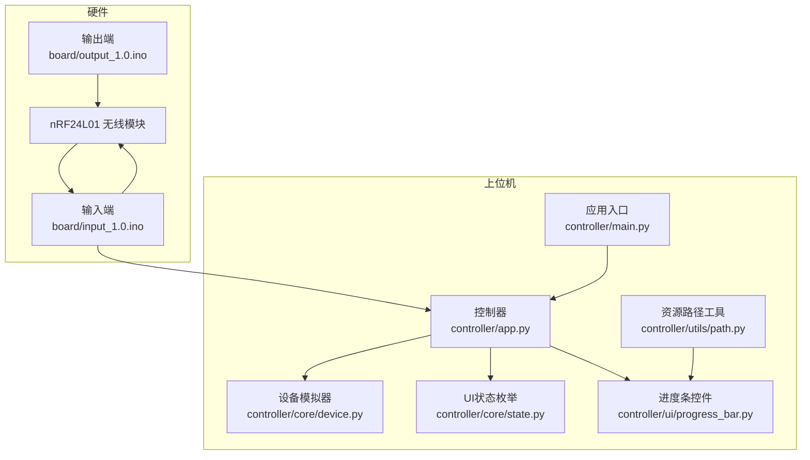
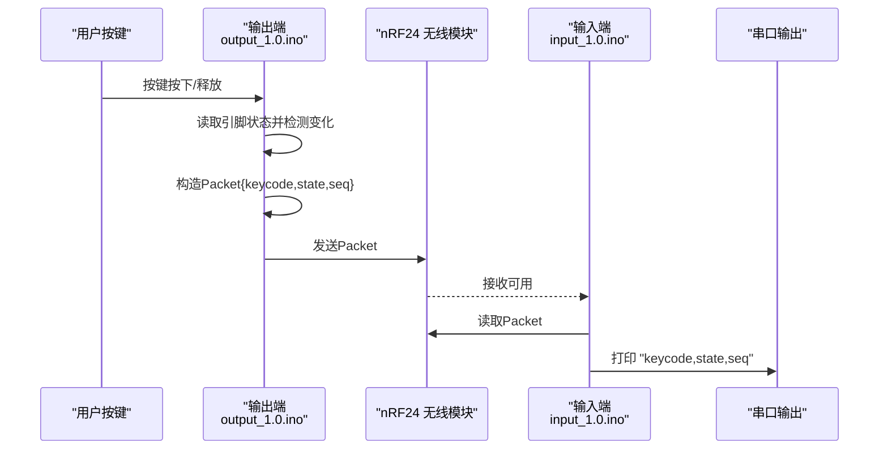
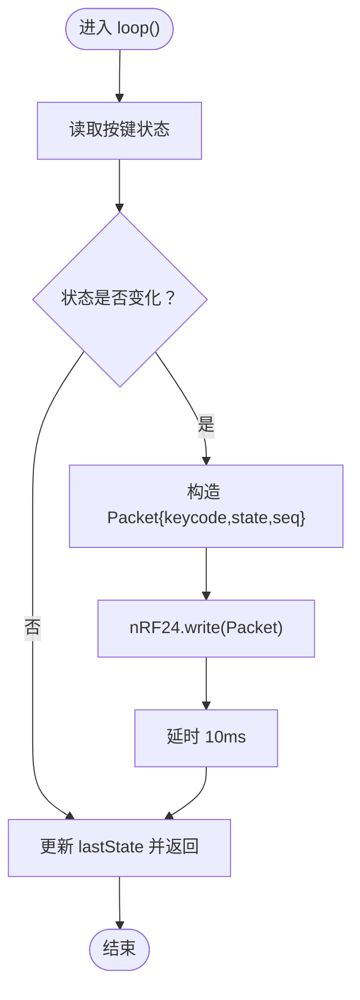
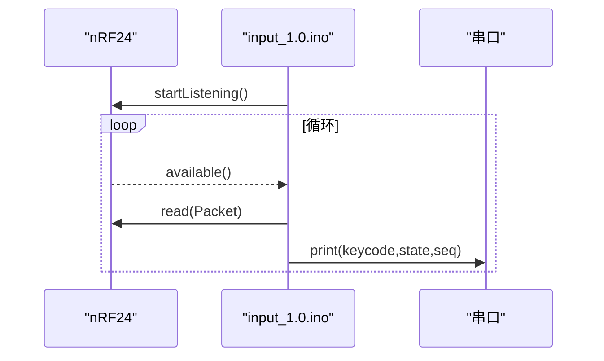
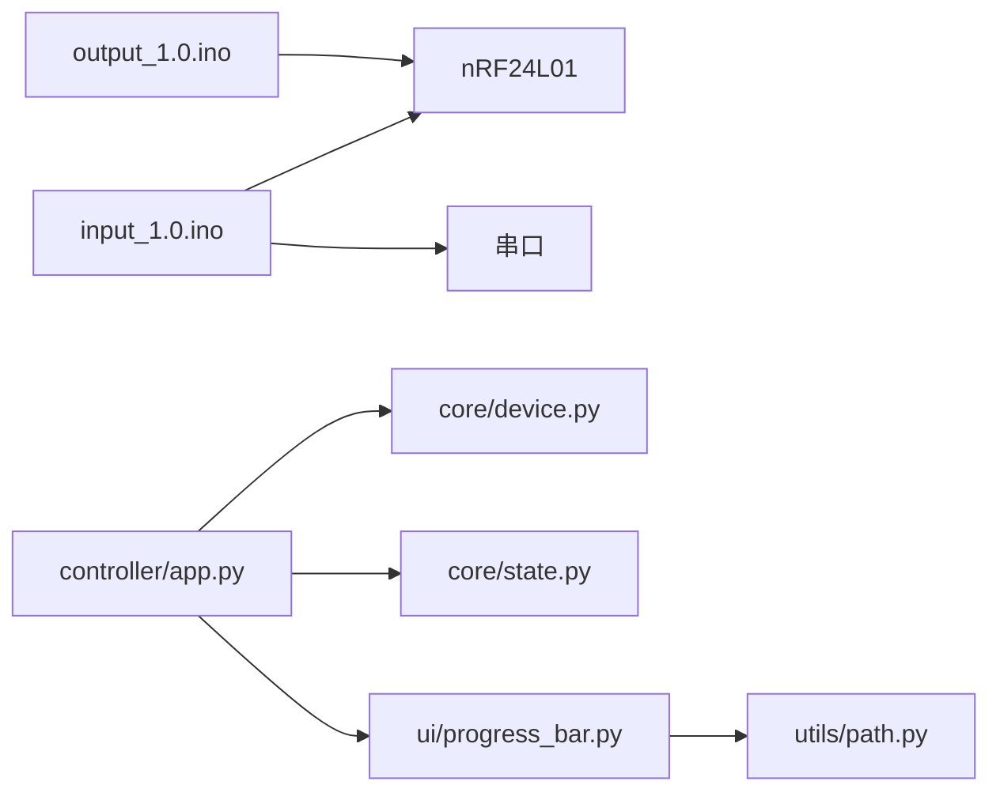
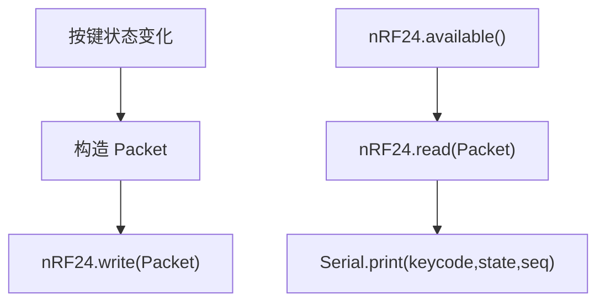

# 固件实现细节

<cite>
**本文引用的文件**
- [input_1.0.ino](file://board/input_1.0/input_1.0.ino)
- [output_1.0.ino](file://board/output_1.0/output_1.0.ino)
- [README.md](file://README.md)
- [app.py](file://controller/app.py)
- [main.py](file://controller/main.py)
- [device.py](file://controller/core/device.py)
- [state.py](file://controller/core/state.py)
- [progress_bar.py](file://controller/ui/progress_bar.py)
- [path.py](file://controller/utils/path.py)
</cite>

## 目录
1. [简介](#简介)
2. [项目结构](#项目结构)
3. [核心组件](#核心组件)
4. [架构总览](#架构总览)
5. [详细组件分析](#详细组件分析)
6. [依赖关系分析](#依赖关系分析)
7. [性能与内存考量](#性能与内存考量)
8. [故障排查指南](#故障排查指南)
9. [结论](#结论)
10. [附录](#附录)

## 简介
本技术文档聚焦于Arduino无线键盘玩具项目的固件实现，围绕输入端与输出端的Arduino代码展开，系统性解析以下内容：
- 输入端与输出端的初始化与主循环设计思路
- Packet结构体的定义与字段含义（keycode、state、seq），以及数据在系统中的流转
- 按键检测算法（单按键输入、状态变化检测、去抖动策略）
- 无线数据接收与转发流程（基于nRF24L01模块）
- 串口通信格式与协议说明
- 内存使用、执行效率与优化空间
- 调试信息输出、错误处理与异常恢复策略
- 固件升级与版本管理建议

## 项目结构
该项目采用“硬件固件 + 控制器界面”的分层架构：
- board/input_1.0：输入端（接收并转发无线数据到串口）
- board/output_1.0：输出端（按键触发，打包为Packet并通过nRF24发送）
- controller：桌面控制器（PySide6），用于按键绑定与状态显示

图表来源
- [input_1.0.ino:16-35](file://board/input_1.0/input_1.0.ino#L16-L35)
- [output_1.0.ino:19-43](file://board/output_1.0/output_1.0.ino#L19-L43)
- [app.py:12-202](file://controller/app.py#L12-L202)
- [main.py:1-8](file://controller/main.py#L1-L8)
- [device.py:1-11](file://controller/core/device.py#L1-L11)
- [state.py:1-3](file://controller/core/state.py#L1-L3)
- [progress_bar.py:1-28](file://controller/ui/progress_bar.py#L1-L28)
- [path.py:1-10](file://controller/utils/path.py#L1-L10)

章节来源
- [README.md:1-1](file://README.md#L1-L1)
- [input_1.0.ino:16-35](file://board/input_1.0/input_1.0.ino#L16-L35)
- [output_1.0.ino:19-43](file://board/output_1.0/output_1.0.ino#L19-L43)
- [app.py:12-202](file://controller/app.py#L12-L202)
- [main.py:1-8](file://controller/main.py#L1-L8)
- [device.py:1-11](file://controller/core/device.py#L1-L11)
- [state.py:1-3](file://controller/core/state.py#L1-L3)
- [progress_bar.py:1-28](file://controller/ui/progress_bar.py#L1-L28)
- [path.py:1-10](file://controller/utils/path.py#L1-L10)

## 核心组件
- Packet结构体：承载按键事件的三元组，字段分别为键码、状态、序列号。该结构体在输入端与输出端均定义，确保双方对数据格式达成一致。
- 输出端（按键侧）：负责读取按键状态，检测状态变化，构造Packet并通过nRF24发送。
- 输入端（串口侧）：监听nRF24接收队列，读取Packet后通过串口以逗号分隔的文本形式转发。
- 控制器（桌面端）：提供按键绑定流程、进度反馈与成功动画，同时展示设备状态（电量、当前按键）。

章节来源
- [input_1.0.ino:8-14](file://board/input_1.0/input_1.0.ino#L8-L14)
- [output_1.0.ino:13-17](file://board/output_1.0/output_1.0.ino#L13-L17)
- [app.py:12-202](file://controller/app.py#L12-L202)

## 架构总览
下图展示了从按键触发到串口输出的关键时序与数据流。

图表来源
- [output_1.0.ino:28-43](file://board/output_1.0/output_1.0.ino#L28-L43)
- [input_1.0.ino:24-35](file://board/input_1.0/input_1.0.ino#L24-L35)

## 详细组件分析

### 输出端（按键输入与无线发送）
- 初始化
  - 将按键引脚配置为上拉输入模式，确保未按键时为高电平。
  - 初始化nRF24模块，设置写入管道地址，降低发射功率，停止监听模式。
- 主循环
  - 读取当前按键状态，与上次状态比较，若发生变化则进入处理分支。
  - 构造Packet：键码固定为0（占位），状态根据按键是否被按下设置，序列号自增。
  - 通过nRF24发送Packet，随后短暂延时以缓解抖动影响。
  - 更新lastState为当前状态，等待下次循环。

图表来源
- [output_1.0.ino:28-43](file://board/output_1.0/output_1.0.ino#L28-L43)

章节来源
- [output_1.0.ino:19-43](file://board/output_1.0/output_1.0.ino#L19-L43)

### 输入端（无线接收与串口转发）
- 初始化
  - 初始化串口通信速率，开启nRF24模块，配置读取管道地址，启动监听模式。
- 主循环
  - 若nRF24有可用数据，则读取一个Packet。
  - 将Packet的三个字段以逗号分隔的形式打印到串口，每行输出一个Packet。

图表来源
- [input_1.0.ino:16-35](file://board/input_1.0/input_1.0.ino#L16-L35)

章节来源
- [input_1.0.ino:16-35](file://board/input_1.0/input_1.0.ino#L16-L35)

### Packet结构体与字段语义
- 字段定义
  - keycode：键码标识（当前固件中固定为0，可扩展为实际键值）
  - state：按键状态（按下为1，释放为0）
  - seq：序列号（递增计数，便于上位机校验顺序与丢包）
- 数据流向
  - 输出端生成Packet并发送至nRF24
  - 输入端从nRF24读取Packet并转发到串口
  - 上位机可据此解析并记录按键事件

章节来源
- [input_1.0.ino:8-14](file://board/input_1.0/input_1.0.ino#L8-L14)
- [output_1.0.ino:13-17](file://board/output_1.0/output_1.0.ino#L13-L17)

### 按键检测算法与去抖动
- 状态变化检测
  - 使用lastState与当前状态对比，仅在状态变化时触发Packet发送，避免重复发送相同状态。
- 去抖动策略
  - 在发送后添加短延时，减少机械按键抖动导致的多次触发。
- 可选增强
  - 当前实现未使用定时器或微秒级计时进行精确去抖；如需更稳健的去抖，可在状态变化后引入最小间隔判断或双阈值检测。

章节来源
- [output_1.0.ino:28-43](file://board/output_1.0/output_1.0.ino#L28-L43)

### 无线数据接收与转发流程
- 接收侧
  - 启动监听，轮询available()，有数据即读取Packet。
- 转发侧
  - 将Packet的三个字段以逗号分隔打印，便于上位机解析。
- 协议格式
  - 文本行格式：keycode,state,seq（无换行符包裹，每行一条）

章节来源
- [input_1.0.ino:24-35](file://board/input_1.0/input_1.0.ino#L24-L35)

### 串口通信格式与协议
- 串口波特率：115200
- 每行输出一个Packet的三元组，逗号分隔
- 上位机可按行解析，提取三列数值作为keycode、state、seq

章节来源
- [input_1.0.ino:17-35](file://board/input_1.0/input_1.0.ino#L17-L35)

### 控制器端交互与绑定流程
- 绑定流程
  - 用户点击“修改按键”，进入绑定状态，显示提示与进度条，播放行走动画。
  - 捕获键盘按键事件，启动两个定时器分别驱动进度增长与动画切换。
  - 当进度达到阈值时播放消失动画并完成绑定，否则重置。
- 设备状态
  - 显示电量与当前按键名称，支持刷新更新。

章节来源
- [app.py:77-197](file://controller/app.py#L77-L197)
- [device.py:1-11](file://controller/core/device.py#L1-L11)

## 依赖关系分析
- 硬件依赖
  - nRF24L01模块：SPI接口，引脚9/10用于通信；输出端写入，输入端读取。
- 固件间耦合
  - 输出端与输入端共享Packet结构体定义，确保二进制/文本格式一致。
- 上位机依赖
  - 控制器依赖PySide6进行UI渲染与事件处理；进度条控件依赖资源路径工具加载图片资源。

图表来源
- [output_1.0.ino:5-8](file://board/output_1.0/output_1.0.ino#L5-L8)
- [input_1.0.ino:5-6](file://board/input_1.0/input_1.0.ino#L5-L6)
- [app.py:6-9](file://controller/app.py#L6-L9)
- [progress_bar.py:3](file://controller/ui/progress_bar.py#L3)
- [path.py:4-10](file://controller/utils/path.py#L4-L10)

章节来源
- [output_1.0.ino:5-8](file://board/output_1.0/output_1.0.ino#L5-L8)
- [input_1.0.ino:5-6](file://board/input_1.0/input_1.0.ino#L5-L6)
- [app.py:6-9](file://controller/app.py#L6-L9)
- [progress_bar.py:3](file://controller/ui/progress_bar.py#L3)
- [path.py:4-10](file://controller/utils/path.py#L4-L10)

## 性能与内存考量
- 执行效率
  - 输出端loop内仅包含状态读取、比较与发送，开销极小；延时10ms有助于去抖。
  - 输入端loop内仅包含nRF24可用检查与串口打印，I/O开销主要来自串口输出。
- 内存占用
  - Packet为固定大小，占用字节数较少；全局变量数量有限，适合Arduino Uno等低端MCU。
- 优化空间
  - 增加去抖时间常数或使用定时器去抖，提升稳定性。
  - 对串口输出进行缓冲或批量输出，减少频繁调用串口API的开销。
  - 在Packet中加入时间戳字段，便于上位机统计抖动与延迟。
  - 将键码与状态映射到实际键值，而非固定值，提升通用性。

[本节为通用性能讨论，无需列出章节来源]

## 故障排查指南
- 无法接收数据
  - 检查nRF24引脚连接与地址一致性（双方地址需相同）。
  - 确认输入端已启动监听，输出端已停止监听并设置写入管道。
- 串口无输出
  - 确认串口波特率设置为115200，使用串口助手查看。
  - 检查输入端是否正确读取Packet并打印。
- 按键无响应
  - 确认按键引脚配置为上拉输入，且按键一端接GND。
  - 观察输出端延时是否过短导致误判，适当增加延时。
- 绑定流程异常
  - 检查控制器端定时器是否正确启动与停止，进度条与动画帧是否加载成功。
  - 确认资源路径工具在打包后仍能正确定位资源文件。

章节来源
- [input_1.0.ino:16-35](file://board/input_1.0/input_1.0.ino#L16-L35)
- [output_1.0.ino:19-43](file://board/output_1.0/output_1.0.ino#L19-L43)
- [app.py:113-138](file://controller/app.py#L113-L138)
- [progress_bar.py:19-28](file://controller/ui/progress_bar.py#L19-L28)
- [path.py:4-10](file://controller/utils/path.py#L4-L10)

## 结论
本固件实现了从按键触发到无线传输再到串口转发的完整链路，结构简洁、易于扩展。通过Packet三元组清晰地表达键码、状态与序列号，满足基本的按键事件采集需求。后续可在去抖动策略、协议扩展（如时间戳）、键码映射与固件升级等方面进一步完善。

[本节为总结性内容，无需列出章节来源]

## 附录

### 关键流程图（Packet发送与串口转发）

图表来源
- [output_1.0.ino:28-43](file://board/output_1.0/output_1.0.ino#L28-L43)
- [input_1.0.ino:24-35](file://board/input_1.0/input_1.0.ino#L24-L35)

### 固件升级与版本管理建议
- 版本标识
  - 在固件中加入版本号常量，便于识别与兼容性管理。
- 升级策略
  - 采用引导程序或双区镜像方案，确保升级失败时可回滚。
  - 提供安全的OTA升级流程，结合CRC校验与分块传输。
- 配置迁移
  - 新版本若变更Packet结构，需提供向后兼容或迁移策略。
- 文档与测试
  - 为每次升级维护变更日志与回归测试清单，确保功能稳定。

[本节为通用建议，无需列出章节来源]