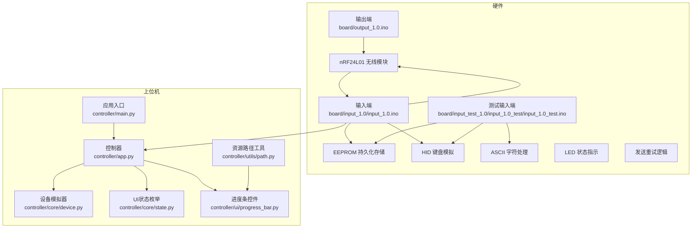
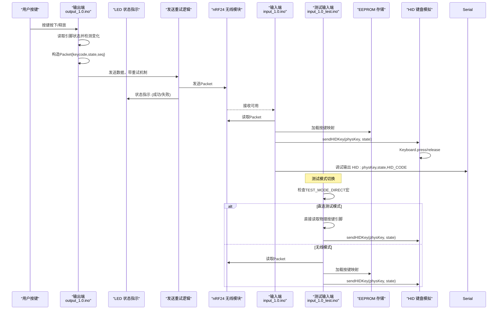
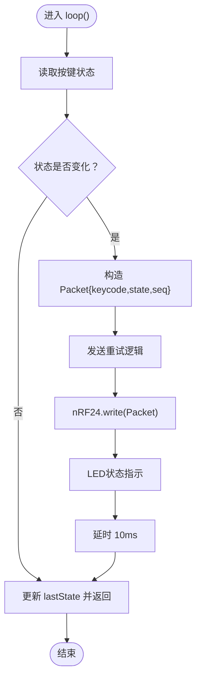
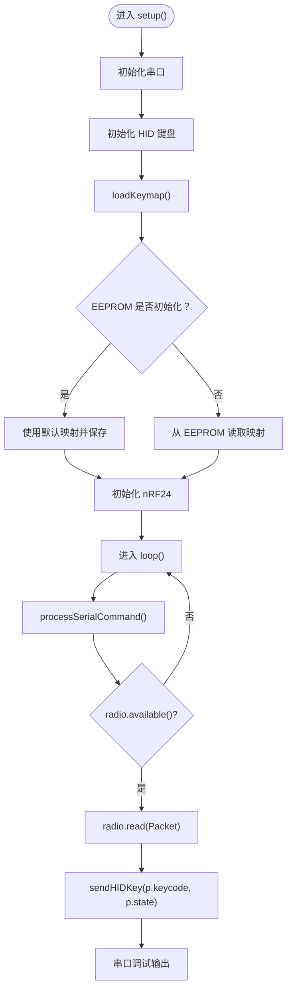
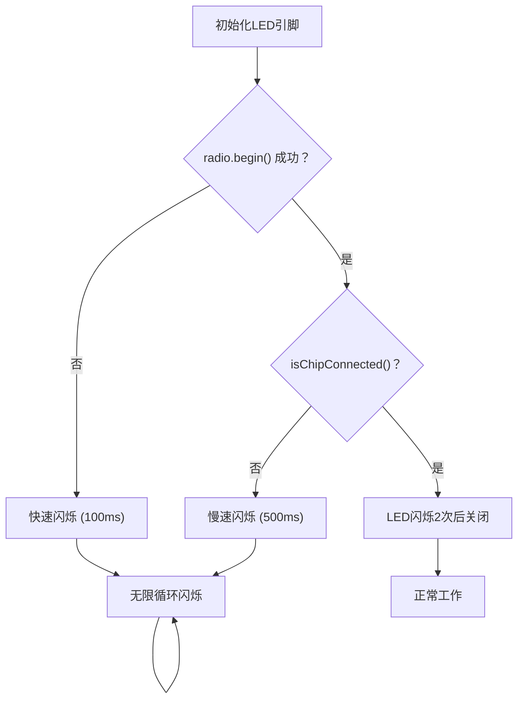
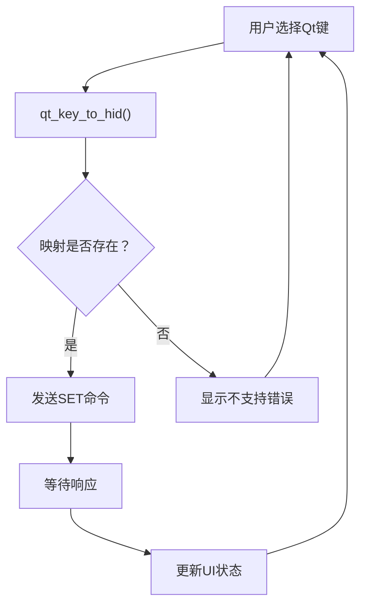
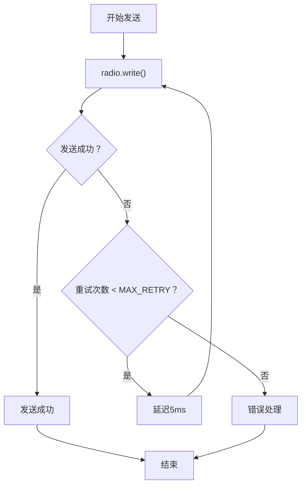
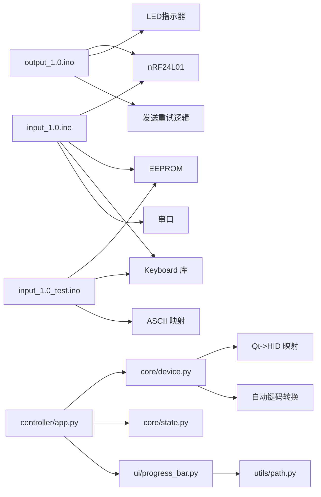
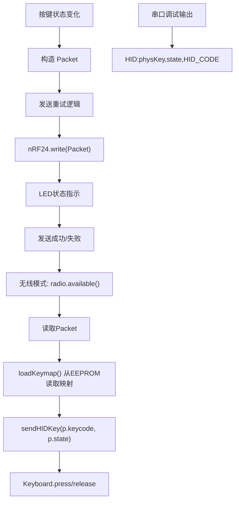

# 固件实现细节

<cite>
**本文引用的文件**
- [input_1.0.ino](file://board/input_1.0/input_1.0.ino)
- [input_1.0_test.ino](file://board/input_test_1.0/input_1.0_test/input_1.0_test.ino)
- [output_1.0.ino](file://board/output_1.0/output_1.0.ino)
- [README.md](file://README.md)
- [app.py](file://controller/app.py)
- [main.py](file://controller/main.py)
- [device.py](file://controller/core/device.py)
- [state.py](file://controller/core/state.py)
- [progress_bar.py](file://controller/ui/progress_bar.py)
- [path.py](file://controller/utils/path.py)
</cite>

## 更新摘要
**变更内容**
- 新增LED状态指示机制，包括初始化失败和芯片连接状态的视觉反馈
- 实现自动HID键映射系统，支持Qt键码到HID键码的自动转换
- 增强发送重试逻辑，提高无线通信的可靠性
- 完善测试模式功能，支持直连测试和无线模式切换
- 优化串口通信协议，增强调试输出和错误报告能力
- 改进键映射系统，支持更广泛的键盘输入类型

## 目录
1. [简介](#简介)
2. [项目结构](#项目结构)
3. [核心组件](#核心组件)
4. [架构总览](#架构总览)
5. [详细组件分析](#详细组件分析)
6. [错误检测与报告机制](#错误检测与报告机制)
7. [依赖关系分析](#依赖关系分析)
8. [性能与内存考量](#性能与内存考量)
9. [故障排查指南](#故障排查指南)
10. [结论](#结论)
11. [附录](#附录)

## 简介
本技术文档聚焦于Arduino无线键盘玩具项目的固件实现，围绕输入端与输出端的Arduino代码展开，系统性解析以下内容：
- 输入端与输出端的初始化与主循环设计思路
- Packet结构体的定义与字段含义（keycode、state、seq），以及数据在系统中的流转
- 按键检测算法（单按键输入、状态变化检测、去抖动策略）
- 无线数据接收与转发流程（基于nRF24L01模块）
- **新增**：LED状态指示机制，提供硬件级别的错误可视化反馈
- **新增**：自动HID键映射系统，实现Qt键码到HID键码的无缝转换
- **新增**：发送重试逻辑，增强无线通信的可靠性和容错能力
- 测试模式支持直连测试和无线模式切换
- 增强的调试输出功能和串口通信协议
- 改进的Qt到HID键码转换系统
- ASCII字符处理功能，支持更广泛的键盘输入
- 串口通信格式与协议说明
- 内存使用、执行效率与优化空间
- 调试信息输出、错误处理与异常恢复策略
- 固件升级与版本管理建议

## 项目结构
该项目采用"硬件固件 + 控制器界面"的分层架构：
- board/input_1.0：输入端（接收无线数据并模拟HID键盘事件）
- board/output_1.0：输出端（按键触发，打包为Packet并通过nRF24发送，包含LED状态指示）
- board/input_test_1.0：测试模式输入端（支持直连测试和无线模式切换）
- controller：桌面控制器（PySide6），用于按键绑定与状态显示

**图表来源**
- [input_1.0.ino:106-132](file://board/input_1.0/input_1.0.ino#L106-L132)
- [output_1.0.ino:20-44](file://board/output_1.0/output_1.0.ino#L20-L44)
- [input_1.0_test.ino:118-208](file://board/input_test_1.0/input_1.0_test/input_1.0_test.ino#L118-L208)
- [app.py:12-261](file://controller/app.py#L12-L261)

**章节来源**
- [README.md:1-1](file://README.md#L1-L1)
- [input_1.0.ino:106-132](file://board/input_1.0/input_1.0.ino#L106-L132)
- [output_1.0.ino:20-44](file://board/output_1.0/output_1.0.ino#L20-L44)
- [input_1.0_test.ino:118-208](file://board/input_test_1.0/input_1.0_test/input_1.0_test.ino#L118-L208)
- [app.py:12-261](file://controller/app.py#L12-L261)

## 核心组件
- Packet结构体：承载按键事件的三元组，字段分别为键码、状态、序列号。该结构体在输入端与输出端均定义，确保双方对数据格式达成一致。
- 输出端（按键侧）：负责读取按键状态，检测状态变化，构造Packet并通过nRF24发送，包含LED状态指示和发送重试逻辑。
- 输入端（HID键盘模拟）：接收Packet后通过EEPROM加载按键映射，将物理按键映射转换为HID键码，直接模拟键盘事件。
- 测试模式输入端：支持直连测试和无线模式切换，提供独立的按键检测和HID事件处理。
- ASCII字符处理：在测试模式中提供hidToAscii函数，将HID键码转换为ASCII字符，支持更广泛的键盘输入。
- EEPROM持久化：按键映射表存储在EEPROM中，支持断电保存和自动加载。
- 串口命令处理：支持SET和GET命令，实现动态按键映射配置。
- **新增**：LED状态指示机制：输出端使用LED引脚提供硬件级别的错误状态可视化反馈。
- **新增**：自动HID键映射系统：控制器端自动将Qt键码转换为HID键码，简化用户操作。
- **新增**：发送重试逻辑：输出端在发送失败时自动重试，提高通信可靠性。
- 增强调试输出：改进的串口调试信息格式，便于开发和故障排查。
- 控制器（桌面端）：提供按键绑定流程、进度反馈与成功动画，同时展示设备状态（电量、当前按键）。

**章节来源**
- [input_1.0.ino:10-15](file://board/input_1.0/input_1.0.ino#L10-L15)
- [output_1.0.ino:13-18](file://board/output_1.0/output_1.0.ino#L13-L18)
- [input_1.0_test.ino:16-21](file://board/input_test_1.0/input_1.0_test/input_1.0_test.ino#L16-L21)
- [app.py:12-261](file://controller/app.py#L12-L261)

## 架构总览
下图展示了从按键触发到HID键盘事件的关键时序与数据流，包括测试模式的两种工作模式和LED状态指示机制。

**图表来源**
- [output_1.0.ino:29-44](file://board/output_1.0/output_1.0.ino#L29-L44)
- [input_1.0.ino:121-132](file://board/input_1.0/input_1.0.ino#L121-L132)
- [input_1.0_test.ino:178-208](file://board/input_test_1.0/input_1.0_test/input_1.0_test.ino#L178-L208)

## 详细组件分析

### 输出端（按键输入、无线发送与LED状态指示）
- 初始化
  - 将按键引脚配置为上拉输入模式，确保未按键时为高电平。
  - 初始化LED引脚为输出模式，初始状态为低电平。
  - 初始化nRF24模块，设置写入管道地址，降低发射功率，停止监听模式。
  - **新增**：LED状态指示初始化，准备进行错误状态可视化反馈。
- 主循环
  - 读取当前按键状态，与上次状态比较，若发生变化则进入处理分支。
  - 构造Packet：键码固定为0（占位），状态根据按键是否被按下设置，序列号自增。
  - **新增**：发送重试逻辑，最多尝试MAX_RETRY次，每次失败后短暂延迟。
  - **新增**：LED状态指示，发送成功时进行确认闪烁，失败时进行错误闪烁。
  - 通过nRF24发送Packet，随后短暂延时以缓解抖动影响。
  - 更新lastState为当前状态，等待下次循环。

**图表来源**
- [output_1.0.ino:29-44](file://board/output_1.0/output_1.0.ino#L29-L44)
- [output_1.0.ino:78-86](file://board/output_1.0/output_1.0.ino#L78-L86)

**章节来源**
- [output_1.0.ino:20-44](file://board/output_1.0/output_1.0.ino#L20-L44)

### 输入端（HID键盘模拟与EEPROM持久化）
- 初始化
  - 初始化串口通信速率，开启HID键盘模拟，加载EEPROM中的按键映射表。
  - 初始化nRF24模块，配置读取管道地址，启动监听模式。
- 主循环
  - 处理串口命令（SET/GET），支持动态按键映射配置。
  - 若nRF24有可用数据，则读取Packet并发送HID键盘事件。
- EEPROM持久化
  - 检查EEPROM是否已初始化（第一个字节为0xFF表示未初始化）
  - 未初始化时使用默认映射并保存到EEPROM
  - 已初始化时从EEPROM读取当前映射
- 串口命令处理
  - SET:physKey,hidKey - 设置物理按键到HID键码的映射
  - GET - 获取当前按键映射
- HID键盘模拟
  - 根据物理按键编号查找对应的HID键码
  - 调用Keyboard.press()或Keyboard.release()模拟键盘事件
  - 同时输出调试信息到串口

**图表来源**
- [input_1.0.ino:106-132](file://board/input_1.0/input_1.0.ino#L106-L132)
- [input_1.0.ino:28-43](file://board/input_1.0/input_1.0.ino#L28-L43)
- [input_1.0.ino:45-85](file://board/input_1.0/input_1.0.ino#L45-L85)
- [input_1.0.ino:87-104](file://board/input_1.0/input_1.0.ino#L87-L104)

**章节来源**
- [input_1.0.ino:106-132](file://board/input_1.0/input_1.0.ino#L106-L132)
- [input_1.0.ino:28-43](file://board/input_1.0/input_1.0.ino#L28-L43)
- [input_1.0.ino:45-85](file://board/input_1.0/input_1.0.ino#L45-L85)
- [input_1.0.ino:87-104](file://board/input_1.0/input_1.0.ino#L87-L104)

### 测试模式输入端（直连测试与无线模式）
- 测试模式配置
  - 定义TEST_MODE_DIRECT宏启用直连测试模式
  - 可配置TEST_BUTTON_PIN指定测试按键引脚
  - 条件编译支持两种模式的切换
- 模式切换机制
  - 直连测试模式：直接读取物理按键引脚状态，无需nRF24模块
  - 无线模式：通过nRF24接收Packet，实现真正的无线键盘功能
- 测试模式初始化
  - 直连模式：配置按键引脚为上拉输入，禁用启动输出避免干扰
  - 无线模式：初始化nRF24模块，启动监听模式
- 增强的调试输出控制
  - 测试模式中禁用启动输出和调试信息，避免干扰控制器
  - 优化了串口通信的实时性

**章节来源**
- [input_1.0_test.ino:7-14](file://board/input_test_1.0/input_1.0_test/input_1.0_test.ino#L7-L14)
- [input_1.0_test.ino:118-208](file://board/input_test_1.0/input_1.0_test/input_1.0_test.ino#L118-L208)

### ASCII字符处理功能
- hidToAscii函数
  - 将HID键码转换为ASCII字符，支持字母、数字和常用符号
  - 字母键A-Z (0x04-0x1D)转换为'a'-'z'
  - 数字键1-9 (0x1E-0x26)转换为'1'-'9'
  - 数字键0 (0x27)转换为'0'
  - 特殊字符：空格(0x2C)、回车(0x28)、Tab(0x2B)
- 智能字符处理
  - 可打印字符使用Keyboard.write()直接输出
  - 控制字符或功能键使用Keyboard.press/release组合
  - 避免输入法干扰，直接发送原始字符

**章节来源**
- [input_1.0_test.ino:100-120](file://board/input_test_1.0/input_1.0_test/input_1.0_test.ino#L100-L120)
- [input_1.0_test.ino:122-143](file://board/input_test_1.0/input_1.0_test/input_1.0_test.ino#L122-L143)

### Packet结构体与字段语义
- 字段定义
  - keycode：物理按键编号（当前固件中固定为0，可扩展为多按键支持）
  - state：按键状态（按下为1，释放为0）
  - seq：序列号（递增计数，便于上位机校验顺序与丢包）
- 数据流向
  - 输出端生成Packet并发送至nRF24
  - 输入端从nRF24读取Packet并发送HID键盘事件
  - 上位机可通过串口观察调试信息

**章节来源**
- [input_1.0.ino:10-15](file://board/input_1.0/input_1.0.ino#L10-L15)
- [output_1.0.ino:13-18](file://board/output_1.0/output_1.0.ino#L13-L18)
- [input_1.0_test.ino:16-21](file://board/input_test_1.0/input_1.0_test/input_1.0_test.ino#L16-L21)

### 按键检测算法与去抖动
- 状态变化检测
  - 使用lastState与当前状态对比，仅在状态变化时触发Packet发送，避免重复发送相同状态。
- 去抖动策略
  - 在发送后添加短延时（10ms），减少机械按键抖动导致的多次触发。
- 可选增强
  - 当前实现未使用定时器或微秒级计时进行精确去抖；如需更稳健的去抖，可在状态变化后引入最小间隔判断或双阈值检测。

**章节来源**
- [output_1.0.ino:29-44](file://board/output_1.0/output_1.0.ino#L29-L44)

### 无线数据接收与转发流程
- 接收侧
  - 启动监听，轮询available()，有数据即读取Packet。
- 转发侧
  - 不再简单转发，而是通过EEPROM加载按键映射，将物理按键映射转换为HID键码，直接模拟键盘事件。
- 协议格式
  - 二进制Packet格式：keycode,state,seq（固定大小，便于高效传输）

**章节来源**
- [input_1.0.ino:121-132](file://board/input_1.0/input_1.0.ino#L121-L132)
- [output_1.0.ino:29-44](file://board/output_1.0/output_1.0.ino#L29-L44)

### 串口通信格式与协议
- 串口波特率：115200
- 命令格式
  - SET:physKey,hidKey - 设置物理按键到HID键码的映射
  - GET - 获取当前按键映射
- 响应格式
  - OK:physKey->0xHID_CODE - 设置成功响应
  - ERR:INVALID_KEY - 无效按键错误
  - MAP:0->0xHID_CODE - 当前映射查询结果
- 调试输出
  - HID:physKey,state,HID_CODE - HID键盘事件调试信息
  - 测试模式中禁用调试输出，避免干扰控制器

**章节来源**
- [input_1.0.ino:45-85](file://board/input_1.0/input_1.0.ino#L45-L85)
- [input_1.0.ino:87-104](file://board/input_1.0/input_1.0.ino#L87-L104)

### 控制器端交互与绑定流程
- 绑定流程
  - 用户点击"修改按键"，进入绑定状态，显示提示与进度条，播放行走动画。
  - 捕获键盘按键事件，启动两个定时器分别驱动进度增长与动画切换。
  - 当进度达到阈值时播放消失动画并完成绑定，否则重置。
- 按键映射转换
  - Qt Key到HID Keycode的映射转换
  - 自动发送SET命令到Arduino进行按键映射配置
- 增强的Qt键码支持
  - 支持F1-F24功能键
  - 支持数字键0-9和字母键A-Z
  - 支持特殊键如Space、Backspace、Return、Tab、Escape
  - 支持方向键Up、Down、Left、Right
- 设备状态
  - 显示电量与当前按键名称，支持刷新更新

**章节来源**
- [app.py:130-256](file://controller/app.py#L130-L256)
- [device.py:4-92](file://controller/core/device.py#L4-L92)

## 错误检测与报告机制

### LED状态指示系统
输出端实现了完整的LED状态指示机制，为用户提供硬件级别的错误可视化反馈：

- **LED引脚配置**
  - 使用引脚13作为LED指示器（大多数Arduino板载LED）
  - LED_BLINK_FAST (100ms)：表示nRF24初始化失败
  - LED_BLINK_SLOW (500ms)：表示nRF24芯片未连接
  - 正常工作时LED闪烁2次后关闭

- **初始化检查流程**
  - radio.begin()检查：初始化失败时LED快速闪烁
  - radio.isChipConnected()检查：芯片未连接时LED慢速闪烁
  - 成功初始化：LED闪烁确认信号

- **发送状态反馈**
  - 发送成功：LED进行确认闪烁
  - 发送失败：LED进行错误闪烁
  - 无限循环：LED持续闪烁表示严重错误

**图表来源**
- [output_1.0.ino:29-37](file://board/output_1.0/output_1.0.ino#L29-L37)
- [output_1.0.ino:46-62](file://board/output_1.0/output_1.0.ino#L46-L62)

**章节来源**
- [output_1.0.ino:29-37](file://board/output_1.0/output_1.0.ino#L29-L37)
- [output_1.0.ino:46-62](file://board/output_1.0/output_1.0.ino#L46-L62)

### 自动HID键映射系统
控制器端实现了自动HID键映射系统，简化了用户的按键绑定过程：

- **Qt键码到HID键码映射表**
  - 支持F1-F24功能键映射
  - 支持数字键0-9和字母键A-Z映射
  - 支持特殊键映射：Space、Backspace、Return、Tab、Escape
  - 支持方向键映射：Up、Down、Left、Right

- **自动转换流程**
  - 用户选择Qt键码
  - qt_key_to_hid()函数自动查找对应HID键码
  - 自动发送SET命令到Arduino进行配置
  - 实时更新UI显示当前绑定状态

- **键码转换函数**
  - qt_key_to_hid(): 将Qt键码转换为HID键码
  - hid_to_key_name(): 将HID键码转换为可读名称
  - 支持反向查找和名称显示

**图表来源**
- [device.py:95-98](file://controller/core/device.py#L95-L98)
- [device.py:167-189](file://controller/core/device.py#L167-L189)

**章节来源**
- [device.py:4-92](file://controller/core/device.py#L4-L92)
- [device.py:95-98](file://controller/core/device.py#L95-L98)
- [device.py:167-189](file://controller/core/device.py#L167-L189)

### 发送重试逻辑
输出端实现了可靠的发送重试机制，提高了无线通信的稳定性：

- **重试参数配置**
  - MAX_RETRY = 3：最大重试次数
  - 延迟间隔：每次重试后延迟5ms
  - 成功条件：radio.write()返回true

- **重试执行流程**
  - 发送失败时进入重试循环
  - 最多重试MAX_RETRY次
  - 任意一次成功即跳出重试
  - 所有重试失败时可进行错误处理

- **错误处理策略**
  - 可扩展的错误处理机制
  - LED状态指示配合重试失败
  - 记录错误次数用于诊断

**图表来源**
- [output_1.0.ino:78-86](file://board/output_1.0/output_1.0.ino#L78-L86)

**章节来源**
- [output_1.0.ino:25-27](file://board/output_1.0/output_1.0.ino#L25-L27)
- [output_1.0.ino:78-86](file://board/output_1.0/output_1.0.ino#L78-L86)

## 依赖关系分析
- 硬件依赖
  - nRF24L01模块：SPI接口，引脚9/10用于通信；输出端写入，输入端读取。
  - EEPROM：用于持久化存储按键映射表。
  - USB键盘接口：通过Keyboard库直接模拟键盘事件。
  - **新增**：LED指示器：通过digitalWrite()控制LED状态，提供硬件级别的错误反馈。
  - **新增**：测试模式GPIO：支持直连测试的独立按键检测。
- 固件间耦合
  - 输出端与输入端共享Packet结构体定义，确保二进制格式一致。
  - 输入端与控制器通过串口命令协议通信。
  - 测试模式与输入端共享EEPROM和HID处理逻辑。
- 上位机依赖
  - 控制器依赖PySide6进行UI渲染与事件处理；进度条控件依赖资源路径工具加载图片资源。
  - Qt Key到HID Keycode映射表，支持多种按键类型。
  - ASCII字符映射表，支持更广泛的键盘输入。
  - **新增**：自动键码转换系统，简化用户操作流程。

**图表来源**
- [output_1.0.ino:7-8](file://board/output_1.0/output_1.0.ino#L7-L8)
- [input_1.0.ino:4-5](file://board/input_1.0/input_1.0.ino#L4-L5)
- [input_1.0_test.ino:3-5](file://board/input_test_1.0/input_1.0_test/input_1.0_test.ino#L3-L5)
- [app.py:6-9](file://controller/app.py#L6-L9)
- [device.py:4-92](file://controller/core/device.py#L4-L92)

**章节来源**
- [output_1.0.ino:7-8](file://board/output_1.0/output_1.0.ino#L7-L8)
- [input_1.0.ino:4-5](file://board/input_1.0/input_1.0.ino#L4-L5)
- [input_1.0_test.ino:3-5](file://board/input_test_1.0/input_1.0_test/input_1.0_test.ino#L3-L5)
- [app.py:6-9](file://controller/app.py#L6-L9)
- [device.py:4-92](file://controller/core/device.py#L4-L92)

## 性能与内存考量
- 执行效率
  - 输出端loop内仅包含状态读取、比较与发送，开销极小；延时10ms有助于去抖。
  - 输入端loop内包含串口命令处理、EEPROM访问和HID键盘模拟，I/O开销主要来自串口输出和键盘模拟。
  - **新增**：LED状态指示对性能影响微乎其微，主要消耗在闪烁控制上。
  - **新增**：发送重试逻辑增加了少量CPU开销，但显著提高了通信可靠性。
  - 测试模式中禁用调试输出，显著提升实时性能。
- 内存占用
  - Packet为固定大小（4字节），占用字节数较少；全局变量数量有限，适合Arduino Uno等低端MCU。
  - EEPROM占用1字节存储按键映射，支持断电保存。
  - ASCII映射表占用较小内存，提供字符转换功能。
  - **新增**：LED状态指示仅使用少量额外内存存储状态变量。
  - **新增**：自动键码转换映射表占用一定Flash空间，但提供了更好的用户体验。
- 优化空间
  - 增加去抖时间常数或使用定时器去抖，提升稳定性。
  - 对串口输出进行缓冲或批量输出，减少频繁调用串口API的开销。
  - 在Packet中加入时间戳字段，便于上位机统计抖动与延迟。
  - 将键码与状态映射到实际键值，而非固定值，提升通用性。
  - **新增**：EEPROM读写操作可考虑缓存策略，减少频繁访问。
  - **新增**：测试模式可进一步优化内存使用，移除不必要的功能。
  - **新增**：LED闪烁频率可动态调整以适应不同应用场景。

**章节来源**
- [input_1.0.ino:28-43](file://board/input_1.0/input_1.0.ino#L28-L43)
- [input_1.0.ino:106-132](file://board/input_1.0/input_1.0.ino#L106-L132)
- [input_1.0_test.ino:100-120](file://board/input_test_1.0/input_1.0_test/input_1.0_test.ino#L100-L120)

## 故障排查指南
- 无法接收数据
  - 检查nRF24引脚连接与地址一致性（双方地址需相同）。
  - 确认输入端已启动监听，输出端已停止监听并设置写入管道。
- 串口无输出
  - 确认串口波特率设置为115200，使用串口助手查看。
  - 检查输入端是否正确读取Packet并发送HID键盘事件。
  - 测试模式中调试输出被禁用，这是正常现象。
- 按键无响应
  - 确认按键引脚配置为上拉输入，且按键一端接GND。
  - 观察输出端延时是否过短导致误判，适当增加延时。
- LED状态异常
  - **新增**：LED快速闪烁：表示nRF24初始化失败，检查硬件连接和供电。
  - **新增**：LED慢速闪烁：表示nRF24芯片未连接，检查芯片型号和引脚配置。
  - **新增**：LED不闪烁：表示初始化失败，检查代码逻辑和硬件状态。
  - **新增**：LED持续闪烁：表示存在严重错误，需要重新初始化。
- 发送失败
  - **新增**：检查发送重试逻辑是否正常工作，确认MAX_RETRY设置合理。
  - **新增**：验证nRF24模块工作状态，检查天线连接和距离。
  - **新增**：确认接收端是否正确配置，检查地址和管道设置。
- 按键映射问题
  - 检查EEPROM是否正确初始化，必要时重新设置映射。
  - 确认串口命令格式正确：SET:0,0x68 或 GET。
  - 验证HID键码是否在支持范围内。
- 测试模式问题
  - 确认TEST_MODE_DIRECT宏定义正确启用或禁用。
  - 检查TEST_BUTTON_PIN引脚配置是否正确。
  - 确认测试模式下的按键连接方式。
- ASCII字符处理问题
  - 检查hidToAscii函数是否正确转换HID键码。
  - 确认Keyboard.write()的字符范围限制。
- 控制器绑定异常
  - 检查Qt Key到HID Keycode映射表是否包含目标按键。
  - 确认串口连接正常，命令能够正确发送到Arduino。
  - 验证控制器的按键捕获功能是否正常工作。
  - **新增**：检查自动键码转换功能是否正常工作。

**章节来源**
- [output_1.0.ino:29-44](file://board/output_1.0/output_1.0.ino#L29-L44)
- [input_1.0.ino:121-132](file://board/input_1.0/input_1.0.ino#L121-L132)
- [input_1.0.ino:45-85](file://board/input_1.0/input_1.0.ino#L45-L85)
- [input_1.0_test.ino:118-208](file://board/input_test_1.0/input_1.0_test/input_1.0_test.ino#L118-L208)
- [device.py:165-184](file://controller/core/device.py#L165-L184)

## 结论
本固件已从简单的串口转发升级为完整的 HID 键盘模拟器，实现了从按键触发到无线传输再到PC键盘事件的完整链路。通过Packet三元组清晰地表达物理键码、状态与序列号，配合EEPROM持久化存储和串口命令处理系统，满足了复杂的按键映射需求。

**新增的核心改进包括：**

1. **LED状态指示系统**：提供硬件级别的错误可视化反馈，包括初始化失败、芯片连接状态和发送状态的直观指示。

2. **自动HID键映射系统**：控制器端自动将Qt键码转换为HID键码，简化用户操作流程，支持更广泛的按键类型。

3. **发送重试逻辑**：增强了无线通信的可靠性，通过多次重试机制提高数据传输的成功率。

4. **测试模式功能**：支持直连测试和无线模式切换，提供灵活的开发和调试环境。

5. **增强的调试输出**：改进的串口通信协议和调试信息格式，便于开发和故障排查。

这些改进显著提升了系统的可用性、可靠性和用户体验，为后续的功能扩展和优化奠定了坚实基础。

## 附录

### 关键流程图（Packet发送与HID键盘模拟）

**图表来源**
- [output_1.0.ino:29-44](file://board/output_1.0/output_1.0.ino#L29-L44)
- [input_1.0.ino:121-132](file://board/input_1.0/input_1.0.ino#L121-L132)
- [input_1.0.ino:28-43](file://board/input_1.0/input_1.0.ino#L28-L43)
- [input_1.0.ino:87-104](file://board/input_1.0/input_1.0.ino#L87-L104)

### 串口命令协议规范
- **SET命令**
  - 格式：SET:physKey,hidKey
  - 示例：SET:0,0x68
  - 功能：设置物理按键到HID键码的映射
  - 响应：OK:physKey->0xHID_CODE 或 ERR:INVALID_KEY
- **GET命令**
  - 格式：GET
  - 功能：获取当前按键映射
  - 响应：MAP:0->0xHID_CODE
- **调试输出**
  - 格式：HID:physKey,state,HID_CODE
  - 示例：HID:0,1,0x68
  - 测试模式中禁用调试输出

### 测试模式配置选项
- **TEST_MODE_DIRECT宏**
  - 启用直连测试模式，无需nRF24模块
  - 禁用时启用无线模式
- **TEST_BUTTON_PIN配置**
  - 可配置测试按键引脚，默认为4
  - 根据实际硬件连接调整
- **模式切换机制**
  - 编译时选择模式，运行时不可更改
  - 提供独立的按键检测和HID处理逻辑

### ASCII字符映射表
- **字母键转换**
  - A-Z: 0x04-0x1D → 'a'-'z'
- **数字键转换**
  - 1-9: 0x1E-0x26 → '1'-'9'
  - 0: 0x27 → '0'
- **特殊字符转换**
  - 空格: 0x2C → ' '
  - 回车: 0x28 → '\n'
  - Tab: 0x2B → '\t'

### LED状态指示规范
- **快速闪烁 (100ms)**
  - 表示nRF24初始化失败
  - LED引脚13持续快速闪烁
- **慢速闪烁 (500ms)**
  - 表示nRF24芯片未连接
  - LED引脚13持续慢速闪烁
- **确认闪烁 (2次)**
  - 表示初始化成功
  - LED引脚13闪烁2次后关闭
- **错误闪烁**
  - 表示发送失败或其他错误
  - LED引脚13持续闪烁直到错误解决

### 发送重试逻辑规范
- **重试参数**
  - MAX_RETRY = 3：最大重试次数
  - 延迟间隔：5ms
  - 成功条件：radio.write()返回true
- **重试流程**
  - 发送失败时进入重试循环
  - 每次重试后延迟5ms
  - 最多重试3次
  - 任意一次成功即完成发送

### 自动HID键映射规范
- **Qt键码支持范围**
  - F1-F24功能键
  - 数字键0-9
  - 字母键A-Z
  - 特殊键：Space、Backspace、Return、Tab、Escape
  - 方向键：Up、Down、Left、Right
- **映射转换流程**
  - qt_key_to_hid()函数自动查找对应HID键码
  - 自动发送SET命令到Arduino
  - 实时更新UI显示当前绑定状态

### 固件升级与版本管理建议
- **版本标识**
  - 在固件中加入版本号常量，便于识别与兼容性管理。
- **升级策略**
  - 采用引导程序或双区镜像方案，确保升级失败时可回滚。
  - 提供安全的OTA升级流程，结合CRC校验与分块传输。
- **配置迁移**
  - 新版本若变更Packet结构，需提供向后兼容或迁移策略。
  - EEPROM数据格式变更时，需提供自动迁移机制。
- **文档与测试**
  - 为每次升级维护变更日志与回归测试清单，确保功能稳定。
  - 测试模式作为开发和验证的重要工具，建议保留并完善。
  - ASCII字符处理功能的兼容性测试。
  - **新增**：LED状态指示系统的兼容性测试。
  - **新增**：自动HID键映射系统的功能验证。
  - **新增**：发送重试逻辑的可靠性测试。

**章节来源**
- [input_1.0_test.ino:7-14](file://board/input_test_1.0/input_1.0_test/input_1.0_test.ino#L7-L14)
- [input_1.0.ino:106-132](file://board/input_1.0/input_1.0.ino#L106-L132)
- [input_1.0_test.ino:100-120](file://board/input_test_1.0/input_1.0_test/input_1.0_test.ino#L100-L120)
- [output_1.0.ino:29-37](file://board/output_1.0/output_1.0.ino#L29-L37)
- [output_1.0.ino:46-62](file://board/output_1.0/output_1.0.ino#L46-L62)
- [output_1.0.ino:78-86](file://board/output_1.0/output_1.0.ino#L78-L86)
- [device.py:4-92](file://controller/core/device.py#L4-L92)
- [device.py:167-189](file://controller/core/device.py#L167-L189)