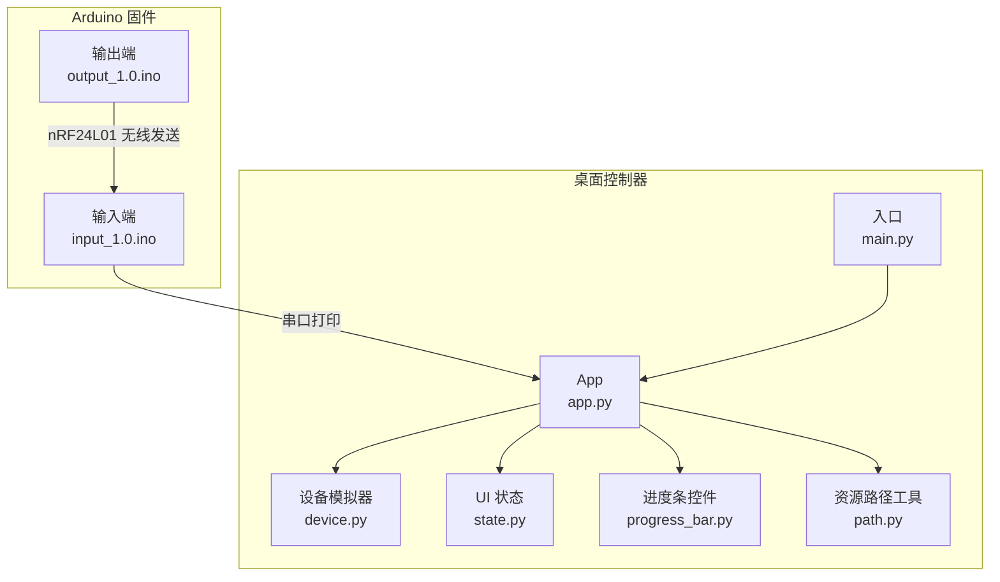
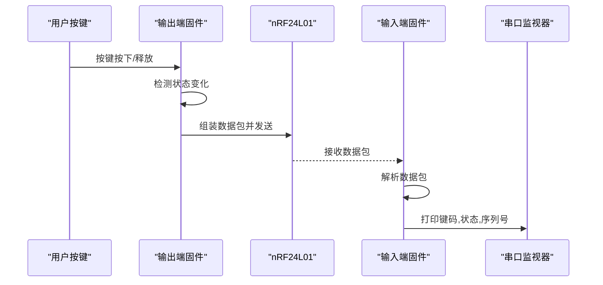
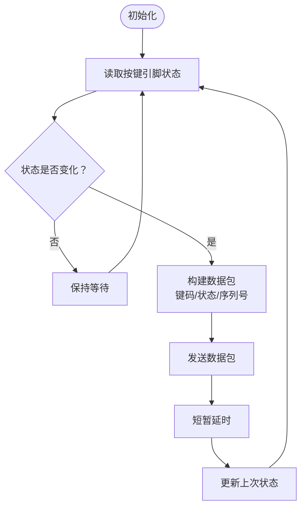
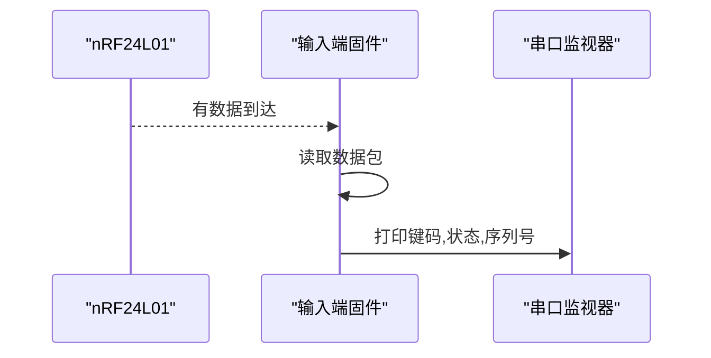
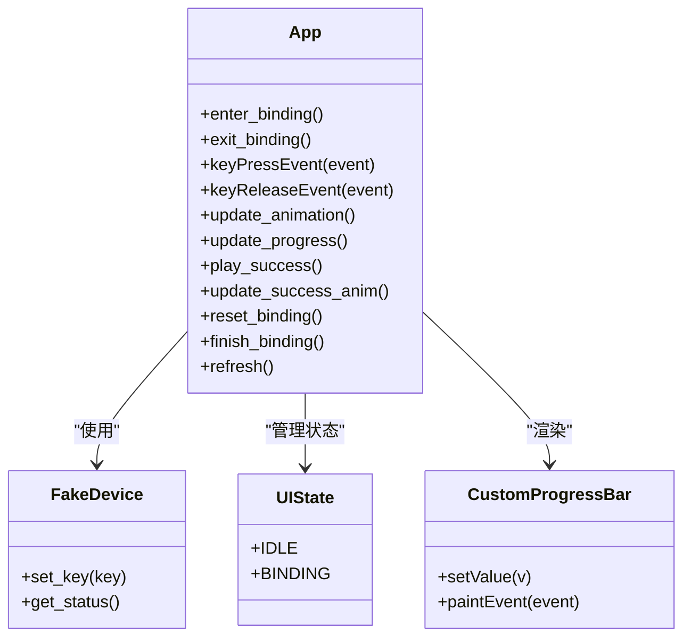
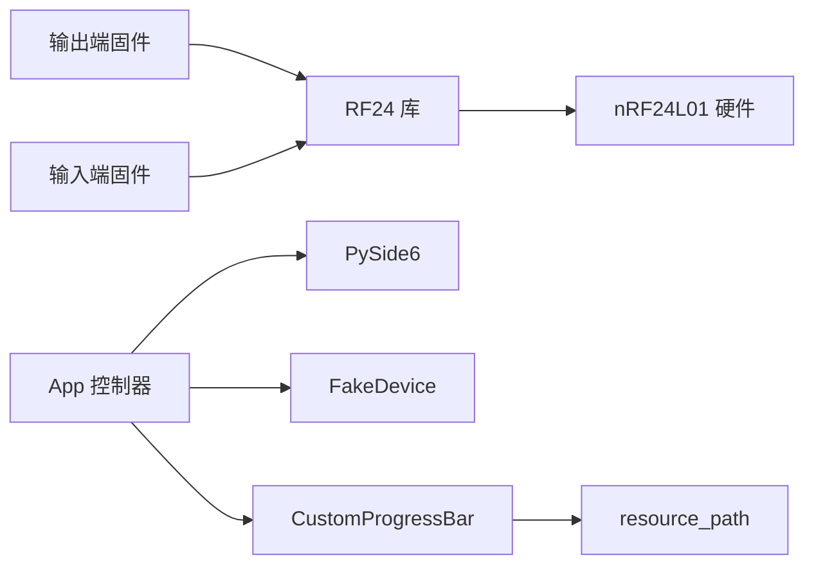

# 硬件系统设计

<cite>
**本文引用的文件**
- [input_1.0.ino](file://board/input_1.0/input_1.0.ino)
- [output_1.0.ino](file://board/output_1.0/output_1.0.ino)
- [README.md](file://README.md)
- [device.py](file://controller/core/device.py)
- [state.py](file://controller/core/state.py)
- [app.py](file://controller/app.py)
- [main.py](file://controller/main.py)
- [progress_bar.py](file://controller/ui/progress_bar.py)
- [path.py](file://controller/utils/path.py)
</cite>

## 目录
1. [简介](#简介)
2. [项目结构](#项目结构)
3. [核心组件](#核心组件)
4. [架构总览](#架构总览)
5. [详细组件分析](#详细组件分析)
6. [依赖分析](#依赖分析)
7. [性能考虑](#性能考虑)
8. [故障排查指南](#故障排查指南)
9. [结论](#结论)
10. [附录](#附录)

## 简介
本项目是一个基于 nRF24L01 无线模块的简易无线键盘玩具系统，包含输入端与输出端两套固件，以及一个用于演示与绑定流程的桌面控制器界面。输入端负责接收来自输出端的按键事件并转发到串口；输出端负责检测物理按键状态变化并通过 nRF24L01 发送数据包；桌面控制器提供按键绑定的可视化交互体验。

## 项目结构
仓库采用分层组织：
- board：Arduino 固件源码，分别存放输入端与输出端的实现
- controller：桌面控制器（Python + PySide6），用于演示与绑定流程
- README：项目说明

图表来源
- [input_1.0.ino:1-35](file://board/input_1.0/input_1.0.ino#L1-L35)
- [output_1.0.ino:1-43](file://board/output_1.0/output_1.0.ino#L1-L43)
- [app.py:1-202](file://controller/app.py#L1-L202)
- [main.py:1-8](file://controller/main.py#L1-L8)
- [device.py:1-11](file://controller/core/device.py#L1-L11)
- [state.py:1-3](file://controller/core/state.py#L1-L3)
- [progress_bar.py:1-28](file://controller/ui/progress_bar.py#L1-L28)
- [path.py:1-10](file://controller/utils/path.py#L1-L10)

章节来源
- [README.md:1-1](file://README.md#L1-L1)
- [input_1.0.ino:1-35](file://board/input_1.0/input_1.0.ino#L1-L35)
- [output_1.0.ino:1-43](file://board/output_1.0/output_1.0.ino#L1-L43)
- [app.py:1-202](file://controller/app.py#L1-L202)
- [main.py:1-8](file://controller/main.py#L1-L8)

## 核心组件
- nRF24L01 无线模块：负责输入端与输出端之间的短距离无线通信
- Arduino 输出端固件：检测按键状态变化，封装数据包并通过 nRF24L01 发送
- Arduino 输入端固件：监听无线数据，解析并打印到串口
- 桌面控制器：PySide6 应用，展示电池与按键状态，提供按键绑定流程的可视化

章节来源
- [input_1.0.ino:1-35](file://board/input_1.0/input_1.0.ino#L1-L35)
- [output_1.0.ino:1-43](file://board/output_1.0/output_1.0.ino#L1-L43)
- [app.py:1-202](file://controller/app.py#L1-L202)

## 架构总览
系统采用“按键采集 -> 无线发送 -> 无线接收 -> 串口打印”的链路。输出端通过按键检测产生事件，输入端接收后在串口上打印三元组（键码、状态、序列号）。桌面控制器通过模拟设备接口展示状态，并提供按键绑定流程。

图表来源
- [output_1.0.ino:28-43](file://board/output_1.0/output_1.0.ino#L28-L43)
- [input_1.0.ino:24-35](file://board/input_1.0/input_1.0.ino#L24-L35)

## 详细组件分析

### 输出端固件（按键采集与无线发送）
- 硬件连接
  - 按键一端连接数字引脚，另一端通过上拉电阻接高电平
  - nRF24L01 的 CE/CSN 引脚分别连接到 Arduino 数字引脚 9 和 10
  - SPI 总线由 Arduino 的 MOSI/MISO/SCK 引脚连接至 nRF24L01
- 数据包结构
  - 包含键码、状态、序列号三个字段，用于标识按键事件与顺序
- 事件处理
  - 读取按键引脚状态，检测与上次状态的差异
  - 将事件打包并通过 nRF24L01 发送
  - 发送后延时以抑制抖动
- 配置要点
  - 使用低功率模式以降低功耗
  - 写入管道配置，停止监听以进入发送模式

图表来源
- [output_1.0.ino:19-43](file://board/output_1.0/output_1.0.ino#L19-L43)

章节来源
- [output_1.0.ino:1-43](file://board/output_1.0/output_1.0.ino#L1-L43)

### 输入端固件（无线接收与串口转发）
- 硬件连接
  - nRF24L01 引脚与输出端一致，使用相同 SPI 引脚
  - CE/CSN 分别连接到数字引脚 9 和 10
- 接收逻辑
  - 初始化无线模块，配置读取管道
  - 循环检查是否有可用数据
  - 读取完整数据包并打印到串口，格式为“键码,状态,序列号”
- 作用
  - 将无线事件转换为串口可见日志，便于调试与验证

图表来源
- [input_1.0.ino:16-35](file://board/input_1.0/input_1.0.ino#L16-L35)

章节来源
- [input_1.0.ino:1-35](file://board/input_1.0/input_1.0.ino#L1-L35)

### 桌面控制器（按键绑定与状态展示）
- 功能概述
  - 展示电池电量与当前按键名称
  - 提供“修改按键”按钮，进入绑定流程
  - 绑定时显示进度条与动画，完成绑定后刷新状态
- 绑定流程
  - 用户在绑定状态下按键，进度条随时间推进
  - 达到阈值后播放成功动画并完成绑定
  - 将当前按键名称写入模拟设备
- UI 组件
  - 自定义进度条控件，支持裁剪填充图像
  - 资源路径工具，兼容打包后的可执行文件

图表来源
- [app.py:12-202](file://controller/app.py#L12-L202)
- [device.py:1-11](file://controller/core/device.py#L1-L11)
- [state.py:1-3](file://controller/core/state.py#L1-L3)
- [progress_bar.py:5-28](file://controller/ui/progress_bar.py#L5-L28)

章节来源
- [app.py:1-202](file://controller/app.py#L1-L202)
- [device.py:1-11](file://controller/core/device.py#L1-L11)
- [state.py:1-3](file://controller/core/state.py#L1-L3)
- [progress_bar.py:1-28](file://controller/ui/progress_bar.py#L1-L28)
- [path.py:1-10](file://controller/utils/path.py#L1-L10)
- [main.py:1-8](file://controller/main.py#L1-L8)

## 依赖分析
- Arduino 固件
  - 使用 RF24 库与 nRF24L01 通信
  - 通过 SPI 接口访问 nRF24L01
- 桌面控制器
  - PySide6 作为 GUI 框架
  - 自定义进度条控件继承 QWidget 并重绘
  - 资源路径工具支持打包后的运行环境

图表来源
- [input_1.0.ino:1-3](file://board/input_1.0/input_1.0.ino#L1-L3)
- [output_1.0.ino:1-3](file://board/output_1.0/output_1.0.ino#L1-L3)
- [app.py:1-10](file://controller/app.py#L1-L10)
- [progress_bar.py:1-4](file://controller/ui/progress_bar.py#L1-L4)
- [path.py:1-10](file://controller/utils/path.py#L1-L10)

章节来源
- [input_1.0.ino:1-3](file://board/input_1.0/input_1.0.ino#L1-L3)
- [output_1.0.ino:1-3](file://board/output_1.0/output_1.0.ino#L1-L3)
- [app.py:1-10](file://controller/app.py#L1-L10)
- [progress_bar.py:1-4](file://controller/ui/progress_bar.py#L1-L4)
- [path.py:1-10](file://controller/utils/path.py#L1-L10)

## 性能考虑
- 抖动抑制
  - 输出端在发送后进行短暂延时，减少机械按键抖动带来的重复触发
- 功耗优化
  - 输出端设置为低功率模式，适合电池供电场景
- 无线可靠性
  - 使用固定地址与管道配置，确保点对点通信稳定
- UI 响应性
  - 控制器中使用定时器驱动动画与进度，避免阻塞主线程

## 故障排查指南
- 无法接收数据
  - 检查输入端的读取管道地址是否与输出端一致
  - 确认 nRF24L01 引脚连接正确且 SPI 正常
- 串口无输出
  - 确认串口监视器波特率设置为固件中使用的速率
  - 检查输入端是否处于监听状态
- 按键无响应
  - 确认按键一端连接到数字引脚，另一端通过上拉电阻接高电平
  - 检查按键状态检测逻辑与上次状态比较
- 绑定流程异常
  - 确认进入绑定状态后按键事件被正确捕获
  - 检查进度条更新与动画定时器是否启动

章节来源
- [input_1.0.ino:16-35](file://board/input_1.0/input_1.0.ino#L16-L35)
- [output_1.0.ino:19-43](file://board/output_1.0/output_1.0.ino#L19-L43)
- [app.py:77-197](file://controller/app.py#L77-L197)

## 结论
本项目通过简洁的硬件与软件设计实现了从按键到无线传输再到可视化反馈的完整链路。输出端专注于按键检测与事件发送，输入端专注于接收与日志输出，桌面控制器提供直观的绑定与状态展示。该架构易于扩展，可进一步引入按键矩阵、LED 指示灯、更多通信协议或更复杂的事件处理逻辑。

## 附录

### 硬件组件清单与连接说明
- 关键组件
  - nRF24L01 无线模块：负责短距离无线通信
  - Arduino 板：运行固件，处理按键与无线通信
  - 按键：物理输入，连接到 Arduino 数字引脚
  - 上拉电阻：确保按键未按下时引脚处于高电平
- 引脚分配
  - nRF24L01 CE/CSN 分别连接到 Arduino 数字引脚 9/10
  - SPI 引脚（MOSI/MISO/SCK）连接到 Arduino 对应引脚
  - 按键一端连接数字引脚，另一端通过上拉电阻接 VCC
- 电路连接图示意
  - 输出端：按键 -> 数字引脚 -> 上拉电阻 -> VCC；nRF24L01 -> SPI 引脚
  - 输入端：nRF24L01 -> SPI 引脚；串口连接至 PC

章节来源
- [output_1.0.ino:5-26](file://board/output_1.0/output_1.0.ino#L5-L26)
- [input_1.0.ino:5-22](file://board/input_1.0/input_1.0.ino#L5-L22)

### 数据包格式与通信时序
- 数据包结构
  - 键码：表示按键标识
  - 状态：表示按键按下/释放
  - 序列号：递增计数，用于事件排序
- 通信时序
  - 输出端检测按键状态变化，组装数据包并发送
  - 输入端持续监听，收到数据后解析并打印

章节来源
- [output_1.0.ino:13-37](file://board/output_1.0/output_1.0.ino#L13-L37)
- [input_1.0.ino:8-34](file://board/input_1.0/input_1.0.ino#L8-L34)

### 桌面控制器功能说明
- 状态展示
  - 显示电池电量与当前按键名称
- 绑定流程
  - 进入绑定状态后，按键事件触发进度条增长
  - 达到阈值后播放成功动画并完成绑定
- 资源与路径
  - 自定义进度条控件使用背景与填充图像
  - 资源路径工具兼容打包后的可执行文件

章节来源
- [app.py:12-202](file://controller/app.py#L12-L202)
- [progress_bar.py:5-28](file://controller/ui/progress_bar.py#L5-L28)
- [path.py:4-10](file://controller/utils/path.py#L4-L10)