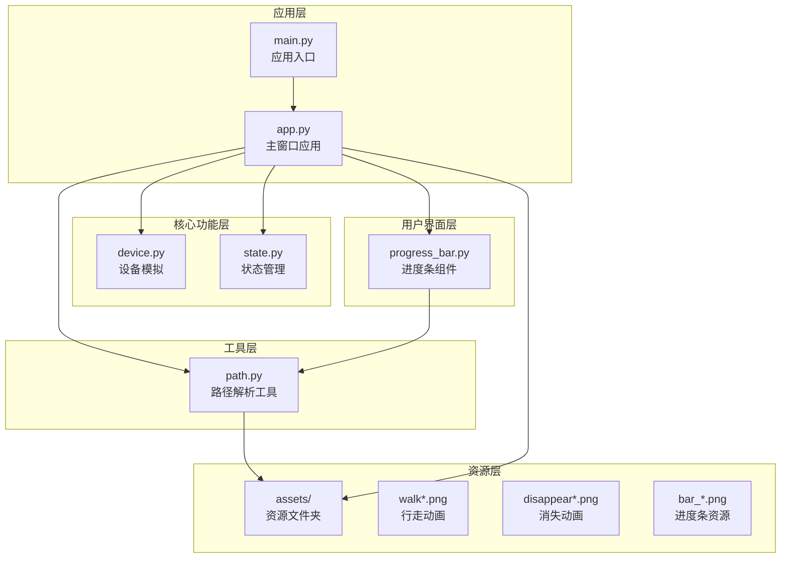
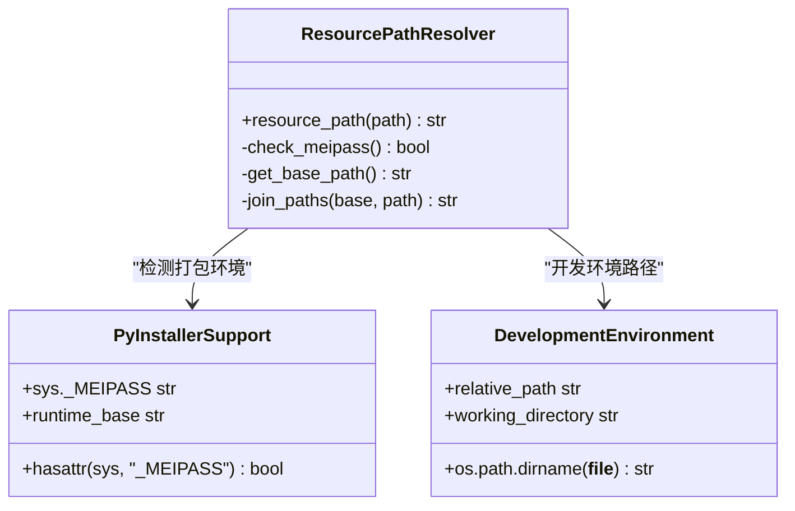
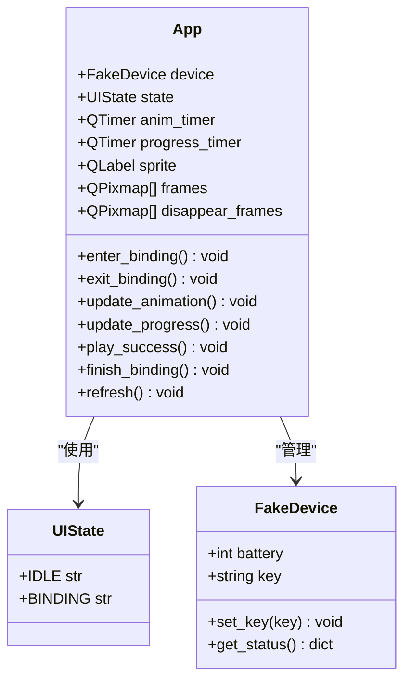
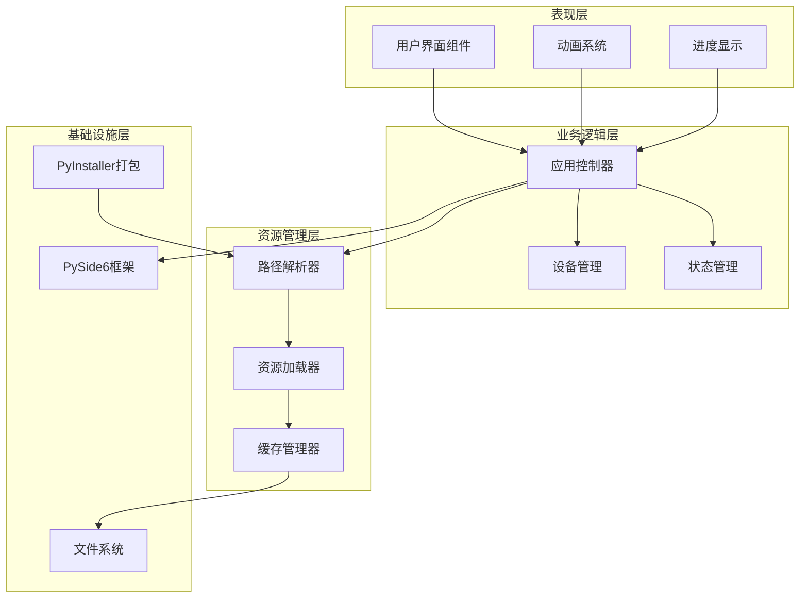
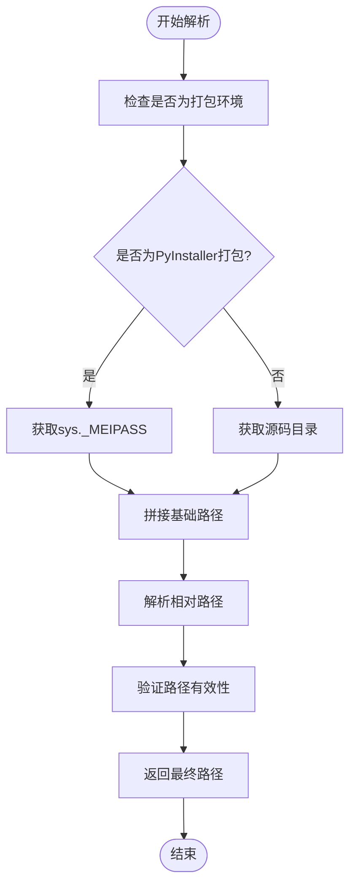
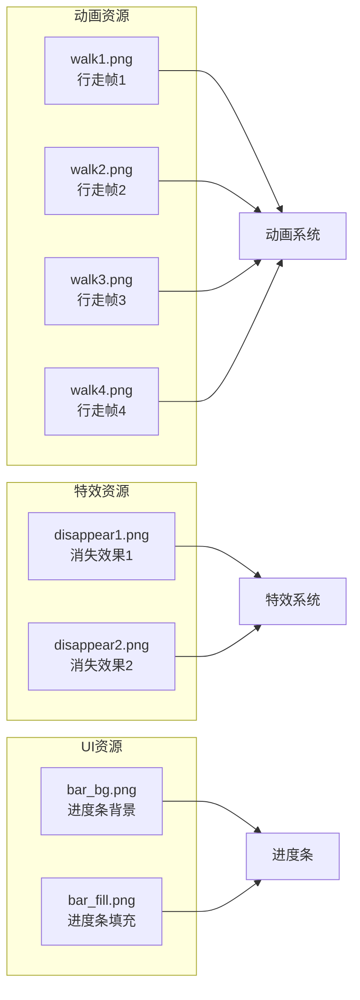
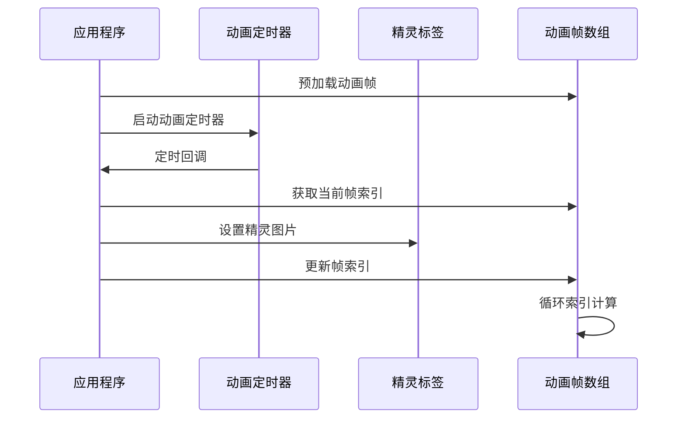
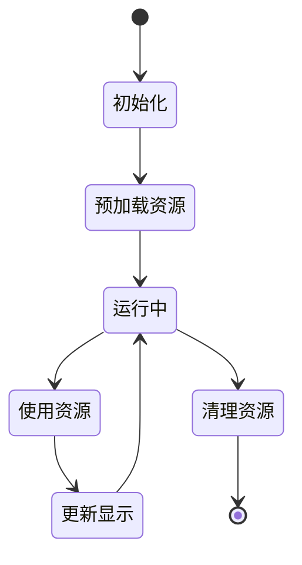
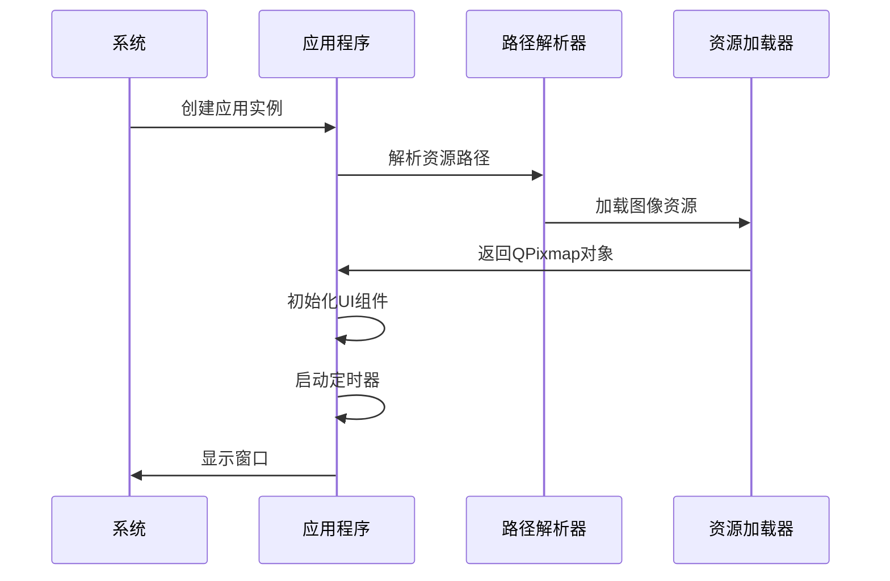
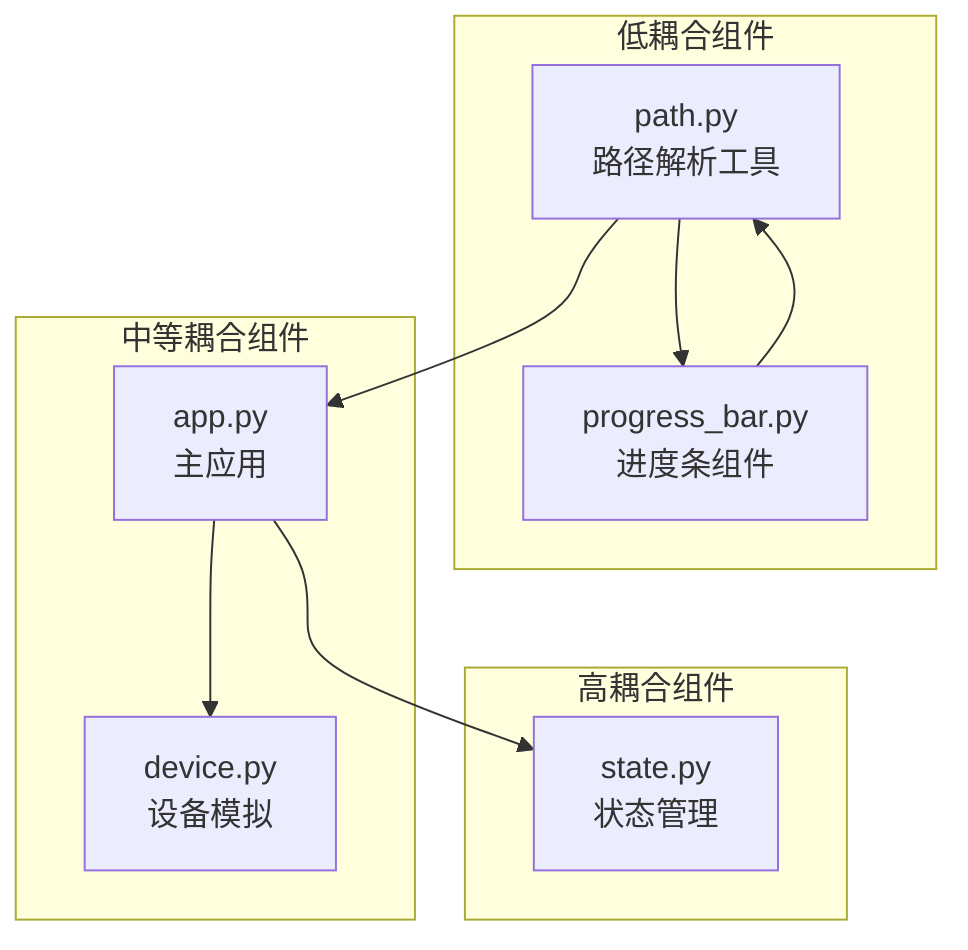

# 资源管理系统技术文档

<cite>
**本文档中引用的文件**
- [controller/utils/path.py](file://controller/utils/path.py)
- [controller/app.py](file://controller/app.py)
- [controller/main.py](file://controller/main.py)
- [controller/core/device.py](file://controller/core/device.py)
- [controller/core/state.py](file://controller/core/state.py)
- [controller/ui/progress_bar.py](file://controller/ui/progress_bar.py)
- [README.md](file://README.md)
</cite>

## 目录
1. [简介](#简介)
2. [项目结构](#项目结构)
3. [核心组件](#核心组件)
4. [架构概览](#架构概览)
5. [详细组件分析](#详细组件分析)
6. [依赖关系分析](#依赖关系分析)
7. [性能考虑](#性能考虑)
8. [故障排除指南](#故障排除指南)
9. [结论](#结论)

## 简介

本项目是一个基于PySide6的无线键盘控制器应用，实现了完整的资源管理系统。该系统专注于跨平台资源路径解析、PyInstaller打包支持以及资源文件的高效管理。系统通过统一的资源路径解析工具，确保在开发环境和打包后的应用程序中都能正确加载资源文件。

## 项目结构

项目采用模块化架构设计，主要分为以下几个核心模块：

**图表来源**
- [controller/main.py:1-8](file://controller/main.py#L1-L8)
- [controller/app.py:1-202](file://controller/app.py#L1-L202)
- [controller/utils/path.py:1-10](file://controller/utils/path.py#L1-L10)

**章节来源**
- [controller/main.py:1-8](file://controller/main.py#L1-L8)
- [controller/app.py:1-202](file://controller/app.py#L1-L202)
- [controller/utils/path.py:1-10](file://controller/utils/path.py#L1-L10)

## 核心组件

### 资源路径解析工具

资源路径解析是整个系统的核心组件，负责在不同运行环境中正确解析资源文件路径。

**图表来源**
- [controller/utils/path.py:4-10](file://controller/utils/path.py#L4-L10)

### 应用程序主窗口

主窗口类负责管理所有UI组件和资源加载，实现了完整的动画系统。

**图表来源**
- [controller/app.py:12-202](file://controller/app.py#L12-L202)
- [controller/core/state.py:1-3](file://controller/core/state.py#L1-L3)
- [controller/core/device.py:1-11](file://controller/core/device.py#L1-L11)

**章节来源**
- [controller/utils/path.py:1-10](file://controller/utils/path.py#L1-L10)
- [controller/app.py:1-202](file://controller/app.py#L1-L202)
- [controller/core/state.py:1-3](file://controller/core/state.py#L1-L3)
- [controller/core/device.py:1-11](file://controller/core/device.py#L1-L11)

## 架构概览

系统采用分层架构设计，实现了清晰的关注点分离：

**图表来源**
- [controller/app.py:1-202](file://controller/app.py#L1-L202)
- [controller/utils/path.py:1-10](file://controller/utils/path.py#L1-L10)

## 详细组件分析

### 资源路径解析机制

#### 绝对路径与相对路径处理逻辑

资源路径解析工具实现了智能的路径解析策略，能够适应不同的运行环境：

**图表来源**
- [controller/utils/path.py:4-10](file://controller/utils/path.py#L4-L10)

#### 跨平台资源处理策略

系统通过统一的路径解析接口，实现了跨平台兼容性：

- **Windows系统**: 使用反斜杠路径分隔符
- **Linux/macOS**: 使用正斜杠路径分隔符  
- **PyInstaller打包**: 自动定位临时解压目录
- **开发环境**: 相对路径解析到项目根目录

**章节来源**
- [controller/utils/path.py:1-10](file://controller/utils/path.py#L1-L10)

### 资源文件组织结构

#### 图像资源分类管理

系统中的图像资源按照功能进行分类管理：

**图表来源**
- [controller/app.py:52-60](file://controller/app.py#L52-L60)
- [controller/ui/progress_bar.py:10-11](file://controller/ui/progress_bar.py#L10-L11)

#### 动画帧处理方式

系统实现了高效的动画帧管理机制：

**图表来源**
- [controller/app.py:140-146](file://controller/app.py#L140-L146)
- [controller/app.py:62-74](file://controller/app.py#L62-L74)

**章节来源**
- [controller/app.py:51-61](file://controller/app.py#L51-L61)
- [controller/app.py:140-146](file://controller/app.py#L140-L146)

### 资源文件加载优化

#### 预加载策略

系统采用了预加载机制来优化资源访问性能：

- **静态资源预加载**: 在应用初始化时加载所有必需的图像资源
- **内存缓存**: 使用QPixmap对象缓存已加载的图像数据
- **延迟加载**: 对于不常用的资源采用按需加载策略

#### 资源生命周期管理

**图表来源**
- [controller/app.py:51-75](file://controller/app.py#L51-L75)

**章节来源**
- [controller/app.py:51-75](file://controller/app.py#L51-L75)

### 应用程序启动和运行时生命周期

#### 启动流程

**图表来源**
- [controller/main.py:1-8](file://controller/main.py#L1-L8)
- [controller/app.py:12-75](file://controller/app.py#L12-L75)

#### 运行时管理

系统在运行时实现了完整的资源管理：

- **状态监控**: 实时跟踪资源使用情况
- **内存管理**: 自动清理不再使用的资源
- **错误处理**: 捕获并处理资源加载异常

**章节来源**
- [controller/main.py:1-8](file://controller/main.py#L1-L8)
- [controller/app.py:12-202](file://controller/app.py#L12-L202)

## 依赖关系分析

### 组件耦合度分析

**图表来源**
- [controller/utils/path.py:1-10](file://controller/utils/path.py#L1-L10)
- [controller/app.py:1-202](file://controller/app.py#L1-L202)
- [controller/ui/progress_bar.py:1-28](file://controller/ui/progress_bar.py#L1-L28)

### 外部依赖关系

系统对外部依赖的管理：

- **PySide6**: GUI框架，提供Qt组件和功能
- **PyInstaller**: 打包工具，支持跨平台分发
- **Python标准库**: os、sys模块用于系统交互

**章节来源**
- [controller/app.py:1-10](file://controller/app.py#L1-L10)
- [controller/ui/progress_bar.py:1-4](file://controller/ui/progress_bar.py#L1-L4)

## 性能考虑

### 资源加载性能优化

1. **预加载策略**: 在应用启动时一次性加载所有必需资源
2. **内存缓存**: 使用QPixmap对象缓存图像数据，避免重复解码
3. **异步加载**: 对于大型资源可考虑异步加载机制

### 内存使用优化

- **及时释放**: 在不需要时及时释放QPixmap对象
- **资源复用**: 同一资源在多处使用时共享同一QPixmap实例
- **垃圾回收**: 利用Python的垃圾回收机制自动管理内存

## 故障排除指南

### 常见问题及解决方案

#### 资源文件无法找到

**问题症状**: 应用启动时报错，提示资源文件不存在

**可能原因**:
1. 资源文件路径错误
2. PyInstaller打包时资源未正确包含
3. 文件权限问题

**解决方法**:
1. 检查资源路径是否正确
2. 确认资源文件在打包配置中
3. 验证文件权限设置

#### 资源加载性能问题

**问题症状**: 应用启动缓慢或运行时卡顿

**可能原因**:
1. 资源文件过大
2. 同时加载过多资源
3. 缺少适当的缓存机制

**解决方法**:
1. 优化图像文件大小
2. 实现分批加载策略
3. 增加缓存管理机制

**章节来源**
- [controller/utils/path.py:4-10](file://controller/utils/path.py#L4-L10)
- [controller/app.py:51-61](file://controller/app.py#L51-L61)

## 结论

本资源管理系统通过精心设计的架构和实现策略，成功解决了跨平台资源管理的关键挑战。系统的主要优势包括：

1. **跨平台兼容性**: 通过智能路径解析支持多种运行环境
2. **打包支持**: 完美适配PyInstaller打包流程
3. **性能优化**: 采用预加载和缓存机制提升运行效率
4. **易于维护**: 清晰的模块划分和职责分离

该系统为类似的应用程序提供了优秀的资源管理参考实现，特别是在需要支持打包分发和跨平台部署的场景中具有很高的实用价值。