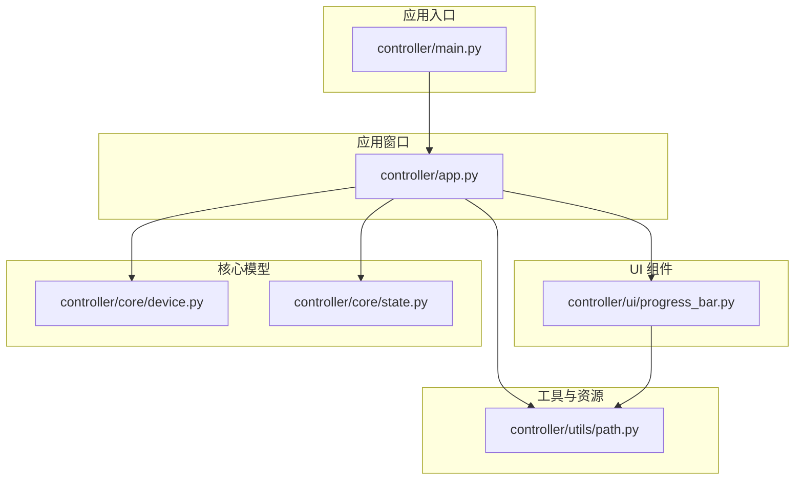
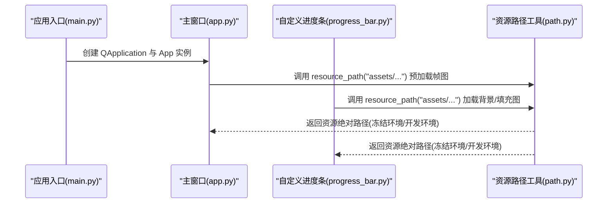
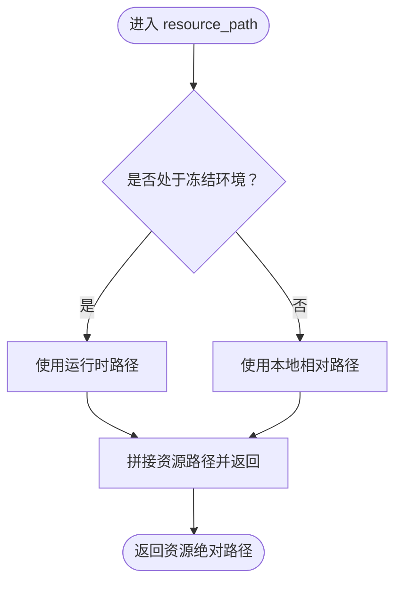
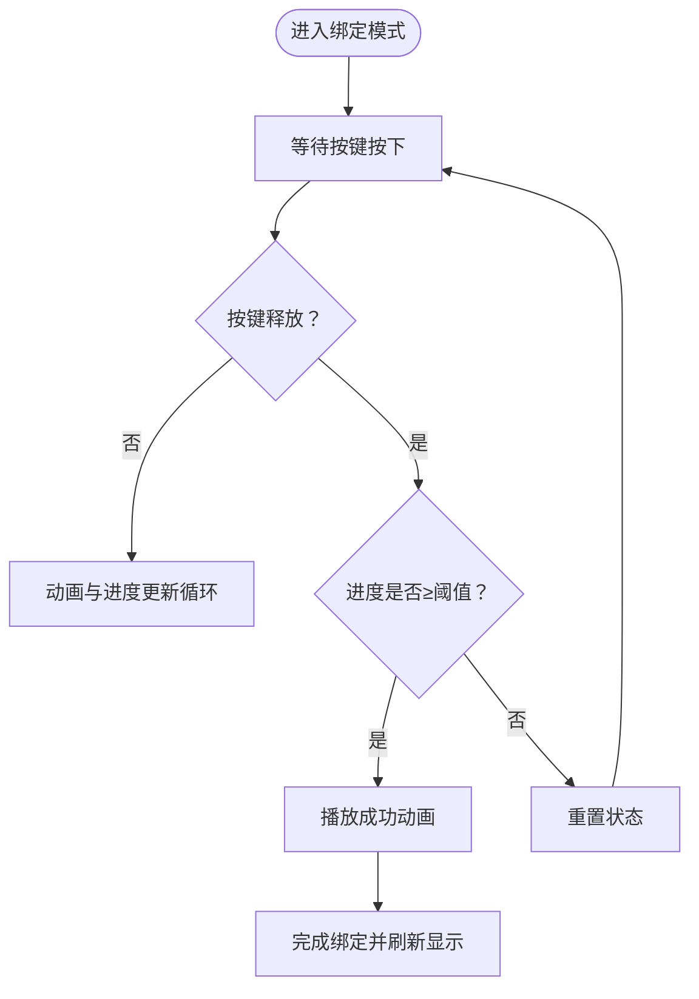
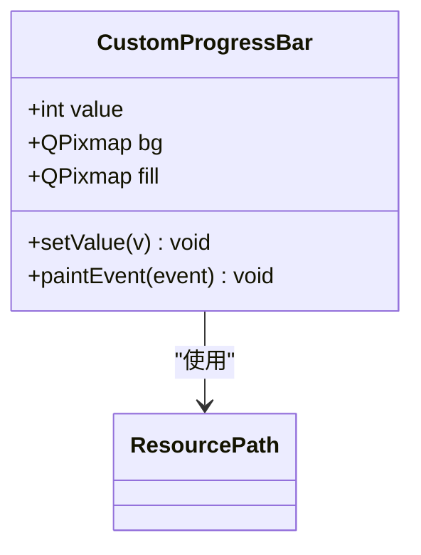
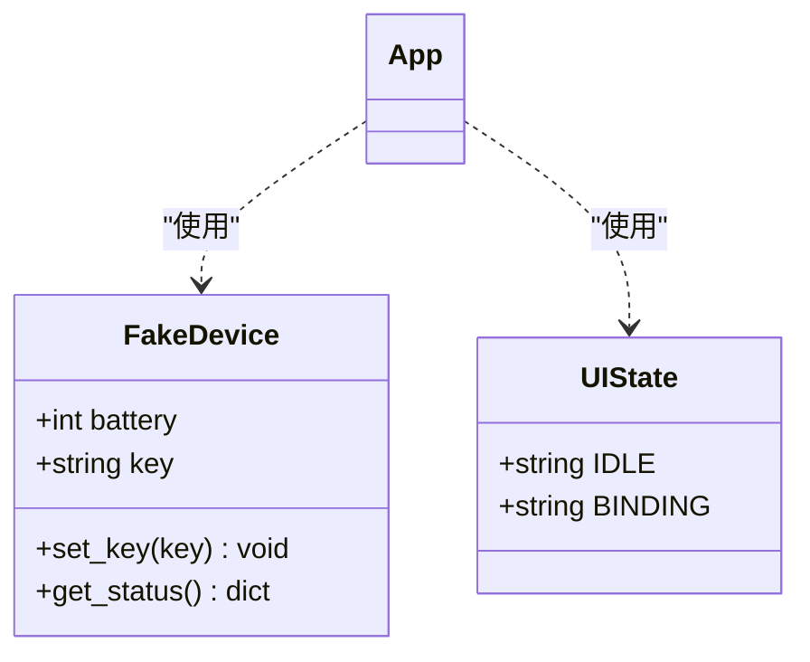
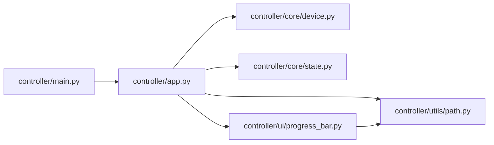

# 应用打包

<cite>
**本文引用的文件**
- [controller/main.py](file://controller/main.py)
- [controller/app.py](file://controller/app.py)
- [controller/utils/path.py](file://controller/utils/path.py)
- [controller/ui/progress_bar.py](file://controller/ui/progress_bar.py)
- [controller/core/device.py](file://controller/core/device.py)
- [controller/core/state.py](file://controller/core/state.py)
- [.gitignore](file://.gitignore)
- [README.md](file://README.md)
</cite>

## 目录
1. [简介](#简介)
2. [项目结构](#项目结构)
3. [核心组件](#核心组件)
4. [架构总览](#架构总览)
5. [详细组件分析](#详细组件分析)
6. [依赖分析](#依赖分析)
7. [性能考虑](#性能考虑)
8. [故障排查指南](#故障排查指南)
9. [结论](#结论)
10. [附录](#附录)

## 简介
本文件面向“无线键盘玩具”项目的打包与分发场景，围绕 PyInstaller 打包展开，系统阐述以下主题：
- spec 文件配置要点与隐藏导入处理
- 资源文件打包策略与路径解析的跨平台兼容性
- 不同操作系统的打包差异（Windows、macOS、Linux）
- 依赖库管理策略（PySide6、nRF24L01相关库）
- 打包优化技巧（体积与启动时间）
- 常见打包错误的诊断与解决

## 项目结构
该项目采用按功能域划分的模块化组织方式，核心入口为 Qt 应用程序，UI 组件与业务逻辑分离，资源通过统一的资源路径解析函数访问。

图表来源
- [controller/main.py:1-8](file://controller/main.py#L1-L8)
- [controller/app.py:12-75](file://controller/app.py#L12-L75)
- [controller/ui/progress_bar.py:1-28](file://controller/ui/progress_bar.py#L1-L28)
- [controller/utils/path.py:1-10](file://controller/utils/path.py#L1-L10)
- [controller/core/device.py:1-11](file://controller/core/device.py#L1-L11)
- [controller/core/state.py:1-3](file://controller/core/state.py#L1-L3)

章节来源
- [controller/main.py:1-8](file://controller/main.py#L1-L8)
- [controller/app.py:12-75](file://controller/app.py#L12-L75)
- [controller/ui/progress_bar.py:1-28](file://controller/ui/progress_bar.py#L1-L28)
- [controller/utils/path.py:1-10](file://controller/utils/path.py#L1-L10)
- [controller/core/device.py:1-11](file://controller/core/device.py#L1-L11)
- [controller/core/state.py:1-3](file://controller/core/state.py#L1-L3)

## 核心组件
- 应用入口：负责创建 QApplication 并展示主窗口，作为 PyInstaller 的打包入口点。
- 主窗口 App：承载 UI 状态、事件处理、动画与进度条更新，使用资源路径解析函数加载图片资源。
- 自定义进度条：继承 QWidget，使用资源路径解析函数加载背景与填充图。
- 资源路径工具：在冻结环境下通过 PyInstaller 注入的运行时路径访问资源。
- 设备与状态：提供虚拟设备接口与 UI 状态枚举。

章节来源
- [controller/main.py:1-8](file://controller/main.py#L1-L8)
- [controller/app.py:12-75](file://controller/app.py#L12-L75)
- [controller/ui/progress_bar.py:1-28](file://controller/ui/progress_bar.py#L1-L28)
- [controller/utils/path.py:1-10](file://controller/utils/path.py#L1-L10)
- [controller/core/device.py:1-11](file://controller/core/device.py#L1-L11)
- [controller/core/state.py:1-3](file://controller/core/state.py#L1-L3)

## 架构总览
下图展示了从应用入口到资源加载的关键调用链，以及资源路径解析在运行时的差异行为。

图表来源
- [controller/main.py:1-8](file://controller/main.py#L1-L8)
- [controller/app.py:52-60](file://controller/app.py#L52-L60)
- [controller/ui/progress_bar.py:9-11](file://controller/ui/progress_bar.py#L9-L11)
- [controller/utils/path.py:4-10](file://controller/utils/path.py#L4-L10)

## 详细组件分析

### 资源路径解析与跨平台兼容
- 资源路径工具在冻结环境下通过 PyInstaller 注入的运行时路径访问资源；在开发环境下回退到相对路径。
- 主窗口与进度条组件均通过该工具加载图片资源，确保打包后仍能正确解析路径。

图表来源
- [controller/utils/path.py:4-10](file://controller/utils/path.py#L4-L10)

章节来源
- [controller/utils/path.py:1-10](file://controller/utils/path.py#L1-L10)
- [controller/app.py:52-60](file://controller/app.py#L52-L60)
- [controller/ui/progress_bar.py:9-11](file://controller/ui/progress_bar.py#L9-L11)

### 主窗口与事件循环
- 主窗口负责状态切换、按键事件处理、动画与进度条更新。
- 使用定时器驱动动画帧切换与进度推进，在达到阈值后播放成功动画并完成绑定流程。

图表来源
- [controller/app.py:77-197](file://controller/app.py#L77-L197)

章节来源
- [controller/app.py:77-197](file://controller/app.py#L77-L197)

### 自定义进度条绘制
- 继承 QWidget，重写绘制事件，按当前进度裁剪填充图并绘制。
- 通过资源路径工具加载背景与填充图，保证打包后可用。

图表来源
- [controller/ui/progress_bar.py:5-28](file://controller/ui/progress_bar.py#L5-L28)
- [controller/utils/path.py:1-10](file://controller/utils/path.py#L1-L10)

章节来源
- [controller/ui/progress_bar.py:1-28](file://controller/ui/progress_bar.py#L1-L28)
- [controller/utils/path.py:1-10](file://controller/utils/path.py#L1-L10)

### 设备与状态模型
- 虚拟设备提供电池电量与当前按键的读写接口。
- UI 状态枚举用于控制窗口交互状态机。

图表来源
- [controller/core/device.py:1-11](file://controller/core/device.py#L1-L11)
- [controller/core/state.py:1-3](file://controller/core/state.py#L1-L3)
- [controller/app.py:21-22](file://controller/app.py#L21-L22)

章节来源
- [controller/core/device.py:1-11](file://controller/core/device.py#L1-L11)
- [controller/core/state.py:1-3](file://controller/core/state.py#L1-L3)
- [controller/app.py:21-22](file://controller/app.py#L21-L22)

## 依赖分析
- 入口模块仅依赖 Qt 应用框架与主窗口类。
- 主窗口依赖设备与状态模型、自定义进度条与资源路径工具。
- 进度条依赖资源路径工具与 Qt 绘图模块。
- 资源路径工具依赖标准库 os 与 sys。

图表来源
- [controller/main.py:1-8](file://controller/main.py#L1-L8)
- [controller/app.py:12-75](file://controller/app.py#L12-L75)
- [controller/core/device.py:1-11](file://controller/core/device.py#L1-L11)
- [controller/core/state.py:1-3](file://controller/core/state.py#L1-L3)
- [controller/utils/path.py:1-10](file://controller/utils/path.py#L1-L10)
- [controller/ui/progress_bar.py:1-28](file://controller/ui/progress_bar.py#L1-L28)

章节来源
- [controller/main.py:1-8](file://controller/main.py#L1-L8)
- [controller/app.py:12-75](file://controller/app.py#L12-L75)
- [controller/core/device.py:1-11](file://controller/core/device.py#L1-L11)
- [controller/core/state.py:1-3](file://controller/core/state.py#L1-L3)
- [controller/utils/path.py:1-10](file://controller/utils/path.py#L1-L10)
- [controller/ui/progress_bar.py:1-28](file://controller/ui/progress_bar.py#L1-L28)

## 性能考虑
- 启动时间优化
  - 将非关键初始化延迟至首次使用（例如资源预加载可改为按需加载）。
  - 减少不必要的模块导入与静态资源加载。
- 体积优化
  - 使用 PyInstaller 排除未使用的第三方库与系统库。
  - 合理设置二进制打包选项，避免冗余数据。
- 资源访问
  - 在冻结环境中尽量减少磁盘 IO，优先使用内存缓存已加载的资源。
  - 对于大图资源，建议在打包前进行压缩与格式优化。

## 故障排查指南
- 资源路径问题
  - 症状：运行时报找不到资源文件。
  - 排查：确认资源路径工具在冻结环境与开发环境的行为一致；检查资源是否被打包进应用。
- PySide6 相关问题
  - 症状：界面空白或控件不显示。
  - 排查：确认 PySide6 已被 PyInstaller 正确收集；必要时添加隐藏导入。
- nRF24L01 相关库问题
  - 症状：运行时报模块缺失或无法加载硬件相关库。
  - 排查：若项目中存在该库，请将其加入隐藏导入；如为系统库，确保目标平台具备对应运行时。
- Windows 可执行文件生成
  - 注意：Windows 下默认生成 .exe；如需生成 .msi 或 .appx，需额外配置安装器。
- macOS .app 包制作
  - 注意：macOS 下建议使用 --onedir 或 --windowed 选项；如需 .app 包，需在构建时指定相应参数。
- Linux 可执行文件创建
  - 注意：Linux 下生成的可执行文件通常为 ELF；如需打包为 AppImage，需额外配置打包工具。

章节来源
- [controller/utils/path.py:4-10](file://controller/utils/path.py#L4-L10)
- [controller/app.py:52-60](file://controller/app.py#L52-L60)
- [controller/ui/progress_bar.py:9-11](file://controller/ui/progress_bar.py#L9-L11)

## 结论
本项目基于 PySide6 的 Qt 应用，通过统一的资源路径解析实现跨平台资源访问。结合 PyInstaller 的隐藏导入与资源打包策略，可在多平台生成可执行文件。建议在实际打包时：
- 明确隐藏导入与资源打包范围；
- 针对不同平台调整构建参数；
- 采用体积与启动时间优化手段；
- 建立完善的故障排查流程。

## 附录

### PyInstaller 配置要点与最佳实践
- spec 文件配置
  - 入口脚本：指向应用入口模块。
  - 收集资源：将 assets 目录与相关数据文件纳入打包。
  - 隐藏导入：显式声明所有动态导入与第三方库。
  - 二进制打包：根据需要选择 --onedir 或 --onefile。
- 资源打包策略
  - 使用资源路径工具统一访问资源，确保冻结环境可用。
  - 对于图片等静态资源，建议在打包前进行尺寸与格式优化。
- 平台差异
  - Windows：默认生成 .exe；注意图标与版本信息注入。
  - macOS：建议生成 .app 包；注意签名与沙盒限制。
  - Linux：生成 ELF 可执行文件；如需便携包可考虑 AppImage。
- 依赖库管理
  - PySide6：确保 Qt 模块与插件被收集。
  - nRF24L01：如涉及底层库，需明确其运行时依赖并在目标平台提供。
- 打包优化
  - 体积：排除未使用模块与调试符号；启用压缩。
  - 启动：延迟初始化非关键组件；合并重复资源。
- 常见错误与解决
  - 资源缺失：检查资源路径与打包包含规则。
  - 模块导入失败：补充隐藏导入；确认第三方库版本兼容。
  - 平台特定问题：针对平台差异调整构建参数与权限。

章节来源
- [.gitignore:34-38](file://.gitignore#L34-L38)
- [controller/utils/path.py:4-10](file://controller/utils/path.py#L4-L10)
- [controller/app.py:52-60](file://controller/app.py#L52-L60)
- [controller/ui/progress_bar.py:9-11](file://controller/ui/progress_bar.py#L9-L11)