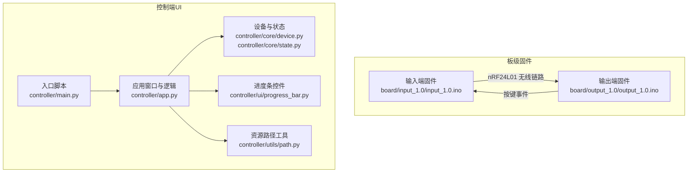
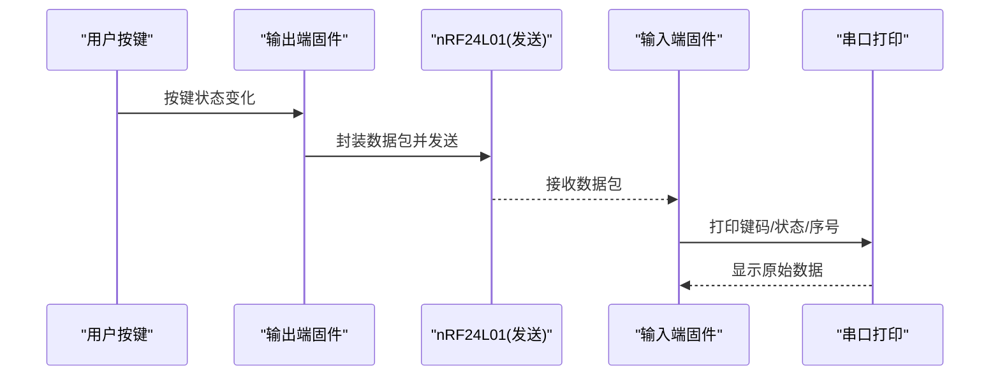
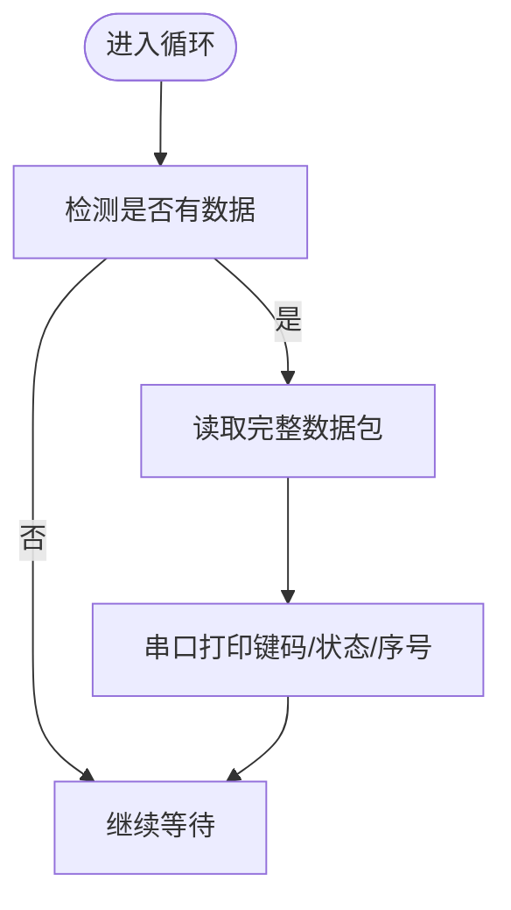
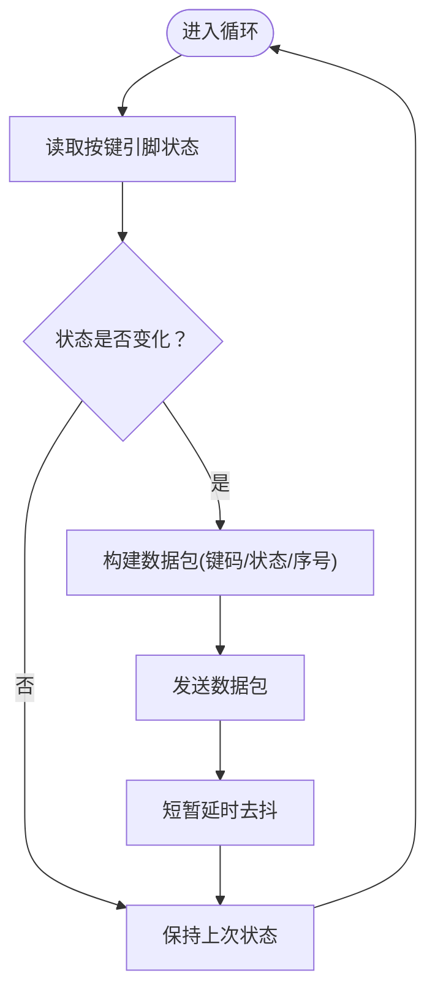
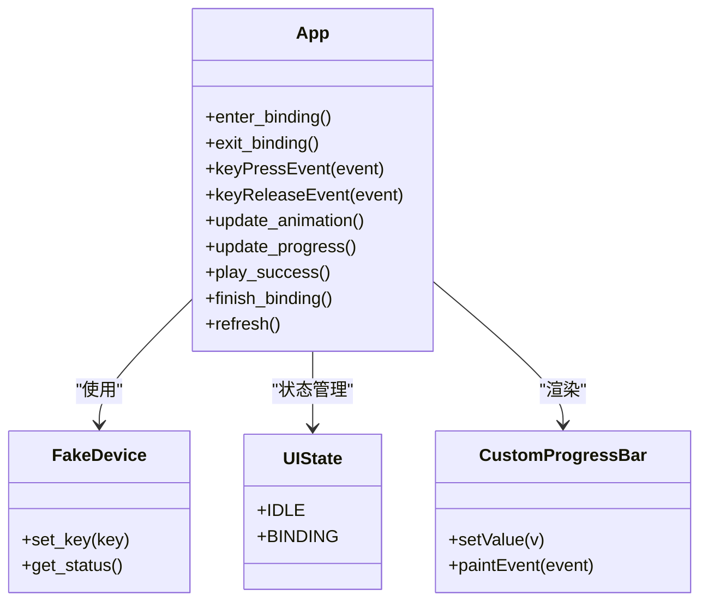
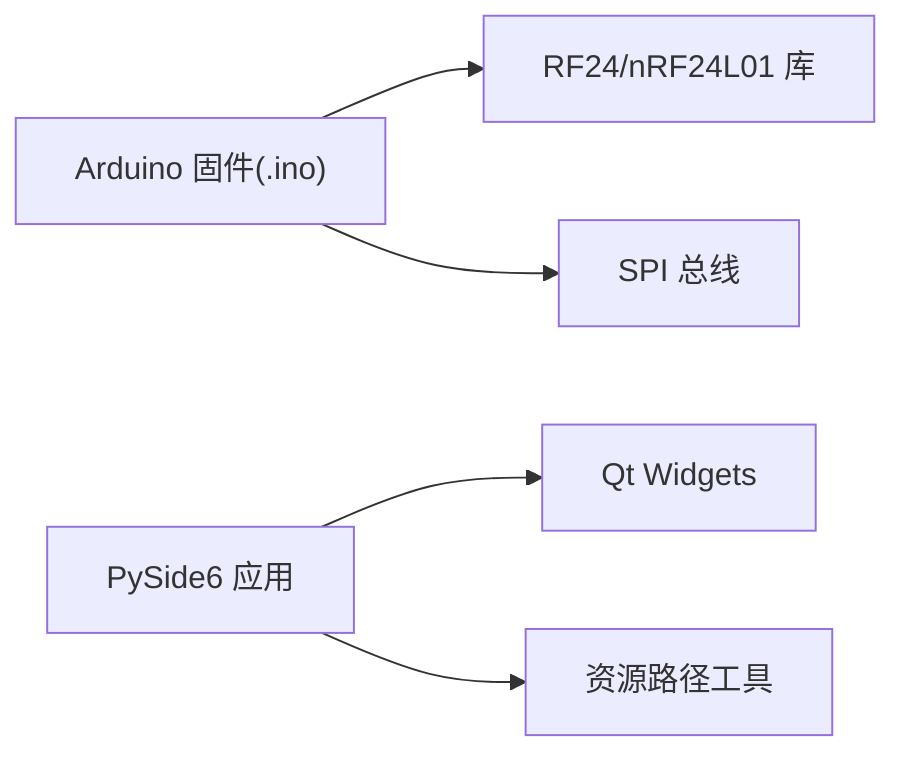

# 硬件部署

<cite>
**本文引用的文件**
- [input_1.0.ino](file://board/input_1.0/input_1.0.ino)
- [output_1.0.ino](file://board/output_1.0/output_1.0.ino)
- [README.md](file://README.md)
- [app.py](file://controller/app.py)
- [main.py](file://controller/main.py)
- [device.py](file://controller/core/device.py)
- [state.py](file://controller/core/state.py)
- [progress_bar.py](file://controller/ui/progress_bar.py)
- [path.py](file://controller/utils/path.py)
</cite>

## 目录
1. [简介](#简介)
2. [项目结构](#项目结构)
3. [核心组件](#核心组件)
4. [架构总览](#架构总览)
5. [详细组件分析](#详细组件分析)
6. [依赖关系分析](#依赖关系分析)
7. [性能与稳定性考量](#性能与稳定性考量)
8. [硬件部署操作指南](#硬件部署操作指南)
9. [硬件测试与验证](#硬件测试与验证)
10. [现场调试技巧](#现场调试技巧)
11. [批量部署与质量控制](#批量部署与质量控制)
12. [硬件兼容性检查清单](#硬件兼容性检查清单)
13. [常见问题与解决方案](#常见问题与解决方案)
14. [结论](#结论)

## 简介
本指南面向硬件工程师与技术运维人员，提供基于 nRF24L01 的无线键盘玩具系统的完整硬件部署方案。内容涵盖：
- Arduino 固件烧录流程（Arduino IDE 配置、编译选项、USB 连接与烧录）
- 输入端与输出端固件的差异化部署策略与硬件连接差异
- 硬件测试验证（串口通信、nRF24L01 模块功能）
- 现场调试技巧（硬件故障排查、信号强度、通信距离）
- 批量部署自动化与质量控制
- 硬件兼容性检查清单与常见问题解决

## 项目结构
该项目采用“板级固件 + 控制端 UI”的分层组织方式：
- board/input_1.0：输入端接收侧固件（监听并转发数据）
- board/output_1.0：输出端发送侧固件（按键采集并发送）
- controller：桌面端 UI 控制器（PySide6），用于演示与交互

图表来源
- [input_1.0.ino:1-35](file://board/input_1.0/input_1.0.ino#L1-L35)
- [output_1.0.ino:1-43](file://board/output_1.0/output_1.0.ino#L1-L43)
- [main.py:1-8](file://controller/main.py#L1-L8)
- [app.py:1-202](file://controller/app.py#L1-L202)
- [device.py:1-11](file://controller/core/device.py#L1-L11)
- [state.py:1-3](file://controller/core/state.py#L1-L3)
- [progress_bar.py:1-28](file://controller/ui/progress_bar.py#L1-L28)
- [path.py:1-10](file://controller/utils/path.py#L1-L10)

章节来源
- [README.md:1-1](file://README.md#L1-L1)
- [main.py:1-8](file://controller/main.py#L1-L8)

## 核心组件
- 输入端固件（接收侧）：初始化 nRF24L01 为接收模式，读取数据包并通过串口打印；负责将无线数据以明文形式透传到上位机。
- 输出端固件（发送侧）：初始化 nRF24L01 为发送模式，读取按键状态变化，封装数据包后通过无线发送；负责按键事件采集与无线上报。
- 控制端 UI：演示绑定流程与状态显示，使用进度条与动画反馈绑定结果。

章节来源
- [input_1.0.ino:16-35](file://board/input_1.0/input_1.0.ino#L16-L35)
- [output_1.0.ino:19-43](file://board/output_1.0/output_1.0.ino#L19-L43)
- [app.py:77-202](file://controller/app.py#L77-L202)

## 架构总览
系统由“发送端（输出端）—无线链路—接收端（输入端）”构成，控制端 UI 仅用于演示与交互，不参与实际无线通信。

图表来源
- [output_1.0.ino:28-43](file://board/output_1.0/output_1.0.ino#L28-L43)
- [input_1.0.ino:24-35](file://board/input_1.0/input_1.0.ino#L24-L35)

## 详细组件分析

### 输入端固件（接收侧）
- 初始化：开启串口、初始化 nRF24L01、配置接收管道、启动监听。
- 数据处理：当有可用数据时读取完整数据包，直接通过串口打印三元组（键码、状态、序列号）。
- 关键点：仅透传，不解析业务含义，便于上位机或测试工具直接观察原始帧。

图表来源
- [input_1.0.ino:24-35](file://board/input_1.0/input_1.0.ino#L24-L35)

章节来源
- [input_1.0.ino:16-35](file://board/input_1.0/input_1.0.ino#L16-L35)

### 输出端固件（发送侧）
- 初始化：配置按键引脚为上拉输入、初始化 nRF24L01、配置发送管道、设置发射功率等级、停止监听。
- 事件处理：检测按键状态变化，封装数据包（键码、状态、自增序号），调用写入接口发送。
- 关键点：使用防抖延时，避免机械抖动导致的误触发。

图表来源
- [output_1.0.ino:28-43](file://board/output_1.0/output_1.0.ino#L28-L43)

章节来源
- [output_1.0.ino:19-43](file://board/output_1.0/output_1.0.ino#L19-L43)

### 控制端 UI 组件
- 绑定流程：进入绑定态后，通过按键事件驱动进度条与精灵动画，达到阈值即视为成功绑定。
- 设备状态：展示电池与当前按键信息，模拟真实设备状态。
- 资源路径：统一资源定位，支持打包后的可执行程序运行。

图表来源
- [app.py:12-202](file://controller/app.py#L12-L202)
- [device.py:1-11](file://controller/core/device.py#L1-L11)
- [state.py:1-3](file://controller/core/state.py#L1-L3)
- [progress_bar.py:1-28](file://controller/ui/progress_bar.py#L1-L28)

章节来源
- [app.py:12-202](file://controller/app.py#L12-L202)
- [device.py:1-11](file://controller/core/device.py#L1-L11)
- [state.py:1-3](file://controller/core/state.py#L1-L3)
- [progress_bar.py:1-28](file://controller/ui/progress_bar.py#L1-L28)
- [path.py:1-10](file://controller/utils/path.py#L1-L10)

## 依赖关系分析
- 板级固件依赖 nRF24L01 库与 SPI 总线，通过引脚复用实现无线通信。
- 控制端 UI 依赖 PySide6，使用自定义进度条与资源路径工具，无网络依赖。
- 两者通过串口与 USB 连接实现上位机联调。

图表来源
- [input_1.0.ino:1-3](file://board/input_1.0/input_1.0.ino#L1-L3)
- [output_1.0.ino:1-3](file://board/output_1.0/output_1.0.ino#L1-L3)
- [app.py:1-10](file://controller/app.py#L1-L10)
- [path.py:1-10](file://controller/utils/path.py#L1-L10)

章节来源
- [input_1.0.ino:1-3](file://board/input_1.0/input_1.0.ino#L1-L3)
- [output_1.0.ino:1-3](file://board/output_1.0/output_1.0.ino#L1-L3)
- [app.py:1-10](file://controller/app.py#L1-L10)
- [path.py:1-10](file://controller/utils/path.py#L1-L10)

## 性能与稳定性考量
- 发送端防抖：按键状态变化后进行短暂延时，降低误触发概率。
- 序列号递增：便于接收端校验丢包与乱序。
- 发射功率：默认低功率配置，兼顾功耗与覆盖范围。
- 串口波特率：固定速率便于上位机稳定解析。

章节来源
- [output_1.0.ino:39-40](file://board/output_1.0/output_1.0.ino#L39-L40)
- [output_1.0.ino:24-25](file://board/output_1.0/output_1.0.ino#L24-L25)
- [input_1.0.ino:17-17](file://board/input_1.0/input_1.0.ino#L17-L17)

## 硬件部署操作指南

### Arduino IDE 配置与编译
- 开发环境：安装 Arduino IDE，确保已添加 nRF24L01 所需的库（如 RF24）。
- 开发板选择：根据实际使用的 Arduino 板型选择开发板与处理器类型。
- 端口与编译：在“工具”中选择正确的串口与开发板，点击编译确认无错误。

章节来源
- [input_1.0.ino:1-3](file://board/input_1.0/input_1.0.ino#L1-L3)
- [output_1.0.ino:1-3](file://board/output_1.0/output_1.0.ino#L1-L3)

### USB 连接与烧录
- 连接：使用标准 USB 数据线将开发板连接至 PC。
- 烧录：在 Arduino IDE 中选择对应串口，点击上传按钮完成烧录。
- 验证：上传完成后自动打开串口监视器，观察输出端按键事件或接收端数据流。

章节来源
- [input_1.0.ino:17-17](file://board/input_1.0/input_1.0.ino#L17-L17)
- [output_1.0.ino:19-26](file://board/output_1.0/output_1.0.ino#L19-L26)

### 输入端与输出端差异化部署策略
- 输入端（接收侧）
  - 管道配置：作为接收端，配置接收管道并启动监听。
  - 串口输出：将原始数据包三元组打印到串口，便于上位机或测试工具解析。
- 输出端（发送侧）
  - 管道配置：作为发送端，配置发送管道并设置发射功率等级。
  - 按键采集：配置按键引脚为上拉输入，检测状态变化后发送数据包。
  - 防抖与序号：加入去抖延时与自增序号，提升可靠性。

章节来源
- [input_1.0.ino:16-22](file://board/input_1.0/input_1.0.ino#L16-L22)
- [input_1.0.ino:24-35](file://board/input_1.0/input_1.0.ino#L24-L35)
- [output_1.0.ino:19-26](file://board/output_1.0/output_1.0.ino#L19-L26)
- [output_1.0.ino:28-43](file://board/output_1.0/output_1.0.ino#L28-L43)

### 硬件连接要求与配置差异
- nRF24L01 引脚映射：两套固件均使用相同引脚复用（示例引脚），确保发送端与接收端一致。
- 地址一致性：双方使用相同的管道地址，保证配对通信。
- 上拉电阻：按键端使用上拉输入，避免悬空引发误触。
- 串口：接收端启用串口以便观察数据流。

章节来源
- [input_1.0.ino:5-6](file://board/input_1.0/input_1.0.ino#L5-L6)
- [input_1.0.ino:19-21](file://board/input_1.0/input_1.0.ino#L19-L21)
- [output_1.0.ino:5-8](file://board/output_1.0/output_1.0.ino#L5-L8)
- [output_1.0.ino:19-25](file://board/output_1.0/output_1.0.ino#L19-L25)

## 硬件测试与验证

### 串口通信测试
- 打开串口监视器，设置波特率为固件中设定的速率。
- 观察输出端按键触发时是否在串口出现键码/状态/序号三元组。
- 观察输入端是否正确接收并打印来自输出端的数据包。

章节来源
- [input_1.0.ino:17-17](file://board/input_1.0/input_1.0.ino#L17-L17)
- [input_1.0.ino:24-35](file://board/input_1.0/input_1.0.ino#L24-L35)
- [output_1.0.ino:32-37](file://board/output_1.0/output_1.0.ino#L32-L37)

### nRF24L01 模块功能验证
- 通电后检查 LED 或指示灯状态（若硬件上有）。
- 使用串口监视器确认数据链路连通性。
- 在不同位置移动发送端与接收端，验证通信距离与稳定性。

章节来源
- [input_1.0.ino:19-21](file://board/input_1.0/input_1.0.ino#L19-L21)
- [output_1.0.ino:22-25](file://board/output_1.0/output_1.0.ino#L22-L25)

## 现场调试技巧
- 硬件故障排查
  - 检查电源与地线连接，确保电压稳定。
  - 检查 nRF24L01 天线与布局，避免走线过短或被遮挡。
  - 更换同型号开发板与线材进行替换测试。
- 信号强度测试
  - 使用串口监视器观察数据包到达频率与完整性。
  - 在障碍物较少的环境中进行距离测试。
- 通信距离验证
  - 逐步增加距离，记录丢包率与误码情况。
  - 对比不同发射功率设置下的表现（若需要调整）。

章节来源
- [output_1.0.ino:24-25](file://board/output_1.0/output_1.0.ino#L24-L25)
- [input_1.0.ino:24-35](file://board/input_1.0/input_1.0.ino#L24-L35)

## 批量部署与质量控制
- 自动化方案建议
  - 使用脚本批量烧录固件，记录每块板的唯一标识与测试结果。
  - 在流水线上集成串口测试步骤，自动校验数据包格式与可达性。
- 质量控制标准
  - 通电自检：上电后指示灯正常闪烁。
  - 无线自检：按键触发后能在远端正确显示键码/状态/序号。
  - 丢包率：在典型环境下丢包率低于阈值。
  - 距离测试：在指定距离内保持稳定通信。

章节来源
- [input_1.0.ino:24-35](file://board/input_1.0/input_1.0.ino#L24-L35)
- [output_1.0.ino:32-37](file://board/output_1.0/output_1.0.ino#L32-L37)

## 硬件兼容性检查清单
- 开发板与芯片：确认与固件引脚映射兼容。
- nRF24L01 模块：检查管脚、供电与天线连接。
- USB 转串口：确认驱动安装与串口识别。
- 电源与稳压：确保供电稳定，避免电压波动。
- 按键与上拉电阻：确认按键线路与上拉电阻正确。
- 串口监视器：确认波特率与数据格式匹配。

章节来源
- [input_1.0.ino:1-3](file://board/input_1.0/input_1.0.ino#L1-L3)
- [output_1.0.ino:1-3](file://board/output_1.0/output_1.0.ino#L1-L3)
- [input_1.0.ino:17-17](file://board/input_1.0/input_1.0.ino#L17-L17)
- [output_1.0.ino:19-20](file://board/output_1.0/output_1.0.ino#L19-L20)

## 常见问题与解决方案
- 无法上传固件
  - 检查串口选择与驱动安装；更换 USB 线缆或端口。
- 串口无输出
  - 确认串口监视器波特率与固件一致；检查连线与供电。
- 无线无法通信
  - 确认地址一致与管道配置；检查天线与周围环境；尝试降低发射功率以改善穿透。
- 按键误触发
  - 加大去抖延时；检查按键与上拉电阻；避免机械结构共振。

章节来源
- [input_1.0.ino:17-17](file://board/input_1.0/input_1.0.ino#L17-L17)
- [output_1.0.ino:24-25](file://board/output_1.0/output_1.0.ino#L24-L25)
- [output_1.0.ino:39-40](file://board/output_1.0/output_1.0.ino#L39-L40)

## 结论
本指南提供了从 Arduino 固件烧录到现场部署与质量控制的全流程实践方法。通过明确输入端与输出端的差异化配置、严格的串口与无线测试流程，以及可复制的自动化与质量控制方案，能够有效提升批量部署的成功率与稳定性。建议在实际生产中结合本指南建立标准化作业指导书，并持续优化测试与验证流程。