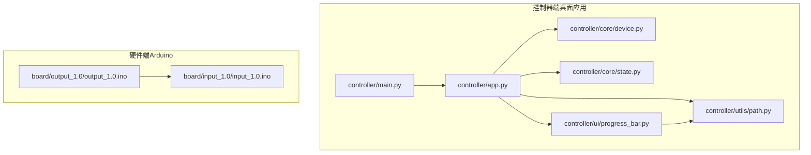
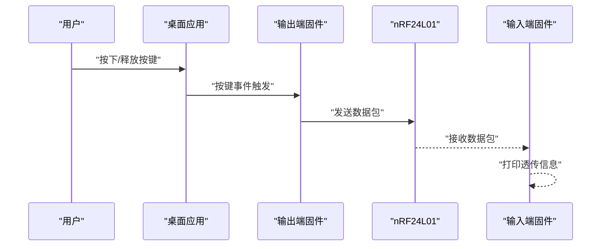
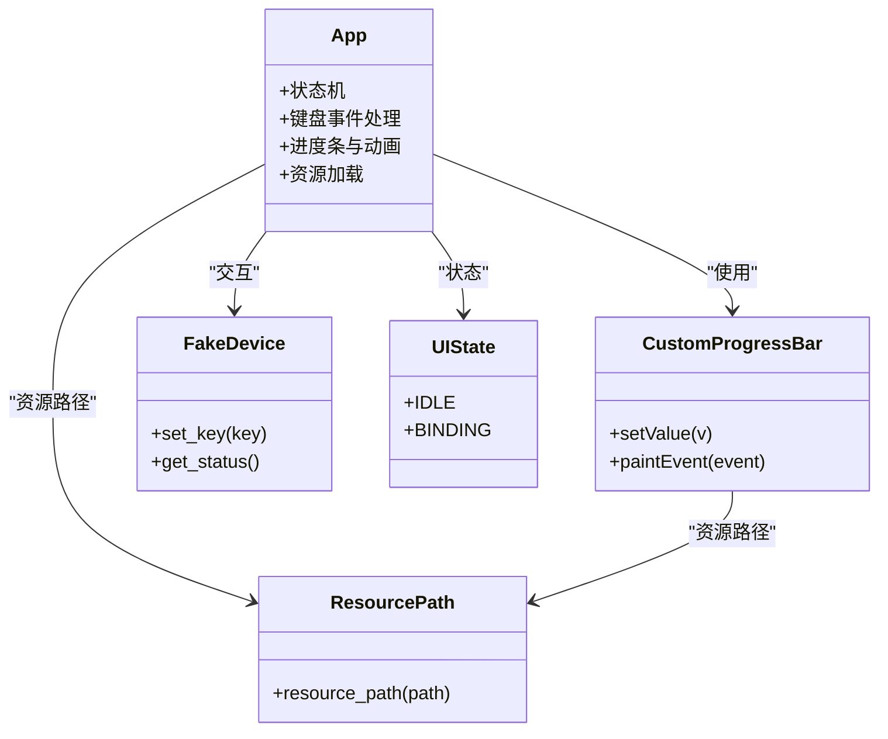
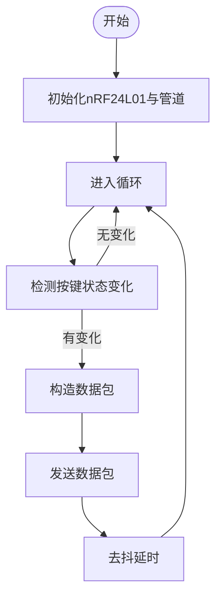
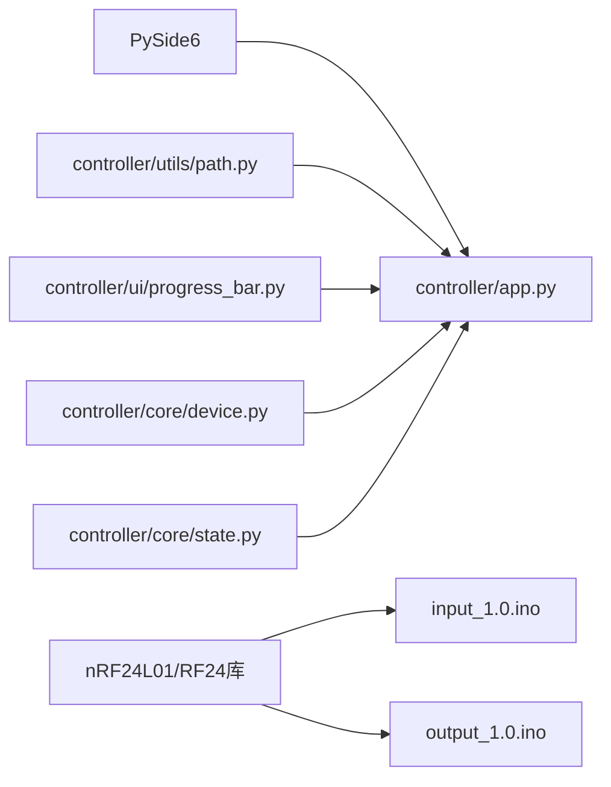

# 部署与分发

<cite>
**本文引用的文件**
- [README.md](file://README.md)
- [controller/main.py](file://controller/main.py)
- [controller/app.py](file://controller/app.py)
- [controller/core/device.py](file://controller/core/device.py)
- [controller/core/state.py](file://controller/core/state.py)
- [controller/ui/progress_bar.py](file://controller/ui/progress_bar.py)
- [controller/utils/path.py](file://controller/utils/path.py)
- [board/input_1.0/input_1.0.ino](file://board/input_1.0/input_1.0.ino)
- [board/output_1.0/output_1.0.ino](file://board/output_1.0/output_1.0.ino)
</cite>

## 目录
1. [简介](#简介)
2. [项目结构](#项目结构)
3. [核心组件](#核心组件)
4. [架构总览](#架构总览)
5. [详细组件分析](#详细组件分析)
6. [依赖分析](#依赖分析)
7. [性能考虑](#性能考虑)
8. [故障排除指南](#故障排除指南)
9. [结论](#结论)
10. [附录](#附录)

## 简介
本指南面向“无线键盘玩具”项目的部署与分发，覆盖桌面端应用打包（PySide6 + PyInstaller）、资源文件处理、跨平台兼容性（Windows/macOS/Linux）、硬件固件烧录与更新、分发渠道与版本管理、安全与数字签名、以及故障排除与回滚策略。文档以仓库现有代码为依据，结合实际工程实践给出可操作的建议。

## 项目结构
该项目采用“控制器（桌面端）+ 板卡固件（Arduino）”的双端架构：
- 控制器端（Python + Qt）：负责图形界面、按键绑定流程、状态显示与资源加载。
- 板卡端（Arduino + nRF24L01）：分为输入端（接收数据并透传）与输出端（采集按键事件并发送）。

图表来源
- [controller/main.py:1-8](file://controller/main.py#L1-L8)
- [controller/app.py:1-202](file://controller/app.py#L1-L202)
- [controller/core/device.py:1-11](file://controller/core/device.py#L1-L11)
- [controller/core/state.py:1-3](file://controller/core/state.py#L1-L3)
- [controller/ui/progress_bar.py:1-28](file://controller/ui/progress_bar.py#L1-L28)
- [controller/utils/path.py:1-10](file://controller/utils/path.py#L1-L10)
- [board/input_1.0/input_1.0.ino:1-35](file://board/input_1.0/input_1.0.ino#L1-L35)
- [board/output_1.0/output_1.0.ino:1-43](file://board/output_1.0/output_1.0.ino#L1-L43)

章节来源
- [README.md:1-1](file://README.md#L1-L1)
- [controller/main.py:1-8](file://controller/main.py#L1-L8)
- [controller/app.py:1-202](file://controller/app.py#L1-L202)
- [controller/core/device.py:1-11](file://controller/core/device.py#L1-L11)
- [controller/core/state.py:1-3](file://controller/core/state.py#L1-L3)
- [controller/ui/progress_bar.py:1-28](file://controller/ui/progress_bar.py#L1-L28)
- [controller/utils/path.py:1-10](file://controller/utils/path.py#L1-L10)
- [board/input_1.0/input_1.0.ino:1-35](file://board/input_1.0/input_1.0.ino#L1-L35)
- [board/output_1.0/output_1.0.ino:1-43](file://board/output_1.0/output_1.0.ino#L1-L43)

## 核心组件
- 应用入口与窗口：应用通过入口模块启动 Qt 应用并展示主窗口。
- 主窗口逻辑：负责状态机切换、按键事件处理、进度条与精灵动画驱动、设备状态刷新。
- 资源路径工具：在打包后（PyInstaller）能正确解析资源文件路径。
- 自定义进度条：基于 Qt 绘图，使用资源图片实现背景与填充。
- 设备抽象：提供电池电量与当前按键的读取，以及按键设置接口。
- 状态枚举：UI 状态机（空闲/绑定中）。
- 硬件固件：输出端采集按键并发送数据包；输入端监听并透传数据。

章节来源
- [controller/main.py:1-8](file://controller/main.py#L1-L8)
- [controller/app.py:1-202](file://controller/app.py#L1-L202)
- [controller/utils/path.py:1-10](file://controller/utils/path.py#L1-L10)
- [controller/ui/progress_bar.py:1-28](file://controller/ui/progress_bar.py#L1-L28)
- [controller/core/device.py:1-11](file://controller/core/device.py#L1-L11)
- [controller/core/state.py:1-3](file://controller/core/state.py#L1-L3)
- [board/input_1.0/input_1.0.ino:1-35](file://board/input_1.0/input_1.0.ino#L1-L35)
- [board/output_1.0/output_1.0.ino:1-43](file://board/output_1.0/output_1.0.ino#L1-L43)

## 架构总览
桌面端应用与硬件端固件通过 nRF24L01 无线模块通信。输出端采集按键事件，封装为数据包并通过无线发送；输入端接收数据包并透传到串口，便于上位机观察与调试。

图表来源
- [controller/app.py:113-138](file://controller/app.py#L113-L138)
- [board/output_1.0/output_1.0.ino:28-43](file://board/output_1.0/output_1.0.ino#L28-L43)
- [board/input_1.0/input_1.0.ino:24-35](file://board/input_1.0/input_1.0.ino#L24-L35)

## 详细组件分析

### 桌面应用打包与资源处理
- 入口模块负责初始化 Qt 应用并展示主窗口。
- 主窗口类负责：
  - 状态机：空闲与绑定两种状态，绑定时显示提示、进度条与精灵动画。
  - 键盘事件：捕获按键按下/抬起，驱动进度条与动画。
  - 资源加载：通过资源路径工具加载 UI 动画帧与进度条素材。
- 资源路径工具在打包后（PyInstaller）通过内置路径解析资源，避免运行时找不到资源的问题。

图表来源
- [controller/app.py:12-202](file://controller/app.py#L12-L202)
- [controller/ui/progress_bar.py:5-28](file://controller/ui/progress_bar.py#L5-L28)
- [controller/core/device.py:1-11](file://controller/core/device.py#L1-L11)
- [controller/core/state.py:1-3](file://controller/core/state.py#L1-L3)
- [controller/utils/path.py:4-10](file://controller/utils/path.py#L4-L10)

章节来源
- [controller/main.py:1-8](file://controller/main.py#L1-L8)
- [controller/app.py:1-202](file://controller/app.py#L1-L202)
- [controller/ui/progress_bar.py:1-28](file://controller/ui/progress_bar.py#L1-L28)
- [controller/utils/path.py:1-10](file://controller/utils/path.py#L1-L10)
- [controller/core/device.py:1-11](file://controller/core/device.py#L1-L11)
- [controller/core/state.py:1-3](file://controller/core/state.py#L1-L3)

### 跨平台兼容性
- 平台差异点：
  - 路径分隔符与工作目录：打包后资源路径需通过统一工具解析。
  - Qt 驱动与字体渲染：不同系统默认字体与 DPI 可能影响 UI 显示，建议固定字号与布局。
  - Python 运行环境：确保各平台安装相同版本的 Python 与依赖。
- 建议：
  - 使用虚拟环境隔离依赖，避免系统 Python 版本差异。
  - 在 CI 中分别测试 Windows/macOS/Linux 的打包产物。

章节来源
- [controller/utils/path.py:1-10](file://controller/utils/path.py#L1-L10)
- [controller/app.py:51-60](file://controller/app.py#L51-L60)

### 硬件固件流程与烧录
- 输出端固件：
  - 采集按键引脚状态变化，封装为数据包并发送。
  - 使用低功率发射以降低干扰与功耗。
- 输入端固件：
  - 初始化接收管道，循环监听无线数据，将键码、状态与序列号透传到串口。
- 烧录流程建议：
  - 使用 Arduino IDE 或命令行工具（如 esptool/avrdude）进行烧录。
  - 确保串口驱动安装完成，选择正确的端口与板卡型号。
  - 烧录前检查电源与接线，避免损坏芯片。

图表来源
- [board/output_1.0/output_1.0.ino:19-43](file://board/output_1.0/output_1.0.ino#L19-L43)

章节来源
- [board/output_1.0/output_1.0.ino:1-43](file://board/output_1.0/output_1.0.ino#L1-L43)
- [board/input_1.0/input_1.0.ino:1-35](file://board/input_1.0/input_1.0.ino#L1-L35)

### 分发渠道与版本管理
- 渠道建议：
  - GitHub Releases：发布桌面端与固件二进制，附带校验信息。
  - 应用商店/官网：提供安装包下载链接与更新日志。
- 版本管理：
  - 使用语义化版本（主.次.修订），在发布标签中体现。
  - 固件与桌面端版本号保持一致或独立标注，便于追踪。
- 更新策略：
  - 桌面端：支持在线检查更新与静默升级（需额外实现）。
  - 固件：通过串口/OTA（需硬件与协议支持）或重新烧录。

章节来源
- [README.md:1-1](file://README.md#L1-L1)

### 安全与数字签名
- 数字签名：
  - Windows/macOS 发布包建议进行代码签名，提升用户信任度与系统放行率。
- 资源与依赖安全：
  - 仅使用可信渠道获取依赖，定期扫描漏洞。
  - 对第三方资源（如图标、字体）注明来源与许可证。
- 传输安全：
  - 发布页面与下载链接启用 HTTPS。
  - 提供哈希值（如 SHA256）用于完整性校验。

章节来源
- [controller/app.py:1-202](file://controller/app.py#L1-L202)

### 故障排除与回滚
- 常见问题：
  - 资源无法加载：确认资源路径工具在打包后的路径解析正常。
  - 无线通信异常：检查天线连接、地址匹配与发射功率设置。
  - 固件烧录失败：确认驱动安装、端口选择与波特率设置。
- 回滚策略：
  - 保留上一版本安装包与固件镜像。
  - 固件回滚：重新烧录上一稳定版本。
  - 桌面端回滚：恢复上一版本安装包并清理缓存。

章节来源
- [controller/utils/path.py:4-10](file://controller/utils/path.py#L4-L10)
- [board/input_1.0/input_1.0.ino:16-22](file://board/input_1.0/input_1.0.ino#L16-L22)
- [board/output_1.0/output_1.0.ino:19-26](file://board/output_1.0/output_1.0.ino#L19-L26)

## 依赖分析
- 控制器端依赖：
  - PySide6：GUI 框架。
  - 资源路径工具：统一资源访问。
  - 自定义进度条：依赖资源图片。
- 硬件端依赖：
  - RF24/nRF24L01：无线通信。
  - Arduino 核心库：引脚与 SPI 接口。

图表来源
- [controller/app.py:1-10](file://controller/app.py#L1-L10)
- [controller/utils/path.py:1-10](file://controller/utils/path.py#L1-L10)
- [controller/ui/progress_bar.py:1-4](file://controller/ui/progress_bar.py#L1-L4)
- [controller/core/device.py:1-11](file://controller/core/device.py#L1-L11)
- [controller/core/state.py:1-3](file://controller/core/state.py#L1-L3)
- [board/input_1.0/input_1.0.ino:1-4](file://board/input_1.0/input_1.0.ino#L1-L4)
- [board/output_1.0/output_1.0.ino:1-4](file://board/output_1.0/output_1.0.ino#L1-L4)

章节来源
- [controller/app.py:1-10](file://controller/app.py#L1-L10)
- [controller/ui/progress_bar.py:1-4](file://controller/ui/progress_bar.py#L1-L4)
- [controller/utils/path.py:1-10](file://controller/utils/path.py#L1-L10)
- [board/input_1.0/input_1.0.ino:1-4](file://board/input_1.0/input_1.0.ino#L1-L4)
- [board/output_1.0/output_1.0.ino:1-4](file://board/output_1.0/output_1.0.ino#L1-L4)

## 性能考虑
- 资源加载：
  - 预加载动画帧与进度条素材，减少绘制时开销。
- 事件处理：
  - 使用定时器驱动动画与进度更新，避免阻塞 UI 线程。
- 无线通信：
  - 合理设置发射功率与通道，平衡距离与功耗。
  - 去抖延时避免误触触发。

章节来源
- [controller/app.py:67-75](file://controller/app.py#L67-L75)
- [controller/app.py:139-162](file://controller/app.py#L139-L162)
- [board/output_1.0/output_1.0.ino:24-40](file://board/output_1.0/output_1.0.ino#L24-L40)

## 故障排除指南
- 资源路径问题：
  - 症状：图片不显示或加载失败。
  - 处理：确认资源路径工具在打包后仍能解析到资源目录。
- 无线通信问题：
  - 症状：串口无输出或数据异常。
  - 处理：检查地址匹配、天线连接与波特率设置。
- 固件烧录问题：
  - 症状：无法上传或报错。
  - 处理：确认驱动安装、端口选择与板卡型号。

章节来源
- [controller/utils/path.py:4-10](file://controller/utils/path.py#L4-L10)
- [board/input_1.0/input_1.0.ino:16-22](file://board/input_1.0/input_1.0.ino#L16-L22)
- [board/output_1.0/output_1.0.ino:19-26](file://board/output_1.0/output_1.0.ino#L19-L26)

## 结论
本指南基于仓库现有代码，给出了桌面端应用打包、资源处理、跨平台兼容、硬件固件烧录与更新、分发与版本管理、安全与签名、以及故障排除与回滚的完整方案。建议在 CI 中自动化执行打包与测试，确保多平台一致性与质量稳定性。

## 附录
- 术语
  - nRF24L01：2.4 GHz 无线收发芯片。
  - RF24：Arduino 上的 nRF24L01 封装库。
- 参考
  - 项目根目录 README 文件用于项目标识与版本说明。

章节来源
- [README.md:1-1](file://README.md#L1-L1)