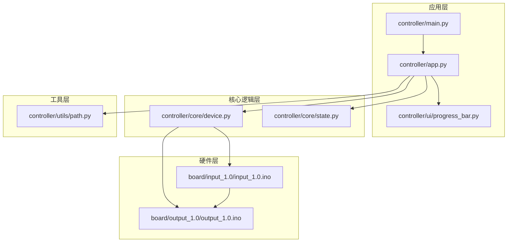
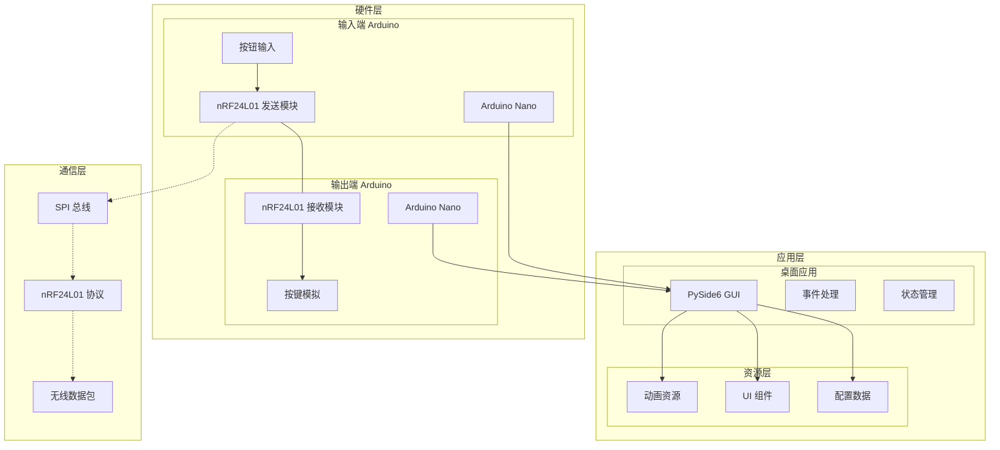
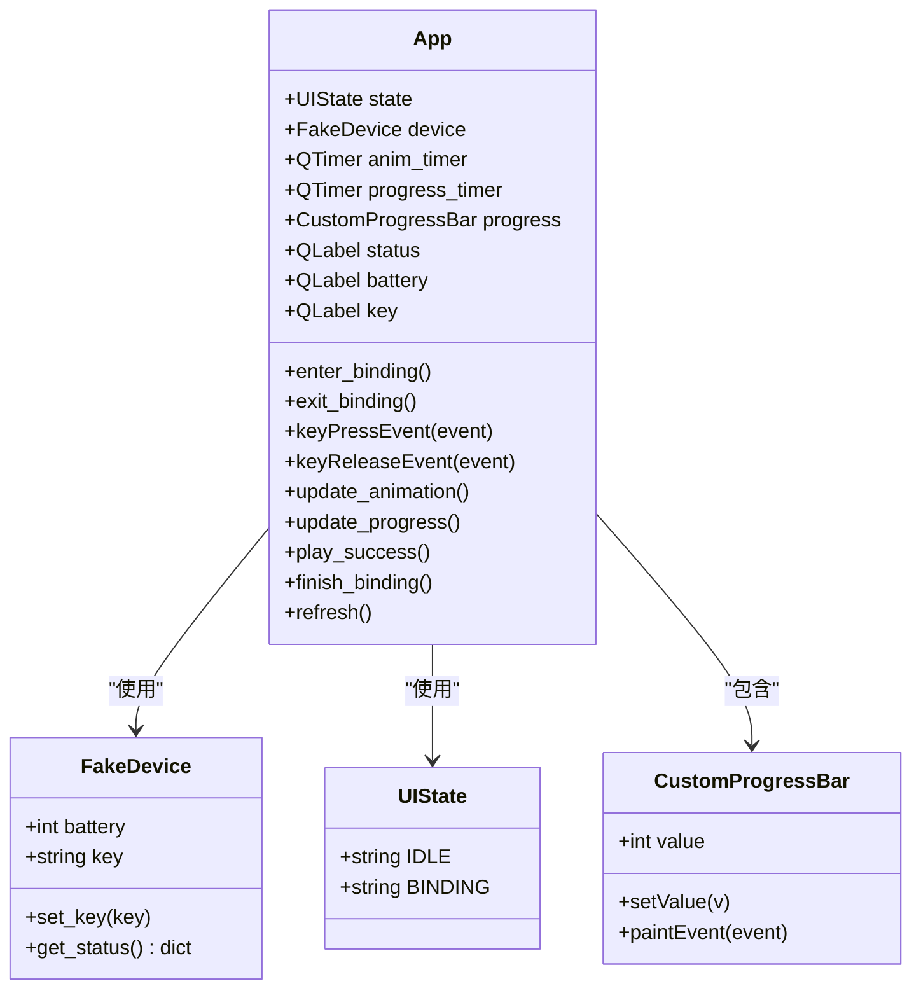
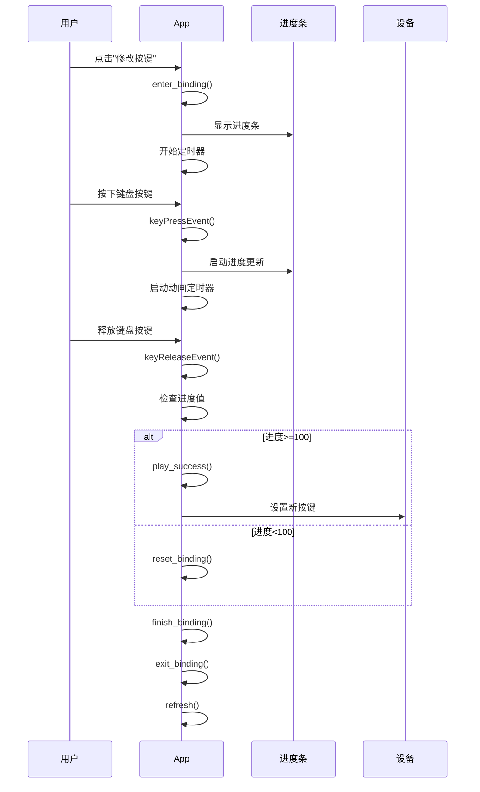
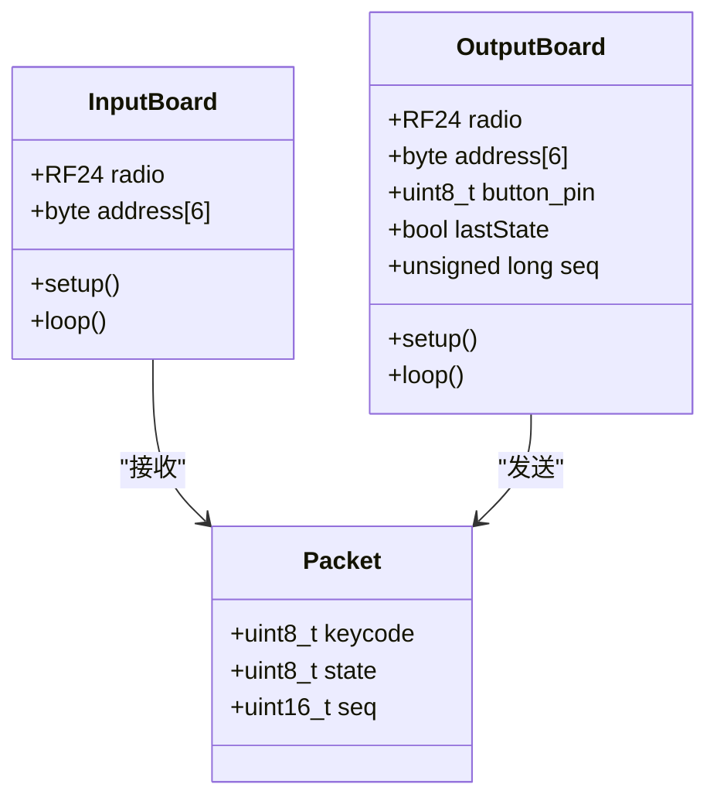
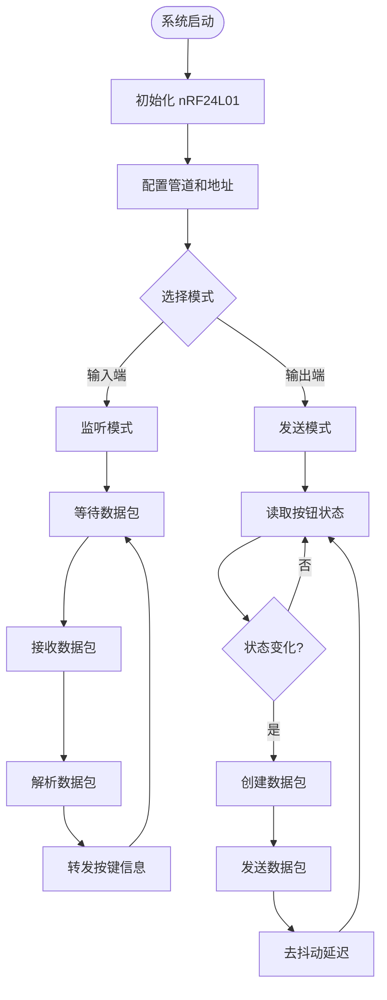
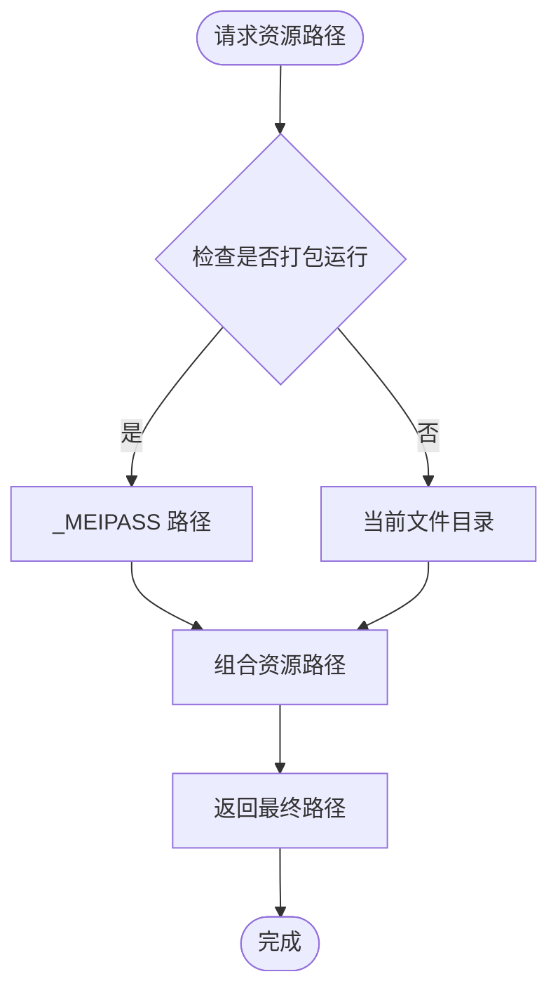
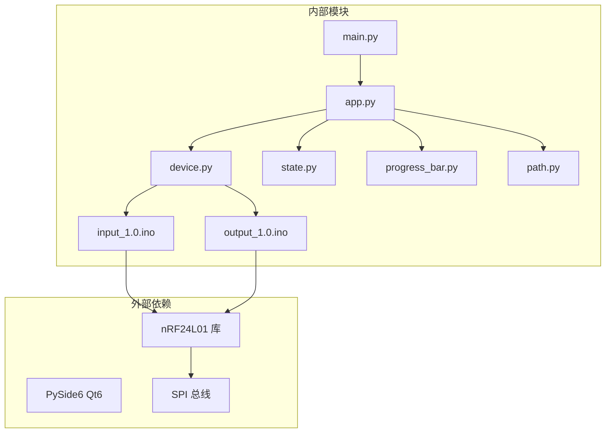

# 项目概述

<cite>
**本文档引用的文件**
- [README.md](file://README.md)
- [main.py](file://controller/main.py)
- [app.py](file://controller/app.py)
- [device.py](file://controller/core/device.py)
- [state.py](file://controller/core/state.py)
- [progress_bar.py](file://controller/ui/progress_bar.py)
- [path.py](file://controller/utils/path.py)
- [input_1.0.ino](file://board/input_1.0/input_1.0.ino)
- [output_1.0.ino](file://board/output_1.0/output_1.0.ino)
</cite>

## 目录
1. [简介](#简介)
2. [项目结构](#项目结构)
3. [核心组件](#核心组件)
4. [架构总览](#架构总览)
5. [详细组件分析](#详细组件分析)
6. [依赖关系分析](#依赖关系分析)
7. [性能考虑](#性能考虑)
8. [故障排除指南](#故障排除指南)
9. [结论](#结论)

## 简介

无线键盘玩具是一个基于PySide6的桌面应用程序与Arduino硬件结合的无线键盘系统，提供完整的输入端和输出端解决方案。该项目旨在通过nRF24L01无线模块实现按键信号的无线传输，为用户提供直观的智能绑定系统和状态可视化界面。

### 项目核心目标
- 实现桌面应用与Arduino硬件的无线通信
- 提供用户友好的按键绑定体验
- 展示系统状态信息（电量、当前按键等）
- 构建可扩展的无线键盘玩具平台

### 主要功能特性
- **无线按键传输**：通过nRF24L01模块实现按键状态的实时无线传输
- **智能绑定系统**：交互式按键绑定流程，支持进度可视化和成功反馈
- **状态可视化**：实时显示设备电量和当前绑定按键信息
- **动画效果**：丰富的UI动画，提升用户体验

## 项目结构

项目采用清晰的分层架构设计，将不同职责的功能模块分离，便于维护和扩展。

**图表来源**
- [main.py:1-8](file://controller/main.py#L1-L8)
- [app.py:1-202](file://controller/app.py#L1-L202)
- [device.py:1-11](file://controller/core/device.py#L1-L11)
- [input_1.0.ino:1-35](file://board/input_1.0/input_1.0.ino#L1-L35)
- [output_1.0.ino:1-43](file://board/output_1.0/output_1.0.ino#L1-L43)

### 文件组织方式
- **controller/**：桌面应用程序核心代码
- **board/**：Arduino硬件固件代码
- **assets/**：UI资源文件（动画帧、进度条背景等）

**章节来源**
- [main.py:1-8](file://controller/main.py#L1-L8)
- [app.py:1-202](file://controller/app.py#L1-L202)

## 核心组件

### 应用程序入口点
主程序负责初始化Qt应用程序和主窗口，建立事件循环。

### 主窗口组件
App类是整个应用程序的核心，负责：
- 界面布局和控件管理
- 用户交互事件处理
- 状态管理和定时器控制
- 资源加载和动画播放

### 设备抽象层
FakeDevice类提供设备状态管理接口，模拟真实设备的电池电量和按键配置。

### 状态管理
UIState枚举定义了应用程序的两种主要状态：空闲模式和绑定模式。

**章节来源**
- [main.py:1-8](file://controller/main.py#L1-L8)
- [app.py:12-75](file://controller/app.py#L12-L75)
- [device.py:1-11](file://controller/core/device.py#L1-L11)
- [state.py:1-3](file://controller/core/state.py#L1-L3)

## 架构总览

系统采用分层架构设计，从底层硬件到上层应用形成清晰的职责分离。

**图表来源**
- [input_1.0.ino:1-35](file://board/input_1.0/input_1.0.ino#L1-L35)
- [output_1.0.ino:1-43](file://board/output_1.0/output_1.0.ino#L1-L43)
- [app.py:1-202](file://controller/app.py#L1-L202)

### 技术栈概览
- **桌面应用开发**：PySide6 (Qt6 Python绑定)
- **硬件控制**：Arduino Nano微控制器
- **无线通信**：nRF24L01 2.4GHz RF模块
- **通信协议**：自定义数据包格式
- **资源管理**：Qt资源系统和路径解析

## 详细组件分析

### 桌面应用程序组件

#### 主窗口类结构

**图表来源**
- [app.py:12-202](file://controller/app.py#L12-L202)
- [device.py:1-11](file://controller/core/device.py#L1-L11)
- [state.py:1-3](file://controller/core/state.py#L1-L3)
- [progress_bar.py:5-28](file://controller/ui/progress_bar.py#L5-L28)

#### 按键绑定流程

**图表来源**
- [app.py:77-196](file://controller/app.py#L77-L196)

**章节来源**
- [app.py:12-202](file://controller/app.py#L12-L202)
- [progress_bar.py:5-28](file://controller/ui/progress_bar.py#L5-L28)

### 硬件通信组件

#### 数据包结构设计

**图表来源**
- [input_1.0.ino:8-14](file://board/input_1.0/input_1.0.ino#L8-L14)
- [output_1.0.ino:13-17](file://board/output_1.0/output_1.0.ino#L13-L17)

#### 通信协议流程

**图表来源**
- [input_1.0.ino:16-35](file://board/input_1.0/input_1.0.ino#L16-L35)
- [output_1.0.ino:19-43](file://board/output_1.0/output_1.0.ino#L19-L43)

**章节来源**
- [input_1.0.ino:1-35](file://board/input_1.0/input_1.0.ino#L1-L35)
- [output_1.0.ino:1-43](file://board/output_1.0/output_1.0.ino#L1-L43)

### 资源管理系统

#### 资源路径解析机制

**图表来源**
- [path.py:4-10](file://controller/utils/path.py#L4-L10)

**章节来源**
- [path.py:1-10](file://controller/utils/path.py#L1-L10)

## 依赖关系分析

### 模块间依赖关系

**图表来源**
- [main.py:1-8](file://controller/main.py#L1-L8)
- [app.py:6-9](file://controller/app.py#L6-L9)
- [input_1.0.ino:1-3](file://board/input_1.0/input_1.0.ino#L1-L3)
- [output_1.0.ino:1-3](file://board/output_1.0/output_1.0.ino#L1-L3)

### 关键依赖特性
- **PySide6依赖**：提供GUI框架和事件处理机制
- **nRF24L01依赖**：实现无线通信功能
- **SPI总线依赖**：作为nRF24L01的物理通信基础
- **Qt资源系统**：统一管理UI资源文件

**章节来源**
- [app.py:1-10](file://controller/app.py#L1-L10)
- [input_1.0.ino:1-3](file://board/input_1.0/input_1.0.ino#L1-L3)
- [output_1.0.ino:1-3](file://board/output_1.0/output_1.0.ino#L1-L3)

## 性能考虑

### 实时性优化
- **定时器精度**：使用Qt的QTimer确保动画和进度更新的稳定性
- **去抖动处理**：硬件端和软件端双重去抖动，避免误触发
- **内存管理**：预加载动画资源，减少运行时开销

### 通信效率
- **数据包大小**：最小化数据包结构，仅包含必要字段
- **传输频率**：合理设置发送间隔，平衡实时性和功耗
- **错误处理**：实现基本的通信错误检测和恢复机制

### 用户体验优化
- **响应速度**：按键事件处理延迟控制在毫秒级
- **视觉反馈**：动画效果提供即时的用户操作反馈
- **状态同步**：设备状态与UI界面保持实时同步

## 故障排除指南

### 常见问题诊断

#### 通信问题
- **症状**：按键无响应或传输不稳定
- **排查步骤**：
  1. 检查nRF24L01模块连接
  2. 验证地址配置一致性
  3. 确认SPI总线工作正常
  4. 测试硬件端LED指示灯状态

#### UI界面问题
- **症状**：进度条不显示或动画异常
- **排查步骤**：
  1. 检查资源文件路径解析
  2. 验证Qt环境配置
  3. 确认定时器正常启动
  4. 检查事件处理函数绑定

#### 硬件兼容性
- **症状**：Arduino无法识别或编译失败
- **排查步骤**：
  1. 确认Arduino IDE版本兼容性
  2. 检查所需库文件安装情况
  3. 验证引脚连接正确性
  4. 测试基本功能模块

**章节来源**
- [input_1.0.ino:16-22](file://board/input_1.0/input_1.0.ino#L16-L22)
- [output_1.0.ino:19-26](file://board/output_1.0/output_1.0.ino#L19-L26)

## 结论

无线键盘玩具项目成功展示了桌面应用与嵌入式硬件的完美结合，通过PySide6和Arduino技术实现了功能完整的无线键盘系统。项目采用模块化设计，具有良好的可扩展性和维护性。

### 技术亮点
- **架构清晰**：分层设计使各模块职责明确，便于独立开发和测试
- **用户体验**：丰富的动画效果和直观的交互界面提升了用户满意度
- **技术整合**：成功融合了桌面应用开发、嵌入式编程和无线通信技术

### 扩展建议
- **功能增强**：可添加多设备支持、按键宏功能等高级特性
- **性能优化**：进一步优化通信协议和UI渲染性能
- **平台移植**：考虑支持其他操作系统和硬件平台

该项目为学习嵌入式系统开发和桌面应用集成提供了优秀的实践案例，适合初学者入门和有经验开发者深入研究。